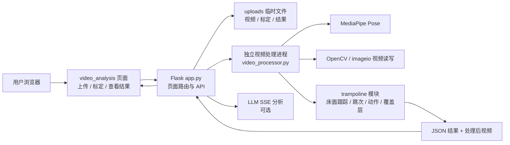
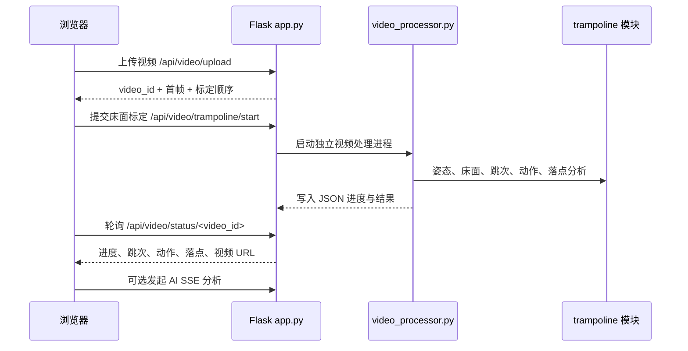

本页是当前 Wiki 的入口页，你现在位于入门目录的 **[概览](1-gai-lan)**。它只回答三个基础问题：这个项目是什么、主链路如何工作、初学者接下来应按什么顺序阅读。项目本身是一个基于 Flask、MediaPipe 与 OpenCV 的蹦床视频分析工具，当前聚焦于上传蹦床视频、床面关键帧标定、跳次分割与动作识别、处理后视频回放以及 AI 文本分析。Sources: [README.md](README.md#L1-L10)

## 这个项目解决什么问题

从使用者视角看，本项目把“上传一段蹦床训练视频”转化为“可回放的视频分析结果”：用户先上传视频，系统提取首帧用于床面四角标定；完成标定后，后端启动视频分析流程，输出跳次、动作、滞空时间、落点、处理后视频，并在分析完成后支持发起 AI 解读。Sources: [README.md](README.md#L14-L22), [templates/video_analysis.html](templates/video_analysis.html#L39-L58), [templates/video_analysis.html](templates/video_analysis.html#L76-L147)

项目当前的重点不是通用健身动作识别，而是围绕 `/video_analysis` 的 **蹦床视频分析主链路** 展开；同时保留 `/`、`/dashboard`、`/profile` 作为后续页面入口或占位页面。对于初学者，可以先把它理解为“一个 Flask 后端 + 原生前端 + 独立视频处理进程 + 蹦床算法模块”的小型视频分析系统。Sources: [README.md](README.md#L10-L33), [app.py](app.py#L249-L267)

## 一眼看懂系统结构

下面的 Mermaid 图展示的是概览级架构：浏览器负责上传、标定、展示进度与结果；Flask 负责页面和 API；独立的 `video_processor.py` 进程负责逐帧处理视频；`trampoline/` 模块负责床面跟踪、跳次检测、动作识别、覆盖层绘制和 AI 报告构建。Sources: [README.md](README.md#L29-L33), [app.py](app.py#L460-L490), [video_processor.py](video_processor.py#L77-L83)



这条链路的关键边界是：Flask 不直接在请求线程里逐帧分析视频，而是通过线程启动子进程运行 `video_processor.py`；子进程把进度与结果写入 JSON，Flask 周期读取结果并同步到内存中的 `video_analyses` 状态，前端再通过状态接口获取进度和摘要。Sources: [app.py](app.py#L447-L457), [app.py](app.py#L460-L531), [video_processor.py](video_processor.py#L84-L108), [video_processor.py](video_processor.py#L301-L359)

## 功能入口概览

| 入口 | 当前作用 | 初学者应如何理解 |
|---|---|---|
| `/` | 蹦床首页 / 实时页预留壳层 | 项目首页入口，当前不是主分析页 |
| `/dashboard` | 蹦床看板占位页，保留图表容器 | 后续承接统计、落点或训练数据 |
| `/profile` | 蹦床训练档案占位页 | 后续承接运动员资料或训练档案 |
| `/video_analysis` | 蹦床视频分析主入口 | 当前最重要、最完整的使用链路 |

这些页面路由在 Flask 中分别渲染 `index.html`、`dashboard.html`、`profile.html` 与 `video_analysis.html`；其中 `/video_analysis` 明确以 `mode='trampoline'` 渲染，是当前项目的主入口。Sources: [README.md](README.md#L23-L28), [app.py](app.py#L249-L267)

## 核心能力速览

| 能力 | 已验证实现位置 | 说明 |
|---|---|---|
| 视频上传 | `POST /api/video/upload` | 只接受 `exercise_type=trampoline`，并检查文件大小与视频时长 |
| 首帧提取 | `_extract_first_frame_b64()` | 上传后提取首帧，供前端进行床面标定 |
| 床面标定 | `POST /api/video/trampoline/start` | 接收四角或多关键帧标定，写入 sidecar JSON |
| 独立处理 | `process_video_subprocess()` | 通过子进程运行 `video_processor.py` |
| 姿态识别 | `MediaPipe Pose` | 子进程逐帧读取视频并运行姿态检测 |
| 跳次与动作 | `TrampolineAnalyzer` | 组合 `JumpDetector` 与 `ActionClassifier` |
| 覆盖层视频 | `draw_trampoline_overlay()` | 输出带骨架、角度、床面与统计信息的处理后视频 |
| AI 解读 | `/api/video/llm_analysis/<video_id>` | 分析完成后通过 SSE 返回结构化 AI 文本 |

上传接口会创建 `video_id`，保存原始视频，提取首帧，并把任务状态置为 `uploaded_pending_calibration`；标定启动接口会校验并规范化标定数据，写入包含床面角点、标定帧、床面尺寸和创建时间的 sidecar 文件，然后将任务置为 `processing` 并启动处理线程。Sources: [app.py](app.py#L269-L365), [app.py](app.py#L368-L457)

视频处理进程只支持 `trampoline` 模式；它会打开视频、初始化输出视频写入器、初始化 MediaPipe Pose、读取床面 sidecar、创建 `BedTracker` 与 `TrampolineAnalyzer`，随后在循环中更新进度、检测姿态、分析跳次与动作，并周期性写出 JSON 结果。Sources: [video_processor.py](video_processor.py#L77-L115), [video_processor.py](video_processor.py#L121-L199), [video_processor.py](video_processor.py#L212-L303)

## 项目结构视觉地图

```text
project-root/
├── app.py                         # Flask 页面、API、任务状态与子进程调度
├── video_processor.py             # 独立视频处理入口
├── trampoline/
│   ├── analyzer.py                # 蹦床分析编排：跳次 + 动作 + 落点
│   ├── bed_tracker.py             # 床面标定、跟踪与落点相关逻辑
│   ├── jump_detector.py           # 跳次分割与起跳/落地检测
│   ├── action_classifier.py       # 动作类型识别
│   ├── overlay.py                 # 视频覆盖层绘制
│   ├── llm_service.py             # 结构化报告与 LLM 流式分析
│   └── docs/                      # 项目内开发记录
├── templates/
│   ├── index.html
│   ├── dashboard.html
│   ├── profile.html
│   └── video_analysis.html        # 主分析页面
├── static/
│   ├── css/
│   └── js/                        # 标定、上传、轮询、展示等前端逻辑
└── tests/                         # 后端、前端契约与算法回归测试
```

这个结构与 README 中的“当前重点目录结构”一致：`app.py` 是后端入口，`video_processor.py` 是独立处理器，`trampoline/` 承载分析核心，`templates/` 和 `static/` 承载原生前端，`tests/` 提供回归保护。Sources: [README.md](README.md#L87-L110)

## 初学者应先理解的数据流

初学者可以把一次完整分析理解为五步：第一，浏览器上传视频；第二，后端保存视频并返回首帧；第三，用户在页面上完成床面四角或关键帧标定；第四，后端启动独立处理进程并持续同步结果；第五，前端轮询状态、展示处理后视频、统计数据、落点图和可选 AI 解读。Sources: [app.py](app.py#L269-L365), [app.py](app.py#L368-L457), [app.py](app.py#L570-L603), [templates/video_analysis.html](templates/video_analysis.html#L23-L75), [templates/video_analysis.html](templates/video_analysis.html#L76-L147)



状态接口返回的是前端展示所需的摘要字段，包括 `status`、`progress`、`reps`、`state`、`feedback`、`current_action`、`completed_jumps`、`phase`、`current_flight_duration_s`、`latest_landing`、`landings`、`processed_video_url` 等；因此前端不需要直接读取结果文件，而是通过 API 获取统一格式的数据。Sources: [app.py](app.py#L570-L603)

## 技术栈概览

| 层级 | 使用技术 | 在项目中的角色 |
|---|---|---|
| Web 后端 | Flask | 页面渲染、上传接口、状态接口、视频文件返回、AI SSE 接口 |
| 视频处理 | OpenCV、imageio | 视频读取、帧处理、处理后视频写出 |
| 姿态估计 | MediaPipe | 提取人体姿态关键点 |
| 蹦床算法 | `trampoline/` Python 模块 | 床面跟踪、跳次检测、动作分类、落点数据生成 |
| 前端 | 原生 HTML/CSS/JS | 上传、标定、进度展示、落点图、AI 结果展示 |
| AI 集成 | OpenAI-compatible SDK | 基于结构化分析结果生成文本解读 |

依赖文件明确列出了 Flask、OpenCV、MediaPipe、NumPy、imageio、imageio-ffmpeg 与 OpenAI SDK；README 也说明前端使用原生 HTML/CSS/JS，没有额外前端框架依赖。Sources: [requirements.txt](requirements.txt#L1-L15), [README.md](README.md#L29-L33)

## 当前能力与边界

| 主题 | 当前状态 |
|---|---|
| 支持的运动类型 | 仅支持 `trampoline` 上传与分析 |
| 上传限制 | 最大 50MB，最长 120 秒 |
| 标定要求 | 分析前需要床面角点标定 |
| 结果保存 | 运行期任务状态保存在内存字典 `video_analyses`，视频与中间文件在 `uploads` 下处理 |
| AI 分析 | 仅在视频分析完成后可发起，需要配置 API Key |
| 其他页面 | 首页、看板、档案页目前主要是扩展入口或占位结构 |

这些边界不是推测，而是代码中的显式条件：上传接口拒绝非 `trampoline` 类型，检查文件大小和视频时长；AI 接口要求任务存在、模式为 `trampoline` 且状态为 `completed`；待标定任务还带有过期清理逻辑。Sources: [app.py](app.py#L35-L38), [app.py](app.py#L149-L170), [app.py](app.py#L276-L314), [app.py](app.py#L620-L645)

## AI 解读在概览中的位置

AI 解读是主分析完成后的附加层，而不是视频处理的前置条件。`llm_service.py` 会把 `video_analyses` 中的完成结果转换为 `AnalysisReport`，其中包含总跳次、视频时长、帧率、分辨率、逐跳结果、动作分布和落点数据；随后通过提示词构建和 SSE 流式返回生成文本分析。Sources: [trampoline/llm_service.py](trampoline/llm_service.py#L1-L9), [trampoline/llm_service.py](trampoline/llm_service.py#L20-L65), [app.py](app.py#L606-L705)

## 建议阅读路线

如果你是第一次阅读这个项目，建议按目录顺序继续：先读 [快速开始](2-kuai-su-kai-shi) 跑起来，再读 [蹦床视频分析主流程](3-beng-chuang-shi-pin-fen-xi-zhu-liu-cheng) 理解完整使用路径，然后读 [页面入口与功能边界](4-ye-mian-ru-kou-yu-gong-neng-bian-jie) 区分主入口和占位入口；完成基础使用后，再进入 [上传、标定、分析与回放操作指南](5-shang-chuan-biao-ding-fen-xi-yu-hui-fang-cao-zuo-zhi-nan)、[AI 解读功能配置](6-ai-jie-du-gong-neng-pei-zhi) 与 [测试与验证命令速查](7-ce-shi-yu-yan-zheng-ming-ling-su-cha)。Sources: [README.md](README.md#L37-L61), [README.md](README.md#L64-L84), [README.md](README.md#L114-L147)

当你已经能跑通主流程，再进入深入解析部分：系统整体可读 [端到端架构与数据流](8-duan-dao-duan-jia-gou-yu-shu-ju-liu)，后端生命周期可读 [后端路由、状态机与任务生命周期](9-hou-duan-lu-you-zhuang-tai-ji-yu-ren-wu-sheng-ming-zhou-qi)，独立处理机制可读 [独立视频处理进程设计](10-du-li-shi-pin-chu-li-jin-cheng-she-ji)，算法细节再从 [MediaPipe 姿态关键点处理管线](12-mediapipe-zi-tai-guan-jian-dian-chu-li-guan-xian) 和 [跳次分割与起跳落地检测](13-tiao-ci-fen-ge-yu-qi-tiao-luo-di-jian-ce) 开始。Sources: [app.py](app.py#L460-L531), [video_processor.py](video_processor.py#L179-L199), [trampoline/analyzer.py](trampoline/analyzer.py#L13-L86)