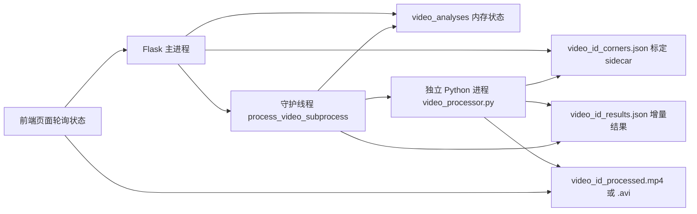

本页解释“独立视频处理进程”的边界与协作方式：Flask 主进程负责上传、标定、任务状态与结果分发；真正消耗 CPU/内存的视频解码、MediaPipe 姿态估计、蹦床分析与覆盖层渲染由 `video_processor.py` 作为单独 Python 进程执行。这个设计在文件级注释中被明确描述为“separate process”，目标是避免内存问题，同时产出轮询用 JSON 结果和带蹦床覆盖层的处理后视频。Sources: [video_processor.py](video_processor.py#L1-L7)

## 架构假设与验证结论

从第一性原理看，视频分析链路同时具备三个高风险特征：视频帧循环时间长、MediaPipe/TensorFlow 运行时占用大、处理结果需要被前端持续轮询。因此合理的架构假设是：Web 请求线程不直接执行逐帧分析，而是将分析转交给独立执行单元，并通过文件系统交换状态。代码验证显示，启动接口只创建一个守护线程，该线程再通过 `subprocess.Popen` 调用 `video_processor.py`；处理器则持续写入 `_results.json`，主进程周期性读取该 JSON 并同步到内存态。Sources: [app.py](app.py#L447-L449), [app.py](app.py#L460-L490), [app.py](app.py#L492-L507), [video_processor.py](video_processor.py#L105-L108)

## 进程边界总览

下面的 Mermaid 图展示的是“控制面”和“数据面”的分离：Flask 主进程保留任务生命周期状态，独立处理进程持有 OpenCV、MediaPipe、蹦床分析器、床面跟踪器和视频写出器；两者之间没有共享 Python 对象，而是通过上传目录中的 sidecar JSON、结果 JSON 和处理后视频文件交接。Sources: [app.py](app.py#L421-L437), [app.py](app.py#L470-L480), [video_processor.py](video_processor.py#L77-L83), [video_processor.py](video_processor.py#L189-L199)

这个结构的核心约束是：主进程不导入并长期持有 `MediaPipe Pose` 实例；处理器在 `process_video()` 内部导入 `mediapipe`、构造 `TrampolineAnalyzer`、加载床面 sidecar，并在 `finally` 中释放 `VideoCapture`、视频写出器和 `pose`。这使资源生命周期集中在子进程内部，而不是散落在 Web 路由中。Sources: [video_processor.py](video_processor.py#L77-L83), [video_processor.py](video_processor.py#L179-L187), [video_processor.py](video_processor.py#L371-L392)

## 启动前置条件：上传后必须先完成标定

独立进程不是在上传完成后立即启动；上传接口先验证 `exercise_type` 只能是 `trampoline`，保存视频文件，读取基础视频信息和首帧，然后把任务状态置为 `uploaded_pending_calibration`，并返回首帧图像、图像尺寸、角点顺序、帧率和总帧数。这个前置阶段确保处理进程启动时已经具备床面初始化所需的标定输入。Sources: [app.py](app.py#L269-L299), [app.py](app.py#L300-L365)

启动接口 `/api/video/trampoline/start` 会把前端提交的角点或多关键帧标定规范化，生成 `schema_version: 2` 的 sidecar 文件，其中包含 `video_id`、首个标定帧、图像尺寸、角点顺序、角点坐标、完整 `calibrations` 列表以及床面尺寸；随后才把任务状态改为 `processing` 并启动后台线程。Sources: [app.py](app.py#L368-L418), [app.py](app.py#L420-L449)

| 阶段 | 主进程状态 | 文件产物 | 是否启动独立进程 |
|---|---|---|---|
| 上传成功 | `uploaded_pending_calibration` | 原始视频文件 | 否 |
| 标定被拒绝 | `calibration_rejected` | 无有效 sidecar 或保留原任务状态 | 否 |
| 标定接受 | `processing` | `<video_id>_corners.json` | 是 |
| 已完成重复启动 | `completed` | 已有处理结果引用 | 否，直接返回现有结果 |

上述状态行为由启动接口的分支直接约束：已完成任务直接返回 `completed`，处理中任务只有在标定完全一致时才允许幂等返回，否则返回冲突；未处于待标定或标定拒绝状态时不能重新启动。测试也覆盖了重复启动、不同标定冲突、多关键帧排序写入和重复关键帧拒绝这些生命周期边界。Sources: [app.py](app.py#L383-L409), [tests/test_trampoline_api.py](tests/test_trampoline_api.py#L143-L160), [tests/test_trampoline_api.py](tests/test_trampoline_api.py#L198-L238)

## 主进程监督器：线程只负责托管子进程

`start_trampoline_analysis()` 创建的是一个 daemon 线程，线程目标是 `process_video_subprocess(video_id)`；这层线程的职责不是逐帧分析，而是避免 HTTP 请求阻塞，并托管子进程的启动、日志读取、结果同步和收尾清理。真正的重负载命令由 `sys.executable video_processor.py <video_path> <exercise_type> <output_json_path> <output_video_path>` 组成，并在项目根目录作为工作目录执行。Sources: [app.py](app.py#L447-L449), [app.py](app.py#L460-L490)

监督器在子进程运行期间每 0.3 秒检查一次结果 JSON：如果文件存在，就读取 JSON 并调用 `_sync_analysis_from_results()` 把进度、跳次数、分数、状态、反馈、当前动作、完成跳次、阶段、飞行帧数、飞行时长、落点和帧率等字段复制到 `video_analyses`。这形成了“文件作为进程间状态总线”的同步模式。Sources: [app.py](app.py#L492-L507), [app.py](app.py#L213-L246)

当子进程退出码为 0 且结果 JSON 存在时，监督器读取最终结果，把进度置为 100，同步字段，并根据处理器报告的 `output_video` 或默认输出路径记录 `processed_video`；如果子进程失败，则把任务状态置为 `error` 并记录错误文本。无论成功后是否仍需保留处理后视频，监督器都会删除临时结果 JSON 和原始上传/sidecar 等非处理视频产物。Sources: [app.py](app.py#L509-L543)

## 独立处理器入口与运行时环境

`video_processor.py` 既可被主进程作为子进程调用，也定义了命令行入口：参数不足时打印用法并以错误码退出；参数满足时读取视频路径、运动类型、结果 JSON 路径和可选输出视频路径，然后调用 `process_video()`。这使处理器边界非常清晰：它不依赖 Flask 请求上下文，只依赖命令行参数和文件路径。Sources: [video_processor.py](video_processor.py#L395-L405)

主进程和处理进程都在导入重型库前设置了 TensorFlow/OpenMP 相关环境变量，包括关闭 oneDNN 优化、限制 OMP 线程数、限制 TensorFlow inter/intra op 线程数、降低 TensorFlow 日志级别。处理器文件再次设置这些变量，说明独立进程拥有自己的运行时初始化边界，不能假设继承主进程后的库状态已经安全。Sources: [app.py](app.py#L1-L7), [video_processor.py](video_processor.py#L9-L14)

## 处理器内部流水线

处理器首先构造结果字典，默认状态为 `processing`、进度为 0、模式为 `trampoline`，并初始化跳次数、分数、当前动作、完成跳次、阶段、飞行帧数、飞行时长和落点字段；`save_results()` 将该字典写入主进程约定的结果 JSON 路径。若 `exercise_type` 不是 `trampoline`，处理器直接写入 `error` 状态并返回。Sources: [video_processor.py](video_processor.py#L84-L114)

随后处理器打开视频，读取总帧数、FPS、宽高，并初始化输出视频写出器。写出策略优先使用 `imageio`/FFmpeg 的 H.264 输出；如果初始化失败或 `imageio` 不可用，则依次尝试 OpenCV 的 `avc1`、`H264`、`XVID`、`mp4v` 编码，最终以 `mp4v` 兜底。处理器会把实际输出路径回写到结果字典的 `output_video` 字段，供主进程在结束时定位文件。Sources: [video_processor.py](video_processor.py#L121-L177)

姿态与蹦床分析初始化发生在处理进程内部：处理器创建 `MediaPipe Pose`，根据输出 JSON 文件名推导 `video_id`，查找同目录下的 `<video_id>_corners.json`，不存在则写入错误；存在时通过 `load_corners_sidecar()` 加载，并用 `BedTracker.from_sidecar()` 构造床面跟踪器，再读取首帧执行 `bed_tracker.initialize()`。Sources: [video_processor.py](video_processor.py#L179-L210)

初始化完成后，处理器构造 `TrampolineAnalyzer(fps=fps, bed_tracker=bed_tracker)`，并根据视频 FPS 计算 `analyze_skip = max(1, int(fps / 15))`，即逐帧仍可渲染覆盖层，但蹦床分析以约 15 FPS 的节奏执行。这一节流点属于独立进程内部策略，不影响主进程的状态轮询机制。Sources: [video_processor.py](video_processor.py#L212-L214), [video_processor.py](video_processor.py#L235-L258)

## 增量结果与进度可见性

主循环每读取一帧就更新 `progress = frame_count / total_frames * 100`，并尝试更新床面跟踪信息；如果 MediaPipe 检测到姿态关键点，则绘制骨架和角度弧线，并在满足 `analyze_skip` 时调用 `analyzer.process_frame()` 更新跳次数、当前动作、阶段、速度、角度、落点和已完成跳次。处理器每 15 帧调用一次 `save_results()`，因此主进程轮询到的是离散但持续刷新的运行快照。Sources: [video_processor.py](video_processor.py#L235-L303)

处理后的每一帧都会经过 `draw_trampoline_overlay()` 绘制蹦床分析覆盖层，然后写入 `imageio_writer` 或 OpenCV `VideoWriter`。这意味着输出视频不是主进程后处理生成的，而是在独立进程逐帧分析时同步渲染生成的。Sources: [video_processor.py](video_processor.py#L294-L299)

| 同步字段类别 | 子进程写入来源 | 主进程同步位置 | 前端可见入口 |
|---|---|---|---|
| 进度与状态 | `results['progress']`, `results['status']` | `_sync_analysis_from_results()` 与结束分支 | `/api/video/status/<video_id>` |
| 动作与跳次 | `jump_count`, `current_action`, `completed_jumps` | `_sync_analysis_from_results()` | `/api/video/status/<video_id>` |
| 飞行阶段 | `phase`, `current_flight_frames`, `current_flight_duration_s` | `_sync_analysis_from_results()` | `/api/video/status/<video_id>` |
| 落点数据 | `latest_landing`, `landings` | `_sync_analysis_from_results()` | `/api/video/status/<video_id>` |
| 处理后视频 | `output_video` | `processed_video` 选择逻辑 | `/api/video/processed/<video_id>` |

状态接口返回的是主进程内存态，而不是直接读取结果 JSON；它暴露 `status`、`progress`、跳次、评分、当前动作、完成跳次、阶段、飞行时长、落点、FPS 以及处理后视频 URL。处理后视频接口则根据 `processed_video` 文件是否存在返回 MP4、AVI 或 WebM 的合适 MIME 类型。Sources: [app.py](app.py#L570-L603), [app.py](app.py#L551-L567)

## 错误处理与资源回收

处理器内部的错误路径都通过结果 JSON 回传：无法打开视频、缺少床面 sidecar、首帧读取失败、非蹦床类型和主循环异常都会把 `results['status']` 置为 `error` 并写入 `results['error']`。主进程在子进程正常退出但结果中包含 `error` 时，也会把任务状态覆盖为 `error`。Sources: [video_processor.py](video_processor.py#L109-L127), [video_processor.py](video_processor.py#L189-L207), [video_processor.py](video_processor.py#L364-L370), [app.py](app.py#L527-L530)

资源回收分为两个层次：处理器在正常结束和 `finally` 中释放 `VideoCapture`、`imageio_writer`、OpenCV 写出器和 `pose`，并调用 `gc.collect()`；主进程在结果同步后删除临时结果 JSON、原始上传文件和 sidecar，但不会在成功路径中删除已经登记的处理后视频。Sources: [video_processor.py](video_processor.py#L308-L343), [video_processor.py](video_processor.py#L371-L392), [app.py](app.py#L538-L543), [app.py](app.py#L133-L147)

上传后未标定的任务还有单独的过期清理路径：`cleanup_expired_pending_trampoline_uploads()` 只处理 `uploaded_pending_calibration` 和 `calibration_rejected` 状态的蹦床任务，超过 TTL 后删除相关文件并把任务改为 `expired`。这条路径发生在独立处理进程启动之前，用于清理被放弃的待标定上传。Sources: [app.py](app.py#L149-L170), [tests/test_trampoline_api.py](tests/test_trampoline_api.py#L178-L195)

## 设计模式对比

| 方案 | 当前代码是否采用 | 证据 | 架构含义 |
|---|---:|---|---|
| Web 请求内同步处理视频 | 否 | 启动接口创建线程后立即返回 JSON | HTTP 请求不等待逐帧分析完成 |
| 后台线程直接执行分析函数 | 否 | 线程目标调用 `subprocess.Popen` 运行脚本 | 重型运行时被隔离到子进程 |
| 文件系统作为 IPC | 是 | sidecar JSON 输入、results JSON 输出、processed video 输出 | 简单、可轮询、与 Flask 内存态解耦 |
| 共享内存或消息队列 | 否 | 代码中未出现队列/共享内存同步，状态来自 JSON 文件读取 | 当前实现保持低依赖复杂度 |
| 子进程自管理资源 | 是 | 处理器在 `finally` 中释放视频、writer、pose | MediaPipe/OpenCV 生命周期集中 |

上述比较只基于现有实现：控制面使用 Flask 内存字典和路由，数据面使用上传目录中的文件，执行面使用独立 Python 进程；没有可验证证据表明当前实现使用外部任务队列、数据库或共享内存。Sources: [app.py](app.py#L33-L33), [app.py](app.py#L460-L490), [app.py](app.py#L499-L543), [video_processor.py](video_processor.py#L395-L405)

## 与相邻页面的边界

本页只解释独立进程如何被启动、如何通过文件同步状态、如何释放资源，以及它在系统中的责任边界；关于上传、标定、分析与回放的用户操作流程，应继续阅读[上传、标定、分析与回放操作指南](5-shang-chuan-biao-ding-fen-xi-yu-hui-fang-cao-zuo-zhi-nan)；关于后端路由状态机和任务生命周期的完整 API 分支，应阅读[后端路由、状态机与任务生命周期](9-hou-duan-lu-you-zhuang-tai-ji-yu-ren-wu-sheng-ming-zhou-qi)；关于状态轮询和结果展示的前端行为，应阅读[分析进度轮询与结果展示](22-fen-xi-jin-du-lun-xun-yu-jie-guo-zhan-shi)。Sources: [app.py](app.py#L269-L365), [app.py](app.py#L368-L457), [app.py](app.py#L570-L603)

下一步若要理解处理进程内部“为什么能产出跳次、动作、落点和覆盖层”，建议按依赖顺序阅读[MediaPipe 姿态关键点处理管线](12-mediapipe-zi-tai-guan-jian-dian-chu-li-guan-xian)、[跳次分割与起跳落地检测](13-tiao-ci-fen-ge-yu-qi-tiao-luo-di-jian-ce)、[床面跟踪、置信度与漂移修正](17-chuang-mian-gen-zong-zhi-xin-du-yu-piao-yi-xiu-zheng)、[覆盖层绘制：骨架、床面、速度与落点](23-fu-gai-ceng-hui-zhi-gu-jia-chuang-mian-su-du-yu-luo-dian)。Sources: [video_processor.py](video_processor.py#L77-L83), [video_processor.py](video_processor.py#L212-L214), [video_processor.py](video_processor.py#L250-L299)