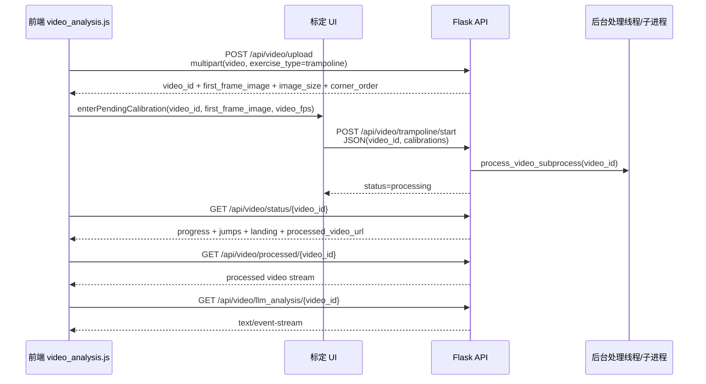
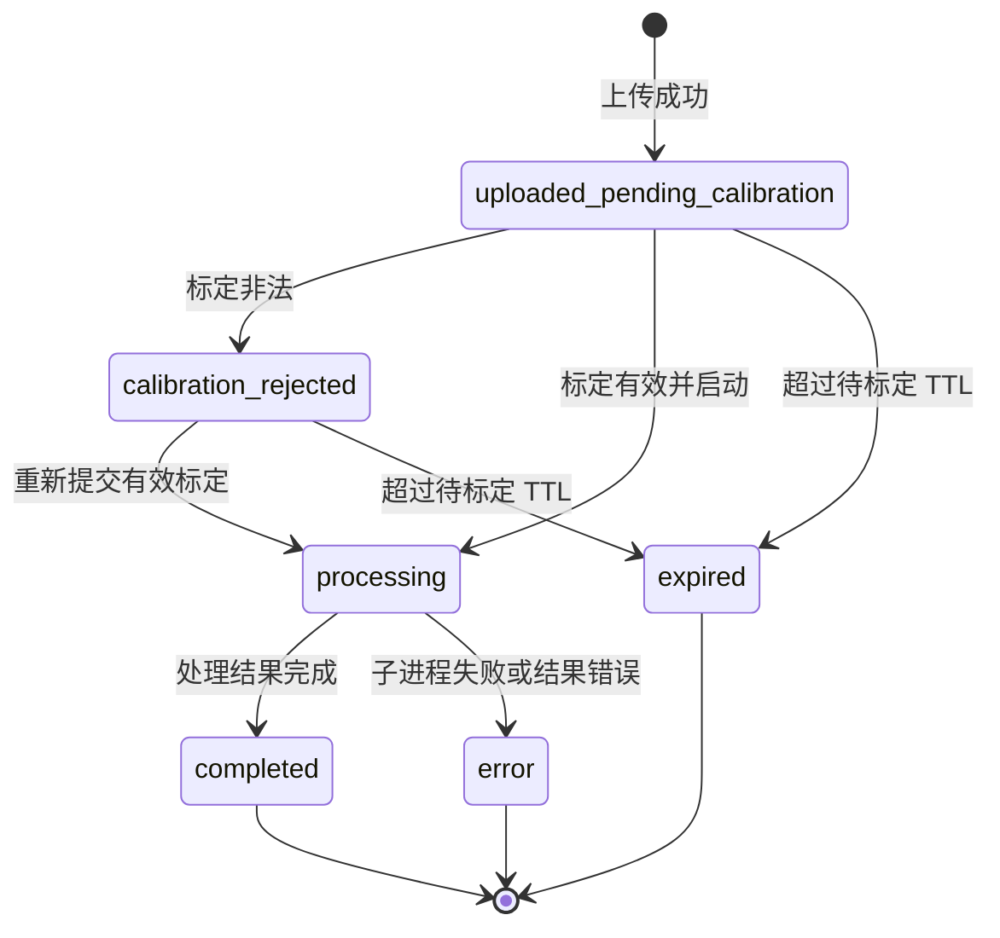

本页聚焦“蹦床视频分析”页面与 Flask 后端之间的 **HTTP/SSE 契约**：前端如何上传视频、提交床面标定、轮询状态、读取处理后视频，并在分析完成后发起 AI 解读流。当前页面在目录中的位置是“深入解析 / 系统架构 / 前后端 API 契约”，它不展开算法内部、视频处理进程或 AI 提示词细节，只记录前后端边界上已经由代码和测试固定下来的字段、状态与错误语义。Sources: [app.py](app.py#L264-L365), [static/js/video_analysis.js](static/js/video_analysis.js#L426-L467), [static/js/trampoline_calibration_ui.js](static/js/trampoline_calibration_ui.js#L382-L405)

## 架构假设与验证结论

从第一性原理看，这个页面的 API 契约不是“一次上传即分析”，而是一个 **两阶段启动协议**：第一阶段上传视频并返回首帧与视频元数据，第二阶段由前端提交一个或多个床面关键帧标定后才启动后台处理。后端在 `/api/video/upload` 中将状态初始化为 `uploaded_pending_calibration`，并返回 `first_frame_image`、`image_size`、`corner_order`、`video_fps`、`total_frames`；前端收到上传响应后不会立即轮询处理结果，而是调用标定控制器进入待标定状态。Sources: [app.py](app.py#L324-L365), [static/js/video_analysis.js](static/js/video_analysis.js#L454-L467)

该时序图对应的后端入口分别是 `/api/video/upload`、`/api/video/trampoline/start`、`/api/video/status/<video_id>`、`/api/video/processed/<video_id>` 与 `/api/video/llm_analysis/<video_id>`；前端实际调用点分别位于上传按钮处理、标定提交、状态轮询、处理后视频替换与 EventSource 初始化逻辑中。Sources: [app.py](app.py#L269-L365), [app.py](app.py#L368-L457), [app.py](app.py#L551-L603), [app.py](app.py#L606-L705), [static/js/video_analysis.js](static/js/video_analysis.js#L293-L320), [static/js/video_analysis.js](static/js/video_analysis.js#L439-L467), [static/js/video_analysis.js](static/js/video_analysis.js#L521-L570), [static/js/trampoline_calibration_ui.js](static/js/trampoline_calibration_ui.js#L382-L405)

## 页面入口契约

`GET /video_analysis` 渲染 `video_analysis.html`，并固定传入 `mode='trampoline'`；模板根容器也固定为 `data-mode="trampoline"`，页面文案声明上传蹦床视频后可在暂停视频上标定床面四角、识别跳次、分析动作与落点。对应测试要求 `/video_analysis` 默认就是蹦床模式，并且页面不再暴露 Fitness Mode、Trampoline Mode 切换或 Select Exercise 文案。Sources: [app.py](app.py#L264-L266), [templates/video_analysis.html](templates/video_analysis.html#L12-L16), [tests/test_app_route_contract.py](tests/test_app_route_contract.py#L37-L45)

页面 DOM 也是契约的一部分：前端脚本依赖 `upload-area`、`video-input`、`video-player`、`analysis-canvas`、`analyze-btn`、`progress-fill`、`stat-reps`、`stat-flight-time`、`stat-action`、`stat-landing`、`landing-map`、`llm-btn` 等元素；测试会从 `video_analysis.js` 与 `trampoline_calibration_ui.js` 中提取 `getElementById(...)` 并断言模板中存在对应 ID。Sources: [static/js/video_analysis.js](static/js/video_analysis.js#L3-L43), [templates/video_analysis.html](templates/video_analysis.html#L23-L120), [tests/test_trampoline_frontend_contract.py](tests/test_trampoline_frontend_contract.py#L7-L20)

## API 总览

下表是前端当前实际使用、后端当前实现并由测试覆盖的 API 契约摘要；所有视频分析相关接口均围绕 `video_id` 关联后端内存中的 `video_analyses` 状态对象。Sources: [app.py](app.py#L33-L39), [app.py](app.py#L269-L365), [app.py](app.py#L368-L457), [app.py](app.py#L551-L603), [app.py](app.py#L606-L705)

| 阶段 | 方法与路径 | 前端调用方 | 请求载荷 | 成功响应核心字段 | 失败语义 |
|---|---|---|---|---|---|
| 上传并进入标定 | `POST /api/video/upload` | `video_analysis.js` | `multipart/form-data`: `video`, `exercise_type=trampoline` | `success`, `video_id`, `status=uploaded_pending_calibration`, `first_frame_b64`, `first_frame_image`, `image_size`, `corner_order`, `video_fps`, `total_frames` | 缺少文件、缺少类型、非蹦床类型、空文件名、超大小、超时长、首帧读取失败返回 `400` |
| 提交标定并启动 | `POST /api/video/trampoline/start` | `trampoline_calibration_ui.js` | JSON: `video_id`, `calibrations`；后端也兼容 `corners` | `success`, `video_id`, `status=processing`, `message`, `calibration_count` | 未找到 `404`；模式不符 `400`；重复启动同标定成功返回；不同标定冲突 `409`；标定非法 `400` 且状态变为 `calibration_rejected` |
| 查询分析状态 | `GET /api/video/status/<video_id>` | `video_analysis.js` | 路径参数 `video_id` | `status`, `progress`, `reps`, `current_action`, `completed_jumps`, `phase`, `latest_landing`, `landings`, `processed_video_url` 等 | 未找到时 JSON 返回 `status=not_found`, `error=Video ID not found` |
| 读取处理后视频 | `GET /api/video/processed/<video_id>` | `video_analysis.js` 在完成后设置 video src | 路径参数 `video_id` | 视频文件响应，MIME 由扩展名决定 | 未找到或未就绪返回 `404` JSON |
| AI 解读流 | `GET /api/video/llm_analysis/<video_id>` | `EventSource` | 路径参数 `video_id` | `text/event-stream`，事件数据为 JSON：`chunk`、`fast_done`、`done`、`error` | 未找到、非蹦床、未完成、服务不可用、API key 缺失均以 SSE `error` 消息返回 |

Sources: [app.py](app.py#L273-L365), [app.py](app.py#L371-L457), [app.py](app.py#L551-L603), [app.py](app.py#L620-L705), [static/js/video_analysis.js](static/js/video_analysis.js#L293-L320), [static/js/video_analysis.js](static/js/video_analysis.js#L439-L467), [static/js/video_analysis.js](static/js/video_analysis.js#L521-L570), [static/js/trampoline_calibration_ui.js](static/js/trampoline_calibration_ui.js#L382-L405)

## 上传接口：`POST /api/video/upload`

上传请求必须是 `multipart/form-data`，前端固定追加 `video` 文件和 `exercise_type='trampoline'`；后端首先清理过期的待标定上传，然后校验 `video` 是否存在、`exercise_type` 是否存在且等于 `trampoline`、文件名是否为空、文件大小是否超过 `MAX_VIDEO_SIZE_MB`、视频时长是否超过 `MAX_VIDEO_DURATION_SEC`。Sources: [static/js/video_analysis.js](static/js/video_analysis.js#L439-L444), [app.py](app.py#L269-L295), [app.py](app.py#L301-L316)

成功上传后，后端生成 UUID 作为 `video_id`，保存原始文件，读取首帧并编码为 PNG base64，然后在 `video_analyses[video_id]` 中写入待标定状态；这个状态对象包含 `mode='trampoline'`、`status='uploaded_pending_calibration'`、`state='PENDING_CALIBRATION'`、`phase='pending_calibration'`、`corner_order`、`image_size`、`video_fps`、`total_frames`、`completed_jumps=[]`、`landings=[]` 等字段。Sources: [app.py](app.py#L296-L351)

成功响应的前端可用字段由测试显式固定：`success is True`、`status == 'uploaded_pending_calibration'`、存在 `message` 与 `video_id`、`first_frame_image` 以 `data:image/png;base64,` 开头、存在原始 `first_frame_b64`、`image_size` 包含宽高、`video_fps` 与 `total_frames` 来自视频元数据、`corner_order` 等于后端常量。Sources: [app.py](app.py#L354-L365), [tests/test_trampoline_api.py](tests/test_trampoline_api.py#L53-L74)

上传失败时，前端只依赖响应 JSON 中的 `success=false` 与 `error` 文本，用于终端日志、反馈日志和状态显示；测试覆盖了缺少视频文件返回 `No video file provided`，以及 `exercise_type='fitness'` 返回 `Only trampoline uploads are supported`。Sources: [static/js/video_analysis.js](static/js/video_analysis.js#L443-L452), [tests/test_app_route_contract.py](tests/test_app_route_contract.py#L48-L65)

## 标定启动接口：`POST /api/video/trampoline/start`

标定启动请求是 JSON。前端标定控制器从已保存的关键帧列表构造 `calibrations`，每个关键帧包含 `frame_index`、`time_s`、`corners_px`；提交时请求体为 `{ video_id: pendingTrampolineVideoId, calibrations }`，请求头为 `Content-Type: application/json`。Sources: [static/js/trampoline_calibration_ui.js](static/js/trampoline_calibration_ui.js#L362-L392)

后端同时支持两种输入形态：新形态是 `calibrations` 列表，兼容形态是在请求体中直接传 `corners`，后者会被转换为 `frame_index=0`、`time_s=0.0` 的单关键帧标定。所有标定都会经过 `_canonicalize_calibrations` 标准化，角点坐标被转成浮点并保留三位小数，关键帧中的 `time_s` 也会保留三位小数。Sources: [app.py](app.py#L82-L127), [app.py](app.py#L411-L418)

启动成功后，后端会写入旁车 JSON 文件 `{video_id}_corners.json`，其中包含 `schema_version=2`、`video_id`、`exercise_type='trampoline'`、首个关键帧的 `frame_index`、`image_size`、`corner_order`、`corners_px`、完整 `calibrations`、固定床面尺寸 `bed_dimensions_m` 与创建时间；随后状态改为 `processing`，并启动后台线程执行 `process_video_subprocess(video_id)`。Sources: [app.py](app.py#L420-L449)

成功响应只承诺启动层面的结果：`success=true`、`video_id`、`status='processing'`、`message='Trampoline analysis started'`、`calibration_count`。测试覆盖了多关键帧乱序提交时旁车文件中的 `calibrations` 会按 `frame_index` 排序，并且响应中的 `calibration_count` 为提交的有效关键帧数量。Sources: [app.py](app.py#L451-L457), [tests/test_trampoline_api.py](tests/test_trampoline_api.py#L198-L220)

该接口具备幂等与冲突语义：如果视频已完成，后端直接返回 `status='completed'` 与可选 `processed_video_url`；如果已经在 `processing` 且新请求标定与既有标定一致，则返回成功并提示已启动；如果正在处理但标定不同，则返回 `409` 与 `Analysis already started with different calibrations`。Sources: [app.py](app.py#L383-L407), [tests/test_trampoline_api.py](tests/test_trampoline_api.py#L143-L176)

非法标定不会启动处理：后端捕获标准化异常后将分析状态改为 `calibration_rejected`，写入 `state='CALIBRATION_REJECTED'`、`error` 和 `feedback`，并返回 `400`；测试覆盖了重复 `frame_index` 的关键帧会被拒绝且视频状态保持为 `calibration_rejected`。Sources: [app.py](app.py#L408-L418), [tests/test_trampoline_api.py](tests/test_trampoline_api.py#L222-L238)

## 状态轮询接口：`GET /api/video/status/<video_id>`

状态轮询是前端实时展示的主契约。标定启动成功后，前端将 `isAnalyzing` 置为 `true` 并每 200ms 请求 `/api/video/status/{videoId}`；当响应 `status='processing'` 时，它更新进度条、进度文字、日志、跳次、动作、滞空时间和落点图。Sources: [static/js/video_analysis.js](static/js/video_analysis.js#L274-L332), [static/js/video_analysis.js](static/js/video_analysis.js#L495-L501)

后端状态响应包含传统统计字段和蹦床运行时字段：`status`、`progress`、`reps`、`form_score`、`avg_form_score`、`grade`、`state`、`feedback`、`error`、`has_processed_video`、`processed_video_url`、`mode='trampoline'`、`current_action`、`completed_jumps`、`phase`、`current_flight_frames`、`current_flight_duration_s`、`latest_landing`、`landings`、`fps`、`video_fps`。Sources: [app.py](app.py#L570-L603)

运行时字段来自 `_sync_analysis_from_results` 对处理结果 JSON 的同步：默认值包括 `progress=0`、`reps=0`、`current_action='--'`、`completed_jumps=[]`、`phase='unknown'`、`current_flight_frames=0`、`current_flight_duration_s=0.0`、`latest_landing=None`、`landings=[]`；如果结果中包含 `fps`、`video_fps`、`total_frames`、`resolution` 等可选字段，也会透传到内存状态。Sources: [app.py](app.py#L213-L247)

当前测试把状态响应的增量字段视为稳定契约：当后端状态中存在 `phase='flight'`、`current_flight_frames=12`、`current_flight_duration_s=0.4`、`latest_landing`、`landings`、`fps=30.0` 时，`GET /api/video/status/{video_id}` 必须原样返回这些字段，同时保留上传时记录的 `video_fps` 与默认 `completed_jumps=[]`。Sources: [tests/test_trampoline_api.py](tests/test_trampoline_api.py#L76-L109)

当状态变为 `completed` 时，前端停止轮询，保存 `completed_jumps`，将进度置为 100%，如果 `has_processed_video` 与 `processed_video_url` 同时存在，则把播放器地址切换为处理后视频并加载播放；当状态为 `error` 时，前端读取 `data.error` 写入日志并停止分析。Sources: [static/js/video_analysis.js](static/js/video_analysis.js#L305-L328)

## 处理后视频接口：`GET /api/video/processed/<video_id>`

处理后视频不是状态 JSON 的内嵌数据，而是独立文件响应。状态接口只返回 `has_processed_video` 和 `processed_video_url`，前端在完成后把 `videoPlayer.src` 设置为该 URL；后端根据 `processed_video` 路径是否存在决定是否可返回文件。Sources: [app.py](app.py#L551-L567), [app.py](app.py#L577-L593), [static/js/video_analysis.js](static/js/video_analysis.js#L315-L319)

该接口的 MIME 类型由文件扩展名决定：`.avi` 返回 `video/x-msvideo`，`.webm` 返回 `video/webm`，其他情况返回 `video/mp4`；未找到 `video_id` 或处理后视频尚未就绪时返回 `404` JSON 错误。Sources: [app.py](app.py#L551-L567)

## AI 解读 SSE 接口：`GET /api/video/llm_analysis/<video_id>`

AI 解读使用 `EventSource`，不是普通 `fetch`。前端点击 AI 按钮后创建 `new EventSource('/api/video/llm_analysis/${currentVideoId}')`，按 `data.type` 分派：`chunk` 追加流式文本，`fast_done` 切换为等待高质量分析提示，`done` 将分段内容填入“整体表现、主要问题、逐跳点评、改进建议”卡片，`error` 显示错误并恢复按钮。Sources: [static/js/video_analysis.js](static/js/video_analysis.js#L505-L570)

后端所有 SSE 响应均使用 `text/event-stream`，事件数据格式为 `data: {JSON}\n\n`，并设置 `Cache-Control: no-cache` 与 `X-Accel-Buffering: no`；对于找不到视频、非蹦床模式、视频尚未完成、LLM 服务不可用或 API key 未配置等情况，接口仍返回 SSE 格式的 `error` 消息。Sources: [app.py](app.py#L606-L645)

成功路径中，后端会先检查缓存；有缓存时直接发送 `done`，携带 `sections` 与 `full_text`。无缓存时，后端并行启动高质量模型线程，同时流式发送快速模型的 `chunk`，快速模型结束后发送 `fast_done`，最终选择高质量结果或快速结果作为 `done` 的 `full_text` 和 `sections`，并附带 `source`。Sources: [app.py](app.py#L647-L705)

## 状态机与错误边界

前后端共享的核心状态值包括 `uploaded_pending_calibration`、`calibration_rejected`、`processing`、`completed`、`error`、`expired` 与未找到时的 `not_found`。其中 `uploaded_pending_calibration` 在上传成功后产生，`calibration_rejected` 在标定校验失败时产生，`processing` 在标定提交成功后产生，`completed` 和 `error` 来自后台处理结果或子进程失败，`expired` 由待标定上传清理逻辑产生。Sources: [app.py](app.py#L149-L170), [app.py](app.py#L324-L351), [app.py](app.py#L411-L418), [app.py](app.py#L469-L548), [app.py](app.py#L570-L603)

该状态图只表达 API 边界能观察到的状态迁移：待标定上传会被 `cleanup_expired_pending_trampoline_uploads` 清理并标记为 `expired`；标定启动接口只允许从 `uploaded_pending_calibration` 或 `calibration_rejected` 进入处理；状态轮询接口把当前状态原样暴露给前端。Sources: [app.py](app.py#L149-L170), [app.py](app.py#L408-L418), [app.py](app.py#L439-L457), [app.py](app.py#L581-L603)

## 已移除接口与负契约

当前前端与后端契约明确不再包含旧健身实时摄像头或动作选择接口。测试要求 `/video_feed`、`/stop_camera`、`/start_exercise`、`/stop_exercise`、`/get_status`、`/exercises`、`/api/profile/update`、`/api/video/analyze_frame` 均返回 `404`，并要求保留的模板与 `video_analysis.js` 不引用这些路径。Sources: [tests/test_app_route_contract.py](tests/test_app_route_contract.py#L6-L16), [tests/test_app_route_contract.py](tests/test_app_route_contract.py#L30-L35), [tests/test_app_route_contract.py](tests/test_app_route_contract.py#L76-L97)

这意味着中间层或前端扩展不应把旧 Fitness Trainer 契约重新接入当前页面；当前页面的可用边界是“上传蹦床视频 → 标定床面 → 启动处理 → 轮询状态 → 播放处理后视频 → 可选 SSE AI 解读”。Sources: [tests/test_app_route_contract.py](tests/test_app_route_contract.py#L19-L28), [tests/test_app_route_contract.py](tests/test_app_route_contract.py#L37-L45), [static/js/video_analysis.js](static/js/video_analysis.js#L426-L570)

## 开发者使用建议

如果你要修改前端交互，优先保护三类契约：第一，上传响应必须继续提供首帧与 `video_id`，否则标定 UI 无法进入待标定状态；第二，`/api/video/trampoline/start` 必须保持 `calibrations` JSON 输入和 `calibration_count` 成功输出，否则多关键帧标定测试会失效；第三，状态接口必须继续透传 `phase`、`current_flight_duration_s`、`latest_landing`、`landings` 与 `completed_jumps`，否则实时统计、落点图和最终报告会丢失数据来源。Sources: [static/js/video_analysis.js](static/js/video_analysis.js#L454-L467), [static/js/trampoline_calibration_ui.js](static/js/trampoline_calibration_ui.js#L382-L405), [app.py](app.py#L581-L603), [tests/test_trampoline_api.py](tests/test_trampoline_api.py#L76-L109), [tests/test_trampoline_api.py](tests/test_trampoline_api.py#L198-L220)

继续阅读时，若你关心这些 API 背后的路由状态与任务生命周期，请转到 [后端路由、状态机与任务生命周期](9-hou-duan-lu-you-zhuang-tai-ji-yu-ren-wu-sheng-ming-zhou-qi)；若你关心轮询结果如何在页面上展示，请转到 [分析进度轮询与结果展示](22-fen-xi-jin-du-lun-xun-yu-jie-guo-zhan-shi)；若你关心标定数据本身的几何意义，请转到 [四角标定与关键帧补标](16-si-jiao-biao-ding-yu-guan-jian-zheng-bu-biao)。Sources: [app.py](app.py#L368-L603), [static/js/video_analysis.js](static/js/video_analysis.js#L274-L332), [static/js/trampoline_calibration_ui.js](static/js/trampoline_calibration_ui.js#L362-L405)