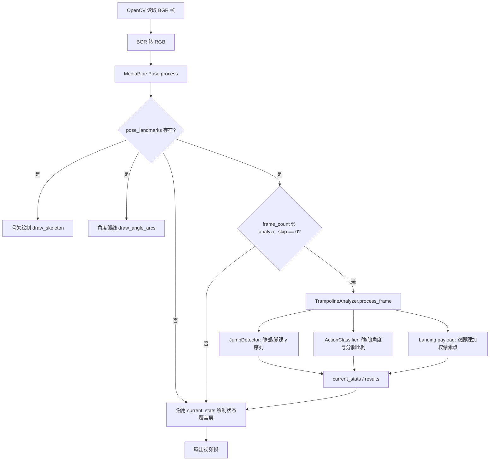
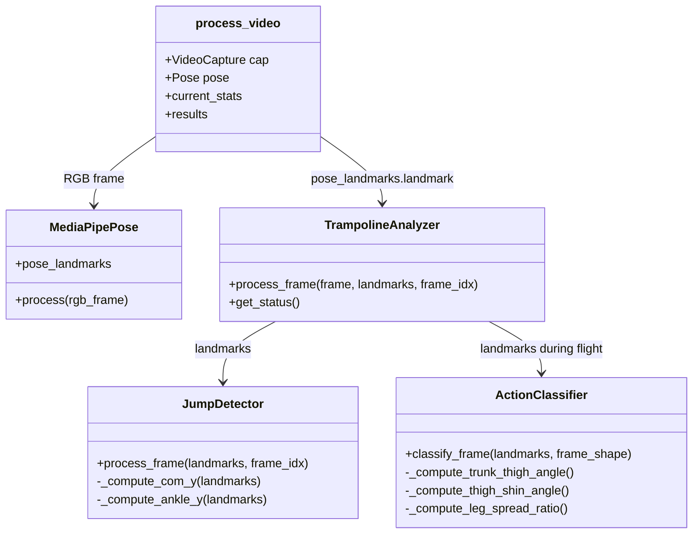

本页定位在“蹦床分析核心算法”中的第一层输入管线：视频帧如何进入 MediaPipe Pose、姿态关键点如何被转换为骨架可视化、跳次检测、动作分类与落点补充所需的结构化输入。范围刻意限制在 **MediaPipe 姿态关键点的提取、筛选、坐标使用与下游分发**；跳次分割、动作分类状态机、床面坐标映射和覆盖层完整渲染分别属于后续页面。Sources: [video_processor.py](video_processor.py#L250-L294), [trampoline/analyzer.py](trampoline/analyzer.py#L22-L86)

## 架构假设与验证结论

从第一原则看，这条管线的核心约束是：MediaPipe 输出的是逐帧、归一化、带可见度的身体关键点，而蹦床分析需要的是时间序列上的髋部纵向运动、飞行期身体角度、脚踝落点和可视化骨架。因此合理的架构假设是：视频处理进程在每帧运行 Pose 推理，在有 `pose_landmarks` 时立即做可视化；但只按降采样频率把 landmark list 交给分析器，避免所有算法都以原始视频 FPS 运行。代码验证显示，该假设成立：`pose.process(rgb_frame)` 每帧执行，骨架和角度弧线在检测到 landmark 时绘制，而 `analyzer.process_frame(...)` 仅在 `frame_count % analyze_skip == 0` 时调用。Sources: [video_processor.py](video_processor.py#L212-L214), [video_processor.py](video_processor.py#L250-L258)

下图描述的是本页关注的关键点处理边界：MediaPipe Pose 是唯一的人体姿态入口，`pose_results.pose_landmarks` 同时流向“即时绘制”和“抽样分析”两条路径；分析器内部再把同一组 landmark 分发给跳次检测、动作分类和落点补充，但本页只解释 landmark 如何被消费，不展开各算法的判定细节。Sources: [video_processor.py](video_processor.py#L250-L294), [trampoline/analyzer.py](trampoline/analyzer.py#L36-L86)

## MediaPipe Pose 初始化与运行参数

`process_video` 在确认模式为 `trampoline`、打开视频并初始化床面跟踪后创建 MediaPipe Pose 实例；配置为视频流模式 `static_image_mode=False`，模型复杂度 `model_complexity=1`，关闭分割 `enable_segmentation=False`，检测置信度和跟踪置信度阈值都设为 `0.5`。这些参数定义了本项目的人体关键点入口：它不是静态图片逐张检测模式，也不使用人体分割掩码，后续算法完全依赖 Pose landmark 坐标与可见度。Sources: [video_processor.py](video_processor.py#L179-L187)

| 参数 | 代码值 | 对关键点管线的影响 |
|---|---:|---|
| `static_image_mode` | `False` | 按视频流方式处理连续帧 |
| `model_complexity` | `1` | 使用中等复杂度 Pose 模型 |
| `enable_segmentation` | `False` | 不生成或消费分割掩码 |
| `min_detection_confidence` | `0.5` | 低于阈值的检测不会成为稳定输入 |
| `min_tracking_confidence` | `0.5` | 跟踪置信度低时由 MediaPipe 自身处理重检测/跟踪 |

Sources: [video_processor.py](video_processor.py#L179-L187)

输入帧由 OpenCV 以 BGR 格式读出，而 MediaPipe Pose 的调用前显式转换为 RGB：`rgb_frame = cv2.cvtColor(frame, cv2.COLOR_BGR2RGB)`，随后调用 `pose.process(rgb_frame)`。这意味着所有下游坐标仍然基于原始帧宽高解释，但推理输入颜色空间已转换，绘制输出仍在 OpenCV BGR 帧上完成。Sources: [video_processor.py](video_processor.py#L236-L252), [video_processor.py](video_processor.py#L294-L299)

## Landmark 数据契约：33 点列表中的项目子集

项目通过 `trampoline.config.LANDMARK` 固定 MediaPipe landmark 索引，只声明后续算法需要的身体点：鼻子、左右肩、左右髋、左右膝、左右踝以及左右脚尖。其中实际核心管线主要消费肩、髋、膝、踝；脚尖索引被配置但本页所检视的跳次、动作和落点处理没有直接使用它。Sources: [trampoline/config.py](trampoline/config.py#L5-L18), [trampoline/jump_detector.py](trampoline/jump_detector.py#L205-L221), [trampoline/action_classifier.py](trampoline/action_classifier.py#L195-L260)

测试夹具进一步验证了接口形态：算法可在不导入 MediaPipe 的情况下使用 33 元素 landmark 列表，单个 landmark 只需具备 `x`、`y`、`visibility` 属性即可被检测和分类逻辑消费。因此，下游模块依赖的是 MediaPipe landmark 的结构契约，而不是 MediaPipe Python 类型本身。Sources: [tests/test_trampoline.py](tests/test_trampoline.py#L16-L30), [tests/test_trampoline.py](tests/test_trampoline.py#L164-L170)

## 坐标系统：归一化 landmark 到像素几何

MediaPipe landmark 的 `x`、`y` 在管线中按归一化坐标处理：绘制骨架时用 `int(lm.x * w)`、`int(lm.y * h)` 转换为像素点；动作分类计算角度时也使用帧宽高把肩、髋、膝、踝转换为二维像素坐标后再计算向量夹角。由此可见，跳次检测使用归一化纵向 `y` 序列，而角度和可视化使用像素坐标几何。Sources: [video_processor.py](video_processor.py#L31-L45), [trampoline/action_classifier.py](trampoline/action_classifier.py#L195-L233)

落点补充路径同样从归一化脚踝坐标进入像素域：分析器取左右脚踝，根据两侧 `visibility` 加权平均 `x`、`y`，再乘以帧宽高得到 `ankle_px`，并把该像素点传给床面跟踪器的落点 payload 逻辑。这里的关键点处理语义是“脚踝中心点估计”，而不是单脚落点或脚尖落点。Sources: [trampoline/analyzer.py](trampoline/analyzer.py#L88-L111)

## 可见度阈值：同一 landmark 在不同阶段的门槛不同

本项目没有全局统一一个 landmark 可见度阈值，而是按用途设置不同门槛：骨架连线绘制要求端点 `visibility > 0.5`，角度弧线绘制要求三点 `visibility > 0.4`，跳次检测中髋部和脚踝纵向序列接受 `visibility >= 0.3` 的单侧或双侧点，动作分类的角度和分腿比例同样以 `0.3` 作为可用性阈值。Sources: [video_processor.py](video_processor.py#L43-L72), [trampoline/overlay.py](trampoline/overlay.py#L231-L260), [trampoline/jump_detector.py](trampoline/jump_detector.py#L205-L221), [trampoline/action_classifier.py](trampoline/action_classifier.py#L195-L260)

| 消费者 | 使用点 | 可见度门槛 | 失败处理 |
|---|---|---:|---|
| 骨架绘制 | 肩、肘、腕、髋、膝、踝 | `> 0.5` | 不绘制该连线或关节点 |
| 角度弧线绘制 | 肩-髋-膝、髋-膝-踝 | `> 0.4` | 跳过该关节弧线 |
| 跳次检测 | 左右髋、左右踝 | `>= 0.3` | 双侧不可见时返回 `None`，本帧不更新运动事件 |
| 动作分类 | 肩、髋、膝、踝 | `>= 0.3` | 角度不可得时累计 invalid frame，达到阈值回退 Unknown |
| 落点补充 | 左右踝 | 使用连续 visibility 权重 | 双侧权重近零时退化为简单平均并把 ankle visibility 置零 |

Sources: [video_processor.py](video_processor.py#L43-L72), [trampoline/overlay.py](trampoline/overlay.py#L251-L265), [trampoline/jump_detector.py](trampoline/jump_detector.py#L205-L221), [trampoline/action_classifier.py](trampoline/action_classifier.py#L79-L90), [trampoline/analyzer.py](trampoline/analyzer.py#L94-L110)

## 即时可视化路径：骨架与角度弧线

当 `pose_results.pose_landmarks` 存在时，视频处理器先调用 `draw_skeleton(frame, pose_results.pose_landmarks)`，再调用 `draw_angle_arcs(frame, pose_results.pose_landmarks)`；两者使用的是 MediaPipe 原始 `pose_landmarks` 对象，而不是传给分析器的 `.landmark` 列表。这一区分很重要：绘制函数需要访问 `.landmark` 容器，分析函数直接接收 list-like landmark 序列。Sources: [video_processor.py](video_processor.py#L253-L258), [trampoline/overlay.py](trampoline/overlay.py#L231-L247)

骨架绘制只覆盖躯干、手臂和腿部的简化连接：躯干连接肩-肩、肩-髋、髋-髋；手臂连接肩-肘-腕；腿部连接髋-膝-踝。每条线要求两端点可见，关节点圆点也只在 `visibility > 0.5` 时绘制，因此视觉骨架本身已经是经过可见度过滤的结果。Sources: [video_processor.py](video_processor.py#L31-L74)

角度弧线绘制关注与动作分类一致的两个关节族：髋关节处的肩-髋-膝角，以及膝关节处的髋-膝-踝角。绘制函数在像素坐标中计算向量夹角，并按角度区间选择颜色：大于 `135` 为绿色，大于 `90` 为橙色，否则为红色；该颜色逻辑仅服务可视化，不直接写回分类状态。Sources: [trampoline/overlay.py](trampoline/overlay.py#L254-L312)

## 抽样分析路径：每帧推理，约 15 FPS 消费

管线中的一个关键性能模式是“推理与分析分频”：MediaPipe Pose 对每个视频帧运行，但 `analyze_skip = max(1, int(fps / 15))` 使 `TrampolineAnalyzer` 约以 15 FPS 接收 landmark。也就是说，输出视频可以每帧绘制姿态骨架，而跳次、动作、速度和落点状态只在抽样帧上更新，并在非抽样帧继续沿用最近一次 `current_stats`。Sources: [video_processor.py](video_processor.py#L212-L214), [video_processor.py](video_processor.py#L250-L294)

这种分频在数据结构上体现为两层状态：`current_stats` 是渲染层的当前状态缓存，`results` 是写入 JSON 供前端轮询的分析结果缓存；只有当抽样帧进入 `analyzer.process_frame(...)` 后，跳数、动作、阶段、速度、角度和落点字段才同步更新到这两个缓存。Sources: [video_processor.py](video_processor.py#L216-L233), [video_processor.py](video_processor.py#L257-L287)

## TrampolineAnalyzer 的 landmark 分发边界

`TrampolineAnalyzer.process_frame(frame, landmarks, frame_idx)` 是 MediaPipe landmark 进入算法域的统一入口。它先把 landmark 交给 `JumpDetector.process_frame`，再根据检测事件驱动动作分类器的 phase，最后仅在检测 phase 为 `flight` 时调用 `ActionClassifier.classify_frame`。因此，动作分类并非对所有有姿态的帧运行，而是受跳次检测输出 phase 约束。Sources: [trampoline/analyzer.py](trampoline/analyzer.py#L22-L70)

分析器返回的结果仍然保留关键点衍生量：`velocity`、`com_y`、`ankle_y` 来自跳次检测，`trunk_thigh_angle`、`thigh_shin_angle` 来自动作分类，`latest_landing` 和 `landings` 来自落点补充。这些字段证明 MediaPipe landmark 在本管线中被转换为三类下游信号：纵向运动信号、身体角度信号和脚踝像素落点信号。Sources: [trampoline/analyzer.py](trampoline/analyzer.py#L71-L86)

## 纵向运动信号：髋部中心与脚踝高度

跳次检测从 landmark 中提取两个归一化纵向信号：`com_y` 使用左右髋的 `y` 均值或单侧可见髋点，`ankle_y` 使用左右脚踝的 `y` 均值或单侧可见踝点；如果两侧都低于可见度门槛，则对应信号为 `None`。这说明当前“身体质心”实现是髋部中心代理，而不是全身多点加权质心。Sources: [trampoline/jump_detector.py](trampoline/jump_detector.py#L76-L90), [trampoline/jump_detector.py](trampoline/jump_detector.py#L205-L221)

当髋部或脚踝信号不可得时，跳次检测不会抛出异常，而是写入诊断日志并返回默认 result；默认 result 保持事件为空、phase 为当前 phase、速度和关键点派生值为零。这是关键点缺失时的稳定性边界：低可见度 landmark 会导致该抽样帧不产生运动事件，而不是中断整个视频处理。Sources: [trampoline/jump_detector.py](trampoline/jump_detector.py#L63-L87)

## 身体角度信号：髋角、膝角与分腿比例

动作分类从 landmark 中计算三类几何量：肩-髋-膝的躯干-大腿角，髋-膝-踝的大腿-小腿角，以及左右脚踝距离除以左右髋距离得到的分腿比例。前两者通过 `_angle_between` 在像素坐标中计算角度，第三者通过二维欧氏距离计算比例。Sources: [trampoline/action_classifier.py](trampoline/action_classifier.py#L29-L45), [trampoline/action_classifier.py](trampoline/action_classifier.py#L195-L260)

分类函数只在 `_phase == "flight"` 时工作；如果不是飞行期，直接返回 `UNKNOWN`。在飞行期内，若髋角或膝角不可得，则累计 `invalid_frame_count`，达到 `UNKNOWN_FALLBACK_FRAMES` 后把状态回退为 Unknown；若角度可得，则写入 `trunk_thigh_angle`、`thigh_shin_angle` 和 `leg_spread_ratio`，再进入滞回判定。Sources: [trampoline/action_classifier.py](trampoline/action_classifier.py#L68-L94), [trampoline/config.py](trampoline/config.py#L28-L39)

## 脚踝落点信号：visibility 加权中心点

落点补充逻辑在 landing 事件发生后执行，输入仍是同一帧的 MediaPipe landmark。它读取左右脚踝的 `x`、`y` 与 `visibility`，当两侧可见度总和大于极小值时用可见度加权平均，否则用两侧坐标的简单平均；随后将归一化坐标乘以帧宽高形成 `ankle_px`。Sources: [trampoline/analyzer.py](trampoline/analyzer.py#L88-L111)

这里值得注意的设计边界是：`ankle_visibility` 被压缩为 `min(1.0, total_vis / 2.0)`，作为脚踝中心点可信度传给落点 payload；而 `ankle_px` 以一位小数写入 payload，供覆盖层或结果展示使用。该处理仍属于 landmark 到像素点的转换层，床面坐标和区域分类不在本页展开。Sources: [trampoline/analyzer.py](trampoline/analyzer.py#L96-L110)

## 缺失姿态帧的行为

如果某一帧没有 `pose_results.pose_landmarks`，代码不会调用骨架绘制、角度弧线绘制或分析器；但仍会调用 `draw_trampoline_overlay(frame, current_stats, current_stats.get('bed_info'))`。因此，缺失姿态帧不会清空当前状态，而是继续使用最近一次成功分析得到的统计信息绘制覆盖层。Sources: [video_processor.py](video_processor.py#L250-L294)

这种行为与分析抽样共同形成“状态保持”模型：MediaPipe 无检测帧、非抽样帧和低可见度抽样帧都可能不更新算法状态，但输出视频仍保持连续渲染，JSON 结果也按每 15 帧周期写出当前缓存。Sources: [video_processor.py](video_processor.py#L257-L303), [trampoline/jump_detector.py](trampoline/jump_detector.py#L79-L100)

## 诊断与验证支撑

跳次检测器为每个被分析的抽样帧记录诊断数据，包括帧号、时间、`com_y`、`ankle_y`、原始速度、平滑速度、phase 和 event；视频处理结束后会把诊断 CSV 写到与结果 JSON 同名前缀的 `_diagnostics.csv`。这为排查 MediaPipe landmark 抖动或不可见导致的运动信号异常提供了可复现证据。Sources: [trampoline/jump_detector.py](trampoline/jump_detector.py#L183-L203), [video_processor.py](video_processor.py#L331-L333)

测试层通过合成 landmark 验证了关键点契约：可以构造 33 元素列表模拟 MediaPipe 输出，验证低可见度 landmark 不会使跳次检测崩溃，验证接触期动作分类返回 Unknown，验证直体、团身/屈体、分腿与 invalid fallback 行为。这些测试说明算法的输入边界明确落在 `x/y/visibility` 三元属性上。Sources: [tests/test_trampoline.py](tests/test_trampoline.py#L16-L30), [tests/test_trampoline.py](tests/test_trampoline.py#L164-L183), [tests/test_trampoline.py](tests/test_trampoline.py#L185-L224), [tests/test_trampoline.py](tests/test_trampoline.py#L249-L311)

## 与后续页面的边界

如果要继续追踪 `com_y` 和速度极值如何变成起跳、落地和跳次，请阅读 [跳次分割与起跳落地检测](13-tiao-ci-fen-ge-yu-qi-tiao-luo-di-jian-ce)；如果要理解髋角、膝角和分腿比例如何映射为动作类别，请阅读 [动作分类：直体、屈体、团身与分腿跳](14-dong-zuo-fen-lei-zhi-ti-qu-ti-tuan-shen-yu-fen-tui-tiao)；如果要理解飞行中段投票和滞回如何减少抖动，请阅读 [中段投票与滞回状态机](15-zhong-duan-tou-piao-yu-zhi-hui-zhuang-tai-ji)。Sources: [trampoline/jump_detector.py](trampoline/jump_detector.py#L102-L191), [trampoline/action_classifier.py](trampoline/action_classifier.py#L91-L193), [trampoline/action_classifier.py](trampoline/action_classifier.py#L96-L106)

如果关注脚踝像素落点如何映射到床面平面，请转向 [图像坐标到床面坐标的映射](18-tu-xiang-zuo-biao-dao-chuang-mian-zuo-biao-de-ying-she)；如果关注 `latest_landing` 和 `landings` 如何被绘制为十字标记与小地图，请阅读 [落点数据结构与可视化](19-luo-dian-shu-ju-jie-gou-yu-ke-shi-hua) 和 [覆盖层绘制：骨架、床面、速度与落点](23-fu-gai-ceng-hui-zhi-gu-jia-chuang-mian-su-du-yu-luo-dian)。Sources: [trampoline/analyzer.py](trampoline/analyzer.py#L88-L111), [trampoline/overlay.py](trampoline/overlay.py#L108-L113), [trampoline/overlay.py](trampoline/overlay.py#L171-L229)