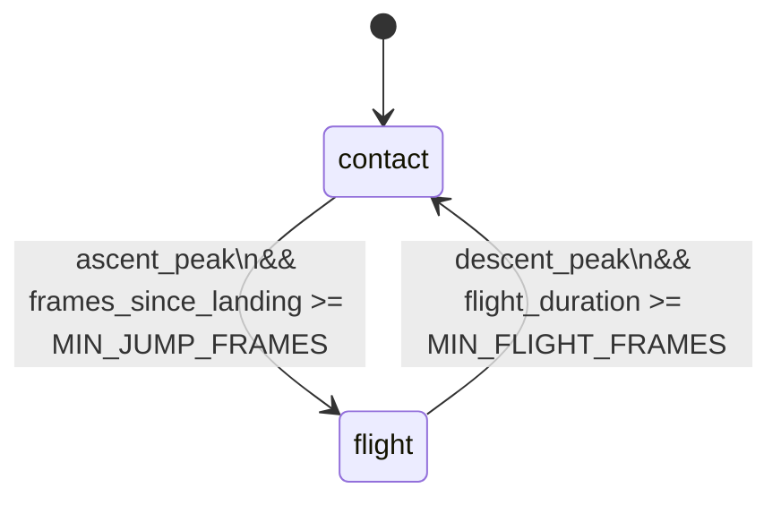
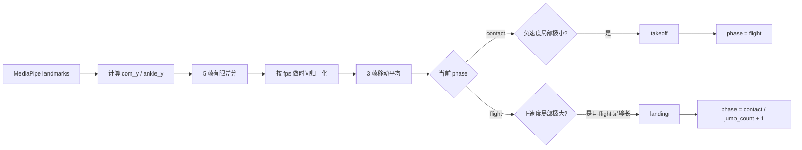

本页聚焦 **“连续姿态帧 → 离散跳次事件”** 这条边界：`JumpDetector` 负责从重心轨迹中识别 `takeoff` / `landing`，`TrampolineAnalyzer` 负责把这些事件整理成可消费的跳次结果，而 `video_processor.py` 负责把帧号、结果与诊断日志串成完整分析链路。Sources: [jump_detector.py](trampoline/jump_detector.py#L1-L9), [jump_detector.py](trampoline/jump_detector.py#L63-L191), [analyzer.py](trampoline/analyzer.py#L22-L86), [video_processor.py](video_processor.py#L235-L333), [README.md](README.md#L16-L21)

## 1. 这层能力的核心模型

实现的核心不是“直接看高度”，而是把每帧骨架压缩成两个稳定的一维信号：**`com_y`** 和 **`ankle_y`**。其中 `com_y` 来自左右髋关节，`ankle_y` 来自左右脚踝；当双侧都满足可见度阈值时取均值，只有单侧可用时退化为单侧值。`JumpDetector` 在此基础上使用一个 5 帧窗口做有限差分，再按 `VELOCITY_WINDOW / fps` 做时间归一化，最后再叠加 3 帧移动平均，形成用于事件判定的平滑速度。Sources: [jump_detector.py](trampoline/jump_detector.py#L21-L31), [jump_detector.py](trampoline/jump_detector.py#L76-L110), [jump_detector.py](trampoline/jump_detector.py#L205-L221), [config.py](trampoline/config.py#L20-L26)

为了便于建立直觉，可以把这层逻辑理解为一个 **双态机**：`contact` 表示身体仍与床面接触，`flight` 表示已经离床。状态只在两个边界事件上切换：`takeoff` 让系统从 `contact` 进入 `flight`，`landing` 让系统从 `flight` 回到 `contact`。这意味着“跳次”不是每个上升或下降片段都计数，而是以 **一次完整的 flight 段** 作为一个跳次单位。Sources: [jump_detector.py](trampoline/jump_detector.py#L35-L47), [jump_detector.py](trampoline/jump_detector.py#L113-L181)

上图中的两个守卫条件都不是零交叉判定，而是 **局部极值判定**：起跳看“负速度局部最小值”，落地看“正速度局部最大值”。这与历史修复文档中的问题描述一致：先修正速度量纲与帧号，再把落地方向从“最高点”改为“真实落床点”。Sources: [jump_detector.py](trampoline/jump_detector.py#L113-L181), [2026-03-28-修复跳次分割检测.md](trampoline/docs/2026-03-28-修复跳次分割检测.md#L12-L18), [2026-04-01-修复落地检测与诊断输出.md](trampoline/docs/2026-04-01-修复落地检测与诊断输出.md#L8-L31)

## 2. 事件判定的具体规则

下面这张表把 `takeoff` 与 `landing` 的判定条件拆开看。`JumpDetector` 在 `phase == "contact"` 时才允许触发起跳，在 `phase == "flight"` 时才允许触发落地；两个事件都要同时满足“极值形态”和“最小帧数门槛”，避免把短促噪声当成有效跳次。Sources: [jump_detector.py](trampoline/jump_detector.py#L113-L181), [config.py](trampoline/config.py#L21-L26)

| 事件 | 当前阶段 | 判定核心 | 触发后副作用 | 代码证据 |
|---|---|---|---|---|
| `takeoff` | `contact` | `prev_smoothed < prev_prev_smoothed` 且 `prev_smoothed < smoothed` 且 `prev_smoothed < MIN_ASCENT_VEL` | 切到 `flight`，设置 `_flight_start = frame_idx`，重置本次 flight 的输出 | [jump_detector.py](trampoline/jump_detector.py#L152-L171) |
| `landing` | `flight` | `prev_smoothed > prev_prev_smoothed` 且 `prev_smoothed > smoothed` 且 `prev_smoothed > MIN_DESCENT_VEL` | 切回 `contact`，`jump_count += 1`，把本次跳跃写入 `jumps` | [jump_detector.py](trampoline/jump_detector.py#L113-L151) |

表中两个门槛的作用不同：`MIN_ASCENT_VEL` 和 `MIN_DESCENT_VEL` 控制“极值幅度是否足够”，`MIN_JUMP_FRAMES` 和 `MIN_FLIGHT_FRAMES` 控制“这是不是一个真正的跳次”。代码还额外把 `INTERMEDIATE_MAX_FLIGHT_FRAMES` 记入每次 landing 记录，用 `is_intermediate` 标记短飞行段。Sources: [config.py](trampoline/config.py#L23-L26), [config.py](trampoline/config.py#L42-L42), [jump_detector.py](trampoline/jump_detector.py#L125-L145)

这条管线的关键点在于：**事件判定依赖的是平滑后的速度曲线，而不是原始单帧速度**。这样做的直接结果是，判定条件与视频帧率解耦，且 `process_frame()` 返回的 `velocity`、`phase`、`current_flight_frames` 可以作为 UI 状态的稳定输入，而不会改变事件语义本身。Sources: [jump_detector.py](trampoline/jump_detector.py#L102-L191), [jump_detector.py](trampoline/jump_detector.py#L52-L61)

## 3. 跳次记录如何落到结果结构里

`JumpDetector` 的职责只到“判出事件”为止；真正的跳次对象是在 `landing` 时被写入 `jumps` 列表。每个条目至少包含 `jump_number`、`start_frame`、`end_frame`、`flight_start`、`flight_end`、`flight_frames`、`is_intermediate` 和占位 `action`。这意味着**跳次分割**和**动作分类**在数据结构上是解耦的：前者先给出一段完整 flight，后者随后填充 `action`。Sources: [jump_detector.py](trampoline/jump_detector.py#L125-L145), [analyzer.py](trampoline/analyzer.py#L44-L63)

`TrampolineAnalyzer` 在收到 `takeoff` 后只做两件事：把 `ActionClassifier` 切到 `flight`，并重置当前跳次的动作状态；在收到 `landing` 后，它会先读取 `ActionClassifier` 的最终动作，再把该动作写回 `jump_detector.jumps[-1]`，然后把一个 `jump_entry` 放进 `completed_jumps`。`landing` 还会附带床面相关信息，但这属于落点丰富化，不改变跳次分割本身。Sources: [analyzer.py](trampoline/analyzer.py#L39-L63), [analyzer.py](trampoline/analyzer.py#L88-L114)

| 输出层级 | 主要字段 | 语义 |
|---|---|---|
| `JumpDetector.process_frame()` | `event`, `phase`, `jump_count`, `current_flight_frames`, `current_flight_duration_s` | 事件与当前状态 |
| `TrampolineAnalyzer.process_frame()` | `current_action`, `completed_jumps`, `latest_landing`, `landings` | 把事件转成可展示的跳次结果 |
| `video_processor.py` 结果对象 | `reps`, `phase`, `current_flight_*`, `completed_jumps`, `landings` | 持久化到轮询结果 JSON |

上表中的字段并不是重复设计，而是分层职责的反映：`JumpDetector` 提供最小事件集，`TrampolineAnalyzer` 聚合跳次语义，`video_processor.py` 则把它们写进轮询结果，供前端持续读取。Sources: [jump_detector.py](trampoline/jump_detector.py#L63-L191), [analyzer.py](trampoline/analyzer.py#L22-L86), [video_processor.py](video_processor.py#L216-L333)

## 4. 帧号、时序与诊断输出

当前实现明确使用 **视频真实帧号** 作为事件时序基准：`TrampolineAnalyzer.process_frame()` 接收可选 `frame_idx`，而 `video_processor.py` 在逐帧循环中把 `frame_count` 原样传入。这样 `current_flight_frames`、`current_flight_duration_s`、`dump_diagnostics()` 的时间戳就都与视频实际进度对齐。Sources: [analyzer.py](trampoline/analyzer.py#L22-L37), [video_processor.py](video_processor.py#L235-L259)

`JumpDetector` 还维护了 `_diagnostic_log`，并能通过 `dump_diagnostics(path)` 输出 CSV。诊断文件每行记录 `frame`、`time_s`、`com_y`、`ankle_y`、`velocity`、`smoothed_velocity`、`phase` 和 `event`；`video_processor.py` 在分析结束后会自动生成 `*_diagnostics.csv`。这使得落地/起跳边界可以在时间轴上被直接回放和核查。Sources: [jump_detector.py](trampoline/jump_detector.py#L183-L203), [video_processor.py](video_processor.py#L331-L333), [2026-04-01-修复落地检测与诊断输出.md](trampoline/docs/2026-04-01-修复落地检测与诊断输出.md#L33-L53)

| 诊断字段 | 用途 |
|---|---|
| `frame` | 对齐视频帧 |
| `time_s` | 对齐时间轴 |
| `com_y` | 观察重心位移 |
| `ankle_y` | 观察脚踝轨迹 |
| `velocity` | 查看原始速度变化 |
| `smoothed_velocity` | 查看判定所用平滑速度 |
| `phase` | 检查状态切换点 |
| `event` | 查看事件触发帧 |

这份诊断结构与历史文档中的修复目标一致：先把落地方向纠正，再把平滑速度和 CSV 输出补齐，最终让“事件是否触发、何时触发、为什么触发”都能在同一份轨迹里被验证。Sources: [jump_detector.py](trampoline/jump_detector.py#L183-L203), [2026-04-01-修复落地检测与诊断输出.md](trampoline/docs/2026-04-01-修复落地检测与诊断输出.md#L13-L31), [2026-04-01-修复落地检测与诊断输出.md](trampoline/docs/2026-04-01-修复落地检测与诊断输出.md#L55-L58)

## 5. 当前实现的验证证据

单元测试已经把这个分割逻辑锁定在几个关键场景上：`test_full_jump_cycle` 通过合成的下降、上升、腾空、下降序列验证完整的 `contact → flight → contact` 周期；`test_missing_landmarks_handled` 验证低可见度输入不会让检测崩溃；`test_initial_state` 则确认检测器从 `contact` 开始，而不是从某个不确定态开始。Sources: [tests/test_trampoline.py](tests/test_trampoline.py#L78-L171)

API 层的契约测试进一步确认了这些事件会被外层系统透出：状态接口能返回 `phase`、`current_flight_frames`、`current_flight_duration_s`、`latest_landing`、`landings` 与 `completed_jumps`，因此跳次分割不是内部私有逻辑，而是已经稳定进入上层结果模型。Sources: [tests/test_trampoline_api.py](tests/test_trampoline_api.py#L76-L140), [analyzer.py](trampoline/analyzer.py#L71-L86), [video_processor.py](video_processor.py#L274-L333)

| 验证点 | 覆盖内容 | 证据 |
|---|---|---|
| 初始状态 | `phase == "contact"`，`jump_count == 0` | [tests/test_trampoline.py](tests/test_trampoline.py#L78-L84) |
| 完整跳次周期 | `takeoff` 与 `landing` 都能被触发 | [tests/test_trampoline.py](tests/test_trampoline.py#L99-L163) |
| 低可见度容错 | 输入缺失不抛异常 | [tests/test_trampoline.py](tests/test_trampoline.py#L164-L171) |
| 状态契约输出 | 结果对象暴露 flight 与 landing 字段 | [tests/test_trampoline_api.py](tests/test_trampoline_api.py#L76-L109) |

## 6. 读到这里之后，下一步看什么

如果你已经理解了“跳次何时切分”，下一步最自然的是看动作如何被挂接到这些 flight 段上：先读 [动作分类：直体、屈体、团身与分腿跳](14-dong-zuo-fen-lei-zhi-ti-qu-ti-tuan-shen-yu-fen-tui-tiao)，再读 [中段投票与滞回状态机](15-zhong-duan-tou-piao-yu-zhi-hui-zhuang-tai-ji)。如果你想回到输入端确认关键点来源与索引，再看 [MediaPipe 姿态关键点处理管线](12-mediapipe-zi-tai-guan-jian-dian-chu-li-guan-xian)。Sources: [analyzer.py](trampoline/analyzer.py#L39-L86), [jump_detector.py](trampoline/jump_detector.py#L205-L221), [README.md](README.md#L16-L21)