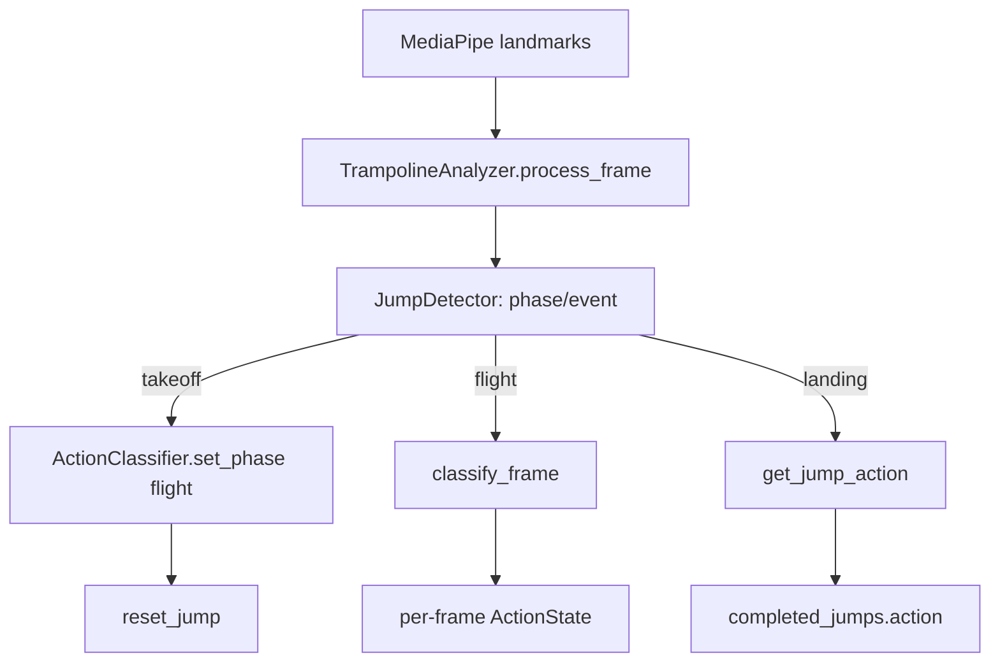
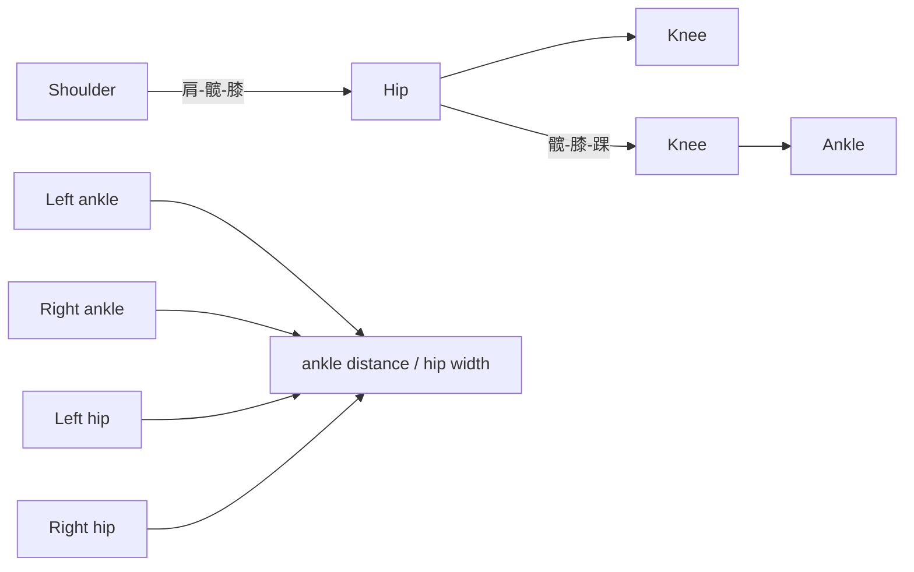
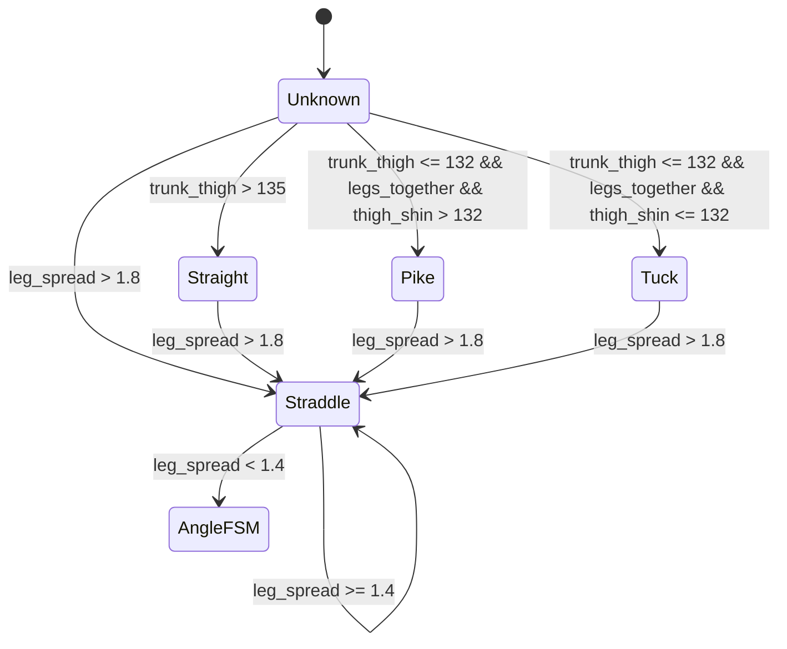

本页聚焦 `ActionClassifier` 的可验证实现边界：它把每帧 MediaPipe 姿态关键点转换为三类几何特征——躯干-大腿角、 大腿-小腿角、踝距/髋宽分腿比例——并在“飞行阶段”内输出 `Straight`、`Pike`、`Tuck`、`Straddle` 或 `Unknown`；跳次结束时再对单跳缓存做多数投票，得到该跳的最终动作标签。Sources: [action_classifier.py](trampoline/action_classifier.py#L1-L7), [action_classifier.py](trampoline/action_classifier.py#L68-L106)

## 架构假设与验证结论

从第一原则看，动作分类器不负责“何时起跳/落地”，而只回答“当前飞行帧的身体形态是什么”：`TrampolineAnalyzer` 先调用 `JumpDetector.process_frame()` 得到阶段与事件，再在 `takeoff` 时把分类器切换到 `flight` 并清空单跳缓存，在 `landing` 时读取 `get_jump_action()` 并把动作写回最近一次跳次记录；只有当检测阶段为 `flight` 时，分析器才调用 `classify_frame()`。Sources: [analyzer.py](trampoline/analyzer.py#L36-L69), [action_classifier.py](trampoline/action_classifier.py#L57-L73)

该关系图的关键约束是：分类器的状态生命周期由跳次事件驱动，飞行帧分类结果进入 `_per_jump_classifications`，落地后通过 `get_jump_action()` 固化为 `completed_jumps` 中的 `action` 字段；实时响应还会暴露 `current_action`、`trunk_thigh_angle` 与 `thigh_shin_angle`。Sources: [analyzer.py](trampoline/analyzer.py#L40-L86), [action_classifier.py](trampoline/action_classifier.py#L91-L106)

## 状态空间：五种动作标签

动作标签由 `ActionState` 枚举定义，包含 `UNKNOWN = "Unknown"`、`STRAIGHT = "Straight"`、`PIKE = "Pike"`、`TUCK = "Tuck"` 与 `STRADDLE = "Straddle"`；这些字符串会经由分析器返回给上层结果结构，因此枚举值本身就是后端输出契约的一部分。Sources: [action_classifier.py](trampoline/action_classifier.py#L21-L27), [analyzer.py](trampoline/analyzer.py#L71-L86)

| 状态 | 代码枚举值 | 判定入口的核心条件 | 说明 |
|---|---:|---|---|
| 直体 | `Straight` | 躯干-大腿角大于直体阈值，或从屈体/团身区退出 | 角度展开状态 |
| 屈体 | `Pike` | 躯干-大腿角进入折叠区，且大腿-小腿角未进入团身区 | 髋部折叠、腿部相对伸展 |
| 团身 | `Tuck` | 躯干-大腿角进入折叠区，且大腿-小腿角进入团身区 | 髋部与膝部同时折叠 |
| 分腿跳 | `Straddle` | 踝距/髋宽比例超过分腿进入阈值 | 优先级高于角度分类 |
| 未知 | `Unknown` | 非飞行阶段、关键点不可用、或无法稳定落入动作区间 | 安全兜底状态 |

表中条件来自 `_apply_hysteresis()` 的分支顺序：分腿检测先于角度分类；角度分类再依据躯干-大腿角、大腿-小腿角和双腿并拢条件区分直体、屈体与团身；非飞行阶段直接返回 `Unknown`。Sources: [action_classifier.py](trampoline/action_classifier.py#L68-L94), [action_classifier.py](trampoline/action_classifier.py#L108-L193)

## 几何特征：角度与比例的计算基础

分类器使用 `_angle_between(a, b, c)` 计算以 `b` 为顶点的二维夹角：它构造 `ba` 与 `bc` 两个向量，使用点积除以模长得到余弦值，并将 `acos` 结果转换为角度；当任一向量长度为零时，函数返回 `180.0`，避免除零。Sources: [action_classifier.py](trampoline/action_classifier.py#L29-L39)

躯干-大腿角由左右两侧的 `shoulder-hip-knee` 角平均得到；每侧都要求肩、髋、膝关键点 `visibility >= 0.3`，否则跳过该侧，若两侧都不可用则返回 `None`。Sources: [action_classifier.py](trampoline/action_classifier.py#L195-L213)

大腿-小腿角由左右两侧的 `hip-knee-ankle` 角平均得到；每侧都要求髋、膝、踝关键点 `visibility >= 0.3`，若没有任何有效侧，结果同样为 `None`。Sources: [action_classifier.py](trampoline/action_classifier.py#L215-L233)

分腿比例定义为左右踝点欧氏距离除以左右髋点欧氏距离；它要求双踝与双髋可见度都不低于 `0.3`，并在髋宽小于 `1` 像素时返回 `None`，以避免比例被近零分母放大。Sources: [action_classifier.py](trampoline/action_classifier.py#L235-L260)

## 阈值表：分类边界与滞回区间

动作分类阈值集中在 `trampoline.config` 中：躯干-大腿进入折叠区阈值为 `132.0` 度，退出回直体阈值为 `138.0` 度；大腿-小腿进入团身阈值为 `132.0` 度，退出回屈体阈值为 `138.0` 度；直体参考边界为 `135.0` 度；连续无效帧兜底阈值为 `6` 帧。Sources: [config.py](trampoline/config.py#L28-L35)

| 参数 | 值 | 使用位置 | 作用 |
|---|---:|---|---|
| `TRUNK_THIGH_ENTER` | `132.0` | 从直体/未知进入屈体或团身 | 髋部折叠进入阈值 |
| `TRUNK_THIGH_EXIT` | `138.0` | 从屈体/团身退出到直体 | 髋部展开退出阈值 |
| `THIGH_SHIN_ENTER` | `132.0` | 屈体转团身 | 膝部折叠进入阈值 |
| `THIGH_SHIN_EXIT` | `138.0` | 团身转屈体 | 膝部展开退出阈值 |
| `STRAIGHT_THRESHOLD` | `135.0` | 未知/分腿退出后的直体识别 | 直体参考边界 |
| `UNKNOWN_FALLBACK_FRAMES` | `6` | 无效关键点兜底 | 连续不可判定后回到未知 |
| `STRADDLE_LEG_SPREAD_ENTER` | `1.8` | 进入分腿跳 | 踝距/髋宽进入阈值 |
| `STRADDLE_LEG_SPREAD_EXIT` | `1.4` | 退出分腿跳 | 踝距/髋宽退出阈值 |
| `TOGETHER_THRESHOLD` | `1.2` | 角度分类前置条件 | 双腿并拢判定 |

分腿跳拥有独立的比例滞回：踝距/髋宽大于 `1.8` 进入 `Straddle`，处于 `Straddle` 时只有比例低于 `1.4` 才会退出；直体、屈体、团身的角度分类要求双腿“并拢”，即分腿比例不可用或小于 `TOGETHER_THRESHOLD = 1.2`。Sources: [config.py](trampoline/config.py#L36-L39), [action_classifier.py](trampoline/action_classifier.py#L112-L130)

## 分类优先级：分腿先于角度形态

`_apply_hysteresis()` 的第一段先处理分腿跳：如果当前已经是 `STRADDLE`，且分腿比例不低于退出阈值，则继续保持 `STRADDLE`；如果当前不是 `STRADDLE`，且分腿比例超过进入阈值，则立即返回 `STRADDLE`。Sources: [action_classifier.py](trampoline/action_classifier.py#L108-L127)

这一优先级意味着分腿形态会覆盖同一帧中的角度分类；只有当分腿状态退出或分腿比例不足以进入时，代码才继续执行直体、屈体、团身的角度判定。Sources: [action_classifier.py](trampoline/action_classifier.py#L112-L130)

该状态图保留了代码中的阈值关系：`Straddle` 的进入阈值高于退出阈值，形成滞回；从 `Unknown` 或退出分腿后的角度分类中，躯干-大腿角大于 `135` 进入直体，躯干-大腿角小于等于 `132` 且双腿并拢时再由大腿-小腿角区分屈体与团身。Sources: [action_classifier.py](trampoline/action_classifier.py#L112-L146), [config.py](trampoline/config.py#L28-L39)

## 直体、屈体、团身的滞回状态机

当当前状态为 `UNKNOWN` 或 `STRADDLE` 且不再保持分腿时，代码先判断 `trunk_thigh > STRAIGHT_THRESHOLD` 并返回 `STRAIGHT`；如果 `trunk_thigh <= TRUNK_THIGH_ENTER` 且双腿并拢，则进一步检查 `thigh_shin <= THIGH_SHIN_ENTER`，满足则返回 `TUCK`，否则返回 `PIKE`；其他情况增加无效帧计数并返回 `UNKNOWN`。Sources: [action_classifier.py](trampoline/action_classifier.py#L128-L146)

当当前状态为 `STRAIGHT` 时，只有在 `trunk_thigh <= TRUNK_THIGH_ENTER` 且双腿并拢时才会切换到 `TUCK` 或 `PIKE`；否则继续保持 `STRAIGHT`，这避免了在边界附近因微小角度波动而频繁离开直体状态。Sources: [action_classifier.py](trampoline/action_classifier.py#L148-L157)

当当前状态为 `PIKE` 时，若 `trunk_thigh > TRUNK_THIGH_EXIT` 切回 `STRAIGHT`；若 `thigh_shin <= THIGH_SHIN_ENTER` 切到 `TUCK`；若 `trunk_thigh <= TRUNK_THIGH_EXIT` 且 `thigh_shin > THIGH_SHIN_ENTER` 则保持 `PIKE`；无法匹配时进入无效帧计数逻辑。Sources: [action_classifier.py](trampoline/action_classifier.py#L159-L174)

当当前状态为 `TUCK` 时，若 `trunk_thigh > TRUNK_THIGH_EXIT` 切回 `STRAIGHT`；若 `thigh_shin > THIGH_SHIN_EXIT` 切回 `PIKE`；若 `trunk_thigh <= TRUNK_THIGH_EXIT` 且 `thigh_shin <= THIGH_SHIN_EXIT` 则保持 `TUCK`；否则同样依赖无效帧计数决定是否回到 `UNKNOWN`。Sources: [action_classifier.py](trampoline/action_classifier.py#L176-L191)

## 无效关键点与 Unknown 兜底

`classify_frame()` 在飞行阶段计算三个特征后，如果躯干-大腿角或大腿-小腿角为 `None`，会递增 `invalid_frame_count`；当连续无效帧数达到 `UNKNOWN_FALLBACK_FRAMES` 时，当前状态被置为 `UNKNOWN`，随后把当前状态追加到单跳分类缓存并返回。Sources: [action_classifier.py](trampoline/action_classifier.py#L75-L85), [config.py](trampoline/config.py#L28-L35)

这里的兜底只强制要求两个角度可用，分腿比例不可用时会被保存为 `0.0`，并在滞回函数中以 `leg_spread is None or leg_spread < TOGETHER_THRESHOLD` 的方式允许角度分类继续执行。Sources: [action_classifier.py](trampoline/action_classifier.py#L87-L94), [action_classifier.py](trampoline/action_classifier.py#L128-L130)

测试覆盖了关键点不可见后的回退路径：先让分类器进入 `STRAIGHT`，再输入可见度为 `0.1` 的关键点序列，循环次数超过 `UNKNOWN_FALLBACK_FRAMES` 后断言状态变为 `UNKNOWN`。Sources: [tests/test_trampoline.py](tests/test_trampoline.py#L249-L271)

## 单跳动作：中段多数投票

单帧分类不是最终跳次标签；`get_jump_action()` 会先过滤掉 `UNKNOWN`，若无有效状态则返回 `UNKNOWN`，否则对有效帧数两端各裁掉 `n // 5` 帧，也就是约 20% 起始段与 20% 结束段，再用 `Counter.most_common(1)` 取出现次数最多的动作状态。Sources: [action_classifier.py](trampoline/action_classifier.py#L96-L106)

这个实现把“跳次动作”定义为飞行中段的主导形态，而不是起跳或落地瞬间的姿态；落地事件发生时，分析器调用 `get_jump_action()`，然后把结果写入 `jump_detector.jumps[-1]["action"]` 与 `completed_jumps` 的 `action` 字段。Sources: [analyzer.py](trampoline/analyzer.py#L44-L63), [action_classifier.py](trampoline/action_classifier.py#L96-L106)

测试中对多数投票的最小契约是：包含 `Straight`、`Pike` 与 `Unknown` 的缓存会忽略 `Unknown` 并返回出现次数最多的 `Straight`；如果缓存全是 `Unknown`，则返回 `UNKNOWN`。Sources: [tests/test_trampoline.py](tests/test_trampoline.py#L273-L284)

## 与分析器输出的接口边界

每帧分析结果会返回 `current_action`，该字段来自当前帧分类器状态；同时返回 `trunk_thigh_angle` 与 `thigh_shin_angle`，它们是最近一次有效计算得到的角度值；跳次完成后，`completed_jumps` 中会包含 `jump_number`、`action`、`flight_frames` 与 `is_intermediate`。Sources: [analyzer.py](trampoline/analyzer.py#L53-L86)

`get_status()` 也暴露 `current_action`、`completed_jumps`、`phase`、当前飞行帧数与飞行时长，因此动作分类结果既服务实时状态展示，也服务跳次完成后的结果列表。Sources: [analyzer.py](trampoline/analyzer.py#L116-L133)

## 回归证据：测试如何约束分类行为

测试用例明确约束了非飞行阶段行为：即使输入近似团身或屈体的关键点，只要分类器处于 `contact` 阶段，`classify_frame()` 就必须返回 `UNKNOWN`。Sources: [tests/test_trampoline.py](tests/test_trampoline.py#L178-L183), [action_classifier.py](trampoline/action_classifier.py#L68-L73)

测试用例约束了直体识别：当肩、髋、膝、踝在垂直方向近似共线时，飞行阶段分类结果应为 `STRAIGHT`。Sources: [tests/test_trampoline.py](tests/test_trampoline.py#L185-L203)

测试用例约束了分腿识别：当左右髋点很近而左右踝点明显分开时，飞行阶段分类结果应为 `STRADDLE`；另一个测试还要求进入 `STRADDLE` 后，相同关键点输入应继续保持 `STRADDLE`。Sources: [tests/test_trampoline.py](tests/test_trampoline.py#L293-L335)

测试用例约束了阶段重置：分类器在飞行阶段可能处于 `TUCK`，但调用 `set_phase("contact")` 后状态必须回到 `UNKNOWN`，这与分析器在落地事件中调用 `set_phase("contact")` 的流程一致。Sources: [tests/test_trampoline.py](tests/test_trampoline.py#L286-L291), [analyzer.py](trampoline/analyzer.py#L44-L48)

## 开发者扩展观察点

如果要调整动作边界，代码中可验证的集中入口是 `trampoline.config` 的动作分类阈值区块；如果要新增动作状态，则需要同步扩展 `ActionState`、`_apply_hysteresis()` 的状态转移、单帧缓存与最终投票路径，并补充测试覆盖。Sources: [config.py](trampoline/config.py#L28-L39), [action_classifier.py](trampoline/action_classifier.py#L21-L27), [action_classifier.py](trampoline/action_classifier.py#L91-L106)

如果要继续阅读相邻实现，建议向前查看 [跳次分割与起跳落地检测](13-tiao-ci-fen-ge-yu-qi-tiao-luo-di-jian-ce)，因为分类器的飞行阶段完全依赖跳次检测事件；向后查看 [中段投票与滞回状态机](15-zhong-duan-tou-piao-yu-zhi-hui-zhuang-tai-ji)，因为本页涉及的 `get_jump_action()` 与 `_apply_hysteresis()` 是该主题的直接代码基础。Sources: [analyzer.py](trampoline/analyzer.py#L36-L69), [action_classifier.py](trampoline/action_classifier.py#L96-L193)