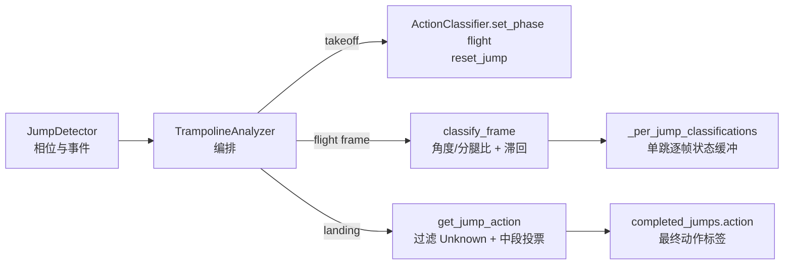
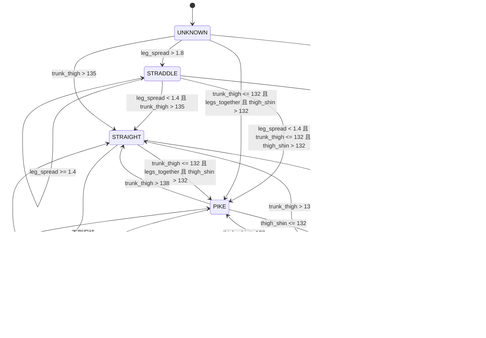
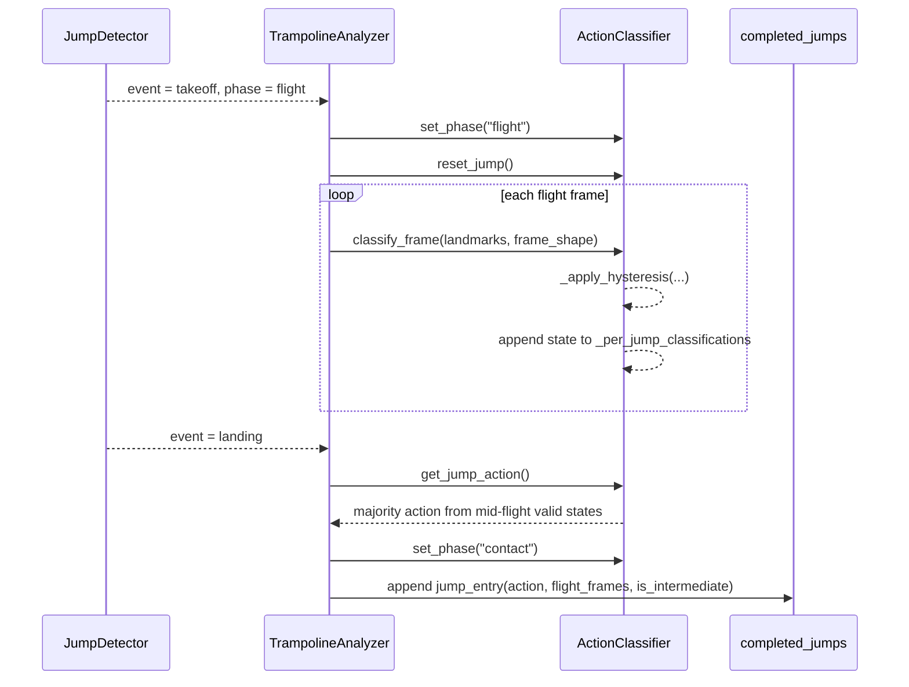

本页解释蹦床动作分类中两个抗噪声机制：**飞行中段多数投票**与**动作滞回有限状态机**。它们位于跳次分割之后、单跳结果写入之前：`JumpDetector` 先给出 `takeoff` / `landing` 与 `flight` / `contact` 相位，`TrampolineAnalyzer` 在起跳时打开分类器并清空单跳缓冲，在飞行期逐帧分类，在落地时调用 `get_jump_action()` 生成该跳的最终动作标签。Sources: [analyzer.py](trampoline/analyzer.py#L36-L67), [action_classifier.py](trampoline/action_classifier.py#L57-L67), [action_classifier.py](trampoline/action_classifier.py#L96-L106)

## 架构假设与验证结论

从第一性原理看，视频姿态识别中的单帧分类不应直接作为单跳动作结论，因为起跳与落地附近存在身体收展过渡，且关键点可见性会短暂退化；当前实现对应的工程解法是：**只在 flight 相位采样动作状态，将每帧状态写入单跳缓冲，落地时对去除首尾后的有效状态做多数投票**。这一模式在代码中由 `_phase`、`_per_jump_classifications`、`classify_frame()` 与 `get_jump_action()` 共同构成。Sources: [action_classifier.py](trampoline/action_classifier.py#L47-L56), [action_classifier.py](trampoline/action_classifier.py#L68-L94), [action_classifier.py](trampoline/action_classifier.py#L96-L106)

上图只描述动作分类链路，不展开跳次分割、床面标定或前端展示；事件来源是 `JumpDetector.process_frame()` 返回的 `event` 与 `phase`，分类输出由 `TrampolineAnalyzer.process_frame()` 写入 `current_action` 与 `completed_jumps`。Sources: [jump_detector.py](trampoline/jump_detector.py#L63-L74), [analyzer.py](trampoline/analyzer.py#L40-L58), [analyzer.py](trampoline/analyzer.py#L71-L86)

## 相位门控：为什么分类器只在飞行期工作

`ActionClassifier.classify_frame()` 的第一道门控是 `_phase != "flight"` 时直接返回 `Unknown`，因此接触床面期间不会产生直体、屈体、团身或分腿跳状态；`set_phase("contact")` 同时把 `state` 重置为 `UNKNOWN` 并清空无效帧计数，避免上一跳状态泄漏到下一次接触期。Sources: [action_classifier.py](trampoline/action_classifier.py#L57-L63), [action_classifier.py](trampoline/action_classifier.py#L68-L73)

`TrampolineAnalyzer` 将相位门控与跳次事件绑定：检测到 `takeoff` 时调用 `set_phase("flight")` 和 `reset_jump()`，检测到 `landing` 时先读取 `get_jump_action()`，再切回 `contact`，并把最终动作写入 `jump_detector.jumps[-1]["action"]` 与 `completed_jumps`。Sources: [analyzer.py](trampoline/analyzer.py#L39-L63)

这种编排意味着动作分类的生命周期与单跳飞行窗口一致：**起跳清空缓冲，飞行逐帧追加，落地冻结结论**。测试也覆盖了接触期返回 `Unknown`、接触相位重置状态、以及分析器输出 `current_action` / `completed_jumps` 等契约。Sources: [tests/test_trampoline.py](tests/test_trampoline.py#L178-L183), [tests/test_trampoline.py](tests/test_trampoline.py#L286-L291), [tests/test_trampoline.py](tests/test_trampoline.py#L345-L359)

## 单帧特征：角度与分腿比

分类器每个飞行帧计算三个特征：躯干-大腿角 `trunk_thigh`、大腿-小腿角 `thigh_shin`、以及脚踝距离与髋宽之比 `leg_spread`；前两个角度分别由肩-髋-膝、髋-膝-踝三点形成，并在左右两侧可见时取平均。Sources: [action_classifier.py](trampoline/action_classifier.py#L75-L90), [action_classifier.py](trampoline/action_classifier.py#L195-L233)

角度计算使用二维欧氏向量夹角：若任一向量长度为 0，则返回 `180.0`；否则通过点积、模长与 `acos` 得到角度，并将余弦值夹在 `[-1.0, 1.0]` 以避免数值越界。Sources: [action_classifier.py](trampoline/action_classifier.py#L29-L39)

关键点可见性阈值在三个特征函数中均为 `0.3`：任一侧肩/髋/膝不足时该侧躯干-大腿角被跳过，任一侧髋/膝/踝不足时该侧大腿-小腿角被跳过，分腿比需要双脚踝与双髋均可见且髋宽不小于 1 像素。Sources: [action_classifier.py](trampoline/action_classifier.py#L200-L213), [action_classifier.py](trampoline/action_classifier.py#L220-L233), [action_classifier.py](trampoline/action_classifier.py#L235-L260)

## 滞回状态机的核心模型

当前动作状态枚举为 `UNKNOWN`、`STRAIGHT`、`PIKE`、`TUCK`、`STRADDLE`，分类器内部保存 `self.state` 作为跨帧状态；这使分类不是纯函数阈值判断，而是依赖上一帧状态的有限状态机。Sources: [action_classifier.py](trampoline/action_classifier.py#L21-L27), [action_classifier.py](trampoline/action_classifier.py#L47-L56), [action_classifier.py](trampoline/action_classifier.py#L108-L193)

该状态图中的数值来自配置：进入屈体/团身区域使用 `TRUNK_THIGH_ENTER = 132.0`，退出回直体使用 `TRUNK_THIGH_EXIT = 138.0`；进入团身使用 `THIGH_SHIN_ENTER = 132.0`，从团身退出到屈体使用 `THIGH_SHIN_EXIT = 138.0`；分腿跳进入阈值为 `1.8`，退出阈值为 `1.4`。Sources: [config.py](trampoline/config.py#L28-L39), [action_classifier.py](trampoline/action_classifier.py#L112-L191)

## 滞回阈值：进入阈值与退出阈值分离

躯干-大腿角采用进入/退出双阈值：从 `STRAIGHT` 进入屈体或团身要求 `trunk_thigh <= TRUNK_THIGH_ENTER`，而从 `PIKE` 或 `TUCK` 回到 `STRAIGHT` 要求 `trunk_thigh > TRUNK_THIGH_EXIT`；由于 `132.0` 与 `138.0` 之间存在缓冲带，边界附近的角度抖动不会立即导致状态来回翻转。Sources: [config.py](trampoline/config.py#L29-L34), [action_classifier.py](trampoline/action_classifier.py#L148-L168), [action_classifier.py](trampoline/action_classifier.py#L176-L185)

大腿-小腿角也采用进入/退出双阈值：从 `PIKE` 进入 `TUCK` 使用 `thigh_shin <= THIGH_SHIN_ENTER`，从 `TUCK` 退出到 `PIKE` 使用 `thigh_shin > THIGH_SHIN_EXIT`，因此团身与屈体之间同样有 `132.0` 到 `138.0` 的滞回区间。Sources: [config.py](trampoline/config.py#L31-L32), [action_classifier.py](trampoline/action_classifier.py#L159-L168), [action_classifier.py](trampoline/action_classifier.py#L176-L185)

分腿跳优先于角度分类：当 `leg_spread > STRADDLE_LEG_SPREAD_ENTER` 时直接进入 `STRADDLE`，处于 `STRADDLE` 时只要 `leg_spread >= STRADDLE_LEG_SPREAD_EXIT` 就保持分腿状态；只有低于退出阈值时，逻辑才回落到角度分类路径。Sources: [action_classifier.py](trampoline/action_classifier.py#L112-L127), [config.py](trampoline/config.py#L36-L39)

| 状态转换维度 | 进入条件 | 退出/保持条件 | 抗噪声作用 |
|---|---|---|---|
| 直体 → 屈体/团身 | `trunk_thigh <= 132` 且双腿并拢 | 回直体需 `trunk_thigh > 138` | 角度边界形成 6° 缓冲带 |
| 屈体 → 团身 | `thigh_shin <= 132` | 团身回屈体需 `thigh_shin > 138` | 膝角边界形成 6° 缓冲带 |
| 非分腿 → 分腿 | `leg_spread > 1.8` | 分腿保持到 `leg_spread < 1.4` | 分腿比边界形成 0.4 缓冲带 |

上表中的阈值关系全部由 `trampoline.config` 与 `_apply_hysteresis()` 共同定义；测试用例也验证了 `STRAIGHT` 状态不会在相同边界输入下闪烁，以及 `STRADDLE` 状态会保持到满足退出条件。Sources: [config.py](trampoline/config.py#L28-L39), [action_classifier.py](trampoline/action_classifier.py#L108-L193), [tests/test_trampoline.py](tests/test_trampoline.py#L226-L247), [tests/test_trampoline.py](tests/test_trampoline.py#L313-L334)

## Unknown 回退：可见性失败时的降级策略

当躯干-大腿角或大腿-小腿角无法计算时，`classify_frame()` 增加 `invalid_frame_count`；只有连续无效帧达到 `UNKNOWN_FALLBACK_FRAMES` 后，状态才被置为 `UNKNOWN`，并且当前状态仍会追加到 `_per_jump_classifications`。Sources: [action_classifier.py](trampoline/action_classifier.py#L79-L85), [config.py](trampoline/config.py#L33-L34)

在 `_apply_hysteresis()` 内部，某些状态分支遇到无法稳定归类的条件时也会增加 `invalid_frame_count`，达到同一阈值后回退到 `UNKNOWN`；这使分类器对短暂边界帧或短暂遮挡保持惯性，但不会无限期维持过期状态。Sources: [action_classifier.py](trampoline/action_classifier.py#L132-L146), [action_classifier.py](trampoline/action_classifier.py#L159-L174), [action_classifier.py](trampoline/action_classifier.py#L176-L191)

测试覆盖了该降级语义：先让分类器进入 `STRAIGHT`，再输入可见性为 `0.1` 的关键点序列，超过 `UNKNOWN_FALLBACK_FRAMES` 后断言状态回到 `UNKNOWN`。Sources: [tests/test_trampoline.py](tests/test_trampoline.py#L249-L271)

## 中段投票：从逐帧状态到单跳动作

`get_jump_action()` 首先过滤掉 `_per_jump_classifications` 中的 `UNKNOWN`，若没有有效状态则返回 `UNKNOWN`；否则计算有效状态数量 `n`，用 `trim = n // 5` 去掉前 20% 与后 20% 的有效状态，并对剩余状态执行 `Counter(...).most_common(1)` 多数投票。Sources: [action_classifier.py](trampoline/action_classifier.py#L96-L106)

该实现的投票对象是**有效分类帧序列**而不是原始飞行帧序列：`UNKNOWN` 在裁剪前被移除，因此首尾裁剪比例作用于有效状态列表；当 `trim > 0 and n > 4` 时才执行裁剪，少量有效帧会直接参与多数投票。Sources: [action_classifier.py](trampoline/action_classifier.py#L96-L106)

仓库文档明确记录了引入中段投票的原因：全飞行帧等权投票会被起跳与落地附近的身体收展过渡稀释，因此 `get_jump_action()` 改为去掉前 20% 和后 20%，只对中间 60% 投票。Sources: [2026-04-01-速度极值检测与中段投票.md](trampoline/docs/2026-04-01-速度极值检测与中段投票.md#L6-L18), [2026-04-01-速度极值检测与中段投票.md](trampoline/docs/2026-04-01-速度极值检测与中段投票.md#L33-L35)

配置文件中存在 `FLIGHT_TRIM_RATIO = 0.2`，但当前 `ActionClassifier.get_jump_action()` 实现没有导入该常量，而是通过 `n // 5` 直接表达 20% 裁剪；这两个位置在当前代码中数值一致，但耦合方式是硬编码而非配置读取。Sources: [config.py](trampoline/config.py#L44-L45), [action_classifier.py](trampoline/action_classifier.py#L13-L18), [action_classifier.py](trampoline/action_classifier.py#L101-L104)

## 单跳分类时间线

单跳生命周期可以按事件顺序读作：`takeoff` 到来时，分类器进入飞行相位并清空上一跳缓冲；每个 `flight` 帧执行角度/分腿比计算、滞回状态转换，并把新状态追加到 `_per_jump_classifications`；`landing` 到来时，对缓冲做中段多数投票，形成写入结果结构的最终动作。Sources: [analyzer.py](trampoline/analyzer.py#L40-L67), [action_classifier.py](trampoline/action_classifier.py#L64-L67), [action_classifier.py](trampoline/action_classifier.py#L91-L106)

这个时序图中的 `flight_frames` 与 `is_intermediate` 由跳次检测结果提供，动作标签由分类器投票结果提供；`TrampolineAnalyzer` 在组装 `jump_entry` 时将二者合并，但本页只关注动作标签的中段投票与滞回来源。Sources: [jump_detector.py](trampoline/jump_detector.py#L135-L145), [analyzer.py](trampoline/analyzer.py#L44-L58)

## 与速度极值检测的边界关系

中段投票依赖跳次检测给出的飞行窗口，但它不负责定义起跳或落地；飞行窗口来自 `JumpDetector` 的速度局部极值检测：在 `flight` 中检测下降速度局部极大值作为 `landing`，在 `contact` 中检测上升速度局部极小值作为 `takeoff`。Sources: [jump_detector.py](trampoline/jump_detector.py#L113-L171)

这种边界关系意味着动作分类器只消费 `phase` 与 `event`，不读取速度、质心或脚踝高度；`TrampolineAnalyzer` 的返回结果同时包含 `velocity`、`com_y`、`ankle_y`、角度与动作状态，但动作状态由 `ActionClassifier` 独立维护。Sources: [analyzer.py](trampoline/analyzer.py#L65-L86), [action_classifier.py](trampoline/action_classifier.py#L68-L94)

如需进一步理解飞行窗口如何形成，应转到[跳次分割与起跳落地检测](13-tiao-ci-fen-ge-yu-qi-tiao-luo-di-jian-ce)；如需理解动作标签集合本身及姿态几何含义，应阅读[动作分类：直体、屈体、团身与分腿跳](14-dong-zuo-fen-lei-zhi-ti-qu-ti-tuan-shen-yu-fen-tui-tiao)。Sources: [jump_detector.py](trampoline/jump_detector.py#L1-L9), [action_classifier.py](trampoline/action_classifier.py#L1-L7)

## 开发者关注点与可验证契约

对于高级开发者，最关键的契约是：`classify_frame()` 在非飞行期必须返回 `UNKNOWN`，飞行期每帧将状态追加到单跳缓冲，`get_jump_action()` 只返回 `ActionState` 枚举值，`TrampolineAnalyzer` 在落地时把 `.value` 写成字符串动作名。Sources: [action_classifier.py](trampoline/action_classifier.py#L68-L94), [action_classifier.py](trampoline/action_classifier.py#L96-L106), [analyzer.py](trampoline/analyzer.py#L44-L58)

现有测试覆盖了角度函数、接触期门控、直体分类、团身/屈体分类、滞回防闪烁、无效帧回退、多数投票、全 Unknown 投票、相位重置、分腿分类与分腿滞回；这些测试定义了修改状态机或投票逻辑时应保持的行为边界。Sources: [tests/test_trampoline.py](tests/test_trampoline.py#L63-L76), [tests/test_trampoline.py](tests/test_trampoline.py#L173-L336)

| 修改点 | 必须同步检查的行为 | 现有证据位置 |
|---|---|---|
| 调整 `TRUNK_THIGH_*` / `THIGH_SHIN_*` | 直体、屈体、团身转换与滞回缓冲 | `test_straight_classification`、`test_tuck_classification`、`test_hysteresis_prevents_flickering` |
| 调整 `STRADDLE_*` / `TOGETHER_THRESHOLD` | 分腿优先级、分腿保持、角度分类是否要求并腿 | `test_straddle_classification`、`test_straddle_hysteresis` |
| 调整中段裁剪比例 | 多数投票窗口与少帧跳次行为 | `test_majority_vote`、`test_majority_vote_all_unknown` |
| 调整无效帧回退 | 遮挡期间状态惯性与 Unknown 回退 | `test_unknown_fallback_after_invalid_frames` |

表中列出的测试名称均来自 `tests/test_trampoline.py`，它们围绕 `ActionClassifier` 的公开方法与内部状态建立回归保护，而不是通过前端或视频文件间接验证。Sources: [tests/test_trampoline.py](tests/test_trampoline.py#L185-L291), [tests/test_trampoline.py](tests/test_trampoline.py#L293-L334)

## 下一步阅读

若你要沿着数据流继续向外层阅读，建议先查看[端到端架构与数据流](8-duan-dao-duan-jia-gou-yu-shu-ju-liu)，再回到算法邻近页[MediaPipe 姿态关键点处理管线](12-mediapipe-zi-tai-guan-jian-dian-chu-li-guan-xian)、[跳次分割与起跳落地检测](13-tiao-ci-fen-ge-yu-qi-tiao-luo-di-jian-ce)与[动作分类：直体、屈体、团身与分腿跳](14-dong-zuo-fen-lei-zhi-ti-qu-ti-tuan-shen-yu-fen-tui-tiao)；本页当前只覆盖单跳动作结论稳定化，不覆盖关键点生成、跳次事件判定或 UI 展示。Sources: [analyzer.py](trampoline/analyzer.py#L1-L10), [jump_detector.py](trampoline/jump_detector.py#L1-L9), [action_classifier.py](trampoline/action_classifier.py#L1-L7)