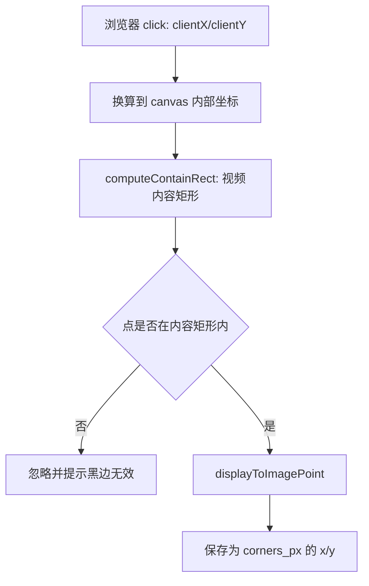
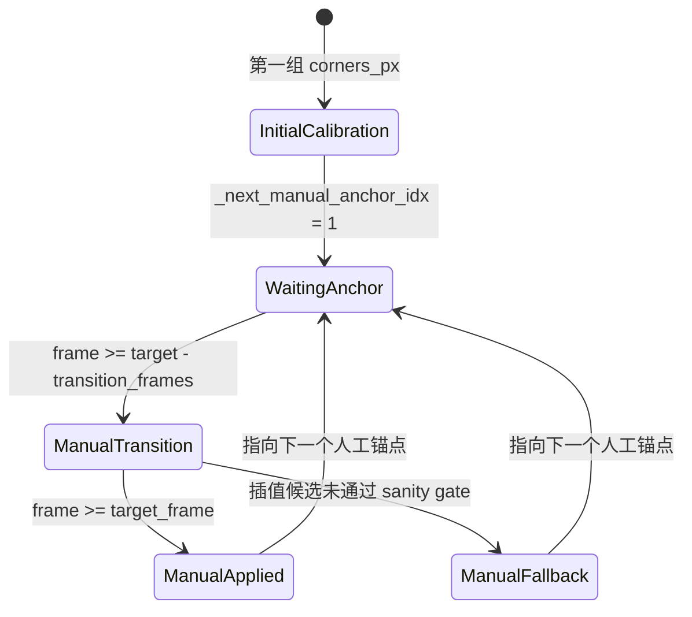

本页位于“床面标定与落点分析”小节中的 [四角标定与关键帧补标](16-si-jiao-biao-ding-yu-guan-jian-zheng-bu-biao)，只解释**用户如何提供床面四角标定、前后端如何规范化这些关键帧、以及处理进程如何在指定帧应用人工补标锚点**；床面跟踪细节、坐标映射和落点可视化分别延伸到 [床面跟踪、置信度与漂移修正](17-chuang-mian-gen-zong-zhi-xin-du-yu-piao-yi-xiu-zheng)、[图像坐标到床面坐标的映射](18-tu-xiang-zuo-biao-dao-chuang-mian-zuo-biao-de-ying-she)、[落点数据结构与可视化](19-luo-dian-shu-ju-jie-gou-yu-ke-shi-hua)。Sources: [templates/video_analysis.html](templates/video_analysis.html#L39-L58), [static/js/trampoline_calibration_ui.js](static/js/trampoline_calibration_ui.js#L382-L405), [trampoline/bed_tracker.py](trampoline/bed_tracker.py#L84-L118)

## 架构假设与验证结论

本页的核心架构假设是：**四角标定不是一次性全局常量，而是一组按帧排序的人工关键帧锚点**。前端负责在视频暂停帧上收集四个角点并转换成原始图像坐标，后端负责校验、排序、去重并写入 sidecar，独立视频处理进程再从 sidecar 构造 `BedTracker`，在运行到对应帧附近时执行平滑过渡或直接应用人工锚点。Sources: [static/js/trampoline_calibration_geometry.js](static/js/trampoline_calibration_geometry.js#L82-L99), [app.py](app.py#L411-L457), [video_processor.py](video_processor.py#L189-L212), [trampoline/bed_tracker.py](trampoline/bed_tracker.py#L892-L982)

上图描述的是标定数据的生命周期，而不是视频分析全流程：上传接口返回首帧、图像尺寸、帧率和角点顺序；前端保存一个或多个关键帧；启动接口将规范化后的 `calibrations` 写入 schema_version 为 2 的 sidecar；处理进程再通过 `load_corners_sidecar()` 与 `BedTracker.from_sidecar()` 恢复这些标定。Sources: [app.py](app.py#L318-L365), [app.py](app.py#L420-L437), [video_processor.py](video_processor.py#L189-L210), [trampoline/bed_tracker.py](trampoline/bed_tracker.py#L519-L528)

## 前端标定模型：在主视频画布上采集四角

标定入口直接嵌入视频分析页：用户上传后点击“添加当前帧标定”，再按 **前左 → 前右 → 后右 → 后左** 的固定顺序在主视频画面上点击四个角点；页面元素还提供“删除所选标定”“开始分析”“重置角点”“保存 / 更新当前标定”和关键帧列表。Sources: [templates/video_analysis.html](templates/video_analysis.html#L39-L58)

| 前端元素 | 作用 | 约束 |
|---|---|---|
| `add-calibration-frame` | 把当前暂停时刻转成标定草稿 | 需要已有待标定视频 |
| `analysis-canvas` | 作为点击面和角点绘制面 | 只接受视频内容区域内点击 |
| `confirm-corners` | 保存或覆盖当前帧标定 | 当前草稿必须有 4 个角点 |
| `start-trampoline-analysis` | 提交所有有效关键帧 | 至少保存 1 个有效标定 |
| `keyframe-list` / `calibration-list` | 展示、重标、删除已保存帧 | 按 `frame_index` 排序展示 |

Sources: [templates/video_analysis.html](templates/video_analysis.html#L39-L58), [static/js/trampoline_calibration_ui.js](static/js/trampoline_calibration_ui.js#L92-L108), [static/js/trampoline_calibration_ui.js](static/js/trampoline_calibration_ui.js#L240-L315)

前端的状态规则集中在 `describeCalibrationUiState()`：未选择草稿时显示“当前草稿：未选择”；已选草稿时显示帧号和秒数；只有 `activeKeyframeFrame !== null` 且草稿角点数为 4 时才允许保存；只有已保存标定数量大于 0 时才允许开始分析。Sources: [static/js/trampoline_calibration_ui.js](static/js/trampoline_calibration_ui.js#L20-L38), [tests/test_trampoline_calibration_ui.mjs](tests/test_trampoline_calibration_ui.mjs#L187-L209)

## 画布坐标到图像坐标的转换

前端没有直接把浏览器点击坐标提交给后端，而是先用 `computeContainRect()` 计算视频图像在显示区域中的 contain 矩形，再用 `displayToImagePoint()` 将点击点还原为原始图像坐标；如果点击落在黑边或视频内容区域外，该函数返回 `null`，UI 会提示“请点击视频画面内的床面角点，黑边区域无效”。Sources: [static/js/trampoline_calibration_geometry.js](static/js/trampoline_calibration_geometry.js#L14-L57), [static/js/trampoline_calibration_ui.js](static/js/trampoline_calibration_ui.js#L448-L468)

这层转换使标定结果与页面缩放、视频宽高比和黑边无关：测试覆盖了竖屏图像在横向显示容器中的黑边排除、横屏等比例映射、图像点与显示点的往返转换，以及关键帧 payload 的排序和默认角点命名。Sources: [tests/test_trampoline_calibration_geometry.mjs](tests/test_trampoline_calibration_geometry.mjs#L16-L49), [tests/test_trampoline_calibration_geometry.mjs](tests/test_trampoline_calibration_geometry.mjs#L59-L77)

## 关键帧 payload 结构

前端保存关键帧时记录 `frame_index`、`time_s`、预览图和 `corners_px`；真正提交给后端时，`buildCalibrationPayload()` 只保留完整的四角标定，统一字段名，补齐角点名称，并按 `frame_index` 升序排序。Sources: [static/js/trampoline_calibration_ui.js](static/js/trampoline_calibration_ui.js#L362-L380), [static/js/trampoline_calibration_geometry.js](static/js/trampoline_calibration_geometry.js#L82-L99)

| 字段 | 生成位置 | 含义 | 后端要求 |
|---|---|---|---|
| `frame_index` | `frameIndexFromTime(timeS, fps)` 或保存草稿时记录 | 标定所在视频帧 | 非负整数，重复帧会被拒绝 |
| `time_s` | 当前 `videoPlayer.currentTime` | 标定时间戳 | 数值型且非负；可为空但不能为负或非有限值 |
| `corners_px` | 四次画布点击转换后的图像坐标 | 四个床面角点 | 必须正好 4 个，顺序固定 |
| `corners_px[].name` | 前端角点顺序或 payload builder 默认补齐 | `front_left/front_right/back_right/back_left` | 必须完全匹配固定顺序 |

Sources: [static/js/trampoline_calibration_ui.js](static/js/trampoline_calibration_ui.js#L329-L369), [static/js/trampoline_calibration_geometry.js](static/js/trampoline_calibration_geometry.js#L76-L99), [trampoline/bed_tracker.py](trampoline/bed_tracker.py#L147-L157), [trampoline/bed_tracker.py](trampoline/bed_tracker.py#L255-L305)

兼容性上，后端仍接受旧式单帧 `corners` 字段：如果请求体没有 `calibrations`，`_normalize_trampoline_calibrations()` 会把 `corners` 包装成 `frame_index=0`、`time_s=0.0` 的单关键帧标定；新式多关键帧则直接走 `calibrations`。Sources: [app.py](app.py#L117-L126), [tests/test_trampoline_api.py](tests/test_trampoline_api.py#L143-L159), [tests/test_trampoline_api.py](tests/test_trampoline_api.py#L198-L219)

## 后端校验：从输入容错到几何约束

后端启动分析时先取出上传阶段保存的 `image_size`，再调用 `_normalize_trampoline_calibrations()`；校验失败会把分析状态置为 `calibration_rejected` 并返回 400，校验成功才会写 sidecar、更新内存状态并启动处理线程。Sources: [app.py](app.py#L368-L419), [app.py](app.py#L439-L449)

| 校验层级 | 校验内容 | 失败行为 |
|---|---|---|
| 标定列表 | 至少一个标定；每项必须是对象 | 抛出 `BedTrackerValidationError` |
| 帧号 | `frame_index` 必须是非负整数；重复帧不允许 | 拒绝启动，状态变为 `calibration_rejected` |
| 时间戳 | `time_s` 必须为数值且非负，空值可归一为 `None` | 拒绝启动 |
| 角点数量和名称 | 必须正好 4 个，顺序为 `front_left/front_right/back_right/back_left` | 拒绝启动 |
| 图像边界 | 如果有 `image_size`，角点必须在首帧边界内 | 拒绝启动 |
| 四边形几何 | 面积足够、非自交、凸四边形、可形成单应矩阵 | 拒绝启动 |

Sources: [trampoline/bed_tracker.py](trampoline/bed_tracker.py#L205-L247), [trampoline/bed_tracker.py](trampoline/bed_tracker.py#L255-L305), [tests/test_trampoline_api.py](tests/test_trampoline_api.py#L222-L238), [tests/test_bed_tracker.py](tests/test_bed_tracker.py#L52-L64)

校验后的 sidecar 使用 `schema_version: 2`，同时保留首个标定的 `frame_index` 与 `corners_px`，并将完整的 `calibrations` 数组写入 `<video_id>_corners.json`；测试明确验证多关键帧请求会被排序写入 sidecar，重复 `frame_index` 会被拒绝且不进入处理。Sources: [app.py](app.py#L420-L437), [tests/test_trampoline_api.py](tests/test_trampoline_api.py#L198-L238)

## sidecar 读取与向后兼容

处理进程不会直接读取前端请求体，而是在输出目录寻找 `<video_id>_corners.json`；如果文件不存在，结果状态被置为 error；如果存在，则通过 `load_corners_sidecar()` 解析并构造 `BedTracker`。Sources: [video_processor.py](video_processor.py#L189-L210)

`load_corners_sidecar()` 要求 sidecar 包含 `schema_version`、`video_id`、`exercise_type`、`image_size`、`corner_order`、`bed_dimensions_m` 和 `created_at` 等公共字段，并校验 `video_id` 与作业匹配、`exercise_type` 为 trampoline、角点顺序符合常量；schema 1 会被转换成单个 `frame_index=0` 标定，schema 2 会读取完整 `calibrations`。Sources: [trampoline/bed_tracker.py](trampoline/bed_tracker.py#L308-L373)

这种读取逻辑让旧版单帧标定和新版多关键帧补标共存：schema 1 仍必须描述首帧 `frame_index=0`，schema 2 则允许多个唯一帧号；测试覆盖了 schema 2 多标定加载并构造 `BedTracker` 的路径。Sources: [trampoline/bed_tracker.py](trampoline/bed_tracker.py#L348-L373), [tests/test_bed_tracker.py](tests/test_bed_tracker.py#L254-L277)

## BedTracker 中的人工关键帧补标机制

`BedTracker` 初始化时会把传入的 `calibrations` 规范化，取第一帧作为 `initial_corners`，并构建 `_manual_anchor_by_frame` 与 `_next_manual_anchor_idx`；后续更新帧时，`update()` 会先调用 `_handle_manual_anchor()`，只有没有到达人工锚点过渡窗口时才继续走自动跟踪路径。Sources: [trampoline/bed_tracker.py](trampoline/bed_tracker.py#L451-L528), [trampoline/bed_tracker.py](trampoline/bed_tracker.py#L1000-L1020)

关键帧补标的核心是**提前过渡而非瞬间跳变**：当当前帧进入 `target_frame - BED_KEYFRAME_TRANSITION_FRAMES` 之后，跟踪器在当前角点与目标人工角点之间线性插值，并对插值结果执行候选角点校验；如果到达目标帧，则直接应用目标角点、刷新 ORB keyframe，并推进到下一个人工锚点。Sources: [trampoline/bed_tracker.py](trampoline/bed_tracker.py#L892-L924), [trampoline/bed_tracker.py](trampoline/bed_tracker.py#L926-L961)

如果插值候选未通过 sanity gate，代码不会丢弃人工补标，而是以较低置信度直接应用目标角点作为 fallback，并在诊断中保留 `fallback_reasons`；这使人工关键帧在失败情况下仍能作为明确锚点生效。Sources: [trampoline/bed_tracker.py](trampoline/bed_tracker.py#L939-L982)

## 人工补标与自动跟踪的边界

人工关键帧补标只负责在指定帧附近纠正床面四角；在没有命中人工锚点窗口时，`update()` 才会使用 LK 光流、ORB 重定位和候选角点 sanity gate 等自动跟踪逻辑。自动跟踪的置信度状态与漂移修正属于下一页 [床面跟踪、置信度与漂移修正](17-chuang-mian-gen-zong-zhi-xin-du-yu-piao-yi-xiu-zheng) 的范围。Sources: [trampoline/bed_tracker.py](trampoline/bed_tracker.py#L1000-L1086), [trampoline/bed_tracker.py](trampoline/bed_tracker.py#L624-L689)

| 场景 | 由谁主导 | 当前页关注点 |
|---|---|---|
| 上传后首帧或任意暂停帧标四角 | 前端标定 UI | 收集四角并生成关键帧 |
| 提交前 payload 整理 | 前端 geometry helper | 过滤不完整标定、排序、补齐名称 |
| 启动分析前校验 | Flask 后端 + `bed_tracker` 校验函数 | 拒绝非法角点和重复帧 |
| 处理进程启动 | `video_processor.py` | 读取 sidecar 并构造 `BedTracker` |
| 到达人工关键帧窗口 | `BedTracker._handle_manual_anchor()` | 平滑过渡、直接应用或 fallback |
| 普通帧自动跟踪 | `BedTracker.update()` 自动路径 | 不在本页展开 |

Sources: [static/js/trampoline_calibration_geometry.js](static/js/trampoline_calibration_geometry.js#L82-L99), [app.py](app.py#L411-L457), [video_processor.py](video_processor.py#L189-L212), [trampoline/bed_tracker.py](trampoline/bed_tracker.py#L892-L1086)

## 回归测试覆盖

前端测试验证了 UI 状态、主画布作为点击面、添加当前帧、四次点击、保存后生成 `calibrations` payload，以及重置草稿不会生成有效标定；这保护了“先选帧、再点四角、再保存”的交互契约。Sources: [tests/test_trampoline_calibration_ui.mjs](tests/test_trampoline_calibration_ui.mjs#L211-L275), [tests/test_trampoline_calibration_ui.mjs](tests/test_trampoline_calibration_ui.mjs#L277-L315)

几何测试验证了 contain 矩形、黑边点击过滤、显示坐标与图像坐标往返、帧号换算，以及 payload builder 对完整关键帧的排序与默认角点命名；这些测试直接覆盖四角采集时最容易受浏览器布局影响的部分。Sources: [tests/test_trampoline_calibration_geometry.mjs](tests/test_trampoline_calibration_geometry.mjs#L16-L80)

后端与跟踪器测试覆盖了上传后 pending calibration 合同字段、多关键帧 sidecar 排序写入、重复关键帧拒绝、schema 2 多标定加载，以及人工关键帧过渡会在目标帧前平滑推进并在目标帧应用最终角点。Sources: [tests/test_trampoline_api.py](tests/test_trampoline_api.py#L53-L74), [tests/test_trampoline_api.py](tests/test_trampoline_api.py#L198-L238), [tests/test_bed_tracker.py](tests/test_bed_tracker.py#L254-L300)

## 阅读下一步

理解本页后，建议继续阅读 [床面跟踪、置信度与漂移修正](17-chuang-mian-gen-zong-zhi-xin-du-yu-piao-yi-xiu-zheng)，因为人工关键帧只是床面定位的输入与锚点，真正的逐帧状态、置信度、冻结和重定位逻辑在跟踪层展开；如果你关心四角如何投影成米制床面坐标，再读 [图像坐标到床面坐标的映射](18-tu-xiang-zuo-biao-dao-chuang-mian-zuo-biao-de-ying-she)。Sources: [trampoline/bed_tracker.py](trampoline/bed_tracker.py#L534-L539), [trampoline/bed_tracker.py](trampoline/bed_tracker.py#L1000-L1130)