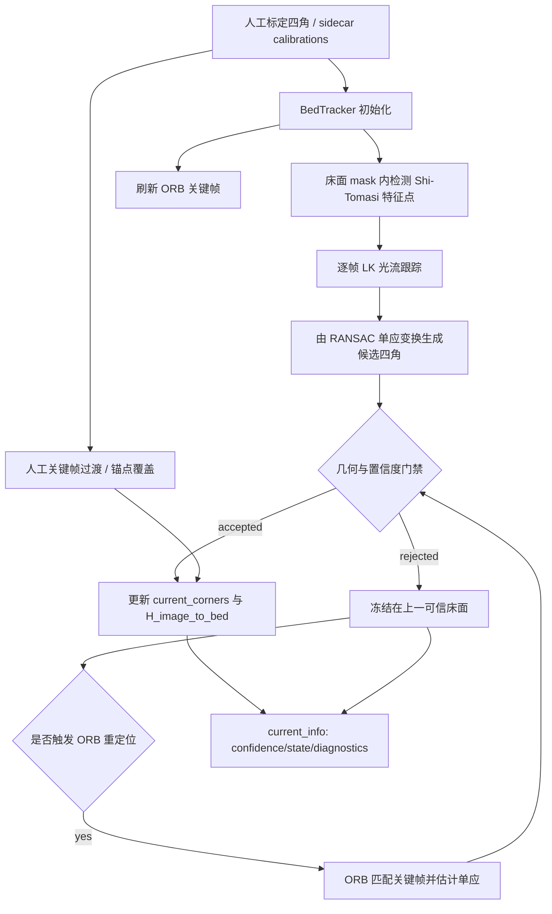

本文聚焦蹦床床面跟踪链路中的三个内部机制：**床面四角如何随视频帧更新**、**跟踪置信度如何计算并转化为状态**、以及**当光流漂移或丢失时如何冻结、重定位与用人工关键帧修正**。它不展开图像坐标到床面坐标的几何细节，也不展开落点可视化；这些内容分别属于 [图像坐标到床面坐标的映射](18-tu-xiang-zuo-biao-dao-chuang-mian-zuo-biao-de-ying-she) 与 [落点数据结构与可视化](19-luo-dian-shu-ju-jie-gou-yu-ke-shi-hua)。Sources: [bed_tracker.py](trampoline/bed_tracker.py#L25-L50), [bed_tracker.py](trampoline/bed_tracker.py#L540-L565), [bed_tracker.py](trampoline/bed_tracker.py#L1000-L1086)

## 架构假设与验证结论

从第一原则看，床面跟踪必须维护一个稳定的“当前床面四边形”，并在每帧尝试用视觉运动估计更新它；如果候选四边形不可信，则不能让坏估计污染后续落点映射。代码验证显示，`BedTracker` 的核心状态正是 `initial_corners`、`current_corners`、`H_image_to_bed`、上一帧灰度图与特征点、ORB 关键帧、连续失败计数、跟踪状态和 `current_info` 诊断结构；初始化时会计算单应矩阵、检测床面区域内特征点、刷新 ORB 关键帧，并返回包含置信度、状态、四角与诊断信息的 `BedTrackerInfo`。Sources: [bed_tracker.py](trampoline/bed_tracker.py#L461-L508), [bed_tracker.py](trampoline/bed_tracker.py#L540-L565), [bed_tracker.py](trampoline/bed_tracker.py#L601-L622)

上图中的主路径与实现一致：`update()` 先处理人工关键帧锚点；没有锚点时，使用 Lucas-Kanade 光流跟踪上一帧特征点，并通过反向误差过滤有效点，再用 RANSAC 估计帧间单应矩阵；候选四角通过 `validate_candidate_corners()` 后才会被 `_accept_candidate()` 接受，否则按条件触发 `_try_relocalize()` 或 `_reject_candidate()`。Sources: [bed_tracker.py](trampoline/bed_tracker.py#L892-L982), [bed_tracker.py](trampoline/bed_tracker.py#L1000-L1086)

## 跟踪信息模型：状态、置信度与诊断统一输出

床面跟踪对外输出不是裸四角，而是 `BedTrackerInfo` 字典：它包含 `success`、`frame_index`、`corners`、`inlier_ratio`、`tracked_points`、`tracking_confidence`、`message`、`tracking_state`、`diagnostics` 与 `marker_lines`。这个结构让后续算法能够区分“有坐标但低可信”“完全丢失”“人工锚点修正”等状态，而不是只用布尔值判断床面是否可用。Sources: [bed_tracker.py](trampoline/bed_tracker.py#L25-L50), [bed_tracker.py](trampoline/bed_tracker.py#L601-L622)

| 字段 | 含义 | 产生位置 |
|---|---|---|
| `tracking_confidence` | 由内点比例与跟踪点数量合成的 0–1 分数 | `_tracking_confidence()` |
| `tracking_state` | `trusted`、`low_confidence`、`frozen`、`tracking_lost` 四态之一 | `_state_for_confidence()` |
| `diagnostics` | 候选来源、拒绝原因、面积比例、中心漂移比例、边长缩放等诊断 | `validate_candidate_corners()` / 接受或拒绝分支 |
| `corners` | 当前用于单应矩阵的床面四角；拒绝候选时保持上一可信值 | `_make_info()` |

Sources: [bed_tracker.py](trampoline/bed_tracker.py#L585-L599), [bed_tracker.py](trampoline/bed_tracker.py#L624-L689), [bed_tracker.py](trampoline/bed_tracker.py#L727-L780)

## 置信度计算：内点比例优先，点数作为支撑项

跟踪置信度使用一个固定加权公式：`0.65 * inlier_ratio + 0.35 * point_score`，其中 `point_score` 是 `tracked_points / BED_MIN_TRACK_POINTS` 截断到 1.0 后的值。配置中 `BED_MIN_TRACK_POINTS` 默认为 20，因此当 RANSAC 内点比例高且有效跟踪点不少于阈值时，置信度会接近 1；当内点比例或点数不足时，置信度下降。Sources: [bed_tracker.py](trampoline/bed_tracker.py#L585-L589), [config.py](trampoline/config.py#L47-L59)

状态机把连续失败也纳入判断：连续失败次数达到 `BED_TRACKING_LOST_AFTER_FAILURES` 时状态为 `tracking_lost`；只要存在失败但未达到丢失阈值，状态为 `frozen`；没有失败时，置信度大于等于 `BED_TRUSTED_CONFIDENCE` 为 `trusted`，大于等于 `BED_LOW_CONFIDENCE` 为 `low_confidence`，否则为 `frozen`。默认阈值分别是丢失 3 次、可信 0.60、低可信 0.30。Sources: [bed_tracker.py](trampoline/bed_tracker.py#L590-L599), [config.py](trampoline/config.py#L71-L82)

| 条件 | 状态 | 行为含义 |
|---|---|---|
| `consecutive_failures >= 3` | `tracking_lost` | 跟踪连续失败，后续 marker line 不再附加 |
| `consecutive_failures > 0` | `frozen` | 冻结在上一可信床面，不接受当前候选 |
| `confidence >= 0.60` 且无失败 | `trusted` | 当前床面可作为可信跟踪结果 |
| `0.30 <= confidence < 0.60` 且无失败 | `low_confidence` | 有可用床面，但置信度不足 |
| `confidence < 0.30` 且无失败 | `frozen` | 置信度过低，语义上仍视为冻结 |

Sources: [bed_tracker.py](trampoline/bed_tracker.py#L590-L599), [config.py](trampoline/config.py#L80-L82), [bed_tracker.py](trampoline/bed_tracker.py#L984-L998)

## LK 光流主路径：从局部运动估计到候选四角

主跟踪路径使用 `cv2.calcOpticalFlowPyrLK()` 在上一帧和当前帧之间跟踪特征点，并再次反向跟踪以计算 forward-backward 误差；只有状态为成功且反向误差小于 `BED_FB_THRESHOLD` 的点会进入单应矩阵估计。配置中 LK 窗口、金字塔层数、反向误差阈值与 RANSAC 重投影阈值分别由 `BED_LK_WIN_SIZE`、`BED_LK_MAX_LEVEL`、`BED_FB_THRESHOLD` 和 `BED_RANSAC_REPROJ_THRESH` 控制。Sources: [bed_tracker.py](trampoline/bed_tracker.py#L1021-L1052), [config.py](trampoline/config.py#L53-L57)

当有效点至少 4 个时，代码用 `cv2.findHomography(prev_good, curr_good, cv2.RANSAC, ...)` 得到帧间单应矩阵 `H_delta`，再将当前四角 `current_corners` 透视变换为候选四角。候选不会立即写入状态，而是先进入 `validate_candidate_corners()` 做几何和质量门禁；只有 `accepted` 为真时，才更新 `_prev_pts` 并调用 `_accept_candidate()`。Sources: [bed_tracker.py](trampoline/bed_tracker.py#L1041-L1061)

测试用一个已知透视变换验证了这条主路径：先初始化 tracker，再对纹理帧施加已知 `H`，随后 `update()` 返回的四角与理论透视变换结果最大误差小于 4 像素，并且 `info["success"]` 为真。Sources: [test_bed_tracker.py](tests/test_bed_tracker.py#L111-L126)

## 候选四角门禁：拒绝自交、跳变与低支撑

`validate_candidate_corners()` 是漂移防护的核心。它首先要求候选四角形状为 `(4, 2)` 且数值有限，然后检查跟踪点数是否低于 `BED_MIN_TRACK_POINTS`、内点比例是否低于 `BED_ACCEPT_INLIER_RATIO`、四边形是否自交、是否凸、面积相对当前床面是否跳变、中心位移是否过大、是否越界、边长缩放是否异常，以及候选四角是否能形成有效单应矩阵。Sources: [bed_tracker.py](trampoline/bed_tracker.py#L624-L689), [config.py](trampoline/config.py#L71-L79)

| 门禁项 | 默认阈值或规则 | 诊断原因 |
|---|---:|---|
| 最少跟踪点 | `BED_MIN_TRACK_POINTS = 20` | `too_few_points` |
| 最低内点比例 | `BED_ACCEPT_INLIER_RATIO = 0.35` | `low_inlier_ratio` |
| 面积比例 | `0.45 ≤ area_ratio ≤ 1.75` | `area_jump` |
| LK 中心位移 | 画面对角线的 `0.25` | `center_shift` |
| ORB 中心位移 | 画面对角线的 `0.65` | `center_shift` |
| 边长缩放 | `0.35 ≤ edge_ratio ≤ 2.5` | `edge_scale_jump` |
| 边界外扩容忍 | 宽高各 `20%` margin | `out_of_bounds` |

Sources: [bed_tracker.py](trampoline/bed_tracker.py#L639-L689), [config.py](trampoline/config.py#L72-L79)

回归测试覆盖了这些漂移防护规则：自交候选会被拒绝且 `current_corners` 保持原可信四角；面积突变或中心跳变会被拒绝；低内点支撑同时记录 `too_few_points` 与 `low_inlier_ratio`。这些测试证明实现目标不是“尽量跟随任何运动”，而是“宁可冻结，也不让明显错误的床面污染单应矩阵”。Sources: [test_bed_tracker.py](tests/test_bed_tracker.py#L143-L183)

## 冻结策略：拒绝候选但保留落点映射能力

当候选被拒绝时，`_reject_candidate()` 会递增连续失败次数，使用折损后的内点比例重新计算低置信度，并把状态设置为 `frozen` 或 `tracking_lost`；它不会覆盖 `current_corners`，因此当前单应矩阵仍然对应上一可信床面。错误消息明确说明这是“frozen on last trusted homography”。Sources: [bed_tracker.py](trampoline/bed_tracker.py#L758-L780)

这种冻结策略与落点输出相容：测试在一次被拒绝更新后仍调用 `landing_payload()`，结果仍能输出床面坐标，但置信度低于 0.6；另一个测试将 `tracking_confidence` 手动降到 0.1，仍能得到中心点坐标和 `center` 区域分类，同时总置信度低于 0.5。Sources: [test_bed_tracker.py](tests/test_bed_tracker.py#L100-L108), [test_bed_tracker.py](tests/test_bed_tracker.py#L186-L197)

## ORB 重定位：光流失败后的关键帧恢复路径

当 LK 失败且配置允许时，`update()` 会调用 `_try_relocalize()`；是否触发由 `_relocalize_due()` 决定：LK 失败且 `BED_ORB_RELOCALIZE_ON_FAILURE` 为真时立即尝试，或者按 `BED_ORB_RELOCALIZE_INTERVAL` 周期尝试。默认配置允许失败后重定位，周期为 30 帧。Sources: [bed_tracker.py](trampoline/bed_tracker.py#L853-L858), [bed_tracker.py](trampoline/bed_tracker.py#L1065-L1073), [config.py](trampoline/config.py#L83-L87)

ORB 重定位使用最近的关键帧描述子与当前帧描述子做 Hamming 距离交叉匹配，要求匹配数不少于 `BED_ORB_MIN_MATCHES`；随后用 RANSAC 估计关键帧到当前帧的单应矩阵，并将关键帧四角透视到当前帧生成候选四角。这个候选仍然经过同一个 `validate_candidate_corners()`，但中心位移阈值使用更宽松的 `BED_ORB_MAX_CENTER_SHIFT_RATIO`。Sources: [bed_tracker.py](trampoline/bed_tracker.py#L782-L851), [bed_tracker.py](trampoline/bed_tracker.py#L660-L665), [config.py](trampoline/config.py#L76-L86)

ORB 成功时会调用 `_accept_candidate()`，并因为来源是 `orb` 而刷新关键帧；失败时则通过 `_reject_candidate()` 冻结。测试覆盖了受控透视变换下 ORB 能恢复四角、空白图像下 ORB 失败但不移动可信四角、以及缺失关键帧时返回 `no_keyframe` 诊断而不是返回空结果。Sources: [bed_tracker.py](trampoline/bed_tracker.py#L727-L756), [bed_tracker.py](trampoline/bed_tracker.py#L792-L851), [test_bed_tracker.py](tests/test_bed_tracker.py#L199-L247)

## 人工关键帧修正：面向长期漂移的确定性锚点

床面跟踪支持多个人工标定关键帧。`load_corners_sidecar()` 在 schema version 2 中读取 `calibrations`，并通过 `validate_calibrations()` 规范化、排序和校验唯一帧号；`BedTracker.from_sidecar()` 使用这些标定构造 tracker。测试验证扩展 sidecar 能加载 `[0, 20]` 两个标定帧，并使 tracker 持有两个 `manual_calibrations`。Sources: [bed_tracker.py](trampoline/bed_tracker.py#L255-L305), [bed_tracker.py](trampoline/bed_tracker.py#L308-L373), [bed_tracker.py](trampoline/bed_tracker.py#L519-L528), [test_bed_tracker.py](tests/test_bed_tracker.py#L254-L277)

人工关键帧不是只在目标帧瞬间跳变。`_handle_manual_anchor()` 会在目标帧前 `BED_KEYFRAME_TRANSITION_FRAMES` 帧开始插值，从当前四角平滑过渡到目标四角；插值候选仍通过 `validate_candidate_corners()`，成功时以 `manual_keyframe` 作为诊断来源并给出 `transition_progress`，目标帧及之后则直接应用目标四角且置信度为 1.0。Sources: [bed_tracker.py](trampoline/bed_tracker.py#L892-L982), [config.py](trampoline/config.py#L87-L87)

如果插值候选未通过门禁，代码会 fallback 到目标关键帧四角，置信度设置为 0.45，并把插值失败原因放入 `fallback_reasons`；这说明人工关键帧在实现上具有“纠偏锚点”语义，但仍将异常过渡记录到诊断。测试验证在第 1 帧已经开始向第 20 帧关键帧平滑移动，且第 20 帧时四角与人工目标四角一致。Sources: [bed_tracker.py](trampoline/bed_tracker.py#L939-L982), [test_bed_tracker.py](tests/test_bed_tracker.py#L279-L300)

## 与落点置信度的边界关系

床面跟踪置信度不是最终落点置信度的唯一来源。`landing_payload()` 会把当前 `tracking_confidence`、踝点可见度和归一化坐标边界置信度组合为最终 `confidence`，权重分别是 0.5、0.3 和 0.2；因此冻结或低可信床面会降低落点置信度，但不会阻止坐标输出。Sources: [bed_tracker.py](trampoline/bed_tracker.py#L1100-L1129)

在分析主流程中，落地事件发生时 `TrampolineAnalyzer` 从左右踝关键点按可见度加权得到踝点像素坐标，再调用 `bed_tracker.landing_payload()`；这个调用被异常保护包裹，确保床面落点增强不会破坏既有跳次分割结果。Sources: [analyzer.py](trampoline/analyzer.py#L44-L63), [analyzer.py](trampoline/analyzer.py#L88-L114)

## 实现模式对照

| 模式 | 主要入口 | 成功结果 | 失败结果 | 用途 |
|---|---|---|---|---|
| 初始化 | `initialize()` | 检测床面内特征、刷新 ORB 关键帧、建立初始信息 | 空帧或非法四角抛出校验错误 | 建立第一帧可信基准 |
| LK 跟踪 | `update()` 内光流分支 | 接受候选四角并更新单应矩阵 | 进入 ORB 或冻结 | 常规逐帧跟踪 |
| ORB 重定位 | `_try_relocalize()` | 从关键帧恢复当前四角 | 冻结并记录失败原因 | 光流失效后的恢复 |
| 人工关键帧 | `_handle_manual_anchor()` | 平滑插值或直接应用人工四角 | fallback 应用目标四角并降置信度 | 长期漂移修正 |
| 拒绝冻结 | `_reject_candidate()` | 不适用 | 保持上一可信四角，降低置信度 | 防止坏候选污染状态 |

Sources: [bed_tracker.py](trampoline/bed_tracker.py#L540-L565), [bed_tracker.py](trampoline/bed_tracker.py#L758-L780), [bed_tracker.py](trampoline/bed_tracker.py#L792-L851), [bed_tracker.py](trampoline/bed_tracker.py#L892-L982), [bed_tracker.py](trampoline/bed_tracker.py#L1000-L1086)

## 阅读下一步

如果你要继续理解人工四角从哪里来，应阅读 [四角标定与关键帧补标](16-si-jiao-biao-ding-yu-guan-jian-zheng-bu-biao)；如果你要理解 `current_corners` 如何被转换为米制床面坐标，应阅读 [图像坐标到床面坐标的映射](18-tu-xiang-zuo-biao-dao-chuang-mian-zuo-biao-de-ying-she)；如果你关注跟踪结果如何影响落点展示，应阅读 [落点数据结构与可视化](19-luo-dian-shu-ju-jie-gou-yu-ke-shi-hua) 与 [覆盖层绘制：骨架、床面、速度与落点](23-fu-gai-ceng-hui-zhi-gu-jia-chuang-mian-su-du-yu-luo-dian)。Sources: [bed_tracker.py](trampoline/bed_tracker.py#L1088-L1129), [analyzer.py](trampoline/analyzer.py#L88-L114)