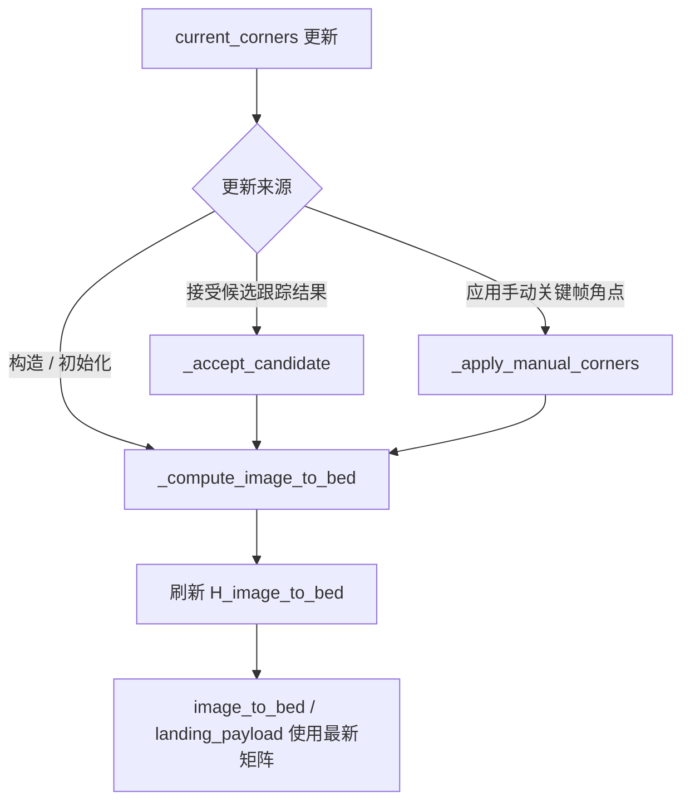
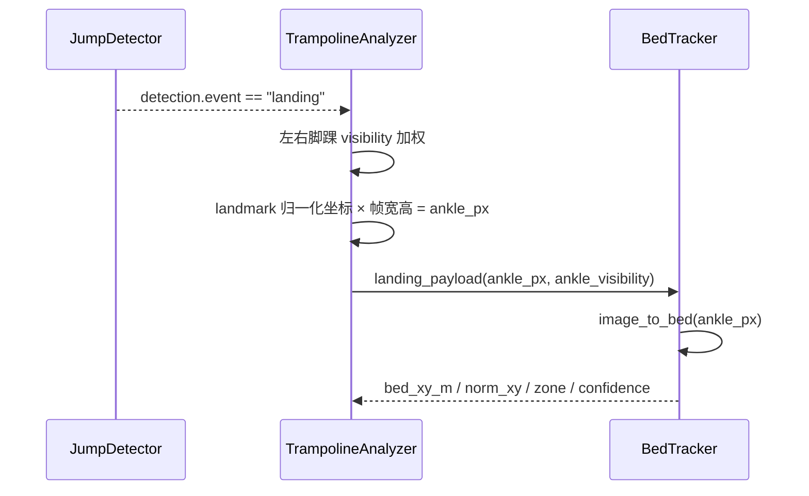

本页解释当前代码中“图像坐标到床面坐标”的映射链路：它从一个图像像素点出发，通过 `BedTracker` 维护的图像到床面单应矩阵，得到以米为单位的床面坐标、归一化坐标、区域分类与置信度；它不展开四角标定 UI、床面跟踪漂移策略、落点前端绘制或 API 轮询细节，这些内容分别属于 [四角标定与关键帧补标](16-si-jiao-biao-ding-yu-guan-jian-zheng-bu-biao)、[床面跟踪、置信度与漂移修正](17-chuang-mian-gen-zong-zhi-xin-du-yu-piao-yi-xiu-zheng)、[落点数据结构与可视化](19-luo-dian-shu-ju-jie-gou-yu-ke-shi-hua) 与 [前后端 API 契约](11-qian-hou-duan-api-qi-yue)。Sources: [bed_tracker.py](trampoline/bed_tracker.py#L451-L538), [analyzer.py](trampoline/analyzer.py#L88-L114)

## 架构假设与验证结论

从第一原则看，床面坐标映射需要三个稳定输入：**图像平面中的四个床角**、**物理床面的参考坐标系**、以及**待映射的图像点**。代码验证后可以确认，`BedTracker` 在初始化时接收 `corners_image` 与 `bed_size_m`，把当前四角保存为 `current_corners`，并立即调用 `_compute_image_to_bed()` 计算 `H_image_to_bed`；这个矩阵随后由 `image_to_bed()` 调用 `cv2.perspectiveTransform()` 将任意图像点映射到床面米坐标。Sources: [bed_tracker.py](trampoline/bed_tracker.py#L451-L508), [bed_tracker.py](trampoline/bed_tracker.py#L530-L538), [bed_tracker.py](trampoline/bed_tracker.py#L1088-L1093)

```mermaid
flowchart LR
    A[图像坐标 pt_xy<br/>像素单位] --> B[H_image_to_bed<br/>图像到床面单应矩阵]
    C[current_corners<br/>front_left/front_right/back_right/back_left] --> B
    D[床面参考点<br/>(0,0),(width,0),(width,length),(0,length)] --> B
    B --> E[bed_xy_m<br/>米坐标]
    E --> F[norm_xy / zone / dist_from_center_m / confidence]
```

上图中的关键约束是：床面参考坐标系并不是从图像自动推断出来的任意局部坐标，而是 `_bed_reference_points()` 显式定义的矩形坐标系；四角顺序对应 `(0,0)`、`(width,0)`、`(width,length)`、`(0,length)`，其中默认 `width=4.28m`、`length=2.14m` 来自配置。Sources: [bed_tracker.py](trampoline/bed_tracker.py#L530-L538), [config.py](trampoline/config.py#L47-L49), [config.py](trampoline/config.py#L64-L69)

## 坐标系定义

当前实现使用一个以床面前左角为原点的二维物理坐标系：`front_left` 映射到 `(0,0)`，`front_right` 映射到 `(width,0)`，`back_right` 映射到 `(width,length)`，`back_left` 映射到 `(0,length)`。这一定义由 `CORNER_ORDER` 与 `_bed_reference_points()` 共同固定，因此输入角点顺序本身就是映射语义的一部分，而不仅是绘制顺序。Sources: [bed_tracker.py](trampoline/bed_tracker.py#L14-L14), [bed_tracker.py](trampoline/bed_tracker.py#L147-L163), [bed_tracker.py](trampoline/bed_tracker.py#L530-L538)

| 概念 | 代码表示 | 单位 | 作用 |
|---|---|---:|---|
| 图像角点 | `current_corners` / `corners_px` | 像素 | 定义图像中床面四边形 |
| 床面参考点 | `_bed_reference_points()` | 米 | 定义目标物理平面坐标 |
| 单应矩阵 | `H_image_to_bed` | 无直接单位 | 将图像点投影到床面坐标 |
| 映射结果 | `bed_xy_m` | 米 | 落点物理坐标 |
| 归一化坐标 | `norm_xy` | 比例 | 用于与床面宽长无关的相对位置表达 |

Sources: [bed_tracker.py](trampoline/bed_tracker.py#L480-L538), [bed_tracker.py](trampoline/bed_tracker.py#L1100-L1116)

测试用一个矩形图像四边形验证了坐标轴方向和中心点语义：`(100,300)` 映射为 `(0,0)`，`(500,300)` 映射为 `(4,0)`，`(500,100)` 映射为 `(4,2)`，中心像素 `(300,200)` 映射为 `(2,1)`。这证明当前映射不是简单的屏幕坐标归一化，而是由四角单应性决定的床面物理坐标。Sources: [test_bed_tracker.py](tests/test_bed_tracker.py#L36-L43)

## 单应矩阵的生成与更新边界

`_compute_image_to_bed()` 使用 `cv2.findHomography(self.current_corners, self._bed_reference_points(), 0)` 生成 `H_image_to_bed`；如果 OpenCV 无法求出矩阵，代码会抛出 `BedTrackerValidationError`。由于目标点是以米为单位的床面参考矩形，矩阵输出天然落在床面物理坐标域，而不是图像像素域。Sources: [bed_tracker.py](trampoline/bed_tracker.py#L530-L538)



矩阵并非只在构造函数中计算一次：当候选床面四角被接受时，`_accept_candidate()` 会更新 `current_corners` 并重新计算 `H_image_to_bed`；当手动角点被应用时，`_apply_manual_corners()` 也会更新 `current_corners` 并重新计算矩阵。因此本页中的“映射”应理解为“基于当前床面四边形的投影映射”，而不是固定首帧映射。Sources: [bed_tracker.py](trampoline/bed_tracker.py#L727-L745), [bed_tracker.py](trampoline/bed_tracker.py#L864-L882)

## 点映射函数：`image_to_bed()`

`image_to_bed(pt_xy)` 是最小映射原语：它要求 `H_image_to_bed` 已存在，将输入点转成形状为 `[[[x,y]]]` 的 `float32` 数组，然后调用 `cv2.perspectiveTransform()`，最后返回 Python `float` 形式的 `(x,y)`。该函数不做裁剪、不做区域分类、也不计算置信度；这些语义留给上层 `is_inside_bed()` 与 `landing_payload()`。Sources: [bed_tracker.py](trampoline/bed_tracker.py#L1088-L1104)

`is_inside_bed(pt_xy)` 复用 `image_to_bed()` 的结果，只检查 `0 <= x <= width` 且 `0 <= y <= length`。因此“是否在床内”是以物理床面坐标判断，而不是以图像四边形的像素包围盒判断；这对透视角度明显的视频尤其重要。Sources: [bed_tracker.py](trampoline/bed_tracker.py#L1095-L1098)

## 从脚踝像素点到落点 payload

在落地事件发生时，`TrampolineAnalyzer._compute_landing_payload()` 从左右脚踝 landmark 读取归一化 `x/y` 与 `visibility`；当两侧可见度之和大于极小值时，它用 visibility 加权平均得到脚踝中心点，否则退化为左右脚踝简单平均，并将归一化坐标乘以帧宽高得到 `ankle_px`。随后它调用 `bed_tracker.landing_payload(ankle_px, ankle_visibility=...)`，并把一位小数的 `ankle_px` 写回 payload。Sources: [analyzer.py](trampoline/analyzer.py#L88-L111)



这个调用路径被限定在现有 landing event 上：`process_frame()` 只有在 `detection["event"] == "landing"` 时才构造 `jump_entry` 并尝试附加 `landing`；测试也确认映射 payload 应当从落地事件路径产生，而不是独立改变跳次分割。Sources: [analyzer.py](trampoline/analyzer.py#L44-L63), [tests/test_trampoline.py](tests/test_trampoline.py#L416-L452)

## `landing_payload()` 的派生字段

`landing_payload(pt_xy, ankle_visibility)` 首先调用 `image_to_bed()` 得到 `bed_xy`，然后用床面宽长计算 `norm_xy = [x/width, y/length]`，调用 `classify_landing_zone()` 生成区域标签，再计算到床面中心点 `(width/2, length/2)` 的欧氏距离。最终返回的字段包括 `bed_xy_m`、`norm_xy`、`zone`、`dist_from_center_m`、`confidence` 与 `confidence_factors`。Sources: [bed_tracker.py](trampoline/bed_tracker.py#L1100-L1122)

| 字段 | 生成逻辑 | 舍入规则 |
|---|---|---:|
| `bed_xy_m` | `image_to_bed(pt_xy)` 的米坐标 | 3 位小数 |
| `norm_xy` | `bed_xy / bed_size_m` | 4 位小数 |
| `zone` | `classify_landing_zone(bed_xy, bed_size_m)` | 字符串 |
| `dist_from_center_m` | 到 `(width/2,length/2)` 的欧氏距离 | 3 位小数 |
| `confidence` | `0.5*tracking + 0.3*ankle + 0.2*bounds` | 3 位小数 |
| `confidence_factors` | 跟踪、脚踝可见度、边界置信度分量 | 3 位小数 |

Sources: [bed_tracker.py](trampoline/bed_tracker.py#L1100-L1122)

## 区域分类：中心、中区、边缘与床外

`classify_landing_zone()` 只基于床面物理坐标工作：如果 `x/y` 超出 `[0,width] × [0,length]`，返回 `off_bed`；否则先检查到最近边界的距离是否小于 `ZONE_EDGE_MARGIN_M`，满足则返回 `edge`；剩余点再按到床面中心的距离与 `ZONE_CENTER_RADIUS_M`、`ZONE_MID_RADIUS_M` 比较，依次返回 `center`、`mid` 或 `edge`。Sources: [bed_tracker.py](trampoline/bed_tracker.py#L376-L397), [config.py](trampoline/config.py#L66-L69)

| 判定顺序 | 条件 | 返回值 |
|---:|---|---|
| 1 | `x < 0`、`y < 0`、`x > width` 或 `y > length` | `off_bed` |
| 2 | 到最近边界距离 `< ZONE_EDGE_MARGIN_M` | `edge` |
| 3 | 到中心距离 `<= ZONE_CENTER_RADIUS_M` | `center` |
| 4 | 到中心距离 `<= ZONE_MID_RADIUS_M` | `mid` |
| 5 | 以上均不满足 | `edge` |

Sources: [bed_tracker.py](trampoline/bed_tracker.py#L381-L397), [config.py](trampoline/config.py#L67-L69)

测试覆盖了典型区域边界：床面中心点 `(2.14,1.07)` 在默认尺寸下为 `center`，靠近后半区但未出界的点可为 `mid`，靠近左边界的点为 `edge`，负 `x` 的点为 `off_bed`。Sources: [test_bed_tracker.py](tests/test_bed_tracker.py#L45-L50)

## 置信度组合：映射不中断，但显式降权

落点置信度由三项组成：当前床面跟踪置信度 `tracking_confidence` 权重 0.5，脚踝可见度 `ankle_visibility` 权重 0.3，边界置信度 `_bounds_confidence(norm)` 权重 0.2；结果被限制在 `[0,1]` 并保留三位小数。这里的设计效果是：只要单应矩阵存在，低跟踪置信或低脚踝可见度不会阻止坐标输出，但会降低最终 `confidence`。Sources: [bed_tracker.py](trampoline/bed_tracker.py#L1105-L1122)

`_bounds_confidence()` 对床内归一化坐标直接返回 `1.0`；如果点超出 `[0,1] × [0,1]`，它根据最大越界量按 `BED_OFF_BED_CONFIDENCE_DECAY` 衰减。默认衰减配置为 `0.25`，因此床外点仍可有数值坐标和区域标签，但边界分量会随越界程度下降。Sources: [bed_tracker.py](trampoline/bed_tracker.py#L1124-L1129), [config.py](trampoline/config.py#L63-L63)

测试明确保护了“低置信仍输出坐标”的行为：当 `tracking_confidence` 被设置为 `0.1` 时，`landing_payload((300,200), ankle_visibility=0.2)` 仍返回约等于 `[2.0,1.0]` 的 `bed_xy_m`，区域仍为 `center`，但总置信度低于 `0.5`；另一个测试在跟踪候选被拒绝后仍能输出中心坐标，但置信度低于 `0.6`。Sources: [test_bed_tracker.py](tests/test_bed_tracker.py#L100-L108), [test_bed_tracker.py](tests/test_bed_tracker.py#L186-L197)

## 失败隔离

映射增强不会破坏跳次结果：`_compute_landing_payload()` 将整个落点计算包裹在 `try/except` 中，发生异常时返回 `None`；`process_frame()` 只有在返回值非空时才把 `landing` 字段写入 `jump_entry`。对应测试构造了会抛异常的 `FailingTracker`，结果仍保留 `jump_count == 1`，但已完成跳跃中没有 `landing` 字段。Sources: [analyzer.py](trampoline/analyzer.py#L53-L64), [analyzer.py](trampoline/analyzer.py#L88-L114), [tests/test_trampoline.py](tests/test_trampoline.py#L453-L474)

这种隔离边界很重要：图像到床面坐标映射是落点增强层，而不是跳次检测层；它可以丰富 `completed_jumps`、`latest_landing` 与 `landings`，但不应反向影响 `JumpDetector` 的 landing event 或动作分类结果。Sources: [analyzer.py](trampoline/analyzer.py#L36-L86), [analyzer.py](trampoline/analyzer.py#L139-L146)

## 实现不变量与回归观察点

维护该映射逻辑时，最关键的不变量是：四角顺序必须保持 `front_left → front_right → back_right → back_left`，床面参考点必须保持 `(0,0) → (width,0) → (width,length) → (0,length)`，`image_to_bed()` 必须继续作为无裁剪的基础投影函数，`landing_payload()` 必须继续在低置信条件下输出坐标并用 `confidence` 表达不确定性。Sources: [bed_tracker.py](trampoline/bed_tracker.py#L14-L14), [bed_tracker.py](trampoline/bed_tracker.py#L147-L163), [bed_tracker.py](trampoline/bed_tracker.py#L530-L538), [bed_tracker.py](trampoline/bed_tracker.py#L1088-L1129)

建议用现有测试作为最小回归网：`test_image_to_bed_mapping_center_and_axes` 保护坐标轴与中心映射，`test_classify_landing_zone` 保护区域分类，`test_landing_payload_low_confidence_still_outputs_coordinates` 与 `test_rejected_update_preserves_low_confidence_landing_output` 保护低置信仍输出坐标，`test_landing_mapping_failure_preserves_jump_result` 保护映射失败不污染跳次结果。Sources: [test_bed_tracker.py](tests/test_bed_tracker.py#L36-L50), [test_bed_tracker.py](tests/test_bed_tracker.py#L100-L108), [test_bed_tracker.py](tests/test_bed_tracker.py#L186-L197), [tests/test_trampoline.py](tests/test_trampoline.py#L453-L474)

## 下一步阅读

如果你要追踪 `current_corners` 如何随视频帧变化并影响 `H_image_to_bed`，下一页应阅读 [床面跟踪、置信度与漂移修正](17-chuang-mian-gen-zong-zhi-xin-du-yu-piao-yi-xiu-zheng)；如果你关心映射结果如何被组织、展示和绘制，应继续阅读 [落点数据结构与可视化](19-luo-dian-shu-ju-jie-gou-yu-ke-shi-hua) 与 [覆盖层绘制：骨架、床面、速度与落点](23-fu-gai-ceng-hui-zhi-gu-jia-chuang-mian-su-du-yu-luo-dian)。Sources: [bed_tracker.py](trampoline/bed_tracker.py#L727-L745), [bed_tracker.py](trampoline/bed_tracker.py#L864-L882), [analyzer.py](trampoline/analyzer.py#L139-L146)