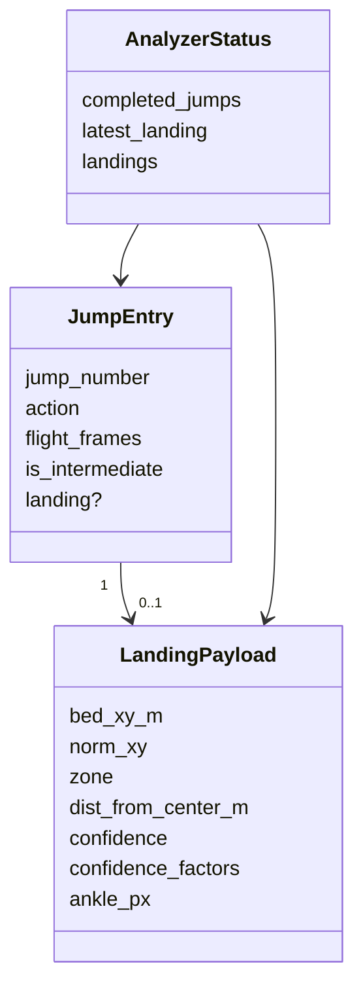
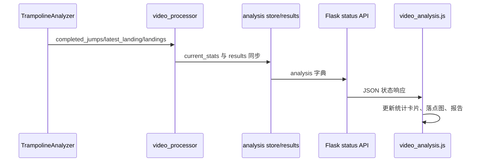

本页位于“床面标定与落点分析”小节的 **[落点数据结构与可视化](19-luo-dian-shu-ju-jie-gou-yu-ke-shi-hua)**，关注一个狭窄但关键的问题：系统如何在“落地事件”发生时把脚踝图像坐标转成床面坐标，如何把该结构挂接到每跳结果、实时状态和最终结果中，以及如何在视频覆盖层与前端页面中展示这些落点。边界上，本页不展开四角标定、床面跟踪或跳次分割的内部算法；这些内容分别属于 [四角标定与关键帧补标](16-si-jiao-biao-ding-yu-guan-jian-zheng-bu-biao)、[床面跟踪、置信度与漂移修正](17-chuang-mian-gen-zong-zhi-xin-du-yu-piao-yi-xiu-zheng)、[跳次分割与起跳落地检测](13-tiao-ci-fen-ge-yu-qi-tiao-luo-di-jian-ce)。Sources: [analyzer.py](trampoline/analyzer.py#L44-L63), [bed_tracker.py](trampoline/bed_tracker.py#L1088-L1122), [overlay.py](trampoline/overlay.py#L108-L114)

## 架构假设与验证结论

从第一性原理看，落点不是连续帧指标，而是 **落地事件上的派生数据**：只有当跳次检测器报告 `landing` 事件时，分析器才会根据当前帧的左右脚踝关键点生成一次 `landing` payload，并把它写入刚完成的 `jump_entry`。代码验证显示，`TrampolineAnalyzer.process_frame()` 在 `detection["event"] == "landing"` 分支中创建 `jump_entry`，随后调用 `_compute_landing_payload()`，返回非空时写入 `jump_entry["landing"]`，最后追加到 `completed_jumps`。Sources: [analyzer.py](trampoline/analyzer.py#L44-L63), [analyzer.py](trampoline/analyzer.py#L88-L114)

第二个结论是：落点结构同时有 **每跳归档形态** 与 **实时摘要形态**。每跳形态保存在 `completed_jumps[*].landing`；实时摘要形态由 `latest_landing` 和 `landings` 暴露，其中 `landings` 是从已完成跳次中过滤出的 landing 列表，`latest_landing` 是该列表的最后一个元素。这个设计让前端既能渲染“最近一次落点”，也能绘制历史落点图。Sources: [analyzer.py](trampoline/analyzer.py#L71-L86), [analyzer.py](trampoline/analyzer.py#L139-L146), [video_analysis_helpers.js](static/js/video_analysis_helpers.js#L48-L55)

第三个结论是：可视化分为 **处理后视频覆盖层** 与 **页面 DOM 落点图** 两条路径。后端覆盖层在视频帧上绘制最新落点十字标记，并在右下角绘制最多 20 个历史落点的俯视小地图；前端页面则通过 `latest_landing`、`landings` 或每跳 landing 回退数据更新统计卡片、落点图和报告明细。Sources: [overlay.py](trampoline/overlay.py#L108-L114), [overlay.py](trampoline/overlay.py#L171-L188), [overlay.py](trampoline/overlay.py#L191-L229), [video_analysis.js](static/js/video_analysis.js#L160-L177), [video_analysis.js](static/js/video_analysis.js#L200-L214)

```mermaid
flowchart LR
    A[landing 事件] --> B[左右脚踝可见度加权像素点]
    B --> C[BedTracker.landing_payload]
    C --> D[completed_jumps[*].landing]
    D --> E[latest_landing / landings]
    E --> F[视频覆盖层: 十字标记 + minimap]
    E --> G[前端页面: 统计卡片 + 落点图 + 报告]
```

这张图只表达落点数据的生成、归档与展示关系：跳次检测产生落地事件，分析器计算脚踝像素点，床面跟踪器生成规范化 payload，随后该 payload 被传递到视频渲染与页面 UI。Sources: [analyzer.py](trampoline/analyzer.py#L53-L63), [bed_tracker.py](trampoline/bed_tracker.py#L1100-L1122), [video_processor.py](video_processor.py#L271-L281), [app.py](app.py#L588-L603)

## 落点 payload 的数据结构

`BedTracker.landing_payload()` 返回的落点对象包含床面米制坐标、归一化坐标、区域分类、到中心距离、综合置信度和置信度因子；`TrampolineAnalyzer._compute_landing_payload()` 在此基础上额外补充 `ankle_px`，即当前落地帧中左右脚踝合成后的图像像素坐标。这个 payload 是落点可视化的唯一数据核心：米制坐标用于文本展示，归一化坐标用于俯视图定位，置信度用于颜色编码。Sources: [bed_tracker.py](trampoline/bed_tracker.py#L1100-L1122), [analyzer.py](trampoline/analyzer.py#L88-L111), [video_analysis.js](static/js/video_analysis.js#L143-L151), [overlay.py](trampoline/overlay.py#L217-L227)

| 字段 | 类型/形态 | 生成位置 | 主要用途 |
|---|---:|---|---|
| `bed_xy_m` | `[x, y]`，保留 3 位小数 | `landing_payload()` | 页面文字、报告明细、落点摘要 |
| `norm_xy` | `[nx, ny]`，保留 4 位小数 | `landing_payload()` | 前端落点图和视频 minimap 定位 |
| `zone` | `center` / `mid` / `edge` / `off_bed` | `classify_landing_zone()` | 最新落点标注、每跳报告 |
| `dist_from_center_m` | 数值，保留 3 位小数 | `landing_payload()` | 中心距离指标 |
| `confidence` | `0.0 ~ 1.0`，保留 3 位小数 | `landing_payload()` | 颜色编码和低置信提示 |
| `confidence_factors.tracking` | 数值 | `landing_payload()` | 置信度分解 |
| `confidence_factors.ankle_visibility` | 数值 | `landing_payload()` | 置信度分解 |
| `confidence_factors.bounds` | 数值 | `landing_payload()` | 置信度分解 |
| `ankle_px` | `[x, y]`，保留 1 位小数 | `_compute_landing_payload()` | 视频帧上的十字落点标记 |

表中的字段均来自本地实现：`landing_payload()` 负责床面坐标、区域与置信度字段，`_compute_landing_payload()` 负责在 payload 上追加 `ankle_px`。Sources: [bed_tracker.py](trampoline/bed_tracker.py#L1100-L1122), [analyzer.py](trampoline/analyzer.py#L108-L111)

## 图像脚踝点到床面落点的转换

落点计算从左右脚踝 MediaPipe landmark 开始：分析器读取左右脚踝的 `x`、`y` 和 `visibility`，当可见度和大于 `1e-6` 时按可见度加权得到归一化脚踝位置；否则退化为左右脚踝坐标的简单平均，并把 `ankle_visibility` 置为 `0.0`。随后代码乘以当前帧宽高得到 `ankle_px`，并调用 `bed_tracker.landing_payload(ankle_px, ankle_visibility=...)`。Sources: [analyzer.py](trampoline/analyzer.py#L88-L111)

床面坐标转换由 `image_to_bed()` 完成：它要求 `H_image_to_bed` 已初始化，然后使用 `cv2.perspectiveTransform()` 将图像点映射到床面坐标系。`landing_payload()` 在此基础上计算 `norm_xy = [x / width, y / length]`，并使用床面尺寸对坐标进行归一化；这解释了为什么前端与视频 minimap 可以不关心实际床面尺寸，只需要读取 `norm_xy` 即可定位。Sources: [bed_tracker.py](trampoline/bed_tracker.py#L1088-L1098), [bed_tracker.py](trampoline/bed_tracker.py#L1100-L1104)

## 区域分类与置信度语义

落点区域由 `classify_landing_zone()` 判定：坐标越界时返回 `off_bed`；未越界时先检查到边缘的最小距离，小于边缘阈值则为 `edge`；随后计算到床面中心的欧氏距离，依次落入中心半径、mid 半径或默认 edge。该函数只返回区域标签，不修改落点坐标本身。Sources: [bed_tracker.py](trampoline/bed_tracker.py#L376-L397)

置信度由三个因子线性组合：床面跟踪置信度权重 `0.5`，脚踝可见度权重 `0.3`，边界置信度权重 `0.2`，最终值被裁剪到 `0.0 ~ 1.0` 并保留 3 位小数。实现同时返回 `confidence_factors`，使调用方可以看到 `tracking`、`ankle_visibility` 和 `bounds` 三个来源，但当前 UI 主要使用总置信度进行颜色和低置信提示。Sources: [bed_tracker.py](trampoline/bed_tracker.py#L1105-L1122), [overlay.py](trampoline/overlay.py#L179-L187), [video_analysis.js](static/js/video_analysis.js#L205-L209)

| 置信度范围 | 后端覆盖层颜色 | 前端落点点位 class | 表达含义 |
|---:|---|---|---|
| `>= 0.6` 或缺省 | 绿色 `(0, 230, 118)` | `landing-dot high` | 高置信或默认可信 |
| `>= 0.35` 且 `< 0.6` | 黄色/橙色 `(0, 190, 255)` | `landing-dot medium` | 中等置信 |
| `< 0.35` | 红色 `(0, 0, 255)` | `landing-dot low` | 低置信 |

颜色阈值在后端和前端保持一致：视频十字标记与 minimap 使用 `0.6`、`0.35` 两级阈值，前端 `landingDotClass()` 也使用相同阈值生成 `high`、`medium`、`low` class。Sources: [overlay.py](trampoline/overlay.py#L179-L187), [overlay.py](trampoline/overlay.py#L225-L227), [video_analysis.js](static/js/video_analysis.js#L154-L157), [static/css/video_analysis.css](static/css/video_analysis.css#L257-L270)

## 与每跳结果的绑定

落地事件发生时，分析器会构造 `jump_entry`，其中包含 `jump_number`、`action`、`flight_frames`、`is_intermediate`，并在成功计算落点时添加 `landing` 字段。这意味着落点天然归属于某一次完成的跳，而不是独立于跳次存在的全局列表。Sources: [analyzer.py](trampoline/analyzer.py#L44-L63)

`_landings()` 不保存新状态，而是从 `completed_jumps` 中按顺序提取所有存在的 `landing`；`_latest_landing()` 再取该列表最后一个元素。这种派生方式保证 `completed_jumps` 是落点归档的主数据源，`landings` 和 `latest_landing` 是便于 UI 消费的视图。Sources: [analyzer.py](trampoline/analyzer.py#L139-L146)



这个类图描述的是运行时字典结构关系，而不是 Python dataclass：`JumpEntry` 在分析器落地分支中构造，`LandingPayload` 来自床面跟踪器并被追加 `ankle_px`，`AnalyzerStatus` 通过 `process_frame()` 和 `get_status()` 对外返回。Sources: [analyzer.py](trampoline/analyzer.py#L53-L86), [analyzer.py](trampoline/analyzer.py#L116-L133)

## 后端结果传播路径

视频处理进程在每个分析帧调用 `analyzer.process_frame()`，随后把 `landings` 和 `latest_landing` 同步到 `current_stats` 与最终 `results`。处理完成后，`results` 再把 `latest_landing` 和 `landings` 从当前统计写回最终 JSON 结果，确保轮询中的中间状态与完成后的最终状态都包含落点数据。Sources: [video_processor.py](video_processor.py#L257-L281), [video_processor.py](video_processor.py#L313-L329)

Flask 应用在初始化和结果合并时为 `latest_landing`、`landings` 设置默认值，并在 `/api/video/status/<video_id>` 的响应中返回这两个字段。前端因此可以在分析尚未产生落点时拿到 `None` 和空数组，在分析完成或进行中拿到真实落点集合。Sources: [app.py](app.py#L220-L246), [app.py](app.py#L336-L345), [app.py](app.py#L588-L603)



该序列只覆盖落点字段传播：分析器产出字段，视频处理器同步字段，API 返回字段，前端消费字段。Sources: [analyzer.py](trampoline/analyzer.py#L71-L86), [video_processor.py](video_processor.py#L271-L281), [app.py](app.py#L588-L603), [video_analysis.js](static/js/video_analysis.js#L255-L271)

## 视频覆盖层可视化

处理后视频的落点可视化发生在 `draw_trampoline_overlay()` 中：当 `stats.latest_landing` 存在时，调用 `draw_landing_marker()` 在 `ankle_px` 位置绘制十字标记；当 `stats.landings` 非空时，调用 `draw_bed_minimap()` 绘制历史落点俯视图。床面四边形绘制和 marker lines 属于床面跟踪覆盖层，本页只关注落点标记与落点图。Sources: [overlay.py](trampoline/overlay.py#L97-L114)

`draw_landing_marker()` 使用 `ankle_px` 的像素坐标在原视频帧上画横竖十字，并把 `zone` 与 `confidence` 组成文本标签。颜色同样来自置信度阈值：高置信绿色、中等置信黄色/橙色、低置信红色；如果没有可用的 `ankle_px` 或坐标无法转成数字，函数直接返回原帧。Sources: [overlay.py](trampoline/overlay.py#L171-L188)

`draw_bed_minimap()` 在视频右下角绘制一个自适应尺寸的小面板，内部矩形代表床面俯视区域，中线代表中心参考线；函数只取 `landings[-20:]`，读取每个 landing 的 `norm_xy`，把 `nx`、`ny` 裁剪到 `0.0 ~ 1.0` 后映射到矩形内部，再按置信度绘制圆点。Sources: [overlay.py](trampoline/overlay.py#L191-L229)

## 前端页面可视化

页面结构中，落点相关 DOM 包括统计卡片 `stat-landing` 和落点图容器 `landing-map` / `landing-map-bed`；统计卡片标签为“落点坐标 + conf”，落点图空态文字为“暂无落点”。这些 DOM 元素是 `video_analysis.js` 更新落点文本与散点图的目标。Sources: [templates/video_analysis.html](templates/video_analysis.html#L93-L105)

前端首先通过 `validLanding()` 判断一个对象是否可作为落点：只要 `bed_xy_m` 或 `norm_xy` 至少有一组包含两个有限数字，就视为有效。`resolveCompactStats()` 的落点选择顺序是 `data.latest_landing`，然后 `data.landings` 的最后一个有效元素，最后回退到最新真实跳次的 `jump.landing`。Sources: [video_analysis_helpers.js](static/js/video_analysis_helpers.js#L15-L22), [video_analysis_helpers.js](static/js/video_analysis_helpers.js#L48-L55)

`formatLandingText()` 将有效落点显示为 `(<x>, <y>)m / conf <confidence>`；如果米制坐标不可用则显示“坐标 --”，如果置信度不可用则显示 `conf --`。`updateStats()` 每次收到轮询数据后更新落点统计卡片，并从 `data.landings` 或 `completed_jumps[*].landing` 收集落点，再把当前摘要落点补入集合后渲染落点图。Sources: [video_analysis.js](static/js/video_analysis.js#L143-L151), [video_analysis.js](static/js/video_analysis.js#L255-L271)

`renderLandingMap()` 清理旧的 `.landing-dot`，过滤有效落点并截取最后 20 个，然后使用 `norm_xy` 的百分比设置 dot 的 `left` 和 `top`。最新点会追加 `latest` class，置信度决定 `high`、`medium`、`low` class，鼠标悬停标题使用同一个 `formatLandingText()`。Sources: [video_analysis.js](static/js/video_analysis.js#L160-L177)

CSS 层把 `.landing-map` 设计为深色圆角容器，把 `.landing-map-bed` 放在容器内部并绘制中心十字参考线；`.landing-dot` 是绝对定位圆点，默认绿色，`.low` 为红色，`.medium` 为黄色，`.latest` 放大到 14px 并提升层级；当容器拥有 `has-landings` class 时隐藏“暂无落点”空态。Sources: [static/css/video_analysis.css](static/css/video_analysis.css#L228-L283)

## 报告中的落点展示

最终分析报告的每跳明细会读取 `jump.landing`：如果存在落点，则展示米制坐标、`zone` 和 `confidence`；当 `confidence < 0.5` 时追加“低置信”提示。该报告逻辑再次说明：面向用户的每跳落点信息来自 `completed_jumps[*].landing`，而不是仅依赖全局 `latest_landing`。Sources: [video_analysis.js](static/js/video_analysis.js#L179-L214)

页面还在构造 AI 分析输入摘要时把每跳落点拼接为文本片段：`落点=(x, y)m zone conf=...`。这一步没有改变落点结构，只是把已有 `jump.landing` 转换成文本，供后续分析层使用；AI 分析层的提示词与输出约束属于 [提示词构建与输出约束](25-ti-shi-ci-gou-jian-yu-shu-chu-yue-shu)，本页不展开。Sources: [video_analysis.js](static/js/video_analysis.js#L599-L603)

## 实现边界与失败保护

落点增强被设计为非阻断逻辑：`_compute_landing_payload()` 在缺少 `bed_tracker` 或 landmarks 时返回 `None`，在内部异常时也返回 `None`，注释明确要求“Landing enrichment must never break the existing jump result”。因此，即使落点无法计算，跳次、动作、腾空帧等核心结果仍然可以进入 `completed_jumps`。Sources: [analyzer.py](trampoline/analyzer.py#L88-L114)

前端同样采用容错读取：`validLanding()` 接受米制坐标或归一化坐标任一有效；`formatLandingText()` 在无效落点时显示 `--`；`renderLandingMap()` 会跳过缺失或非法 `norm_xy` 的落点。这些保护使文本摘要和散点图可以独立降级。Sources: [video_analysis_helpers.js](static/js/video_analysis_helpers.js#L15-L22), [video_analysis.js](static/js/video_analysis.js#L143-L151), [video_analysis.js](static/js/video_analysis.js#L160-L177)

## 阅读路径

若要理解落点结构的上游输入，建议先阅读 [图像坐标到床面坐标的映射](18-tu-xiang-zuo-biao-dao-chuang-mian-zuo-biao-de-ying-she)，再回到本页理解 `bed_xy_m` 与 `norm_xy` 的消费方式；若要理解视频帧上的整体覆盖层绘制，请继续阅读 [覆盖层绘制：骨架、床面、速度与落点](23-fu-gai-ceng-hui-zhi-gu-jia-chuang-mian-su-du-yu-luo-dian)；若要理解轮询数据如何进入页面状态，请阅读 [分析进度轮询与结果展示](22-fen-xi-jin-du-lun-xun-yu-jie-guo-zhan-shi)。Sources: [bed_tracker.py](trampoline/bed_tracker.py#L1088-L1122), [overlay.py](trampoline/overlay.py#L108-L114), [video_analysis.js](static/js/video_analysis.js#L255-L271)