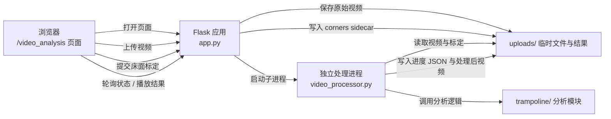
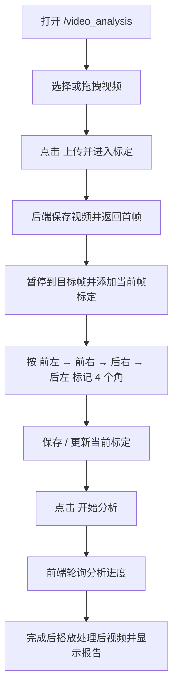

本页帮助你在本地把“蹦床视频分析”项目跑起来，并完成一次最短路径的体验：安装依赖、启动 Flask 服务、打开页面、上传视频、完成床面四角标定、启动分析并查看结果。当前仓库的主线能力聚焦 `/video_analysis`，也保留 `/`、`/dashboard`、`/profile` 作为页面入口；本页只覆盖上手所需内容，算法细节与 API 契约请在后续页面继续阅读。Sources: [README.md](README.md#L3-L10), [README.md](README.md#L23-L33)

## 你将启动什么

从第一性原理看，这个项目是一个**浏览器页面 + Flask 后端 + 独立视频处理进程**的本地分析工具：浏览器负责选择视频、显示标定界面和轮询进度；Flask 负责页面路由、上传接口、标定提交、状态查询和处理后视频返回；`video_processor.py` 在独立进程中运行 MediaPipe、OpenCV 与蹦床分析模块，持续写出 JSON 结果并生成带覆盖层的视频。Sources: [README.md](README.md#L29-L33), [app.py](app.py#L249-L267), [app.py](app.py#L460-L490), [video_processor.py](video_processor.py#L1-L7)



这张图只表达快速开始需要理解的最小链路：你不需要先掌握算法实现，只要知道“先上传视频，再标定床面，再启动分析，最后轮询结果并播放处理后视频”。前端页面的上传区、床面四角标定、实时统计、落点图、报告区、AI 分析区和处理日志都已经在 `templates/video_analysis.html` 中定义，页面脚本会按流程调用上传、标定启动、状态轮询与结果展示逻辑。Sources: [templates/video_analysis.html](templates/video_analysis.html#L23-L73), [templates/video_analysis.html](templates/video_analysis.html#L76-L157), [static/js/video_analysis.js](static/js/video_analysis.js#L426-L467), [static/js/video_analysis.js](static/js/video_analysis.js#L274-L333)

## 本地安装依赖

在项目根目录创建并激活虚拟环境，然后安装 `requirements.txt` 中的依赖；README 给出的快速开始命令是 `python -m venv venv`、`source venv/bin/activate` 和 `pip install -r requirements.txt`。Sources: [README.md](README.md#L37-L46)

```bash
python -m venv venv
source venv/bin/activate
pip install -r requirements.txt
```

当前依赖以 Flask、OpenCV、MediaPipe、NumPy、imageio、imageio-ffmpeg 和 OpenAI 兼容 SDK 为核心；其中 imageio/imageio-ffmpeg 用于浏览器兼容的视频输出，OpenAI 兼容 SDK 用于可选的通义千问 AI 解读能力。Sources: [requirements.txt](requirements.txt#L1-L15)

| 依赖类别 | 包 | 快速开始阶段的作用 |
|---|---|---|
| Web 服务 | `flask` | 提供页面路由与视频分析 API |
| 视频处理 | `opencv-python` | 读取视频、提取首帧、检查帧率与时长、写出视频 |
| 姿态估计 | `mediapipe` | 在处理进程中初始化 Pose 模型 |
| 数值计算 | `numpy` | 支撑分析模块中的数值处理 |
| 视频输出 | `imageio`, `imageio-ffmpeg` | 优先生成 H.264 MP4 结果视频 |
| AI 解读 | `openai` | 支持 OpenAI 兼容接口的 LLM 分析 |

依赖安装完成后，`app.py` 会在导入 TensorFlow/MediaPipe 相关组件前设置线程与日志环境变量，`video_processor.py` 也在独立进程入口处设置同类环境变量；这意味着初次运行时无需额外手动配置这些运行时变量。Sources: [app.py](app.py#L1-L8), [video_processor.py](video_processor.py#L9-L15)

## 启动服务

使用 README 中的启动命令运行项目：Sources: [README.md](README.md#L48-L52)

```bash
python app.py
```

服务启动入口位于 `app.py` 的 `if __name__ == '__main__'` 块；启动时会打印项目标题、可用页面路由和浏览器访问地址，然后以 `debug=False`、`threaded=False`、`use_reloader=False` 运行 Flask 应用。Sources: [app.py](app.py#L708-L717)

启动后在浏览器访问以下地址；README 的快速开始入口是 `http://127.0.0.1:5000`，而蹦床视频分析主入口是 `/video_analysis`。Sources: [README.md](README.md#L54-L60), [README.md](README.md#L23-L28)

```text
http://127.0.0.1:5000
http://127.0.0.1:5000/video_analysis
```

## 选择正确页面

当前项目保留四个页面路由，其中 `/video_analysis` 是本次快速体验要使用的主页面；`/`、`/dashboard`、`/profile` 当前更多承担入口、看板占位和训练档案占位作用。Sources: [README.md](README.md#L23-L28), [app.py](app.py#L249-L267)

| 页面 | 路由 | 快速开始中的用途 |
|---|---|---|
| 首页 | `/` | 进入项目的默认页面 |
| 仪表盘 | `/dashboard` | 查看保留的看板页面入口 |
| 训练档案 | `/profile` | 查看保留的档案页面入口 |
| 蹦床视频分析 | `/video_analysis` | 上传视频、标定床面、启动分析与查看结果 |

路由契约测试也固定了这些页面仍需返回 200，并要求页面文案围绕“蹦床”或“视频分析”，同时确认旧的健身训练端点不再出现在保留前端中；因此初学者应把 `/video_analysis` 视为当前可实际操作的核心页面。Sources: [tests/test_app_route_contract.py](tests/test_app_route_contract.py#L6-L16), [tests/test_app_route_contract.py](tests/test_app_route_contract.py#L19-L45), [tests/test_app_route_contract.py](tests/test_app_route_contract.py#L76-L97)

## 完成一次最短分析流程

打开 `/video_analysis` 后，先在上传区域拖拽视频或点击“选择视频”；页面声明支持 MP4、AVI、MOV、WebM，并使用原生 `<input type="file" accept="video/*">` 选择视频文件。Sources: [templates/video_analysis.html](templates/video_analysis.html#L23-L32)



选择视频后，前端会把本地文件设置为视频播放器源，启用播放、上传分析和重置按钮，并在处理日志与过程反馈中记录已加载的视频文件名和大小。Sources: [static/js/video_analysis.js](static/js/video_analysis.js#L364-L375)

点击“上传并进入标定”后，前端会创建 `FormData`，提交 `video` 文件和固定的 `exercise_type=trampoline` 到 `/api/video/upload`；上传成功后，页面记录 `video_id`，进入“请先完成床面关键帧标定”的状态，并把后端返回的首帧图像交给标定控制器。Sources: [static/js/video_analysis.js](static/js/video_analysis.js#L426-L467)

后端上传接口只接受 `exercise_type=trampoline`，会拒绝缺少视频、缺少运动类型、非蹦床类型和空文件名的请求；它还会检查文件大小上限、读取视频帧率与总帧数、检查视频时长，并提取首帧作为标定图像返回给前端。Sources: [app.py](app.py#L269-L323), [app.py](app.py#L324-L365)

在标定步骤中，页面提示你在主视频暂停到目标帧，点击“添加当前帧标定”，然后按 **前左 → 前右 → 后右 → 后左** 标记 4 个床面角；至少保存 1 个有效标定后才能点击“开始分析”。Sources: [templates/video_analysis.html](templates/video_analysis.html#L39-L58)

点击“开始分析”后，后端会规范化标定数据，写入包含 `video_id`、`corner_order`、`corners_px`、`calibrations` 和床面尺寸的 sidecar JSON，然后把分析状态改为 `processing` 并启动后台线程调用独立视频处理进程。Sources: [app.py](app.py#L408-L457)

分析过程中，前端每 200ms 请求 `/api/video/status/<video_id>`；当状态为 `processing` 时更新进度条、跳次、动作和落点，当状态为 `completed` 时加载处理后视频、展示报告并停止轮询，当状态为 `error` 时显示错误信息。Sources: [static/js/video_analysis.js](static/js/video_analysis.js#L274-L333)

## 快速开始 API 摘要

你通常不需要手写调用这些 API，因为页面脚本已经串联了完整流程；但理解这些端点能帮助你定位“卡在上传、标定、处理、播放还是 AI 解读”哪个阶段。Sources: [README.md](README.md#L75-L84), [static/js/video_analysis.js](static/js/video_analysis.js#L426-L467), [static/js/video_analysis.js](static/js/video_analysis.js#L274-L333)

| 端点 | 方法 | 快速开始中的角色 |
|---|---:|---|
| `/api/video/upload` | POST | 上传蹦床视频，返回 `video_id`、首帧图像、帧率、总帧数和角点顺序 |
| `/api/video/trampoline/start` | POST | 提交床面标定并启动分析 |
| `/api/video/status/<video_id>` | GET | 轮询分析进度、跳次、动作、落点和处理后视频地址 |
| `/api/video/processed/<video_id>` | GET | 返回处理后视频文件 |
| `/api/video/llm_analysis/<video_id>` | GET | 对已完成分析的视频发起 SSE AI 解读 |

后端状态接口返回 `status`、`progress`、`reps`、`current_action`、`completed_jumps`、`latest_landing`、`landings`、`processed_video_url` 等字段；这些字段直接驱动页面上的进度条、实时统计、落点图、报告和结果视频播放。Sources: [app.py](app.py#L570-L603), [static/js/video_analysis.js](static/js/video_analysis.js#L296-L321)

## 项目结构速览

快速开始阶段只需要认识几个顶层文件和目录：`app.py` 是 Flask 入口，`video_processor.py` 是独立视频处理入口，`trampoline/` 承载蹦床分析逻辑，`templates/` 和 `static/` 提供页面与前端脚本样式，`tests/` 保存回归测试。Sources: [README.md](README.md#L87-L110)

```text
project-root/
├── app.py                         # Flask 页面与 API 入口
├── video_processor.py             # 独立视频处理进程
├── requirements.txt               # Python 依赖
├── trampoline/                    # 蹦床分析、床面跟踪、动作识别、覆盖层与 LLM 服务
├── templates/
│   └── video_analysis.html        # 蹦床视频分析页面
├── static/
│   ├── css/
│   └── js/
│       ├── video_analysis.js
│       ├── trampoline_calibration_geometry.js
│       └── trampoline_calibration_ui.js
└── tests/                         # 路由、API、前端契约与算法回归测试
```

README 的目录结构明确把 `video_processor.py`、`trampoline/analyzer.py`、`trampoline/bed_tracker.py`、`trampoline/jump_detector.py`、`trampoline/action_classifier.py`、`trampoline/overlay.py`、`trampoline/llm_service.py` 列为当前重点；快速开始不需要逐个阅读这些模块，只需要知道它们在视频处理和结果生成阶段被使用。Sources: [README.md](README.md#L87-L110), [video_processor.py](video_processor.py#L77-L83)

## 可选：启用 AI 解读

AI 解读不是完成本地视频分析的必需步骤；如果你希望使用 `/api/video/llm_analysis/<video_id>`，README 要求设置 `QWEN_API_KEY` 或 `DASHSCOPE_API_KEY`，并可选设置 `QWEN_FAST_MODEL` 与 `QWEN_MODEL`。Sources: [README.md](README.md#L132-L147)

```bash
export QWEN_API_KEY=your_key
# 或使用 DASHSCOPE_API_KEY

export QWEN_FAST_MODEL=qwen-plus
export QWEN_MODEL=qwen3.6-plus-2026-04-02
```

后端 AI 路由只在视频存在、模式为 `trampoline` 且分析状态为 `completed` 时继续执行；如果视频不存在、模式不匹配、分析未完成或 API Key 未配置，它会通过 SSE 返回错误消息。Sources: [app.py](app.py#L606-L645)

## 常见卡点速查

如果上传后没有进入标定，优先检查请求是否携带了 `video` 文件以及 `exercise_type=trampoline`，因为后端会直接拒绝缺少视频、缺少运动类型或非蹦床类型的上传。Sources: [app.py](app.py#L269-L281)

如果上传时提示文件过大或视频过长，后端当前限制为最大 50MB 和最长 120 秒；超过时会返回 400，并给出实际大小或实际时长。Sources: [app.py](app.py#L35-L37), [app.py](app.py#L286-L314)

如果点击开始分析后失败，优先确认你已经保存了至少一组有效床面标定；后端会把标定数据规范化，若失败会把状态设置为 `calibration_rejected` 并返回错误。Sources: [templates/video_analysis.html](templates/video_analysis.html#L47-L56), [app.py](app.py#L408-L419)

如果结果视频没有立即出现，先看页面进度与状态轮询；后端只有在 `processed_video` 存在时才返回 `processed_video_url`，否则处理后视频接口会返回 “Processed video not ready”。Sources: [app.py](app.py#L551-L567), [app.py](app.py#L577-L593)

| 现象 | 先检查什么 | 代码依据 |
|---|---|---|
| 上传失败：没有视频 | 表单是否包含 `video` 字段 | `/api/video/upload` 检查 `request.files` |
| 上传失败：非蹦床类型 | 是否提交 `exercise_type=trampoline` | 上传接口只接受蹦床模式 |
| 上传失败：文件过大 | 文件是否超过 50MB | `MAX_VIDEO_SIZE_MB = 50` |
| 上传失败：视频过长 | 视频是否超过 120 秒 | `MAX_VIDEO_DURATION_SEC = 120` |
| 不能开始分析 | 是否保存了有效床面四角标定 | 标定规范化失败会拒绝启动 |
| AI 解读失败 | 视频是否已完成、API Key 是否已配置 | LLM 路由检查状态与 Key |

## 下一步阅读

完成本页后，建议按入门目录继续阅读：[蹦床视频分析主流程](3-beng-chuang-shi-pin-fen-xi-zhu-liu-cheng) 会把本页的操作串成完整业务链路，[页面入口与功能边界](4-ye-mian-ru-kou-yu-gong-neng-bian-jie) 会解释各页面当前职责，[上传、标定、分析与回放操作指南](5-shang-chuan-biao-ding-fen-xi-yu-hui-fang-cao-zuo-zhi-nan) 会更细地展开实际操作步骤；如果你只想配置 AI，再阅读 [AI 解读功能配置](6-ai-jie-du-gong-neng-pei-zhi)，如果你想验证环境，则阅读 [测试与验证命令速查](7-ce-shi-yu-yan-zheng-ming-ling-su-cha)。Sources: [README.md](README.md#L14-L22), [README.md](README.md#L114-L128), [README.md](README.md#L132-L147)