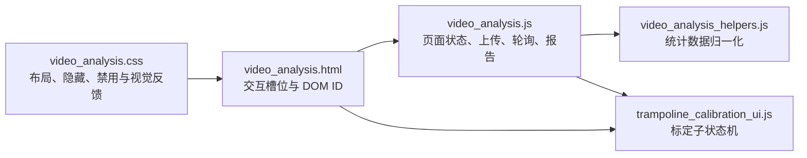
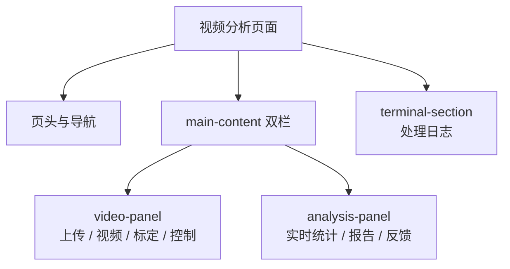
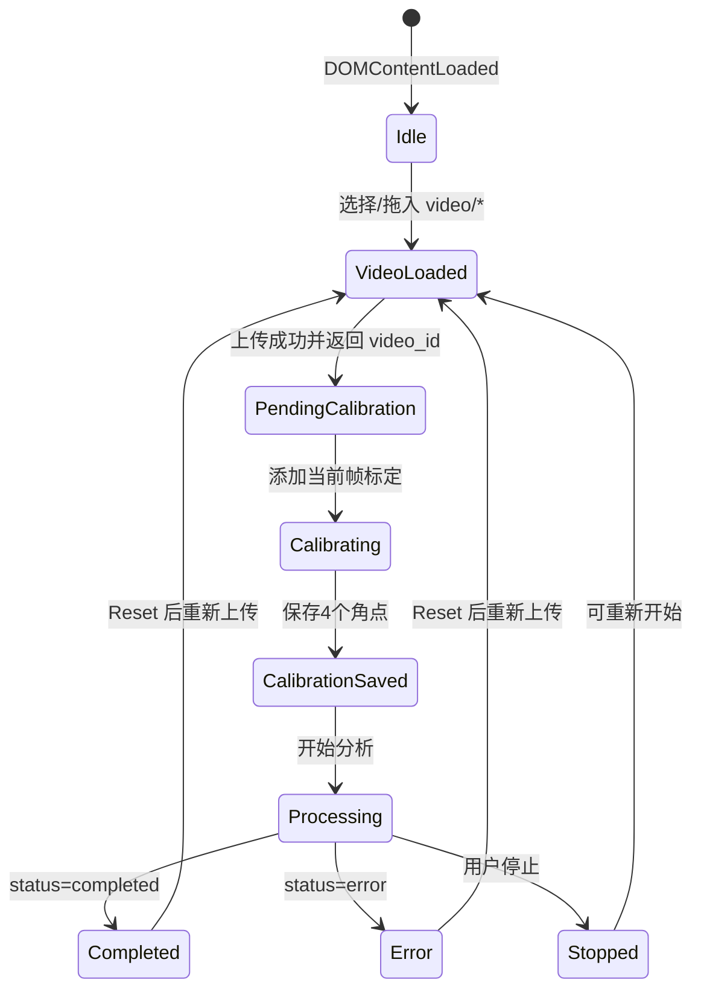
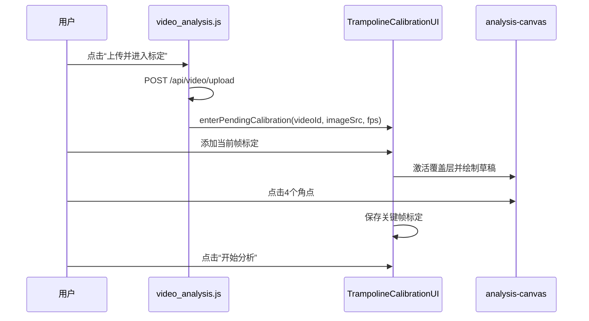
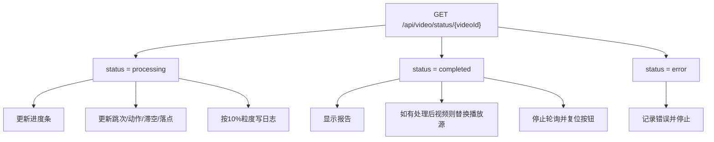

视频分析页面的交互核心不是“上传后立即分析”，而是一个**显式分阶段的前端状态机**：用户先在上传区选择或拖入视频，页面切换到本地预览；点击“上传并进入标定”后，后端返回视频 ID 与首帧/帧率信息，前端进入床面关键帧标定；保存至少一个有效四角标定后，才允许提交蹦床分析并启动进度轮询；分析完成后，页面展示统计、落点、报告、处理日志，并解锁 AI 分析入口。Sources: [video_analysis.html](templates/video_analysis.html#L23-L73), [video_analysis.js](static/js/video_analysis.js#L426-L467), [trampoline_calibration_ui.js](static/js/trampoline_calibration_ui.js#L382-L429)

## 架构假设与验证结论

本页的第一性问题是：**用户动作如何被映射为页面状态、API 调用和可视反馈**。代码验证显示，页面由 HTML 定义固定交互槽位，由 `video_analysis.js` 负责上传、播放、轮询、统计、报告、日志和 AI 入口，由 `trampoline_calibration_ui.js` 负责标定子流程；样式层则通过网格布局、隐藏类、按钮禁用态、覆盖画布指针事件和响应式规则表达状态变化。Sources: [video_analysis.html](templates/video_analysis.html#L178-L181), [video_analysis.js](static/js/video_analysis.js#L3-L63), [trampoline_calibration_ui.js](static/js/trampoline_calibration_ui.js#L40-L85), [video_analysis.css](static/css/video_analysis.css#L24-L42)

这个关系图表达的是前端模块之间的**职责边界**：模板提供可寻址 DOM，主脚本持有页面级状态，标定控制器只接管四角标定交互，辅助模块只处理数值与落点选择逻辑，CSS 则把状态投射为视觉结构。Sources: [video_analysis.html](templates/video_analysis.html#L23-L175), [video_analysis.js](static/js/video_analysis.js#L41-L47), [video_analysis_helpers.js](static/js/video_analysis_helpers.js#L10-L62), [video_analysis.css](static/css/video_analysis.css#L100-L119)

## 页面结构：左侧视频工作区，右侧分析反馈区

页面主体采用双栏模型：左侧 `.video-panel` 承载上传、视频、覆盖画布、标定面板和控制按钮；右侧 `.analysis-panel` 再拆成实时列与报告列，分别放置实时统计、落点图、分析报告、AI 分析入口和过程反馈；底部独立终端区显示处理日志。Sources: [video_analysis.html](templates/video_analysis.html#L23-L175), [video_analysis.css](static/css/video_analysis.css#L24-L49), [video_analysis.css](static/css/video_analysis.css#L440-L535)

布局不是纯视觉划分，而是与用户认知顺序一致：用户先在左侧完成视频输入与标定操作，再在右侧观察分析输出；日志区独立于主内容，避免把过程性诊断信息与结果性统计混在同一阅读层级。Sources: [video_analysis.html](templates/video_analysis.html#L24-L73), [video_analysis.html](templates/video_analysis.html#L76-L159), [video_analysis.html](templates/video_analysis.html#L162-L175)

| 区域 | 主要 DOM | 交互职责 | 状态表达 |
|---|---|---|---|
| 视频容器 | `#upload-area`, `#video-player`, `#analysis-canvas` | 上传入口、本地预览、标定覆盖层 | `hidden`, `.calibration-active` |
| 标定面板 | `#corner-marking-step` | 添加关键帧、四角点击、保存/删除标定、开始分析 | `.hidden`, 按钮 `disabled` |
| 控制条 | `#play-btn`, `#analyze-btn`, `#stop-analysis-btn`, `#reset-btn` | 播放、上传进入标定、停止、重置 | 按钮 `disabled` 与文本切换 |
| 分析输出 | `#stat-*`, `#landing-map`, `#report-section` | 展示跳次、动作、滞空、落点和报告 | 文本更新、动态节点、`.hidden` |
| 日志与反馈 | `#feedback-log`, `#terminal-content` | 用户可读反馈与处理日志 | 新节点插入、折叠状态 |

Sources: [video_analysis.html](templates/video_analysis.html#L25-L73), [video_analysis.html](templates/video_analysis.html#L76-L157), [video_analysis.html](templates/video_analysis.html#L162-L175), [video_analysis.css](static/css/video_analysis.css#L116-L119)

## 页面级状态机：从空页面到结果展示

页面级状态由 `videoFile`、`isAnalyzing`、`analysisInterval`、`currentVideoId`、`trampolineCalibrationController`、`llmEventSource` 和 `analysisResults` 共同描述；其中 `analysisResults` 记录跳次、反馈、起止时间和已完成跳次，是报告生成和下载的本地数据源。Sources: [video_analysis.js](static/js/video_analysis.js#L49-L63), [video_analysis.js](static/js/video_analysis.js#L179-L244), [video_analysis.js](static/js/video_analysis.js#L582-L617)

这个状态机的关键约束是：点击“上传并进入标定”时页面会先上传视频，但上传成功后不会立即处理帧；脚本将 `isAnalyzing` 置回 `false`、禁用停止按钮，并通过标定控制器进入待标定状态。Sources: [video_analysis.js](static/js/video_analysis.js#L426-L467), [trampoline_calibration_ui.js](static/js/trampoline_calibration_ui.js#L413-L429)

## 上传与本地预览交互

上传入口同时支持点击选择和拖拽：点击浏览按钮或上传区域会触发隐藏的文件输入，拖拽进入时添加 `.dragover` 样式，释放时仅当文件 MIME 以 `video/` 开头才调用 `handleVideoFile`。Sources: [video_analysis.html](templates/video_analysis.html#L25-L32), [video_analysis.js](static/js/video_analysis.js#L377-L399), [video_analysis.css](static/css/video_analysis.css#L63-L83)

`handleVideoFile` 不会立即调用后端，而是用 `URL.createObjectURL(file)` 给 `<video>` 创建本地预览地址，显示播放器、隐藏上传区、解锁播放/分析/重置按钮，并向日志和过程反馈写入文件名与大小。Sources: [video_analysis.js](static/js/video_analysis.js#L364-L375)

| 用户动作 | 前端响应 | 后端请求 |
|---|---|---|
| 点击“选择视频” | 打开隐藏文件输入 | 无 |
| 拖入视频文件 | 设置本地预览并解锁按钮 | 无 |
| 点击播放按钮 | 播放或暂停 `<video>`，同步按钮文案 | 无 |
| 点击“上传并进入标定” | 构建 `FormData` 并进入上传流程 | `POST /api/video/upload` |

Sources: [video_analysis.js](static/js/video_analysis.js#L377-L444), [video_analysis.js](static/js/video_analysis.js#L401-L422)

## 播放控制与进度条的双重语义

播放按钮是对原生视频播放器状态的外部镜像：点击时根据 `videoPlayer.paused` 切换播放/暂停，`play` 与 `pause` 事件再反向同步按钮文字，避免按钮文本与真实播放状态分离。Sources: [video_analysis.js](static/js/video_analysis.js#L401-L415)

进度条在非分析状态下表示**本地视频播放进度**，由 `timeupdate` 根据 `currentTime / duration` 更新；进入分析轮询后，同一进度条改为表示**后端处理进度**，由 `/api/video/status/<videoId>` 返回的 `progress` 驱动。Sources: [video_analysis.js](static/js/video_analysis.js#L416-L422), [video_analysis.js](static/js/video_analysis.js#L286-L305)

## 标定交互：覆盖画布作为点击表面

标定不是独立图片编辑器，而是复用视频容器内的 `analysis-canvas` 作为覆盖层；默认画布不可点击，只有视频容器带有 `.calibration-active` 时才开启 `pointer-events: auto` 并显示十字光标。Sources: [video_analysis.html](templates/video_analysis.html#L33-L37), [video_analysis.css](static/css/video_analysis.css#L100-L119), [trampoline_calibration_ui.js](static/js/trampoline_calibration_ui.js#L110-L117)

标定 UI 明确要求用户按“前左 → 前右 → 后右 → 后左”的顺序点击 4 个床面角；控制器内部也使用相同的默认角点顺序与中文标签，并在画布上绘制连线、点位和编号标签。Sources: [video_analysis.html](templates/video_analysis.html#L39-L56), [trampoline_calibration_ui.js](static/js/trampoline_calibration_ui.js#L10-L12), [trampoline_calibration_ui.js](static/js/trampoline_calibration_ui.js#L161-L196)

标定控制器进入待标定时会显示标定面板、暂停视频、确保播放器可见、隐藏分析画布、清空历史关键帧、记录待处理视频 ID 与上传帧率，并渲染空关键帧列表。Sources: [trampoline_calibration_ui.js](static/js/trampoline_calibration_ui.js#L413-L429)

## 关键帧标定的局部状态模型

标定子流程维护 `pendingTrampolineVideoId`、`cornerPoints`、`calibrationKeyframes`、`activeKeyframeFrame`、`selectedCalibrationFrame`、`pendingFrameImage` 和 `uploadedFrameRate` 等局部状态；这些状态只存在于标定控制器内部，不污染页面级上传、轮询和报告逻辑。Sources: [trampoline_calibration_ui.js](static/js/trampoline_calibration_ui.js#L74-L85), [video_analysis.js](static/js/video_analysis.js#L483-L502)

| 标定状态 | 触发条件 | 可用操作 | UI 反馈 |
|---|---|---|---|
| 无草稿 | 尚未添加当前帧 | 添加当前帧标定 | “当前草稿：未选择” |
| 草稿不足 4 点 | 已选关键帧但角点少于 4 | 继续点击角点、重置 | `0/4` 到 `3/4` |
| 草稿完整 | 当前草稿已有 4 点 | 保存/更新当前标定 | 保存按钮可用 |
| 已保存标定 | 至少一个关键帧保存成功 | 开始分析、删除、重标 | 开始分析按钮可用 |

Sources: [trampoline_calibration_ui.js](static/js/trampoline_calibration_ui.js#L20-L38), [trampoline_calibration_ui.js](static/js/trampoline_calibration_ui.js#L92-L108), [trampoline_calibration_ui.js](static/js/trampoline_calibration_ui.js#L362-L380)

点击“添加当前帧标定”会暂停视频，按当前播放时间和帧率估算帧号，捕获当前视频帧为 data URL，然后激活覆盖画布进入草稿编辑；如果视频帧尚未准备好且没有可用图像，则给出警告反馈。Sources: [trampoline_calibration_ui.js](static/js/trampoline_calibration_ui.js#L228-L238), [trampoline_calibration_ui.js](static/js/trampoline_calibration_ui.js#L329-L351)

点击画布时，控制器先把浏览器坐标换算为画布显示坐标，再调用几何模块换算为视频图像坐标；如果点击落在视频黑边外，交互会被拒绝并写入警告反馈，否则将点追加到 `cornerPoints` 并重绘覆盖层。Sources: [trampoline_calibration_ui.js](static/js/trampoline_calibration_ui.js#L448-L468)

## 分析启动：标定提交是处理开始的门闩

“开始分析”按钮只有在有效标定数大于 0 时才可用；启动时前端向 `/api/video/trampoline/start` 提交 `video_id` 和 `calibrations`，后端接受后隐藏标定面板、清空草稿、显示视频，并通过 `onProcessingStart` 回调把控制权交回页面级轮询。Sources: [trampoline_calibration_ui.js](static/js/trampoline_calibration_ui.js#L31-L37), [trampoline_calibration_ui.js](static/js/trampoline_calibration_ui.js#L382-L405)

页面级回调会设置 `isAnalyzing = true`、记录分析开始时间、启用停止按钮、把终端状态置为 `Processing`，然后调用 `startAnalysisPolling(videoId)`。Sources: [video_analysis.js](static/js/video_analysis.js#L488-L502)

## 分析轮询与页面输出更新

轮询以 200ms 周期请求 `/api/video/status/<videoId>`；当状态为 `processing` 时更新进度条、每跨过 10% 写入一次进度日志，并调用 `updateStats(data)` 刷新实时统计与落点图。Sources: [video_analysis.js](static/js/video_analysis.js#L274-L305), [video_analysis.js](static/js/video_analysis.js#L246-L272)

`updateStats` 的职责是把后端返回的增量状态投射为紧凑 UI：更新跳次，缓存 `completed_jumps`，通过 `resolveCompactStats` 解析滞空时间、动作和最新落点，再更新动作卡、落点文本和落点图。Sources: [video_analysis.js](static/js/video_analysis.js#L246-L272), [video_analysis_helpers.js](static/js/video_analysis_helpers.js#L24-L56)

当状态为 `completed` 时，页面停止轮询、记录结束时间、更新最终统计、把进度置为 100%、写入成功日志和反馈；如果响应包含处理后视频地址，则用 `processed_video_url` 替换播放器来源并播放，然后显示分析报告并调用 `stopAnalysis()` 收尾。Sources: [video_analysis.js](static/js/video_analysis.js#L305-L321)

当状态为 `error` 或请求异常时，交互模型区分“后端处理失败”和“轮询请求失败”：前者会写入错误日志、错误反馈、终端错误状态并停止分析；后者只写入轮询失败警告，不立即销毁整个分析状态。Sources: [video_analysis.js](static/js/video_analysis.js#L322-L331)

## 实时统计与落点图交互

实时统计区包含跳次、当前跳滞空时间、动作和“落点坐标 + conf”四张卡片；动作卡根据动作名添加 `action-*` 类，样式层为 tuck、pike、straight、straddle 和 unknown 定义不同颜色。Sources: [video_analysis.html](templates/video_analysis.html#L77-L98), [video_analysis.js](static/js/video_analysis.js#L255-L263), [video_analysis.css](static/css/video_analysis.css#L605-L624)

落点图只渲染有效落点并最多保留最近 20 个；每个落点使用 `norm_xy` 转换成百分比位置，根据信心值分为 high、medium、low，并把最新点放大显示。Sources: [video_analysis.js](static/js/video_analysis.js#L143-L177), [video_analysis.css](static/css/video_analysis.css#L228-L283)

落点有效性的判定被抽到 `video_analysis_helpers.js`：只要落点对象具有可解析的米制坐标 `bed_xy_m` 或归一化坐标 `norm_xy`，就被视为有效；紧凑统计优先取后端最新落点，其次取落点数组末项，再退回到最新已完成真实跳次的落点。Sources: [video_analysis_helpers.js](static/js/video_analysis_helpers.js#L15-L22), [video_analysis_helpers.js](static/js/video_analysis_helpers.js#L48-L55)

## 报告区与下载交互

分析完成后，`showTrampolineReport` 从 `completed_jumps` 中排除 `is_intermediate` 的过渡跳，计算总跳次、动作分布、处理耗时，并生成可折叠的逐跳明细；报告区和 AI 分析区随后从隐藏状态切换为可见，AI 按钮也被启用。Sources: [video_analysis.js](static/js/video_analysis.js#L179-L244)

报告明细的展开/折叠是本页内的轻量 DOM 状态：按钮维护 `aria-expanded`，点击时切换按钮前缀符号和 `.hidden` 类，不重新请求后端。Sources: [video_analysis.js](static/js/video_analysis.js#L217-L240), [video_analysis.css](static/css/video_analysis.css#L336-L399)

下载报告按钮会基于本地 `analysisResults` 和当前 `videoFile` 生成纯文本报告，包含时间、视频名、跳次摘要、过渡跳数量、逐跳动作/腾空帧/落点信息以及反馈日志，然后通过 Blob URL 触发浏览器下载。Sources: [video_analysis.js](static/js/video_analysis.js#L582-L617)

## 过程反馈与终端日志

页面提供两层过程反馈：`feedback-log` 面向用户，按最新优先插入并最多保留 50 条；`terminal-content` 面向开发和诊断，追加带时间戳的日志行并自动滚动到底部。Sources: [video_analysis.js](static/js/video_analysis.js#L75-L99), [video_analysis.html](templates/video_analysis.html#L149-L175)

终端状态用 `setTerminalStatus` 更新为 Idle、Processing、Completed、Error 或 Stopped 等文本与样式类；终端主体可通过切换按钮折叠，折叠状态由 `.collapsed` 类控制。Sources: [video_analysis.js](static/js/video_analysis.js#L83-L86), [video_analysis.js](static/js/video_analysis.js#L619-L624), [video_analysis.css](static/css/video_analysis.css#L471-L526)

## 重置与停止的边界

停止分析只负责终止分析态：清除轮询定时器、暂停视频、根据是否存在 `videoFile` 恢复“上传并进入标定”按钮、禁用停止按钮，并把 `lastProgress` 归零。Sources: [video_analysis.js](static/js/video_analysis.js#L112-L122)

重置页面则是全量复位：停止分析、隐藏并清空视频、恢复上传区、隐藏画布、重置标定控制器、清空当前视频 ID、禁用按钮、隐藏报告与 AI 区、关闭 SSE、清空反馈并重置统计。Sources: [video_analysis.js](static/js/video_analysis.js#L335-L362), [trampoline_calibration_ui.js](static/js/trampoline_calibration_ui.js#L431-L446)

## 响应式与视觉状态规则

桌面端页面最大宽度在较大视口下扩展到 1560px，主内容使用“视频更宽、分析略窄”的双栏网格；当视口小于 1180px 时主内容折叠为单列，分析面板保持双列；小于 720px 时分析面板也折叠为单列，控制按钮改为纵向排列。Sources: [video_analysis.css](static/css/video_analysis.css#L24-L42), [video_analysis.css](static/css/video_analysis.css#L405-L438)

视觉状态主要通过三种机制表达：`.hidden` 控制模块显隐，按钮 `disabled` 控制流程门禁，语义类如 `.dragover`、`.calibration-active`、`.has-landings`、`.collapsed` 控制局部交互状态。Sources: [video_analysis.css](static/css/video_analysis.css#L80-L83), [video_analysis.css](static/css/video_analysis.css#L116-L119), [video_analysis.css](static/css/video_analysis.css#L283-L283), [video_analysis.css](static/css/video_analysis.css#L712-L721)

## 与相邻页面的阅读关系

如果你要理解本页交互背后的接口契约，应继续阅读[前后端 API 契约](11-qian-hou-duan-api-qi-yue)；如果关注轮询完成后如何组织结果展示，应阅读[分析进度轮询与结果展示](22-fen-xi-jin-du-lun-xun-yu-jie-guo-zhan-shi)；如果要深入覆盖层坐标换算，应阅读[标定画布几何计算](21-biao-ding-hua-bu-ji-he-ji-suan)；如果要理解最终视频叠加图形的绘制语义，应阅读[覆盖层绘制：骨架、床面、速度与落点](23-fu-gai-ceng-hui-zhi-gu-jia-chuang-mian-su-du-yu-luo-dian)。Sources: [video_analysis.html](templates/video_analysis.html#L178-L181), [video_analysis.js](static/js/video_analysis.js#L293-L320), [trampoline_calibration_ui.js](static/js/trampoline_calibration_ui.js#L448-L468)