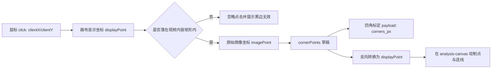
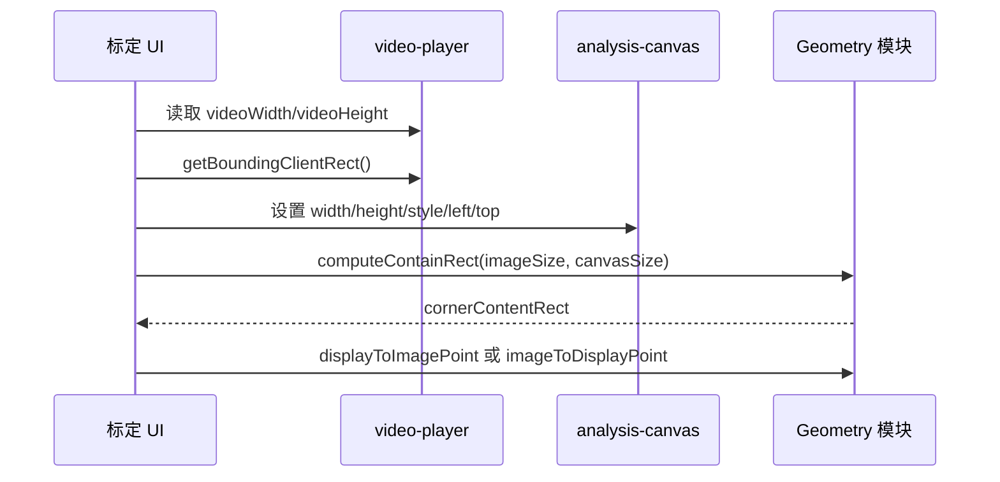

标定画布几何计算解决的是一个非常具体的问题：用户在浏览器中看到的是经过 `object-fit: contain` 缩放后的 `<video>`，但后端标定需要的是原始视频图像坐标；因此前端必须计算视频内容在画布中的真实显示矩形，过滤黑边点击，并在“显示坐标 ↔ 图像坐标”之间稳定转换。本页只解释这层几何与它在标定 UI 中的调用边界，不展开后端床面映射或落点分析；相关后续可继续阅读[图像坐标到床面坐标的映射](18-tu-xiang-zuo-biao-dao-chuang-mian-zuo-biao-de-ying-she)与[视频分析页面交互模型](20-shi-pin-fen-xi-ye-mian-jiao-hu-mo-xing)。Sources: [trampoline_calibration_geometry.js](static/js/trampoline_calibration_geometry.js#L14-L57), [video_analysis.css](static/css/video_analysis.css#L100-L119), [video_analysis.html](templates/video_analysis.html#L33-L42)

## 几何问题的第一性原理

标定页面复用主视频区域中的 `analysis-canvas` 作为点击层，而不是另建一个下方独立画布；HTML 中 `<video id="video-player">` 与 `<canvas id="analysis-canvas">` 位于同一 `video-container`，标定说明要求用户直接在上方视频画面按“前左 → 前右 → 后右 → 后左”点击四角。UI 模块也显式声明点击面为 `analysis-canvas`，且 `requiresLowerStandaloneCanvas` 为 `false`，这让所有几何计算都集中在同一覆盖层上完成。Sources: [video_analysis.html](templates/video_analysis.html#L25-L42), [trampoline_calibration_ui.js](static/js/trampoline_calibration_ui.js#L13-L18), [tests/test_trampoline_calibration_ui.mjs](tests/test_trampoline_calibration_ui.mjs#L211-L215)

视频元素和分析画布在 CSS 中都被设置为 `width: 100%`、`max-height: 500px`、`object-fit: contain`；画布本身为绝对定位，默认不接收鼠标事件，只有容器进入 `calibration-active` 状态时才打开 `pointer-events: auto` 并显示十字光标。因此几何层不能假设画布所有像素都属于视频内容：当视频宽高比与显示区域不一致时，画布中会出现水平或垂直黑边，点击黑边必须被视为无效。Sources: [video_analysis.css](static/css/video_analysis.css#L100-L119), [trampoline_calibration_ui.js](static/js/trampoline_calibration_ui.js#L110-L117), [trampoline_calibration_ui.js](static/js/trampoline_calibration_ui.js#L448-L463)

下面的关系图展示了本页关注的坐标链路：浏览器事件先变成画布显示坐标，再通过内容矩形转换为原始图像坐标；保存时只提交图像坐标与关键帧信息，画布绘制时则执行反向转换。Sources: [trampoline_calibration_ui.js](static/js/trampoline_calibration_ui.js#L448-L467), [trampoline_calibration_geometry.js](static/js/trampoline_calibration_geometry.js#L36-L74), [trampoline_calibration_geometry.js](static/js/trampoline_calibration_geometry.js#L82-L99)

## 内容矩形：把 `contain` 布局显式化

`computeContainRect(imageWidth, imageHeight, displayWidth, displayHeight)` 是几何层的入口函数。它先将输入转成数值，并要求图像宽高、显示宽高都为有限正数；任何非法输入都会返回 `null`。合法时，它使用 `Math.min(displayWidth / imageWidth, displayHeight / imageHeight)` 得到等比缩放系数，再计算缩放后的内容宽高，并用剩余空间的一半作为 `x`、`y` 偏移，这正是 `object-fit: contain` 在画布坐标系中的显式矩形模型。Sources: [trampoline_calibration_geometry.js](static/js/trampoline_calibration_geometry.js#L10-L34), [video_analysis.css](static/css/video_analysis.css#L100-L104)

| 输出字段 | 含义 | 由代码可验证的用途 |
|---|---|---|
| `x` | 视频内容左边界相对画布左侧的偏移 | 点击过滤与坐标反算使用 |
| `y` | 视频内容上边界相对画布顶部的偏移 | 点击过滤与坐标反算使用 |
| `width` | 缩放后视频内容宽度 | 归一化点击横坐标 |
| `height` | 缩放后视频内容高度 | 归一化点击纵坐标 |
| `scale` | 原始图像到显示内容的等比缩放系数 | 由 `computeContainRect` 返回，当前 UI 主要使用矩形字段完成映射 |

Sources: [trampoline_calibration_geometry.js](static/js/trampoline_calibration_geometry.js#L24-L33), [trampoline_calibration_ui.js](static/js/trampoline_calibration_ui.js#L157-L159)

单元测试覆盖了两类关键显示形态：竖屏图像放进横向显示区域时应产生左右黑边，且黑边点击返回 `null`；横屏图像与显示区域比例一致时，内容矩形偏移为 0，中心点从显示坐标 `(400, 225)` 映射到原图坐标 `(640, 360)`。这些测试说明几何层的核心目标不是“画布坐标等于视频坐标”，而是“先求内容矩形，再在内容矩形内部做比例映射”。Sources: [tests/test_trampoline_calibration_geometry.mjs](tests/test_trampoline_calibration_geometry.mjs#L16-L39)

## 显示坐标到图像坐标

用户点击画布时，UI 首先用 `cornerCanvas.getBoundingClientRect()` 取得 CSS 像素尺寸，再按 `cornerCanvas.width / rect.width` 与 `cornerCanvas.height / rect.height` 把浏览器事件坐标换算为画布内部坐标。这个步骤处理了 DOM 显示尺寸与 canvas backing store 尺寸可能不同的问题，随后才调用 `geometry.displayToImagePoint(displayPoint, cornerContentRect, cornerImageSize)`。Sources: [trampoline_calibration_ui.js](static/js/trampoline_calibration_ui.js#L448-L458)

`displayToImagePoint` 对输入点、内容矩形与图像尺寸进行存在性和数值校验，并要求图像尺寸、内容矩形宽高为正数；然后用一个 `1e-9` 的 epsilon 判断点击是否越过内容矩形边界。边界外返回 `null`，边界内则按比例计算 `x = ((displayX - rect.x) / rect.width) * imageWidth` 与 `y = ((displayY - rect.y) / rect.height) * imageHeight`，最终得到原始图像像素坐标。Sources: [trampoline_calibration_geometry.js](static/js/trampoline_calibration_geometry.js#L36-L57)

如果转换结果为 `null`，UI 会给出“请点击视频画面内的床面角点，黑边区域无效”的反馈，并记录忽略点击的日志；如果转换成功，点会按当前顺序加入 `cornerPoints`，名称来自 `front_left`、`front_right`、`back_right`、`back_left`，然后更新角点计数、重绘画布并刷新按钮状态。Sources: [trampoline_calibration_ui.js](static/js/trampoline_calibration_ui.js#L10-L11), [trampoline_calibration_ui.js](static/js/trampoline_calibration_ui.js#L458-L467)

## 图像坐标到显示坐标

绘制标定草稿时，系统不会把点击时的显示坐标直接缓存下来，而是缓存原始图像坐标，再通过 `imageToDisplayPoint` 反向投影到当前画布。该函数同样校验点、内容矩形与图像尺寸，然后计算 `displayX = rect.x + (imageX / imageWidth) * rect.width` 与 `displayY = rect.y + (imageY / imageHeight) * rect.height`。Sources: [trampoline_calibration_geometry.js](static/js/trampoline_calibration_geometry.js#L59-L74), [trampoline_calibration_ui.js](static/js/trampoline_calibration_ui.js#L173-L175)

这种“保存图像坐标、绘制时再投影”的模式让窗口尺寸变化、视频显示尺寸变化后仍能正确重绘。UI 在 `drawCornerCanvas()` 开始时会调用 `updateCornerCanvasSize()` 重新计算画布尺寸和内容矩形；浏览器 `resize` 事件与视频 `loadedmetadata` 事件触发时，如果标定步骤可见且有活动关键帧，也会重新绘制。Sources: [trampoline_calibration_ui.js](static/js/trampoline_calibration_ui.js#L136-L159), [trampoline_calibration_ui.js](static/js/trampoline_calibration_ui.js#L161-L175), [trampoline_calibration_ui.js](static/js/trampoline_calibration_ui.js#L479-L491)

测试中有一个完整的往返验证：原始图像点先经 `imageToDisplayPoint` 转成显示坐标，再经 `displayToImagePoint` 转回原始图像坐标，断言结果接近原点。这保证了标点绘制与点击采集使用的是同一套几何模型，而不是两套可能漂移的换算逻辑。Sources: [tests/test_trampoline_calibration_geometry.mjs](tests/test_trampoline_calibration_geometry.mjs#L41-L50)

## 画布尺寸与视频内容尺寸的来源

`currentImageSize()` 优先读取 `videoPlayer.videoWidth` 与 `videoPlayer.videoHeight`，若视频元数据尚不可用，则回退到已加载帧图像的自然尺寸或图像元素尺寸；没有有效宽高时返回 `null`。这个策略保证几何计算始终以“原始视频图像尺寸”为基准，而不是以页面上看到的 CSS 尺寸为基准。Sources: [trampoline_calibration_ui.js](static/js/trampoline_calibration_ui.js#L129-L134)

`updateCornerCanvasSize()` 负责把 canvas backing store 与可见视频矩形对齐：它读取视频元素的 bounding rect，必要时读取容器 rect，设置 `cornerCanvas.width`、`height`、`style.width`、`style.height`，并在有容器坐标时把画布 `left/top` 设置为视频矩形相对容器的偏移。最后，它用当前图像尺寸和画布像素尺寸调用 `computeContainRect()`，得到后续点击过滤与绘制投影共享的 `cornerContentRect`。Sources: [trampoline_calibration_ui.js](static/js/trampoline_calibration_ui.js#L136-L159)

## 关键帧索引与 payload 归一化

几何模块还提供 `frameIndexFromTime(timeS, fps)`，用于把当前视频时间转换为关键帧编号。该函数把时间限制为非负数，fps 若不是正数则默认使用 30，并返回 `Math.round(time * fps)` 的非负结果；UI 的 `estimateFrameIndex()` 优先调用这个函数，否则使用相同的回退公式。Sources: [trampoline_calibration_geometry.js](static/js/trampoline_calibration_geometry.js#L76-L80), [trampoline_calibration_ui.js](static/js/trampoline_calibration_ui.js#L329-L335)

当用户点击“添加当前帧标定”时，UI 会暂停视频、计算当前帧号、读取当前时间、捕获当前视频帧图像，然后进入草稿编辑；保存时要求活动关键帧存在且角点数量正好为 4，并把角点按固定顺序写入 `corners_px`。这说明几何层的输出不是独立存在的点，而是被绑定到某个 `frame_index` 与 `time_s` 的四角标定。Sources: [trampoline_calibration_ui.js](static/js/trampoline_calibration_ui.js#L337-L350), [trampoline_calibration_ui.js](static/js/trampoline_calibration_ui.js#L362-L380)

`buildCalibrationPayload(keyframes)` 是提交前的规范化步骤：它只保留包含 4 个角点的关键帧，兼容 `corners` 与 `corners_px` 字段，将帧号四舍五入并限制为非负，将时间限制为非负，并为缺失名称的角点补齐默认顺序，最后按 `frame_index` 升序排序。测试验证了不完整草稿会被过滤，多个关键帧会按帧号排序，并且默认角点名称会被补齐。Sources: [trampoline_calibration_geometry.js](static/js/trampoline_calibration_geometry.js#L82-L99), [tests/test_trampoline_calibration_geometry.mjs](tests/test_trampoline_calibration_geometry.mjs#L59-L77)

## 运行时状态与按钮约束

几何计算并不直接控制按钮，但它决定 `cornerPoints.length` 是否能达到 4，从而影响保存与开始分析的可用性。`describeCalibrationUiState()` 根据活动关键帧、草稿角点数、已保存标定数量和是否选中标定，生成草稿标签、状态文案以及 `canSave`、`canStart`、`canDelete`；其中保存要求 `activeKeyframeFrame !== null && draftCornerCount === 4`，开始分析要求至少有一个已保存有效标定。Sources: [trampoline_calibration_ui.js](static/js/trampoline_calibration_ui.js#L20-L38), [trampoline_calibration_ui.js](static/js/trampoline_calibration_ui.js#L92-L108)

| 状态条件 | UI 结果 | 几何相关原因 |
|---|---|---|
| 未选择活动关键帧 | 草稿显示“未选择”，不能保存 | 没有帧号时角点无法绑定到关键帧 |
| 活动关键帧存在但少于 4 点 | 可继续点击，不能保存 | 四角标定 payload 要求正好 4 点 |
| 点击黑边区域 | 点数不增加，并提示无效 | `displayToImagePoint` 返回 `null` |
| 已保存至少 1 个完整标定 | 可以开始分析 | `buildCalibrationPayload` 能产出至少 1 条有效记录 |
| 选中已有标定 | 可以删除或重标 | 关键帧列表按 `frame_index` 管理 |

Sources: [trampoline_calibration_ui.js](static/js/trampoline_calibration_ui.js#L92-L108), [trampoline_calibration_ui.js](static/js/trampoline_calibration_ui.js#L448-L467), [trampoline_calibration_geometry.js](static/js/trampoline_calibration_geometry.js#L82-L99)

UI 测试覆盖了这一状态链路：进入待标定后，画布初始隐藏且容器未激活；点击“添加当前帧标定”后，画布显示并进入 `calibration-active`；四次点击后角点计数为 `4/4` 且保存按钮启用；保存后 payload 中包含一条 `frame_index = 60`、`time_s = 2` 的标定，并且四个坐标与点击位置对应。Sources: [tests/test_trampoline_calibration_ui.mjs](tests/test_trampoline_calibration_ui.mjs#L217-L275)

## 与页面主流程的集成边界

主页面脚本启动时从 `window` 读取 `TrampolineCalibrationGeometry`、`TrampolineCalibrationUI` 与 `VideoAnalysisHelpers`，若缺失则抛出错误；HTML 的脚本加载顺序也先加载几何模块，再加载标定 UI，最后加载主页面脚本。这说明几何模块是浏览器全局 API 的一部分，同时也支持 Node 测试中的 `module.exports`。Sources: [video_analysis.js](static/js/video_analysis.js#L41-L47), [video_analysis.html](templates/video_analysis.html#L178-L181), [trampoline_calibration_geometry.js](static/js/trampoline_calibration_geometry.js#L1-L8)

上传视频完成后，主页面不会立即开始逐帧分析，而是提示用户先完成床面关键帧标定，并调用 `trampolineCalibrationController.enterPendingCalibration()` 传入 `videoId`、首帧图像和视频 fps。标定控制器提交时把 `video_id` 与规范化后的 `calibrations` 作为 JSON POST 到 `/api/video/trampoline/start`，提交成功后才触发后续处理轮询。Sources: [video_analysis.js](static/js/video_analysis.js#L454-L467), [trampoline_calibration_ui.js](static/js/trampoline_calibration_ui.js#L382-L405)

## 实现模式总结

标定画布几何采用了一个清晰的三层分离：CSS 与 DOM 提供可见视频和覆盖画布，UI 控制器负责事件、状态和绘制，`trampoline_calibration_geometry.js` 只处理纯函数几何与 payload 归一化。这种边界使几何函数可以在 Node 环境下直接测试，也让 UI 测试可以用假 DOM 验证点击、保存、重置与 payload 输出。Sources: [trampoline_calibration_geometry.js](static/js/trampoline_calibration_geometry.js#L101-L107), [tests/test_trampoline_calibration_geometry.mjs](tests/test_trampoline_calibration_geometry.mjs#L1-L10), [tests/test_trampoline_calibration_ui.mjs](tests/test_trampoline_calibration_ui.mjs#L123-L185)

| 模块 | 职责 | 不负责的内容 |
|---|---|---|
| `trampoline_calibration_geometry.js` | contain 矩形、坐标互转、帧号计算、payload 规范化 | DOM、绘制、网络请求 |
| `trampoline_calibration_ui.js` | 画布尺寸同步、点击采集、草稿绘制、关键帧列表、提交请求 | 后端分析算法 |
| `video_analysis.js` | 上传后进入标定、初始化控制器、标定成功后启动处理轮询 | 坐标换算公式 |
| `video_analysis.css` | 视频与画布叠放、标定状态下启用点击 | 标定数据结构 |

Sources: [trampoline_calibration_geometry.js](static/js/trampoline_calibration_geometry.js#L14-L99), [trampoline_calibration_ui.js](static/js/trampoline_calibration_ui.js#L40-L90), [video_analysis.js](static/js/video_analysis.js#L483-L503), [video_analysis.css](static/css/video_analysis.css#L100-L119)

下一步如果要理解这些 `corners_px` 如何进入后端并变成床面坐标，请阅读[图像坐标到床面坐标的映射](18-tu-xiang-zuo-biao-dao-chuang-mian-zuo-biao-de-ying-she)；如果要理解标定前后页面按钮、上传与轮询如何协同，请阅读[视频分析页面交互模型](20-shi-pin-fen-xi-ye-mian-jiao-hu-mo-xing)和[分析进度轮询与结果展示](22-fen-xi-jin-du-lun-xun-yu-jie-guo-zhan-shi)。Sources: [trampoline_calibration_ui.js](static/js/trampoline_calibration_ui.js#L382-L405), [video_analysis.js](static/js/video_analysis.js#L454-L467)