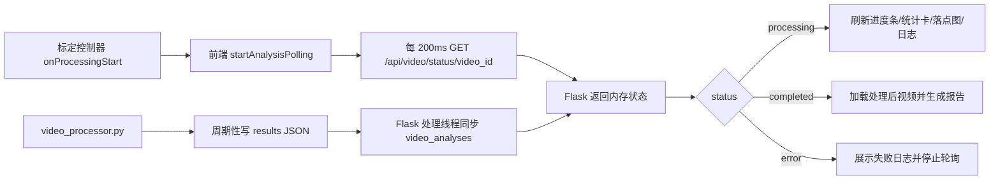
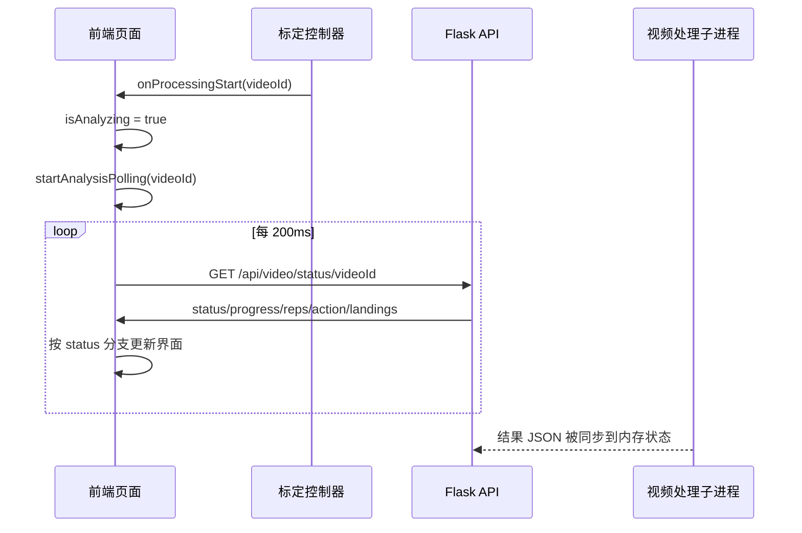
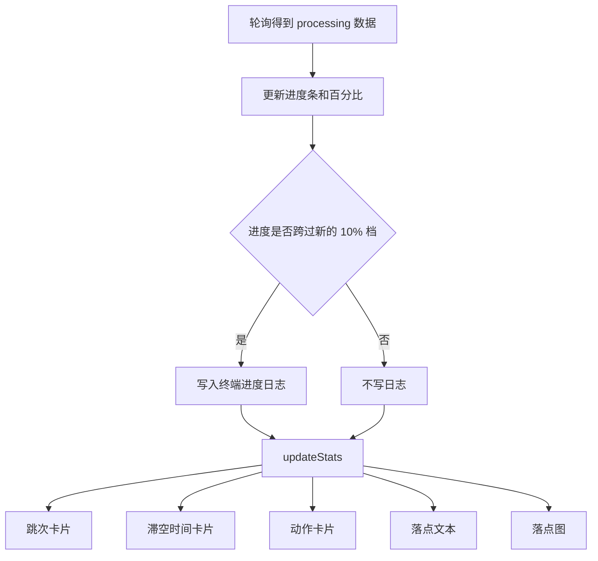
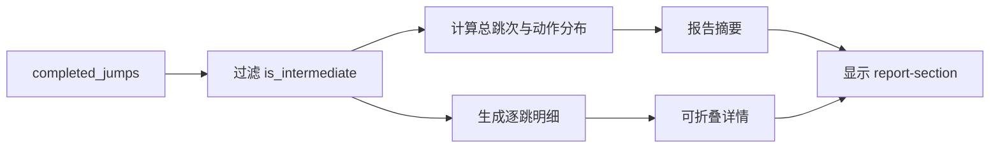

本页解释蹦床视频分析页面在“已启动后端处理”之后如何通过前端轮询读取进度、刷新实时统计、切换处理后视频、生成本地报告，并在失败或重置时收束界面状态；它不展开上传、标定、算法检测或 AI SSE 的内部机制，只记录本页可验证的进度与结果展示链路。Sources: [video_analysis.html](templates/video_analysis.html#L60-L156), [video_analysis.js](static/js/video_analysis.js#L274-L333)

## 架构假设与验证结论

**架构假设**：页面不是通过 WebSocket 或 SSE 接收视频处理进度，而是在标定控制器确认开始处理后，由前端创建一个短周期 `setInterval`，反复请求 `/api/video/status/<video_id>`；后端状态来自独立视频处理进程持续写出的 JSON 结果，Flask 主进程再把该结果同步到内存中的 `video_analyses`，最终由状态接口返回给浏览器。代码验证显示，前端轮询间隔为 200ms，后端状态接口返回 `status/progress/reps/current_action/completed_jumps/latest_landing/landings/processed_video_url` 等字段，子进程处理期间每 15 帧保存一次结果 JSON，Flask 处理线程约每 0.3 秒读取一次该 JSON 并同步内存状态。Sources: [video_analysis.js](static/js/video_analysis.js#L286-L333), [app.py](app.py#L492-L517), [app.py](app.py#L570-L603), [video_processor.py](video_processor.py#L301-L302)

上图中的关键边界是：前端只消费状态接口，不直接读取子进程文件；后端状态接口也不执行重计算，只把当前内存状态序列化为 JSON；子进程通过 `results` 字典维护处理阶段数据，并在分析循环内更新 `progress`、跳次、动作、飞行阶段与落点字段。Sources: [app.py](app.py#L213-L246), [app.py](app.py#L570-L603), [video_processor.py](video_processor.py#L241-L286)

## 页面承载的展示区域

进度与结果展示主要落在三个页面区域：视频控制区中的进度条与百分比文本，实时统计区中的跳次、当前跳滞空时间、动作、落点坐标与置信度，报告区中的分析报告和下载按钮；过程反馈和处理日志则提供面向用户的状态解释，而不是核心数据源。Sources: [video_analysis.html](templates/video_analysis.html#L60-L73), [video_analysis.html](templates/video_analysis.html#L76-L156), [video_analysis.html](templates/video_analysis.html#L162-L174)

| 展示区域 | DOM 标识 | 数据来源 | 更新时机 |
|---|---|---|---|
| 分析进度 | `progress-fill`, `progress-text` | `data.progress`, `data.status` | 轮询返回 `processing` 或 `completed` |
| 实时统计 | `stat-reps`, `stat-flight-time`, `stat-action`, `stat-landing` | `reps`, `completed_jumps`, `phase`, `current_flight_duration_s`, `latest_landing` | 每次 `processing` 轮询和完成时 |
| 落点图 | `landing-map`, `landing-map-bed` | `landings` 或 `completed_jumps[].landing` | `updateStats()` 内部渲染 |
| 分析报告 | `report-section`, `report-content` | `completed_jumps`, `reps`, 本地计时 | `completed` 后调用 `showTrampolineReport()` |
| 处理日志 | `terminal-content`, `terminal-status` | 前端状态分支与进度阈值 | 初始化、进度每 10% 档、完成、错误、停止 |

这些展示区域在 HTML 中预先声明，JavaScript 在 `DOMContentLoaded` 后缓存对应 DOM 引用，并通过 `resetStats()`、`updateStats()`、`showTrampolineReport()` 和 `stopAnalysis()` 控制内容与可见状态。Sources: [video_analysis.js](static/js/video_analysis.js#L3-L40), [video_analysis.js](static/js/video_analysis.js#L101-L122), [video_analysis.js](static/js/video_analysis.js#L246-L272), [video_analysis.js](static/js/video_analysis.js#L179-L244)

## 轮询启动边界

轮询不是上传成功后立即开始，而是在标定 UI 的 `onProcessingStart` 回调中启动：回调将 `isAnalyzing` 设为 `true`，记录 `analysisResults.startTime`，启用停止按钮，把终端状态置为 `Processing`，然后调用 `startAnalysisPolling(videoId)`；这保证了进度轮询只覆盖真正进入后端处理的阶段。Sources: [video_analysis.js](static/js/video_analysis.js#L488-L501)

`startAnalysisPolling()` 初始化当前视频 ID、画布尺寸与视频播放状态，然后创建 `analysisInterval`；每个周期首先检查 `isAnalyzing`，若已停止则清除定时器并返回，避免用户停止或完成后继续请求状态接口。Sources: [video_analysis.js](static/js/video_analysis.js#L274-L290)

该时序中，前端的唯一轮询入口是 `fetch('/api/video/status/${videoId}')`，而状态分支只处理 `processing`、`completed`、`error` 三类返回；请求失败不会立刻终止分析，只写入一条“轮询失败”的警告日志。Sources: [video_analysis.js](static/js/video_analysis.js#L292-L331)

## 后端状态契约

状态接口 `/api/video/status/<video_id>` 会先清理过期的待标定上传，再根据 `video_analyses` 查找当前分析对象；如果找不到视频 ID，返回 `status: not_found` 和错误信息，如果存在处理后视频文件，则额外返回 `has_processed_video: true` 与 `/api/video/processed/<video_id>` 地址。Sources: [app.py](app.py#L570-L603)

| 字段 | 前端用途 | 说明 |
|---|---|---|
| `status` | 轮询分支 | `processing` 刷新中间态，`completed` 进入报告展示，`error` 展示失败 |
| `progress` | 进度条与百分比文本 | 子进程按帧数比例写入，完成时设为 100 |
| `reps` | 跳次卡片与报告总跳次 | 与 `completed_jumps` 一起用于统计 |
| `current_action` | 动作卡片与进度日志 | 处理中显示当前识别动作 |
| `completed_jumps` | 报告、统计兜底、下载报告 | 包含每跳动作、帧数、落点等结构 |
| `phase`, `current_flight_frames`, `current_flight_duration_s` | 当前跳滞空时间 | `resolveCompactStats()` 用于计算实时显示 |
| `latest_landing`, `landings` | 落点文本与落点图 | 最新落点优先，历史落点用于图上点位 |
| `processed_video_url` | 完成后替换视频源 | 仅在处理后视频存在时返回 |

后端状态的上游是 `_sync_analysis_from_results()`：它从子进程结果中同步 `progress/reps/current_action/completed_jumps/phase/current_flight_duration_s/latest_landing/landings` 等字段，并在子进程成功结束后把 `progress` 设为 100、把 `status` 更新为结果中的最终状态。Sources: [app.py](app.py#L213-L246), [app.py](app.py#L509-L531)

## 处理中状态的界面刷新

当状态为 `processing` 时，前端把 `progressFill.style.width` 设置为 `${data.progress}%`，把文本显示为 `处理中：N%`；同时按 10% 档位记录终端日志，日志内容包含当前进度、跳次和动作，避免每 200ms 都刷屏。Sources: [video_analysis.js](static/js/video_analysis.js#L296-L304)

处理中分支每次都会调用 `updateStats(data)`；该函数先更新跳次与已完成跳列表，再通过 `resolveCompactStats()` 计算当前应展示的滞空时间、动作和落点，最后更新四个统计卡与落点图。Sources: [video_analysis.js](static/js/video_analysis.js#L246-L272), [video_analysis_helpers.js](static/js/video_analysis_helpers.js#L24-L56)

`resolveCompactStats()` 的优先级是可验证的：飞行阶段优先使用 `current_flight_duration_s`，没有秒数时用 `current_flight_frames / fps` 推导；若当前不在飞行阶段，则回退到最近一个非中间跳的 `flight_duration_s` 或 `flight_frames`；动作字段优先使用 `current_action`，无效时回退到最近一跳动作；落点优先使用 `latest_landing`，再回退到 `landings` 的最后一个有效点，最后回退到最近一跳的 `landing`。Sources: [video_analysis_helpers.js](static/js/video_analysis_helpers.js#L24-L56)

落点图只渲染有效落点，并限制为最近 20 个；每个点使用 `norm_xy` 转换为百分比位置，置信度决定 CSS 类，高置信、中置信和低置信会得到不同点位样式，最新落点额外带 `latest` 类。Sources: [video_analysis.js](static/js/video_analysis.js#L143-L177)

## 完成状态的结果展示

当状态为 `completed` 时，前端清除轮询定时器，记录结束时间，保存 `completed_jumps`，再调用 `updateStats(data)` 做最终统计刷新；随后进度条被强制设为 100%，终端写入“分析完成”，过程反馈写入“分析完成，正在展示结果”，终端状态改为 `Completed`。Sources: [video_analysis.js](static/js/video_analysis.js#L305-L315)

如果状态响应同时声明 `has_processed_video` 且提供 `processed_video_url`，页面会把视频播放器源切换为处理后视频地址、重新加载并播放；这一步只发生在完成分支，不影响处理中统计卡的轮询刷新。Sources: [video_analysis.js](static/js/video_analysis.js#L315-L320), [app.py](app.py#L577-L603)

完成分支最后调用 `showTrampolineReport(data)` 并执行 `stopAnalysis()`；前者负责生成报告和启用后续 AI 分析入口，后者负责把 `isAnalyzing` 设为 `false`、清理轮询定时器、暂停播放器，并恢复分析按钮与停止按钮状态。Sources: [video_analysis.js](static/js/video_analysis.js#L320-L322), [video_analysis.js](static/js/video_analysis.js#L112-L122), [video_analysis.js](static/js/video_analysis.js#L179-L244)

## 报告生成逻辑

`showTrampolineReport()` 从 `completed_jumps` 中过滤掉 `is_intermediate` 的过渡跳，使用真实跳列表计算动作分布，并结合本地记录的 `startTime/endTime` 计算处理耗时；报告摘要包含分析类型、总跳次、可选的中间过渡跳数量、动作分布和处理耗时。Sources: [video_analysis.js](static/js/video_analysis.js#L179-L199), [video_analysis.js](static/js/video_analysis.js#L217-L230)

逐跳明细按每个真实跳生成一行，展示跳次编号、动作、腾空帧数和落点信息；落点信息包含米制坐标、区域、置信度，且当置信度低于 0.5 时追加“低置信”标记。Sources: [video_analysis.js](static/js/video_analysis.js#L200-L215)

报告中的“每跳详细数据”默认折叠，按钮通过 `aria-expanded` 标记控制展开状态，并在点击时切换按钮符号与详情容器的 `hidden` 类；报告生成完成后，报告区和 AI 分析区都会从隐藏状态变为可见，AI 分析按钮被启用。Sources: [video_analysis.js](static/js/video_analysis.js#L228-L244)

下载报告按钮不会请求后端，而是基于前端保存的 `analysisResults.completedJumps`、`analysisResults.reps` 和 `analysisResults.feedbacks` 组装纯文本，通过 `Blob` 与临时对象 URL 触发浏览器下载。Sources: [video_analysis.js](static/js/video_analysis.js#L582-L617)

## 错误、停止与重置

当状态接口返回 `error` 时，前端清除轮询定时器，写入错误日志和错误反馈，把终端状态改为 `Error`，随后调用 `stopAnalysis()` 停止轮询与播放；该分支展示的是后端返回的 `data.error` 文本。Sources: [video_analysis.js](static/js/video_analysis.js#L322-L328)

当 `fetch` 或 JSON 处理抛出异常时，前端只追加“轮询失败：错误消息”的 warning 日志，不调用 `stopAnalysis()`；因此网络层的单次失败不会改变 `isAnalyzing`，后续定时器周期仍会继续请求状态接口。Sources: [video_analysis.js](static/js/video_analysis.js#L329-L331)

用户点击停止按钮时，页面写入“用户手动停止分析”日志和“分析已停止”反馈，把终端状态改为 `Stopped`，然后调用 `stopAnalysis()`；该按钮层面的停止只清理前端轮询与播放状态，代码中没有向后端发送取消处理请求。Sources: [video_analysis.js](static/js/video_analysis.js#L476-L481), [video_analysis.js](static/js/video_analysis.js#L112-L122)

重置页面会先调用 `stopAnalysis()`，再隐藏视频、清空视频源、显示上传区、清理画布、重置标定控制器、清空当前视频 ID、隐藏报告与 AI 区域、恢复默认反馈文本，并调用 `resetStats()` 把跳次、滞空时间、动作、落点和进度条归零。Sources: [video_analysis.js](static/js/video_analysis.js#L335-L362), [video_analysis.js](static/js/video_analysis.js#L101-L110)

## 设计取舍

这个页面采用**短轮询 + 内存状态快照**的模式：前端实现简单，所有可视化逻辑集中在浏览器端，后端状态接口只返回当前快照；代价是状态刷新粒度由前端 200ms 轮询、Flask 0.3 秒同步和子进程每 15 帧写 JSON 共同决定。Sources: [video_analysis.js](static/js/video_analysis.js#L286-L333), [app.py](app.py#L492-L507), [video_processor.py](video_processor.py#L301-L302)

| 模式特征 | 当前实现 | 对开发者的影响 |
|---|---|---|
| 前端通信 | `setInterval + fetch` | 容易调试，可直接在浏览器网络面板观察状态响应 |
| 后端状态 | `video_analyses` 内存字典 | 状态接口快速返回，但依赖主进程内存中的任务记录 |
| 子进程同步 | JSON 文件中转 | 处理逻辑与 Flask 主进程隔离，状态同步由周期读取完成 |
| 完成切换 | `processed_video_url` 替换播放器源 | 用户完成后看到带覆盖层的处理后视频 |
| 报告下载 | 前端本地生成文本 | 不需要后端报告文件，但内容取决于当前页面内存状态 |

从维护角度看，新增一个实时展示指标时，最小变更路径是：子进程在 `results` 中写入字段，Flask `_sync_analysis_from_results()` 与状态接口暴露字段，前端 `updateStats()` 或报告函数消费字段；本页只覆盖这个展示链路，指标算法本身应参考 [新增动作类型或分析指标的扩展路径](29-xin-zeng-dong-zuo-lei-xing-huo-fen-xi-zhi-biao-de-kuo-zhan-lu-jing)。Sources: [video_processor.py](video_processor.py#L274-L286), [app.py](app.py#L213-L246), [app.py](app.py#L581-L603), [video_analysis.js](static/js/video_analysis.js#L246-L272)

## 阅读路径

如果需要理解轮询之前的视频上传、标定与启动动作，请先读 [视频分析页面交互模型](20-shi-pin-fen-xi-ye-mian-jiao-hu-mo-xing) 和 [标定画布几何计算](21-biao-ding-hua-bu-ji-he-ji-suan)；如果需要理解状态字段背后的后端生命周期，请继续读 [后端路由、状态机与任务生命周期](9-hou-duan-lu-you-zhuang-tai-ji-yu-ren-wu-sheng-ming-zhou-qi) 与 [独立视频处理进程设计](10-du-li-shi-pin-chu-li-jin-cheng-she-ji)。Sources: [video_analysis.js](static/js/video_analysis.js#L488-L501), [app.py](app.py#L368-L457), [app.py](app.py#L460-L531)

如果关注完成后视频中骨架、床面、速度和落点覆盖层如何绘制，应转到 [覆盖层绘制：骨架、床面、速度与落点](23-fu-gai-ceng-hui-zhi-gu-jia-chuang-mian-su-du-yu-luo-dian)；如果关注“开始 AI 分析”之后的流式文本和卡片拆分，应转到 [SSE 流式返回、缓存与双模型分析](26-sse-liu-shi-fan-hui-huan-cun-yu-shuang-mo-xing-fen-xi)。Sources: [video_analysis.js](static/js/video_analysis.js#L315-L320), [video_analysis.js](static/js/video_analysis.js#L505-L571), [app.py](app.py#L606-L705)