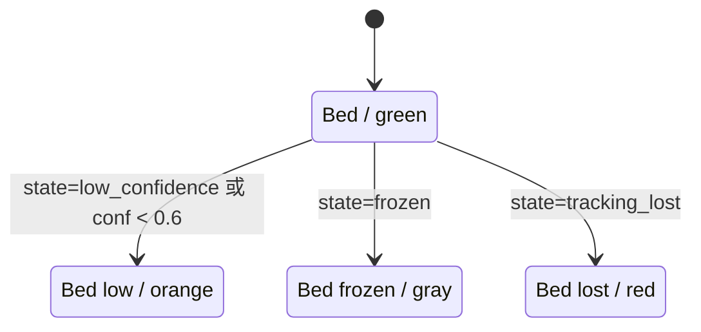

本页解释蹦床分析视频中的**覆盖层绘制路径**：后端逐帧把骨架、关节角度、统计面板、速度条、床面四边形、辅助检测线、最新落点和落点小地图绘制进输出视频；前端则在轮询结果中同步更新统计卡片与落点图。这里不展开跳次检测、动作分类、床面映射或 API 生命周期，只关注“可视化层如何消费已有分析结果并呈现”。Sources: [video_processor.py](video_processor.py#L253-L295), [overlay.py](trampoline/overlay.py#L32-L115), [video_analysis.js](static/js/video_analysis.js#L246-L272)

## 架构假设与验证结论

从第一原则看，覆盖层不是独立分析器，而是**分析结果的渲染投影**：`video_processor.py` 负责读取视频帧、调用 MediaPipe、维护 `current_stats`，然后把同一帧交给骨架绘制函数、角度弧线函数和蹦床覆盖层函数；`trampoline/overlay.py` 只根据传入的 `frame`、`stats` 与 `bed_info` 修改图像像素并返回帧，不承担检测决策。这个假设由处理循环中的顺序调用得到验证：先绘制骨架与角度，再按跳次分析采样更新统计，最后统一调用 `draw_trampoline_overlay(frame, current_stats, current_stats.get('bed_info'))`。Sources: [video_processor.py](video_processor.py#L250-L295), [overlay.py](trampoline/overlay.py#L32-L115)


上图中的关键边界是：骨架和角度直接依赖 `pose_results.pose_landmarks`，统计面板、速度、床面和落点依赖 `current_stats` 与 `bed_info`；因此覆盖层可以在没有新分析采样帧时继续使用上一帧统计值，而床面跟踪信息则在每帧尝试更新。Sources: [video_processor.py](video_processor.py#L244-L272), [video_processor.py](video_processor.py#L294-L299)

## 覆盖层模块的职责边界

`trampoline/overlay.py` 是蹦床专用的视频叠加模块，文件注释明确说明它替代通用统计叠加函数，并且所有尺寸会按视频尺寸比例缩放。模块内定义动作颜色、阶段颜色与参考宽度 `_REF_W = 640`，这些常量使同一套 UI 元素可以在不同分辨率视频上保持相对一致的视觉比例。Sources: [overlay.py](trampoline/overlay.py#L1-L30)

| 绘制元素 | 入口函数或位置 | 输入数据 | 输出位置/形态 |
|---|---|---|---|
| 统计面板 | `draw_trampoline_overlay` | `stats.jump_count/reps`、`phase`、`current_action` | 左上半透明信息盒 |
| 速度条 | `_draw_velocity_bar` | `stats.velocity` | 右侧垂直条 |
| 床面四边形 | `draw_bed_quad` | `bed_info.corners`、置信度、状态 | 视频中的床面区域 |
| 标记检测线 | `draw_marker_lines` | `bed_info.diagnostics.marker_lines` | 最多 8 条辅助线 |
| 最新落点 | `draw_landing_marker` | `stats.latest_landing.ankle_px` | 脚踝像素位置十字标 |
| 落点小地图 | `draw_bed_minimap` | `stats.landings[].norm_xy` | 右下角俯视小地图 |
| 角度弧线 | `draw_angle_arcs` | MediaPipe landmarks | 髋、膝关节附近弧线 |

这张表概括的是同一后端渲染层内的函数分工：`draw_trampoline_overlay` 是聚合入口，速度条、床面、落点和小地图由它进一步分派；骨架与角度弧线则由视频处理循环在进入聚合覆盖层之前直接调用。Sources: [overlay.py](trampoline/overlay.py#L32-L115), [overlay.py](trampoline/overlay.py#L191-L352), [video_processor.py](video_processor.py#L253-L255)

## 后端逐帧绘制顺序

处理循环对每一帧执行三类绘制。第一类是姿态可视化：当 MediaPipe 返回 `pose_landmarks` 时，先调用 `draw_skeleton` 绘制人体连线和关节点，再调用 `draw_angle_arcs` 在关节处绘制角度弧线。第二类是状态更新：每隔 `analyze_skip` 帧调用 `analyzer.process_frame`，把跳次、动作、阶段、速度、角度、落点写入 `current_stats` 和轮询结果。第三类是最终叠加：无论该帧是否触发分析采样，都调用 `draw_trampoline_overlay` 使用当前缓存状态完成统计、速度、床面和落点绘制。Sources: [video_processor.py](video_processor.py#L212-L233), [video_processor.py](video_processor.py#L253-L295)

```mermaid
sequenceDiagram
    participant Loop as process_video 循环
    participant Pose as MediaPipe Pose
    participant Draw as 绘制函数
    participant Analyzer as TrampolineAnalyzer
    participant Overlay as draw_trampoline_overlay
    participant Writer as 视频写出器

    Loop->>Pose: pose.process(rgb_frame)
    alt 检测到 pose_landmarks
        Loop->>Draw: draw_skeleton(frame, landmarks)
        Loop->>Draw: draw_angle_arcs(frame, landmarks)
        alt frame_count % analyze_skip == 0
            Loop->>Analyzer: process_frame(frame, landmarks, frame_count)
            Analyzer-->>Loop: jump/action/phase/velocity/landings
        end
    end
    Loop->>Overlay: draw_trampoline_overlay(frame, current_stats, bed_info)
    Overlay-->>Loop: 已修改 frame
    Loop->>Writer: append_data 或 out.write
```

这个时序说明了一个实现细节：覆盖层绘制是**原地修改帧**，后续写出器接收到的就是已经叠加了 UI 元素的图像；若使用 `imageio_writer`，帧会从 BGR 转为 RGB 写入，否则直接由 OpenCV `VideoWriter` 写入。Sources: [video_processor.py](video_processor.py#L294-L299)

## 骨架绘制：连接分组与可见性门控

骨架绘制函数 `draw_skeleton` 定义了三组连接：躯干连接、手臂连接和腿部连接，并通过 `visibility > 0.5` 判断某个关键点是否可绘制。每条骨架线使用“暗色粗线 + 主色线 + 提亮细线”的三层线条制造发光效果；可见关节点则绘制外层深色圆、中层绿色圆与中心白点，以便在处理后视频中突出关节位置。Sources: [video_processor.py](video_processor.py#L31-L74)

| 骨架区域 | 连接索引 | 颜色意图 | 可见性条件 |
|---|---|---|---|
| 躯干 | `(11,12)`, `(11,23)`, `(12,24)`, `(23,24)` | 蓝黄系主干 | 起点与终点均 `visibility > 0.5` |
| 手臂 | `(11,13)`, `(13,15)`, `(12,14)`, `(14,16)` | 绿色肢段 | 起点与终点均 `visibility > 0.5` |
| 腿部 | `(23,25)`, `(25,27)`, `(24,26)`, `(26,28)` | 红蓝系肢段 | 起点与终点均 `visibility > 0.5` |
| 关节点 | 11、12、13、14、15、16、23、24、25、26、27、28 | 深色外圈、绿色主体、白色中心 | 单点 `visibility > 0.5` |

这里的骨架绘制只消费 MediaPipe 的归一化坐标：`get_pos` 将 `lm.x * w` 与 `lm.y * h` 转换为像素坐标；函数不改变分析状态，也不参与动作判定。Sources: [video_processor.py](video_processor.py#L31-L45), [video_processor.py](video_processor.py#L57-L74)

## 角度弧线：髋膝局部几何标注

`draw_angle_arcs` 在四个关节局部绘制角度：左髋、右髋、左膝、右膝。每个角度由三点确定，函数先验证三个相关关键点的 `visibility > 0.4`，再把归一化坐标转为像素坐标，并用点积公式计算夹角度数。Sources: [overlay.py](trampoline/overlay.py#L231-L281)

角度弧线的颜色按角度分段：大于 135 度为绿色，大于 90 度为橙色，否则为红色；弧线使用 `cv2.ellipse` 绘制，角度数值标签放置在弧线中点外侧。这个函数同样只负责可视化标注，实际动作分类结果由分析器写入 `stats.current_action` 后再显示在统计面板中。Sources: [overlay.py](trampoline/overlay.py#L283-L312), [video_processor.py](video_processor.py#L257-L268)

## 统计面板：跳次、阶段、动作的视觉锚点

`draw_trampoline_overlay` 在左上角创建半透明深色矩形，并使用绿色强调条作为视觉锚点。面板内绘制三类文字：`JUMPS` 使用 `stats.jump_count`，如果缺失则回退到 `stats.reps`；`PHASE` 使用 `stats.phase` 并按 `PHASE_COLORS` 选择颜色；`ACTION` 使用 `stats.current_action` 并按 `ACTION_COLORS` 着色。Sources: [overlay.py](trampoline/overlay.py#L32-L92)

| 状态字段 | 默认值/回退 | 视觉编码 |
|---|---|---|
| `jump_count` | 回退到 `reps`，再回退到 `0` | 白色大号数字 |
| `phase` | 默认 `unknown` | 绿色 flight、橙色 contact、灰色 unknown |
| `current_action` | 默认 `Unknown` | Straight 绿色、Pike 蓝色系、Tuck 橙色系、Straddle 品红、Unknown 灰色 |

面板尺寸、边距、字体大小和线宽都通过内部缩放函数基于 `min(w, h)` 和 `_REF_W` 计算，因此覆盖层不会固定使用某个绝对像素布局。Sources: [overlay.py](trampoline/overlay.py#L37-L65)

## 速度条：右侧垂直方向的速度提示

速度条由 `_draw_velocity_bar` 绘制在视频右侧，先画半透明深色背景，再画中心零线。速度被限制到 `[-1.0, 1.0]` 的填充比例，计算方式是 `velocity / max_vel`，其中 `max_vel = 0.5`；正向填充向下绘制为红色系，负向填充向上绘制为绿色系。Sources: [overlay.py](trampoline/overlay.py#L315-L352)

这个速度条只读取 `stats.velocity`，而该字段由 `TrampolineAnalyzer.process_frame` 返回的 `detection["velocity"]` 写入 `current_stats`；因此速度条呈现的是跳次检测层已经计算好的速度状态，不在覆盖层内重新估计运动。Sources: [analyzer.py](trampoline/analyzer.py#L71-L86), [video_processor.py](video_processor.py#L257-L266)

## 床面四边形：置信度驱动的信任状态样式

床面覆盖层从 `bed_info` 中读取 `corners`、`tracking_confidence`、`tracking_state` 与 `message`，然后调用 `draw_bed_quad`。该函数要求角点存在且数量为 4，并验证所有坐标为有限值；通过验证后，会以低透明度填充四边形，再用对应颜色描边，并在第一个角点附近写入状态标签。Sources: [overlay.py](trampoline/overlay.py#L97-L107), [overlay.py](trampoline/overlay.py#L131-L151)

`bed_quad_style` 把床面跟踪状态映射为颜色与标签：`tracking_lost` 为红色 “Bed lost”，`frozen` 为灰色 “Bed frozen”，`low_confidence` 或置信度低于 0.6 为橙色 “Bed low”，否则为绿色 “Bed”。测试用例固定验证了不可靠状态不会复用可信绿色，并验证对应标签字符串。Sources: [overlay.py](trampoline/overlay.py#L118-L128), [test_trampoline_overlay.py](tests/test_trampoline_overlay.py#L1-L20)



这张状态图只描述覆盖层的视觉映射，不描述床面跟踪算法本身；关于床面跟踪和漂移修正，应继续阅读 [床面跟踪、置信度与漂移修正](17-chuang-mian-gen-zong-zhi-xin-du-yu-piao-yi-xiu-zheng)。Sources: [overlay.py](trampoline/overlay.py#L118-L151), [test_trampoline_overlay.py](tests/test_trampoline_overlay.py#L6-L19)

## 标记检测线：诊断信息的有限可视化

当 `bed_info.diagnostics.marker_lines` 存在时，`draw_trampoline_overlay` 会调用 `draw_marker_lines`。该函数最多绘制前 8 条线，尝试从每条记录的 `p1` 与 `p2` 读取两个坐标并四舍五入为整数；无效数据会被跳过，颜色在青色和品红之间交替。Sources: [overlay.py](trampoline/overlay.py#L106-L107), [overlay.py](trampoline/overlay.py#L154-L168)

这部分覆盖层的价值在于把床面跟踪诊断输出投射回视频画面，帮助开发者观察检测线与床面四边形是否一致；它不会改变床面角点，也不会反馈到分析状态。Sources: [overlay.py](trampoline/overlay.py#L154-L168)

## 最新落点：脚踝像素处的十字标

最新落点通过 `stats.latest_landing` 绘制：入口函数读取 `latest_landing.ankle_px`，并把整个落点对象和 `zone` 传给 `draw_landing_marker`。该函数要求脚踝像素至少包含两个数值，转换失败时直接返回；有效时在脚踝位置绘制水平和垂直十字线，并在旁边写入区域标签与置信度。Sources: [overlay.py](trampoline/overlay.py#L108-L110), [overlay.py](trampoline/overlay.py#L171-L188)

落点颜色同样由置信度分段：缺省或 `>= 0.6` 为绿色，`>= 0.35` 为橙色，低于该阈值为红色。落点数据的来源是在落地事件中由分析器计算：它使用左右脚踝可见性加权得到脚踝像素，再通过 `bed_tracker.landing_payload` 转换为落点 payload，并附加 `ankle_px`。Sources: [overlay.py](trampoline/overlay.py#L179-L187), [analyzer.py](trampoline/analyzer.py#L88-L111)

## 落点小地图：右下角俯视轨迹摘要

当 `stats.landings` 非空时，`draw_bed_minimap` 在右下角绘制一个自适应尺寸的小地图。它先建立半透明背景和床面矩形，再绘制中心横线与竖线；随后只遍历最近 20 个落点，读取每个落点的 `norm_xy`，将归一化坐标夹紧到 `[0, 1]`，映射到小地图矩形内部，并按置信度绘制圆点。Sources: [overlay.py](trampoline/overlay.py#L111-L113), [overlay.py](trampoline/overlay.py#L191-L229)

| 小地图规则 | 实现方式 |
|---|---|
| 最大历史长度 | `landings[-20:]` |
| 坐标来源 | `landing.norm_xy` |
| 坐标范围 | `max(0.0, min(1.0, value))` |
| 高置信颜色 | `confidence >= 0.6` 绿色 |
| 中置信颜色 | `confidence >= 0.35` 橙色 |
| 低置信颜色 | 低于 0.35 红色 |

后端小地图是写入处理后视频的像素覆盖层；它与前端页面右侧“落点图”使用同一类归一化落点数据，但渲染介质不同。Sources: [overlay.py](trampoline/overlay.py#L217-L228), [static/js/video_analysis.js](static/js/video_analysis.js#L160-L177)

## 前端落点图与实时统计同步

前端页面定义了实时统计卡片，包括跳次、当前跳滞空时间、动作和落点坐标置信度，并定义了独立的落点图容器 `landing-map` 与 `landing-map-bed`。这些 DOM 节点不绘制进视频像素，而是在分析轮询期间作为页面级辅助可视化呈现。Sources: [video_analysis.html](templates/video_analysis.html#L76-L106), [video_analysis.js](static/js/video_analysis.js#L18-L24)

前端通过 `updateStats` 消费轮询数据：跳次写入 `statReps`，`completed_jumps` 缓存在 `analysisResults.completedJumps`；随后调用 `resolveCompactStats` 推导当前滞空时间、动作和可用落点，再调用 `renderLandingMap`。如果当前 compact 落点不在落点数组中，前端会把它补入渲染列表。Sources: [video_analysis.js](static/js/video_analysis.js#L246-L272)

`renderLandingMap` 会过滤合法落点、保留最近 20 个、按 `norm_xy` 设置圆点的 `left` 与 `top` 百分比，并给最新点附加 `latest` 样式；CSS 中低置信点为红色、中置信点为黄色、最新点尺寸更大。Sources: [video_analysis.js](static/js/video_analysis.js#L160-L177), [video_analysis.css](static/css/video_analysis.css#L228-L283)

## 数据契约：覆盖层实际读取的字段

覆盖层读取的数据字段很少，但字段缺失时行为明确：统计面板有默认值，床面角点无效时不绘制，落点无效时不绘制，小地图无落点时不绘制。下面的表只列出本页相关字段，不包含完整分析结果契约。Sources: [overlay.py](trampoline/overlay.py#L67-L115), [overlay.py](trampoline/overlay.py#L131-L188), [overlay.py](trampoline/overlay.py#L191-L229)

| 数据对象 | 字段 | 使用位置 | 缺失/无效行为 |
|---|---|---|---|
| `stats` | `jump_count` / `reps` | 左上跳次 | 回退到 `0` |
| `stats` | `phase` | 阶段标签与颜色 | 回退到 `unknown` |
| `stats` | `current_action` | 动作标签与颜色 | 回退到 `Unknown` |
| `stats` | `velocity` | 右侧速度条 | 回退到 `0` |
| `stats` | `latest_landing.ankle_px` | 最新落点十字标 | 缺失或转换失败则跳过 |
| `stats` | `landings[].norm_xy` | 右下小地图 | 无落点则跳过小地图 |
| `bed_info` | `corners` | 床面四边形 | 非 4 点或非有限数则跳过 |
| `bed_info` | `tracking_confidence` / `tracking_state` | 床面颜色与标签 | 使用可信默认或状态映射 |
| `bed_info` | `diagnostics.marker_lines` | 标记检测线 | 无数据则跳过 |

这些字段由 `video_processor.py` 初始化并在分析采样帧更新：`current_stats` 初始包含跳次、动作、阶段、速度、床面信息、最新落点和落点列表；采样更新后，同步写入 `results`，供前端轮询读取。Sources: [video_processor.py](video_processor.py#L216-L233), [video_processor.py](video_processor.py#L257-L286)

## 分辨率适配与原地绘制策略

覆盖层采用统一的缩放思想：以 `ref = min(w, h)` 为当前视频尺度，以 `_REF_W = 640` 为参考尺度，将边距、面板尺寸、字体、线宽、速度条、小地图半径等转换为当前分辨率下的像素值。这样做使 720p 附近视频与更小或更大视频都使用相近的相对布局。Sources: [overlay.py](trampoline/overlay.py#L28-L49), [overlay.py](trampoline/overlay.py#L195-L216), [overlay.py](trampoline/overlay.py#L315-L324)

透明背景使用 `frame.copy()` 创建临时覆盖图，再通过 `cv2.addWeighted` 混合回原帧；统计面板、床面填充、小地图背景和速度条背景都采用这种方式。绘制完成后函数返回同一个已修改帧，处理循环再把它写入输出视频。Sources: [overlay.py](trampoline/overlay.py#L52-L59), [overlay.py](trampoline/overlay.py#L140-L143), [overlay.py](trampoline/overlay.py#L207-L213), [video_processor.py](video_processor.py#L294-L299)

## 测试保护点

当前覆盖层测试集中保护的是床面信任状态样式：可信状态必须是绿色，冻结、丢失和低置信状态不能与可信状态同色，并且标签必须分别为 “Bed frozen”、“Bed lost” 和 “Bed low”。这说明回归测试重点锁定了开发者最容易误判的视觉语义：不可靠床面不能被渲染成可信绿色。Sources: [test_trampoline_overlay.py](tests/test_trampoline_overlay.py#L1-L20)

对于中级开发者，修改覆盖层时应优先保持三个不变量：无效数据应跳过而不是抛出异常；不可靠床面与低置信落点必须有非绿色提示；所有像素布局应继续随视频尺寸缩放。Sources: [overlay.py](trampoline/overlay.py#L131-L151), [overlay.py](trampoline/overlay.py#L171-L188), [overlay.py](trampoline/overlay.py#L198-L229)

## 阅读路径

如果你需要理解覆盖层背后的床面角点和落点坐标来源，下一步阅读 [四角标定与关键帧补标](16-si-jiao-biao-ding-yu-guan-jian-zheng-bu-biao)、[床面跟踪、置信度与漂移修正](17-chuang-mian-gen-zong-zhi-xin-du-yu-piao-yi-xiu-zheng) 与 [图像坐标到床面坐标的映射](18-tu-xiang-zuo-biao-dao-chuang-mian-zuo-biao-de-ying-she)；如果你关注页面轮询和结果展示，则继续阅读 [分析进度轮询与结果展示](22-fen-xi-jin-du-lun-xun-yu-jie-guo-zhan-shi)。Sources: [analyzer.py](trampoline/analyzer.py#L88-L111), [video_analysis.js](static/js/video_analysis.js#L286-L320)