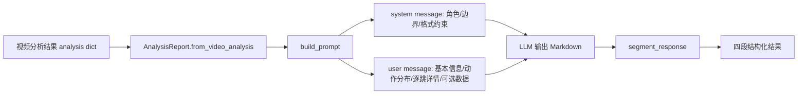
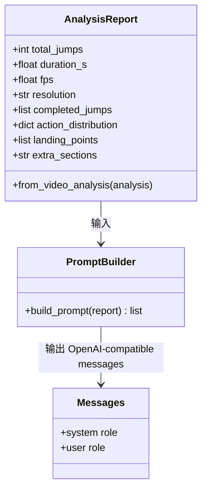

本页聚焦 AI 分析层中的**提示词构建与输出约束**：后端如何把蹦床分析结果转换为 OpenAI 兼容的 `messages`，系统提示词如何限制模型只能基于结构化数据回答，以及返回文本如何依赖固定 Markdown 标题被切分为结构化卡片。本页不展开 SSE 传输、缓存与双模型调度细节；这些内容属于下一页 [SSE 流式返回、缓存与双模型分析](26-sse-liu-shi-fan-hui-huan-cun-yu-shuang-mo-xing-fen-xi)。Sources: [llm_service.py](trampoline/llm_service.py#L1-L9), [app.py](app.py#L678-L700)

## 架构假设与验证结论

从第一性原理看，这一层的核心不是“让模型自由分析视频”，而是建立一个**结构化数据 → 受约束提示词 → 固定章节文本 → 可切分结果**的契约。代码验证显示，`AnalysisReport` 先从视频分析字典中提取总跳次、时长、帧率、分辨率、逐跳详情、动作分布与可选落点；`build_prompt()` 再把这些字段组织成 system/user 两条消息；最后 `segment_response()` 只识别四个固定标题：`整体表现`、`主要问题`、`逐跳点评`、`改进建议`。Sources: [llm_service.py](trampoline/llm_service.py#L20-L65), [llm_service.py](trampoline/llm_service.py#L95-L147), [llm_service.py](trampoline/llm_service.py#L278-L296)

上图表达的是本页的约束边界：`AnalysisReport` 负责把分析结果规整成报告模型，`build_prompt()` 负责把报告模型转换为模型输入，`segment_response()` 则假设模型遵守四段标题并据此做结果拆分。若模型没有输出某个标题，切分器不会补写内容，而是保留该段为空字符串。Sources: [llm_service.py](trampoline/llm_service.py#L37-L65), [llm_service.py](trampoline/llm_service.py#L95-L147), [llm_service.py](trampoline/llm_service.py#L281-L296)

## 输入报告模型：提示词的数据边界

`AnalysisReport` 是提示词的数据入口，它明确了 LLM 可以看到哪些字段：`total_jumps`、`duration_s`、`fps`、`resolution`、`completed_jumps` 和 `action_distribution` 是核心字段；`landing_points`、`form_scores`、`rotation_data` 与 `extra_sections` 是可扩展字段，其中当前构建流程实际会填充落点列表并支持额外文本段拼入提示词。Sources: [llm_service.py](trampoline/llm_service.py#L20-L35), [llm_service.py](trampoline/llm_service.py#L55-L65), [llm_service.py](trampoline/llm_service.py#L130-L142)

| 字段 | 来源/计算方式 | 在提示词中的用途 | 约束意义 |
|---|---|---|---|
| `total_jumps` | `analysis.get("reps", len(jumps))` | 视频基本信息中的总跳次 | 限定整体表现讨论范围 |
| `duration_s` | `total_frames / fps` 后四舍五入到 1 位 | 视频基本信息中的时长 | 避免模型自行估算时长 |
| `fps` | `analysis.get("fps", 30)` | 视频基本信息与滞空时间换算 | 给逐跳滞空数据提供上下文 |
| `resolution` | `analysis.get("resolution", "unknown")` | 视频基本信息 | 明确画面元数据来源 |
| `completed_jumps` | 原始逐跳列表加 `flight_duration_s` | 逐跳详情 | 逐跳点评只能围绕检测结果 |
| `action_distribution` | 排除 `is_intermediate` 后计数 | 动作分布 | 中间直跳不参与动作分布统计 |
| `landing_points` | 从带 `landing` 的逐跳结果提取 | 可选落点数据 | 只有存在落点时才进入提示词 |
| `extra_sections` | 默认为空字符串，可后续填充 | 补充数据 | 为未来指标扩展保留入口 |

表中的每个输入字段都来自本地代码，而非模型推理。尤其是动作分布会先过滤 `is_intermediate` 标记的中间直跳，再用 `Counter` 统计真实动作；每个逐跳项会补充 `flight_duration_s`，计算公式为 `flight_frames / fps` 并保留两位小数。Sources: [llm_service.py](trampoline/llm_service.py#L39-L54), [tests/test_llm_service.py](tests/test_llm_service.py#L39-L48)

## System Prompt：角色、事实边界与章节协议

系统提示词定义了模型的**身份、事实边界、语气和输出格式**。身份被限定为“专业的蹦床运动 AI 分析助手”；回答边界要求只能基于下方结构化分析数据，不猜测视频中未检测出的动作或问题；当数据不足时必须明确说明“数据不足”；语气要求专业但友好，面向运动员或教练。Sources: [llm_service.py](trampoline/llm_service.py#L70-L77), [tests/test_llm_service.py](tests/test_llm_service.py#L70-L78)

系统提示词还强制模型使用四个 Markdown 二级标题，且“不要增减或改名”：`## 整体表现`、`## 主要问题`、`## 逐跳点评`、`## 改进建议`。这不是展示层偏好，而是后端切分逻辑的前置契约，因为 `segment_response()` 只按这些标题名称提取对应内容。Sources: [llm_service.py](trampoline/llm_service.py#L78-L92), [llm_service.py](trampoline/llm_service.py#L278-L296)

| 约束类型 | 具体文本/行为 | 后端依赖 |
|---|---|---|
| 角色约束 | 专业蹦床运动 AI 分析助手 | 控制语气与领域 |
| 事实边界 | 只能基于结构化分析数据 | 降低幻觉风险 |
| 数据不足策略 | 明确说明“数据不足” | 避免编造未检测指标 |
| 受众语气 | 专业但友好，面向运动员或教练 | 保持解释可读性 |
| 标题协议 | 四个固定 `##` 标题，不增减、不改名 | 支撑 `segment_response()` 切分 |

这些约束也被单元测试锁定：测试会检查 system prompt 中包含“数据不足”、运动员或教练语境，以及 `整体表现`、`逐跳点评` 等固定章节词。换言之，提示词文本本身是受回归保护的接口，而不只是自然语言文案。Sources: [tests/test_llm_service.py](tests/test_llm_service.py#L70-L78)

## User Prompt：结构化数据如何被写入模型上下文

`build_prompt()` 生成的 user message 由三个基础段落组成：`视频基本信息`、`动作分布`、`逐跳详情`。基本信息写入总跳次、视频时长、帧率和分辨率；动作分布把 `action_distribution` 格式化为 `动作: N次`，若没有数据则写入“无数据”；逐跳详情逐行写入跳次编号、动作名称、滞空秒数、帧数，以及中间直跳标记。Sources: [llm_service.py](trampoline/llm_service.py#L97-L128)

逐跳详情中的落点信息是条件化拼接：只有当前跳跃字典存在 `landing` 时，才会加入床面坐标 `bed_xy_m`、区域 `zone` 和置信度 `confidence`；如果对应字段缺失，会使用 `"?"` 作为占位。这意味着提示词不会假装存在落点数据，但也会在有部分落点字段时保留可见上下文。Sources: [llm_service.py](trampoline/llm_service.py#L101-L111)

当 `report.landing_points` 存在时，user message 会追加 `## 落点数据`，逐条写入床面坐标、区域、距中心距离与置信度；当 `report.extra_sections` 非空时，会追加 `## 补充数据` 并原样拼入补充内容。测试覆盖了 `extra_sections` 会进入 user prompt 的行为。Sources: [llm_service.py](trampoline/llm_service.py#L130-L142), [tests/test_llm_service.py](tests/test_llm_service.py#L87-L93)

## Messages 契约：OpenAI 兼容的双消息结构

`build_prompt()` 最终返回一个两元素列表：第一条为 `{"role": "system", "content": _SYSTEM_PROMPT}`，第二条为 `{"role": "user", "content": user_content}`。这一结构直接被流式调用和同步调用复用，因此提示词构建逻辑在快模型、质量模型以及非流式质量调用中保持一致。Sources: [llm_service.py](trampoline/llm_service.py#L144-L147), [llm_service.py](trampoline/llm_service.py#L221-L229), [llm_service.py](trampoline/llm_service.py#L252-L260)

从实现角度看，提示词层没有直接调用前端，也不直接处理 SSE 事件；它只返回 OpenAI 兼容消息。调用方再把 `messages` 传给 `client.chat.completions.create()`，并决定是否 `stream=True`。Sources: [llm_service.py](trampoline/llm_service.py#L95-L147), [llm_service.py](trampoline/llm_service.py#L223-L229), [llm_service.py](trampoline/llm_service.py#L254-L260)

## 输出约束：四段 Markdown 是后端切分协议

输出必须严格使用四个 Markdown 二级标题，因为后端的 `segment_response()` 初始化了四个固定 key：`整体表现`、`主要问题`、`逐跳点评`、`改进建议`。函数会先把 `\n## ` 规范化为双换行前缀，再按 `"## "` 分割文本，并用 `startswith(heading)` 匹配标题。Sources: [llm_service.py](trampoline/llm_service.py#L278-L296)

| 模型输出情况 | `segment_response()` 行为 | 对页面结构的影响 |
|---|---|---|
| 四个标题全部存在 | 四个 key 都填入对应内容 | 可完整展示四段卡片 |
| 缺少某个标题 | 缺失标题对应值保持 `""` | 该段为空，不由后端补写 |
| 标题名称被改写 | 无法匹配固定 key | 改写段落不会进入目标字段 |
| 多行内容 | 保留在匹配段落内容中 | 支持段落式点评 |
| 标题前换行不一致 | 通过 `replace("\n## ", "\n\n## ")` 做有限规范化 | 提高常见 Markdown 输出的容错性 |

测试明确覆盖了三类切分行为：四段都存在时能全部提取；缺失章节时对应字段为空；多行内容会保留在同一章节中。因此，输出约束的可靠性主要来自“提示词要求固定标题”和“切分器只接受固定标题”的双重约束。Sources: [tests/test_llm_service.py](tests/test_llm_service.py#L110-L131), [llm_service.py](trampoline/llm_service.py#L281-L296)

## 约束强度与失效边界

当前设计的强约束点在于：system prompt 明确禁止猜测、要求数据不足时说明“数据不足”、固定四段标题；user prompt 只写入结构化字段；测试会验证提示词包含关键约束，并验证输出切分的基本行为。Sources: [llm_service.py](trampoline/llm_service.py#L70-L92), [llm_service.py](trampoline/llm_service.py#L116-L147), [tests/test_llm_service.py](tests/test_llm_service.py#L62-L93)

当前设计的边界也很清晰：`segment_response()` 不做语义纠错，不会把“总体表现”自动映射到“整体表现”，也不会在缺失章节时生成默认建议；它只做标题匹配和内容提取。若需要更强的输出契约，应在提示词协议之外引入更严格的结构化输出机制，但这不是当前代码实现。Sources: [llm_service.py](trampoline/llm_service.py#L278-L296), [tests/test_llm_service.py](tests/test_llm_service.py#L119-L124)

## 扩展提示词时的安全路径

如果要给 AI 分析加入新指标，当前代码提供了两条已存在的扩展路径：一是在 `AnalysisReport` 上增加结构化字段，二是通过 `extra_sections` 把补充数据拼入 user prompt。历史集成文档也明确记录了 `extra_sections` 可拼入未来数据，并指出后续落点分析或动作评分可通过扩展 `AnalysisReport` 与补充数据进入提示词。Sources: [llm_service.py](trampoline/llm_service.py#L30-L35), [llm_service.py](trampoline/llm_service.py#L141-L142), [2026-04-03-LLM解释层集成.md](trampoline/docs/2026-04-03-LLM解释层集成.md#L44-L50), [2026-04-03-LLM解释层集成.md](trampoline/docs/2026-04-03-LLM解释层集成.md#L64-L66)

扩展时应避免随意修改四个固定标题，因为它们同时出现在 system prompt、切分器和测试断言中；若确实要增加第五个章节，需要同步修改 `_SYSTEM_PROMPT`、`_SECTION_HEADINGS`、相关切分测试，以及依赖这些 section key 的展示逻辑。Sources: [llm_service.py](trampoline/llm_service.py#L78-L92), [llm_service.py](trampoline/llm_service.py#L278-L296), [tests/test_llm_service.py](tests/test_llm_service.py#L70-L78), [tests/test_llm_service.py](tests/test_llm_service.py#L110-L131)

## 阅读路径

理解本页后，建议先回看 [结构化分析报告模型](24-jie-gou-hua-fen-xi-bao-gao-mo-xing)，把 `AnalysisReport` 的输入语义与上游分析结果对应起来；然后继续阅读 [SSE 流式返回、缓存与双模型分析](26-sse-liu-shi-fan-hui-huan-cun-yu-shuang-mo-xing-fen-xi)，理解这些提示词消息如何被快模型流式输出、质量模型同步生成，并在完成后切分与缓存。Sources: [llm_service.py](trampoline/llm_service.py#L20-L65), [app.py](app.py#L654-L700)