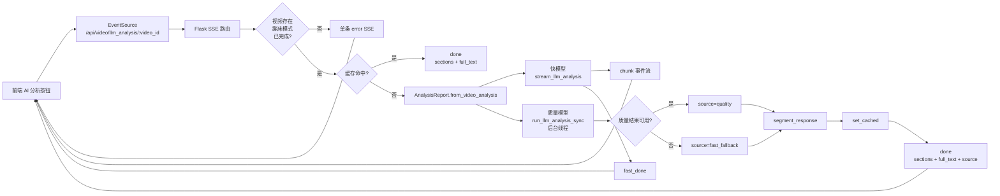

**架构假设**：本页关注的 AI 分析层不是一个单次 JSON API，而是一个围绕 `GET /api/video/llm_analysis/<video_id>` 构建的流式解释通道；后端先校验视频分析状态，再把已完成的蹦床分析结果转换为 `AnalysisReport`，随后以“快模型流式输出 + 质量模型后台同步生成”的双模型策略提供即时反馈与最终结果，并用内存 TTL 缓存避免同一视频重复调用模型。Sources: [app.py](app.py#L606-L705), [llm_service.py](trampoline/llm_service.py#L198-L322)

## 范围定位

本页位于“AI 分析层”的第三个解释页，边界限定在 **SSE 返回协议、缓存语义、双模型调度、前端 EventSource 消费方式**；结构化报告如何形成属于 [结构化分析报告模型](24-jie-gou-hua-fen-xi-bao-gao-mo-xing)，提示词格式约束属于 [提示词构建与输出约束](25-ti-shi-ci-gou-jian-yu-shu-chu-yue-shu)，这里仅在必要处把它们作为 SSE 输入前置条件引用。Sources: [llm_service.py](trampoline/llm_service.py#L20-L65), [llm_service.py](trampoline/llm_service.py#L95-L147), [app.py](app.py#L654-L700)

## 概念关系图

下面的 Mermaid 图展示这一页的核心关系：浏览器通过 `EventSource` 建立 SSE 连接；Flask 路由执行前置校验与缓存检查；未命中缓存时，快模型负责持续产出 `chunk`，质量模型在后台线程生成最终文本；最终文本被分段、写入缓存，并通过 `done` 事件返回给前端卡片。Sources: [app.py](app.py#L606-L705), [static/js/video_analysis.js](static/js/video_analysis.js#L521-L570)

## SSE 路由入口与前置约束

`/api/video/llm_analysis/<video_id>` 是一个 `GET` 路由，它始终用 `text/event-stream` 作为返回媒体类型；辅助函数 `sse_message()` 会把错误或一次性响应包装成 `data: <json>\n\n` 的 SSE 帧，并设置 `Cache-Control: no-cache` 与 `X-Accel-Buffering: no`，使代理层和浏览器侧都按流式语义处理。Sources: [app.py](app.py#L606-L618)

路由在真正调用 LLM 前按顺序检查三类条件：`video_id` 必须存在，`analysis.mode` 必须是 `trampoline`，`analysis.status` 必须是 `completed`；任一条件不满足时，后端不会发起模型调用，而是返回单条 `type: error` 的 SSE 消息。Sources: [app.py](app.py#L620-L627)

服务模块导入失败与 API Key 缺失也在路由层提前短路：导入 `trampoline.llm_service` 失败会返回 “LLM service not available”，`resolve_api_key()` 返回空字符串会返回 “LLM API key not configured”，这意味着前端看到的仍然是 SSE 消息，而不是传统 JSON 错误响应。Sources: [app.py](app.py#L628-L645), [llm_service.py](trampoline/llm_service.py#L161-L168)

## SSE 事件契约

后端实际发出的事件以 JSON 的 `type` 字段区分语义：`chunk` 表示快模型增量文本，`fast_done` 表示快模型流已结束且正在等待高质量结果，`done` 表示最终分段结果可用，`error` 表示校验、调用或双模型失败。Sources: [app.py](app.py#L675-L700), [static/js/video_analysis.js](static/js/video_analysis.js#L521-L562)

| 事件类型 | 触发位置 | 载荷字段 | 前端行为 |
|---|---|---|---|
| `chunk` | 快模型每个清洗后的增量片段 | `text` | 追加到流式原文区域并滚动到底部 |
| `fast_done` | 快模型流结束后 | 无额外业务字段 | 将状态文案改为“正在生成高质量分析...” |
| `done` | 最终文本分段并缓存后，或缓存命中时 | `sections`, `full_text`, 可选 `source` | 关闭 EventSource，填充四张 AI 卡片，显示“展开原文”按钮 |
| `error` | 前置校验失败、模型失败或异常 | `message` | 关闭 EventSource，在流式区域追加红色错误文本 |

该表对应的关键实现点是：前端只监听标准 `onmessage`，没有使用自定义 SSE event name；因此服务端每个消息都以 `data:` 行承载 JSON，而不是 `event:` + `data:` 的命名事件格式。Sources: [app.py](app.py#L610-L618), [static/js/video_analysis.js](static/js/video_analysis.js#L523-L570)

## 双模型调度模式

双模型策略以 `resolve_models()` 为配置入口，返回 `(fast_model, quality_model)`；默认快模型是 `deepseek-v4-flash`，默认质量模型是 `deepseek-v4-pro`，并支持通过 DeepSeek、DS、Qwen 命名体系的环境变量覆盖。Sources: [llm_service.py](trampoline/llm_service.py#L181-L195), [tests/test_llm_service.py](tests/test_llm_service.py#L183-L211)

| 角色 | 默认模型 | 覆盖变量优先级 | 调用方式 |
|---|---:|---|---|
| 快模型 | `deepseek-v4-flash` | `DEEPSEEK_FAST_MODEL` → `DS_FAST_MODEL` → `QWEN_FAST_MODEL` | `stream_llm_analysis(..., stream=True)` |
| 质量模型 | `deepseek-v4-pro` | `DEEPSEEK_MODEL` → `DS_PRO_MODEL` → `QWEN_MODEL` | `run_llm_analysis_sync(..., stream=False)` |

在未命中缓存时，路由创建 `quality_result` 共享字典，然后启动一个 daemon 线程运行质量模型；与此同时，主生成器立即进入快模型流式循环，把每个 `raw_chunk` 经 `clean_chunk()` 处理后作为 `chunk` 推给前端。Sources: [app.py](app.py#L656-L683), [llm_service.py](trampoline/llm_service.py#L198-L234)

快模型结束后，服务端先发送 `fast_done`，再等待质量线程最多 120 秒；若质量模型产出有效文本，最终结果来源标记为 `quality`，否则在快模型文本存在且不是 `[ERROR]` 开头时使用 `fast_fallback`，两者都不可用时发送 `type: error` 且消息为“两个模型均调用失败”。Sources: [app.py](app.py#L685-L700)

这种模式的关键收益是 **首屏响应速度与最终质量解耦**：快模型的文本先进入用户可见的流式区域，质量模型结果晚到后成为卡片化最终报告；前端当前只使用 `sections` 填充卡片，并未展示 `source` 字段。Sources: [app.py](app.py#L688-L700), [static/js/video_analysis.js](static/js/video_analysis.js#L534-L555)

## LLM 客户端调用与错误语义

`stream_llm_analysis()` 是快模型的 OpenAI-compatible 流式客户端：它延迟导入 `openai`，解析 API Key、Base URL 和模型名，构造 messages 后调用 `client.chat.completions.create(..., stream=True)`，并逐个 yield `chunk.choices[0].delta.content`。Sources: [llm_service.py](trampoline/llm_service.py#L198-L232)

`run_llm_analysis_sync()` 是质量模型的同步客户端：它使用相同的 API Key、Base URL 与 prompt 构造逻辑，但调用 `stream=False`，最终返回 `response.choices[0].message.content`；导入失败、缺少 API Key 或调用异常都以 `[ERROR] ...` 字符串表达。Sources: [llm_service.py](trampoline/llm_service.py#L237-L263)

依赖层面，项目显式声明 `openai>=1.0.0`，注释标明这是用于 OpenAI-compatible API 的 LLM integration；因此该服务并不直接绑定某个 SDK 专有协议，而是通过 OpenAI 兼容接口接入不同模型供应方。Sources: [requirements.txt](requirements.txt#L10-L11), [llm_service.py](trampoline/llm_service.py#L171-L178)

## 配置解析优先级

API Key 解析使用 `_first_env()` 的“第一个非空环境变量”策略，优先级依次为 `DEEPSEEK_API_KEY`、`DS_API_KEY`、`QWEN_API_KEY`、`DASHSCOPE_API_KEY`；对应测试覆盖了 DeepSeek 优先、DS 回退、Qwen 回退、DashScope 回退以及无 Key 返回空字符串。Sources: [llm_service.py](trampoline/llm_service.py#L152-L168), [tests/test_llm_service.py](tests/test_llm_service.py#L147-L180)

Base URL 解析优先读取 `DEEPSEEK_BASE_URL`、`DS_BASE_URL`、`QWEN_BASE_URL`，默认值是 `https://api.deepseek.com`；模型名解析则把快模型和质量模型分开处理，使“低延迟流式预览”和“最终质量报告”可以独立调参。Sources: [llm_service.py](trampoline/llm_service.py#L171-L195)

| 配置项 | 环境变量优先级 | 默认值 |
|---|---|---|
| API Key | `DEEPSEEK_API_KEY` → `DS_API_KEY` → `QWEN_API_KEY` → `DASHSCOPE_API_KEY` | 空字符串 |
| Base URL | `DEEPSEEK_BASE_URL` → `DS_BASE_URL` → `QWEN_BASE_URL` | `https://api.deepseek.com` |
| 快模型 | `DEEPSEEK_FAST_MODEL` → `DS_FAST_MODEL` → `QWEN_FAST_MODEL` | `deepseek-v4-flash` |
| 质量模型 | `DEEPSEEK_MODEL` → `DS_PRO_MODEL` → `QWEN_MODEL` | `deepseek-v4-pro` |

配置表中的优先级全部来自服务函数实现；测试重点覆盖 API Key 与模型名解析，没有单独覆盖 Base URL。Sources: [llm_service.py](trampoline/llm_service.py#L152-L195), [tests/test_llm_service.py](tests/test_llm_service.py#L147-L211)

## 流式文本清洗与最终分段

`clean_chunk()` 只执行一个边界清洗规则：当上一个 chunk 以换行结尾且当前 chunk 以换行开头时，去掉当前 chunk 开头的连续换行，以避免流式拼接时产生重复空行；空 chunk 或 `None` 会被转换为空字符串并跳过。Sources: [llm_service.py](trampoline/llm_service.py#L268-L275), [tests/test_llm_service.py](tests/test_llm_service.py#L95-L108)

最终文本通过 `segment_response()` 按固定四个二级标题切分：`整体表现`、`主要问题`、`逐跳点评`、`改进建议`；函数先把 `\n## ` 规范化为 `\n\n## `，再按 `"## "` 拆分，并把缺失段落保留为空字符串。Sources: [llm_service.py](trampoline/llm_service.py#L278-L296), [tests/test_llm_service.py](tests/test_llm_service.py#L110-L131)

前端卡片与这四个标题一一对应：`整体表现` 映射到 `llm-card-overview`，`主要问题` 映射到 `llm-card-issues`，`逐跳点评` 映射到 `llm-card-details`，`改进建议` 映射到 `llm-card-suggestions`；若某段为空，前端显示“AI 未生成此部分”。Sources: [static/js/video_analysis.js](static/js/video_analysis.js#L538-L550), [templates/video_analysis.html](templates/video_analysis.html#L128-L144)

## 缓存语义

LLM 缓存是进程内字典 `_llm_cache`，键为 `video_id`，值包含 `full_text`、`sections` 与 `timestamp`；TTL 固定为 1800 秒，也就是 30 分钟。Sources: [llm_service.py](trampoline/llm_service.py#L299-L322)

`get_cached(video_id)` 命中且未过期时直接返回缓存项；如果缓存存在但超时，会删除该条目并返回 `None`，从而让后续请求重新进入双模型调用路径。Sources: [llm_service.py](trampoline/llm_service.py#L305-L312)

路由层在构造 `AnalysisReport` 之前检查缓存；命中时直接发送单条 `done` 事件，载荷包含 `sections` 与 `full_text`，但不包含正常双模型完成路径中的 `source` 字段。Sources: [app.py](app.py#L647-L654), [app.py](app.py#L698-L700)

缓存写入发生在最终文本完成分段之后：无论最终来源是质量模型还是快模型 fallback，只要进入 `done` 路径，后端都会调用 `set_cached(video_id, final_text, sections)`，随后发送最终 SSE 消息。Sources: [app.py](app.py#L688-L700), [llm_service.py](trampoline/llm_service.py#L315-L322)

## 前端消费模型

前端在 AI 按钮点击后会禁用按钮、清空流式区域、隐藏结果卡片、关闭旧的 `EventSource`，然后创建新的 `EventSource('/api/video/llm_analysis/' + currentVideoId)`；这使同一页面上重复点击不会保留上一条 SSE 连接。Sources: [static/js/video_analysis.js](static/js/video_analysis.js#L505-L523)

收到 `chunk` 时，前端用 `simpleMd()` 将增量 Markdown 做轻量 HTML 转换后追加到 `llmStreamingText`；收到 `fast_done` 时，前端把状态栏更新为“正在生成高质量分析...”，对应后端已经结束快模型流、正在等待质量模型最终文本的阶段。Sources: [static/js/video_analysis.js](static/js/video_analysis.js#L124-L129), [static/js/video_analysis.js](static/js/video_analysis.js#L526-L533)

收到 `done` 时，前端关闭 SSE 连接，把四个 `sections` 填入卡片，折叠流式原文区，显示卡片区和“展开原文”按钮，并重新启用 AI 按钮；收到 `error` 或底层 `onerror` 时，也会关闭连接并恢复按钮可用状态。Sources: [static/js/video_analysis.js](static/js/video_analysis.js#L534-L570)

页面结构上，AI 分析区域包含启动按钮、流式文本容器、四张分段卡片和原文展开按钮；这些 DOM 元素决定了 SSE 的用户体验不是“下载一份报告”，而是“先看流式原文，再看结构化卡片”。Sources: [templates/video_analysis.html](templates/video_analysis.html#L116-L147)

## 模式对比

| 维度 | 快模型流式路径 | 质量模型最终路径 | 缓存命中路径 |
|---|---|---|---|
| 启动时机 | 未命中缓存后立即启动 | 未命中缓存后后台线程启动 | 路由检查缓存后立即返回 |
| 输出事件 | 多个 `chunk`，随后 `fast_done` | 最终参与 `done` | 单个 `done` |
| 模型调用 | `stream=True` | `stream=False` | 不调用模型 |
| 前端可见性 | 原文区域实时增长 | 卡片区最终刷新 | 卡片区直接刷新 |
| 失败后角色 | 可作为 fallback | 优先作为最终结果 | 不涉及模型失败 |

这三条路径共同构成了当前 AI 分析的性能策略：快模型降低等待感，质量模型提升最终文本质量，缓存降低重复请求成本；实现中没有持久化缓存或跨进程共享缓存，缓存作用域就是当前 Python 进程内的 `_llm_cache`。Sources: [app.py](app.py#L647-L700), [llm_service.py](trampoline/llm_service.py#L299-L322)

## 验证依据

测试文件覆盖了 AI 层的关键纯函数契约：`AnalysisReport.from_video_analysis()` 会补充滞空秒数并排除中间跳的动作分布，`build_prompt()` 返回 system/user 两条消息，`clean_chunk()` 处理重复换行，`segment_response()` 在缺失段落时返回空字符串，缓存函数可 set/get，环境变量解析具有明确优先级。Sources: [tests/test_llm_service.py](tests/test_llm_service.py#L30-L146), [tests/test_llm_service.py](tests/test_llm_service.py#L147-L223)

与本页最直接相关的回归保护集中在缓存、配置解析、同步调用无 API Key 错误和分段逻辑；SSE 路由与前端 EventSource 行为在当前文件中没有逐行测试展示，因此本文仅依据实现代码描述其运行契约。Sources: [tests/test_llm_service.py](tests/test_llm_service.py#L133-L223), [app.py](app.py#L606-L705), [static/js/video_analysis.js](static/js/video_analysis.js#L505-L570)

## 阅读建议

若需要理解 `done.sections` 中四个字段为什么固定为“整体表现、主要问题、逐跳点评、改进建议”，请回读 [提示词构建与输出约束](25-ti-shi-ci-gou-jian-yu-shu-chu-yue-shu)；若需要理解这些字段依赖的跳次、动作、落点数据如何进入 `AnalysisReport`，请回读 [结构化分析报告模型](24-jie-gou-hua-fen-xi-bao-gao-mo-xing)。Sources: [llm_service.py](trampoline/llm_service.py#L70-L147), [llm_service.py](trampoline/llm_service.py#L20-L65)

继续向后阅读时，建议进入 [测试体系与回归保护](27-ce-shi-ti-xi-yu-hui-gui-bao-hu)，因为 SSE、缓存和双模型分析的稳定性依赖于服务函数、配置解析和前端契约的共同回归；若关注异常路径和资源边界，则继续阅读 [错误处理、资源清理与上传限制](28-cuo-wu-chu-li-zi-yuan-qing-li-yu-shang-chuan-xian-zhi)。Sources: [tests/test_llm_service.py](tests/test_llm_service.py#L1-L228), [app.py](app.py#L606-L705)