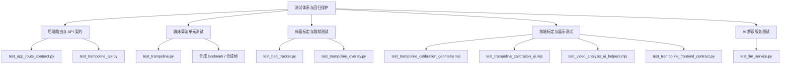

本页说明当前仓库如何用 **Python pytest 合约测试、算法单元测试、前端 Node 模块测试、模板/脚本一致性检查** 来保护蹦床视频分析主链路的回归风险。我的验证假设是：测试体系不是单一“跑通”脚本，而是围绕接口契约、床面标定、跳次与动作算法、覆盖层可视状态、AI 解读服务和前端交互边界分层布防；代码检查确认，`tests/` 下的测试文件分别覆盖这些边界，并且 README 已列出对应的常用验证命令。Sources: [README.md](README.md#L114-L128), [test_app_route_contract.py](tests/test_app_route_contract.py#L6-L16), [test_trampoline_api.py](tests/test_trampoline_api.py#L1-L20)

## 回归保护的总体结构

当前测试体系可以从第一性原理拆成三类保护：**入口契约保护**确保页面和 API 的行为没有偏离蹦床模式；**核心计算保护**用合成数据验证跳次检测、动作分类、床面映射和跟踪容错；**前端交互保护**用 Node 直接测试几何转换、标定 UI 状态和紧凑统计展示逻辑。测试根目录通过 `tests/conftest.py` 将仓库根目录插入 `sys.path`，使测试可以直接导入 `app.py` 与 `trampoline/` 模块。Sources: [conftest.py](tests/conftest.py#L1-L8), [test_trampoline.py](tests/test_trampoline.py#L1-L13), [test_trampoline_calibration_geometry.mjs](tests/test_trampoline_calibration_geometry.mjs#L1-L10)



这张图表达的是测试层之间的职责边界：路由/API 测试保护外部契约，算法测试保护内部判定逻辑，床面测试保护坐标与跟踪可信度，前端测试保护用户标定与展示状态，LLM 测试保护报告结构、提示词、缓存和配置解析。Sources: [test_app_route_contract.py](tests/test_app_route_contract.py#L19-L34), [test_bed_tracker.py](tests/test_bed_tracker.py#L36-L49), [test_llm_service.py](tests/test_llm_service.py#L30-L60), [test_video_analysis_ui_helpers.mjs](tests/test_video_analysis_ui_helpers.mjs#L6-L22)

## 测试分层与覆盖对象

| 测试层 | 代表文件 | 主要保护对象 | 回归信号 |
|---|---|---|---|
| 页面与路由契约 | `test_app_route_contract.py` | 保留页面、删除的健身端点、蹦床默认模式、上传错误分支、SSE 路由存在性 | 状态码、页面文案、禁用端点泄漏 |
| 蹦床 API 生命周期 | `test_trampoline_api.py` | 上传后待标定状态、运行时状态字段、启动幂等、标定 sidecar、过期清理、重复关键帧拒绝 | JSON 字段、状态迁移、文件副作用 |
| 算法核心 | `test_trampoline.py` | 角度计算、跳次阶段、动作分类、滞回、投票、分析器状态、落点集成 | 合成 landmark 下的状态和输出字段 |
| 床面与覆盖层 | `test_bed_tracker.py` / `test_trampoline_overlay.py` | 图像到床面映射、落区分类、角点校验、跟踪漂移拒绝、ORB 重定位、minimap、可信状态样式 | 坐标近似、诊断原因、颜色/标签 |
| 前端标定与展示 | `.mjs` 与 `test_trampoline_frontend_contract.py` | contain 几何、关键帧 payload、UI 状态、模板 ID、脚本加载、紧凑统计 | Node 断言、DOM 契约、HTML/CSS/JS 字符串 |
| AI 解读服务 | `test_llm_service.py` | 结构化报告、提示词、响应分段、缓存、API key 与模型解析、无 key 错误 | 数据结构、文本片段、环境变量优先级 |

Sources: [test_app_route_contract.py](tests/test_app_route_contract.py#L19-L97), [test_trampoline_api.py](tests/test_trampoline_api.py#L53-L74), [test_trampoline.py](tests/test_trampoline.py#L63-L83), [test_bed_tracker.py](tests/test_bed_tracker.py#L36-L63), [test_trampoline_frontend_contract.py](tests/test_trampoline_frontend_contract.py#L7-L19), [test_llm_service.py](tests/test_llm_service.py#L147-L180)

## 后端路由契约保护

路由契约测试首先确认保留页面 `'/','/dashboard','/profile','/video_analysis','/video_analysis?mode=trampoline'` 均返回 200，并且页面中保留“蹦床”或“视频分析”语义，同时排除旧的 `Fitness Trainer` 和 `Select Exercise` 文案；这类测试的价值在于保护“去健身化”后的页面入口不被旧模式重新污染。Sources: [test_app_route_contract.py](tests/test_app_route_contract.py#L6-L27)

同一个文件还显式列出已删除的健身相关端点，例如 `/video_feed`、`/stop_camera`、`/start_exercise`、`/get_status`、`/api/profile/update`、`/api/video/analyze_frame`，并逐一断言返回 404；随后又扫描保留模板和 `static/js/video_analysis.js`，确认这些旧端点字符串没有泄漏到前端源码。Sources: [test_app_route_contract.py](tests/test_app_route_contract.py#L7-L16), [test_app_route_contract.py](tests/test_app_route_contract.py#L30-L35), [test_app_route_contract.py](tests/test_app_route_contract.py#L76-L97)

上传入口的负向契约也被固定：缺少视频文件时 `/api/video/upload` 返回 400 和 `No video file provided`，传入非 `trampoline` 的 `exercise_type` 时返回 400 和 `Only trampoline uploads are supported`；这直接保护上传接口只服务当前蹦床分析范围。Sources: [test_app_route_contract.py](tests/test_app_route_contract.py#L48-L65)

LLM 分析路由作为保留能力也有契约检查：对未知 `video_id` 请求 `/api/video/llm_analysis/unknown-video-id` 时，测试断言 HTTP 状态为 200、响应 mimetype 为 `text/event-stream`，并包含 `Video ID not found` 错误文本，从而保护 SSE 错误返回路径不被普通 JSON 或非流式响应替换。Sources: [test_app_route_contract.py](tests/test_app_route_contract.py#L67-L73)

## 蹦床 API 生命周期保护

`test_trampoline_api.py` 使用 `autouse` fixture 隔离上传目录、清空 `video_analyses`，并用 monkeypatch 将 `process_video_subprocess` 替换为空函数；因此这些 API 测试验证的是 Flask 生命周期和状态字段，不会真正启动视频处理子进程。Sources: [test_trampoline_api.py](tests/test_trampoline_api.py#L14-L20)

上传成功后的契约被固定为“先上传、待标定”：测试构造 64×64、5 帧、5 FPS 的临时 MP4，调用 `/api/video/upload` 后断言 `success=True`、`status=uploaded_pending_calibration`、存在 `video_id`、首帧 data URL、首帧 base64、图像尺寸、FPS、总帧数和 `corner_order`。Sources: [test_trampoline_api.py](tests/test_trampoline_api.py#L23-L50), [test_trampoline_api.py](tests/test_trampoline_api.py#L53-L74)

状态查询的回归保护覆盖运行时增量字段：测试手动向 `video_analyses[video_id]` 注入 `phase`、`current_flight_frames`、`current_flight_duration_s`、`latest_landing`、`landings`、`fps` 等字段，再请求 `/api/video/status/<video_id>`，断言这些字段被原样暴露，并且仍保留 `video_fps` 和 `completed_jumps`。Sources: [test_trampoline_api.py](tests/test_trampoline_api.py#L76-L109)

启动分析的幂等保护体现在三种分支：第一次提交有效四角标定会进入 `processing` 并写入 `{video_id}_corners.json`；重复提交相同角点仍成功；处理中的同一视频如果角点发生变化则返回 409；而已完成状态下即使提交不同角点，也返回已有 `completed` 结果。Sources: [test_trampoline_api.py](tests/test_trampoline_api.py#L143-L160), [test_trampoline_api.py](tests/test_trampoline_api.py#L162-L176)

标定 sidecar 的回归保护已经扩展到多关键帧：测试提交乱序的 `calibrations`，断言响应中的 `calibration_count` 为 2，写入文件的 `schema_version` 为 2，并且 sidecar 内的关键帧按 `frame_index` 排序；重复关键帧则被拒绝为 400，并把分析状态置为 `calibration_rejected`。Sources: [test_trampoline_api.py](tests/test_trampoline_api.py#L198-L220), [test_trampoline_api.py](tests/test_trampoline_api.py#L222-L238)

待标定上传的资源清理也被纳入回归保护：测试构造一个超过 TTL 的 orphan 视频和对应 `_corners.json`，调用 `cleanup_expired_pending_trampoline_uploads` 后断言返回过期 ID、状态改为 `expired`，并删除视频和 sidecar 文件。Sources: [test_trampoline_api.py](tests/test_trampoline_api.py#L178-L195)

## 算法单元测试：跳次、动作与分析器

算法测试使用合成 landmark，而不是依赖 MediaPipe 实时推理。`make_landmark` 构造带 `x/y/visibility` 的 mock landmark，`make_landmarks_at_y` 构造 33 点姿态数组并设置髋、踝、肩、膝等关键点位置；这让跳次和动作分类测试可以在确定性输入下运行。Sources: [test_trampoline.py](tests/test_trampoline.py#L16-L60)

角度基础函数 `_angle_between` 有独立测试：三点共线接近 180 度、直角接近 90 度、锐角接近 45 度；这些测试保护动作分类依赖的几何基础不发生静默偏移。Sources: [test_trampoline.py](tests/test_trampoline.py#L63-L75)

跳次检测测试覆盖初始状态、运动阶段和缺失关键点容错：`JumpDetector(fps=30.0)` 初始 phase 为 `contact`、跳次为 0；模拟下降再上升的帧序列后仍可确认接触状态；低可见度 landmark 输入不会崩溃，并返回 `event=None` 与 `phase=contact`。Sources: [test_trampoline.py](tests/test_trampoline.py#L78-L98), [test_trampoline.py](tests/test_trampoline.py#L164-L170)

完整跳次周期测试用多段合成运动模拟“静止接触 → 加速上升 → 减速上升 → 峰值下降 → 减速下降 → 床面反弹”，并以速度极值为起跳和落地检测依据，最终断言至少检测到一次跳次；这类测试保护的是分段状态机在连续帧输入下的时序行为。Sources: [test_trampoline.py](tests/test_trampoline.py#L99-L162)

动作分类测试覆盖 `Straight`、`Tuck/Pike`、`Straddle`、滞回、不可见关键点回退和多数投票。具体断言包括：飞行阶段直体姿态返回 `STRAIGHT`，团身样例返回 `TUCK` 或 `PIKE`，腿部分开姿态返回 `STRADDLE`，重复直体或分腿输入保持当前状态，连续无效帧后回到 `UNKNOWN`，每跳分类列表通过多数投票得到最终动作。Sources: [test_trampoline.py](tests/test_trampoline.py#L173-L224), [test_trampoline.py](tests/test_trampoline.py#L226-L335)

`TrampolineAnalyzer` 测试保护分析器输出结构和实时字段：初始状态包含 `counter=0`、`current_action=Unknown`、`form_score=100`；单帧处理结果必须包含 `jump_count`、`current_action`、`phase`、`velocity`、`completed_jumps`、`current_flight_frames`、`current_flight_duration_s`、`latest_landing`、`landings` 等字段。Sources: [test_trampoline.py](tests/test_trampoline.py#L337-L360)

实时滞空字段的测试明确要求“新增运行时字段不改变跳次分割”：在模拟进入飞行阶段后，断言 `jump_count` 仍为 0，同时 `current_flight_frames` 增长，`current_flight_duration_s` 等于帧数除以 FPS，并且 `get_status()` 返回同样的 phase、帧数、时长、`fps` 与 `video_fps`。Sources: [test_trampoline.py](tests/test_trampoline.py#L361-L395)

落点集成测试用 fake tracker 验证落地事件路径：当 `jump_detector.process_frame` 返回 `event=landing` 时，分析器调用 `landing_payload` 并把结果写入 `completed_jumps[0]["landing"]`、`latest_landing` 和 `landings`；当 tracker 抛出异常时，测试断言跳次结果仍保留，只是不写入 `landing` 字段。Sources: [test_trampoline.py](tests/test_trampoline.py#L415-L451), [test_trampoline.py](tests/test_trampoline.py#L453-L474)

## 床面标定、跟踪与覆盖层保护

床面几何测试从最基础的透视映射开始：矩形四角 `RECT_CORNERS` 在 640×480 图像中映射到 4.0×2.0 米床面，测试断言前左、前右、后右和中心点分别映射到预期米制坐标；落区分类测试则验证中心、mid、edge 和 off_bed 的边界行为。Sources: [test_bed_tracker.py](tests/test_bed_tracker.py#L19-L24), [test_bed_tracker.py](tests/test_bed_tracker.py#L36-L49)

角点输入校验测试覆盖四类无效四边形：不足 4 点、重复点、自交顺序、越界坐标；这些断言保护标定入口不会接受无法形成稳定床面平面的输入。Sources: [test_bed_tracker.py](tests/test_bed_tracker.py#L52-L63)

sidecar 解析测试同时保护兼容性和必填字段：未知字段会被保留，缺少 `created_at` 或 `frame_index` 会触发 `BedTrackerValidationError`；多关键帧 schema 测试还确认 `schema_version=2` 的 sidecar 会按帧序排序并生成包含两个手动标定的 tracker。Sources: [test_bed_tracker.py](tests/test_bed_tracker.py#L66-L98), [test_bed_tracker.py](tests/test_bed_tracker.py#L254-L277)

床面跟踪回归测试覆盖受控透视变换和候选拒绝。`test_known_warp_recovery` 用 OpenCV 生成已知单应变换，要求跟踪角点与理论结果误差小于 4 像素；自交候选、面积跳变、中心跳变、低 inlier 支持都会被拒绝，并保留可信角点或降低置信度。Sources: [test_bed_tracker.py](tests/test_bed_tracker.py#L111-L126), [test_bed_tracker.py](tests/test_bed_tracker.py#L143-L183)

低置信度情况下的落点输出被显式保护：即使 `tracking_confidence` 降低，`landing_payload` 仍输出床面坐标、低置信度和落区；在候选更新被拒绝后，落点坐标仍可根据保留角点计算，同时 confidence 低于可信阈值。Sources: [test_bed_tracker.py](tests/test_bed_tracker.py#L100-L108), [test_bed_tracker.py](tests/test_bed_tracker.py#L186-L197)

ORB 重定位和降级路径也有测试：受控 warp 的 noisy frame 可通过 `_try_relocalize` 恢复，诊断来源为 `orb`；空白帧重定位失败时不移动角点，状态进入 `frozen` 或 `tracking_lost`；缺少 ORB keyframe 时 `update` 不能返回 `None`，而是返回带 `no_keyframe` 原因的低置信度状态。Sources: [test_bed_tracker.py](tests/test_bed_tracker.py#L199-L230), [test_bed_tracker.py](tests/test_bed_tracker.py#L232-L248)

覆盖层测试保护视觉信任状态：`bed_quad_style` 对 `trusted` 返回绿色 `(0, 230, 118)` 和标签 `Bed`，而 `frozen`、`tracking_lost`、`low_confidence` 都不能复用可信绿色，并分别返回 `Bed frozen`、`Bed lost`、`Bed low`。Sources: [test_trampoline_overlay.py](tests/test_trampoline_overlay.py#L1-L20)

minimap 与标记线覆盖层也有安全性测试：检测到 marker line 后 `draw_marker_lines` 会改变帧内容；空白帧 marker line 为空；高分辨率和小分辨率下 `draw_bed_minimap` 都必须在图像边界内绘制。Sources: [test_bed_tracker.py](tests/test_bed_tracker.py#L302-L319), [test_bed_tracker.py](tests/test_bed_tracker.py#L322-L335)

## 前端标定与展示回归保护

前端几何测试直接导入 `static/js/trampoline_calibration_geometry.js`，验证 `computeContainRect`、`displayToImagePoint`、`imageToDisplayPoint`、`frameIndexFromTime` 和 `buildCalibrationPayload`。测试覆盖竖屏图像在横向容器中的黑边、横屏等比例显示、图像点与显示点往返映射、负时间帧号归零、关键帧 payload 排序与补齐角点名称。Sources: [test_trampoline_calibration_geometry.mjs](tests/test_trampoline_calibration_geometry.mjs#L1-L10), [test_trampoline_calibration_geometry.mjs](tests/test_trampoline_calibration_geometry.mjs#L16-L77)

标定 UI 测试使用 fake DOM，而不是浏览器自动化。文件内定义 `FakeClassList`、`FakeElement`、`FakeCanvasElement`、`FakeImage` 和 `createFakeControllerEnv`，用于模拟 DOM class、事件监听、canvas 绘制接口、视频尺寸、元素 ID 和 `toDataURL`。Sources: [test_trampoline_calibration_ui.mjs](tests/test_trampoline_calibration_ui.mjs#L7-L121), [test_trampoline_calibration_ui.mjs](tests/test_trampoline_calibration_ui.mjs#L123-L185)

UI 状态测试保护按钮可用性和文案：无草稿时显示“当前草稿：未选择”，提示“至少保存 1 个有效标定后才能开始分析。”，且保存、开始、删除均不可用；有 4 个角点、2 个已保存标定且选中标定时，草稿标签为 `F42 / 1.40s`，提示可开始分析，并允许保存、开始和删除。Sources: [test_trampoline_calibration_ui.mjs](tests/test_trampoline_calibration_ui.mjs#L187-L209)

交互路径测试保护“直接在视频画面上标定”的控制器行为：进入待标定后画布保持隐藏；点击“添加标定帧”后显示 `analysisCanvas` 并进入 `calibration-active`；四次点击角点后计数为 `4/4` 且确认按钮可用；确认后画布隐藏，payload 中保存 `frame_index=60`、`time_s=2` 和四个角点坐标。Sources: [test_trampoline_calibration_ui.mjs](tests/test_trampoline_calibration_ui.mjs#L217-L275)

另一个 UI 测试保护误点击和重置：未添加标定帧时点击画布不会改变角点计数；添加标定帧后点击再重置，会保持标定画布可见、计数归零，并且当前 payload 为空。Sources: [test_trampoline_calibration_ui.mjs](tests/test_trampoline_calibration_ui.mjs#L277-L313)

前端模板契约测试首先从 `video_analysis.js` 和 `trampoline_calibration_ui.js` 中提取 `getElementById(...)` 使用的 ID，再与 `templates/video_analysis.html` 中的实际 ID 比较，动态 ID `report-details-toggle` 除外；缺失列表必须为空。Sources: [test_trampoline_frontend_contract.py](tests/test_trampoline_frontend_contract.py#L7-L19)

视频分析页的结构契约也被固定：页面必须包含 `corner-marking-step`、`add-calibration-frame`、`start-trampoline-analysis`、`calibration-list`、`analysis-canvas`、紧凑统计和落点地图，不能再包含旧的 `corner-canvas`，并且必须加载 `video_analysis_helpers.js`、`trampoline_calibration_geometry.js`、`trampoline_calibration_ui.js` 和 `video_analysis.js`。Sources: [test_trampoline_frontend_contract.py](tests/test_trampoline_frontend_contract.py#L22-L45)

紧凑统计 helper 测试保护前端展示选择逻辑：飞行中优先使用 `current_flight_frames / fps` 和 `current_action`；已有完成跳次时使用最后一跳的 `flight_duration_s` 或 landing；接触阶段时优先展示完成跳次；只有中间跳或未知动作时返回空展示。Sources: [test_video_analysis_ui_helpers.mjs](tests/test_video_analysis_ui_helpers.mjs#L6-L65)

## AI 解读服务测试

LLM 服务测试覆盖结构化报告构造：`AnalysisReport.from_video_analysis` 会从输入中得到总跳次、时长、FPS、分辨率和完成跳列表；动作分布排除 `is_intermediate=True` 的跳次；缺失字段时默认 FPS 为 30、分辨率为 `unknown`、完成跳为空。Sources: [test_llm_service.py](tests/test_llm_service.py#L13-L28), [test_llm_service.py](tests/test_llm_service.py#L30-L60)

提示词测试保护输出约束和数据注入：`build_prompt` 返回 system/user 两条消息；system 内容包含“数据不足”“整体表现”“逐跳点评”等约束；user 内容包含总跳次和动作类型；额外段落如“落点偏移”会被包含进 user prompt。Sources: [test_llm_service.py](tests/test_llm_service.py#L62-L93)

响应清洗、分段和缓存也被测试覆盖：`clean_chunk` 处理空 chunk、普通文本和连续换行；`segment_response` 能提取“整体表现”“主要问题”“逐跳点评”“改进建议”，缺失 section 时返回空字符串；缓存测试确认 set/get 命中和 miss 行为。Sources: [test_llm_service.py](tests/test_llm_service.py#L95-L145)

配置解析测试保护 API key 和模型环境变量优先级：API key 依次从 `DEEPSEEK_API_KEY`、`DS_API_KEY`、`QWEN_API_KEY`、`DASHSCOPE_API_KEY` 解析；模型默认值为 `deepseek-v4-flash` 和 `deepseek-v4-pro`，自定义 `DEEPSEEK_FAST_MODEL` / `DEEPSEEK_MODEL` 可覆盖，`DS_FAST_MODEL` / `DS_PRO_MODEL` 优先于 Qwen 模型变量。Sources: [test_llm_service.py](tests/test_llm_service.py#L147-L180), [test_llm_service.py](tests/test_llm_service.py#L183-L212)

无 API key 的运行路径被显式保护：删除所有相关 key 环境变量后，`run_llm_analysis_sync` 返回以 `[ERROR]` 开头且包含 `API key` 的错误文本。Sources: [test_llm_service.py](tests/test_llm_service.py#L214-L223)

## 常用验证命令

README 中列出的回归命令覆盖 Python 与 Node 两类测试：Python 部分通过 `python -m pytest` 分别运行路由契约、前端契约、API、床面跟踪、覆盖层、蹦床算法和 LLM 服务测试；Node 部分直接运行标定几何、标定 UI 测试。Sources: [README.md](README.md#L114-L128)

```bash
python -m pytest tests/test_app_route_contract.py -v
python -m pytest tests/test_trampoline_frontend_contract.py -v
python -m pytest tests/test_trampoline_api.py -v
python -m pytest tests/test_bed_tracker.py -v
python -m pytest tests/test_trampoline_overlay.py -v
python -m pytest tests/test_trampoline.py -v
python -m pytest tests/test_llm_service.py -v
node tests/test_trampoline_calibration_geometry.mjs
node tests/test_trampoline_calibration_ui.mjs
```

运行依赖层面，仓库的运行时依赖列出了 Flask、OpenCV、MediaPipe、NumPy、imageio、imageio-ffmpeg 和 OpenAI 兼容客户端；测试文件自身使用 `pytest`、`cv2`、`numpy`、Node 内置 `assert` 等测试入口，因此本页只记录已在仓库文件中可验证的依赖使用关系。Sources: [requirements.txt](requirements.txt#L1-L15), [test_trampoline_api.py](tests/test_trampoline_api.py#L7-L11), [test_trampoline_calibration_geometry.mjs](tests/test_trampoline_calibration_geometry.mjs#L1-L2)

## 修改代码时的回归选择策略

如果修改页面入口、上传条件、SSE 或旧健身端点清理，应优先运行 `test_app_route_contract.py`；如果修改上传、标定启动、状态同步、sidecar 或待标定清理，应运行 `test_trampoline_api.py`；如果修改视频分析页 DOM、脚本加载、统计卡片或标定控件，应运行 `test_trampoline_frontend_contract.py` 以及相关 `.mjs` 前端测试。Sources: [test_app_route_contract.py](tests/test_app_route_contract.py#L19-L97), [test_trampoline_api.py](tests/test_trampoline_api.py#L53-L74), [test_trampoline_frontend_contract.py](tests/test_trampoline_frontend_contract.py#L22-L64)

如果修改跳次分割、动作分类、实时滞空字段或落点集成，应运行 `test_trampoline.py`；如果修改床面坐标映射、角点校验、跟踪、重定位、minimap 或覆盖层可信状态，应运行 `test_bed_tracker.py` 和 `test_trampoline_overlay.py`；如果修改 AI 报告、提示词、SSE 上游服务逻辑或模型配置解析，应运行 `test_llm_service.py`。Sources: [test_trampoline.py](tests/test_trampoline.py#L337-L395), [test_bed_tracker.py](tests/test_bed_tracker.py#L111-L126), [test_trampoline_overlay.py](tests/test_trampoline_overlay.py#L6-L20), [test_llm_service.py](tests/test_llm_service.py#L62-L93)

## 下一步阅读

若需要把本页的测试保护与系统行为对应起来，建议先阅读 [前后端 API 契约](11-qian-hou-duan-api-qi-yue) 理解接口字段，再阅读 [跳次分割与起跳落地检测](13-tiao-ci-fen-ge-yu-qi-tiao-luo-di-jian-ce)、[动作分类：直体、屈体、团身与分腿跳](14-dong-zuo-fen-lei-zhi-ti-qu-ti-tuan-shen-yu-fen-tui-tiao) 和 [床面跟踪、置信度与漂移修正](17-chuang-mian-gen-zong-zhi-xin-du-yu-piao-yi-xiu-zheng) 对照算法测试，最后阅读 [错误处理、资源清理与上传限制](28-cuo-wu-chu-li-zi-yuan-qing-li-yu-shang-chuan-xian-zhi) 理解过期清理和错误路径的运行语境。Sources: [test_trampoline_api.py](tests/test_trampoline_api.py#L178-L195), [test_trampoline.py](tests/test_trampoline.py#L99-L162), [test_bed_tracker.py](tests/test_bed_tracker.py#L143-L183)