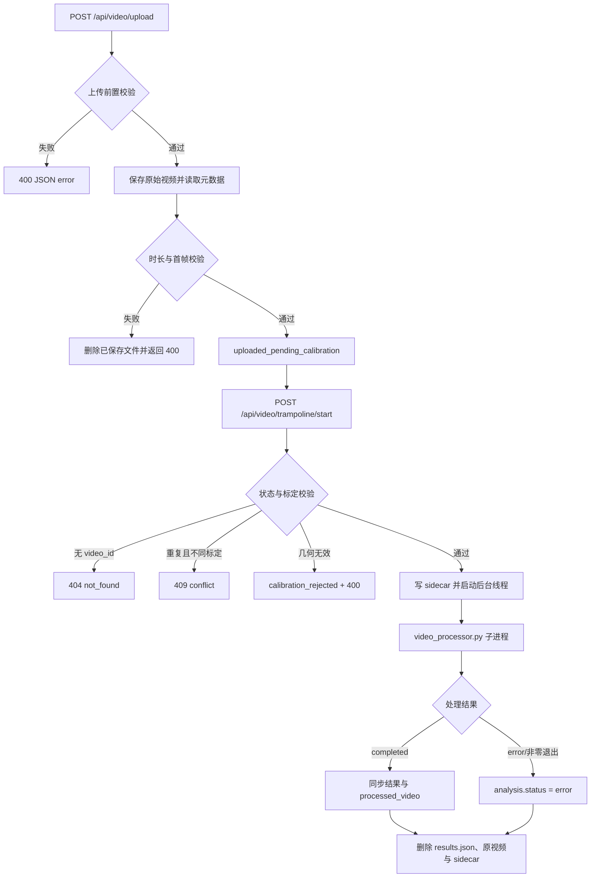

本页位于质量保障与扩展章节，聚焦蹦床视频分析链路中的**失败入口、资源释放、临时文件生命周期与上传约束**。它不展开动作识别、床面映射或前端交互细节，而是从工程可靠性的第一原则出发：任何进入后端处理的视频都必须先被约束，任何未完成的标定会话都必须可过期，任何独立处理进程持有的 OpenCV、MediaPipe 与视频写入资源都必须在正常或异常路径上释放。Sources: [app.py](app.py#L35-L38), [app.py](app.py#L149-L170), [video_processor.py](video_processor.py#L116-L120), [video_processor.py](video_processor.py#L364-L392)

## 架构假设：错误被分层拦截，资源被阶段性回收

该实现呈现出三层防线：**上传阶段**先拒绝缺失文件、非蹦床类型、超大文件、超长视频与不可读首帧；**标定启动阶段**验证视频状态、标定几何与重复启动冲突；**处理阶段**由独立 `video_processor.py` 写入增量结果，并在异常时把 `status` 写为 `error`，最后释放视频捕获、姿态模型、视频写入器与垃圾回收。Sources: [app.py](app.py#L269-L323), [app.py](app.py#L368-L457), [video_processor.py](video_processor.py#L121-L197), [video_processor.py](video_processor.py#L364-L392)

上图中的关键模式是**先拒绝、再持久化、后异步处理、最终清理**：上传接口在保存文件之前完成大小校验，在保存后才通过 OpenCV 读取 FPS、帧数与首帧；标定通过后才写入 sidecar 并启动后台线程；子进程结束后，主进程会删除结果 JSON、原始视频与角点 sidecar，但保留可供回放的处理后视频路径。Sources: [app.py](app.py#L286-L323), [app.py](app.py#L433-L449), [app.py](app.py#L509-L543)

## 上传限制：入口约束优先于计算开销

后端上传接口只接受 `exercise_type == "trampoline"`，并对缺失文件、缺失运动类型、非蹦床类型与空文件名分别返回 `400` JSON 错误；这使旧健身端点和非蹦床流程无法进入后续视频处理阶段。对应契约测试覆盖了缺失视频与非蹦床类型的拒绝行为，并验证已删除的健身端点返回 `404`。Sources: [app.py](app.py#L269-L285), [tests/test_app_route_contract.py](tests/test_app_route_contract.py#L30-L64)

| 限制点 | 判定位置 | 失败响应 | 资源影响 | Sources |
|---|---|---|---|---|
| 缺少 `video` 表单字段 | 上传入口 | `400`，`No video file provided` | 文件未保存 | [app.py](app.py#L273-L274) |
| 缺少 `exercise_type` | 上传入口 | `400`，`No exercise type specified` | 文件未保存 | [app.py](app.py#L276-L278) |
| 非 `trampoline` 类型 | 上传入口 | `400`，`Only trampoline uploads are supported` | 文件未保存 | [app.py](app.py#L279-L280) |
| 空文件名 | 上传入口 | `400`，`No file selected` | 文件未保存 | [app.py](app.py#L282-L284) |
| 文件超过 50 MB | 保存前大小检测 | `400`，包含最大值与实际 MB | 文件未保存 | [app.py](app.py#L35-L36), [app.py](app.py#L286-L294) |
| 视频超过 120 秒 | 保存后 OpenCV 元数据检测 | `400`，包含最大秒数与实际秒数 | 已保存文件被删除 | [app.py](app.py#L35-L36), [app.py](app.py#L301-L316) |
| 首帧不可打开、读取或编码 | 首帧提取 | `400`，返回具体 `frame_error` | 已保存文件被删除 | [app.py](app.py#L41-L56), [app.py](app.py#L318-L322) |

这里的上传限制不是前端提示层面的限制，而是后端强制约束：`MAX_VIDEO_SIZE_MB = 50` 与 `MAX_VIDEO_DURATION_SEC = 120` 定义在服务端常量中，文件大小通过文件流 seek/tell 计算，时长通过 `CAP_PROP_FRAME_COUNT / CAP_PROP_FPS` 计算；当视频过长时，已经保存到 `uploads` 的文件会立即 `os.remove(filepath)`。Sources: [app.py](app.py#L35-L36), [app.py](app.py#L286-L316)

前端只在拖放时检查 `files[0].type.startsWith('video/')`，选择文件后会记录文件名与大小，并始终以 `exercise_type=trampoline` 上传；因此，真正的安全边界仍在后端上传接口，而不是浏览器 MIME 提示。Sources: [static/js/video_analysis.js](static/js/video_analysis.js#L364-L374), [static/js/video_analysis.js](static/js/video_analysis.js#L387-L392), [static/js/video_analysis.js](static/js/video_analysis.js#L439-L445)

## 待标定上传：TTL 过期与孤儿文件清理

蹦床上传成功后不会立即进入计算，而是进入 `uploaded_pending_calibration` 状态，并记录 `created_at`、原始 `filepath`、首帧图像、图像尺寸、FPS、总帧数与角点顺序；这使上传阶段和标定阶段解耦，但也产生了“用户上传后离开页面”的孤儿文件风险。Sources: [app.py](app.py#L324-L365)

该风险由 `cleanup_expired_pending_trampoline_uploads()` 处理：它只扫描 `mode == "trampoline"` 且状态为 `uploaded_pending_calibration` 或 `calibration_rejected` 的记录，若当前时间与 `created_at` 的差值达到 `TRAMPOLINE_PENDING_TTL_SECONDS`，就删除原始视频、sidecar、结果 JSON 与潜在处理后视频，并把状态更新为 `expired`、`state` 更新为 `EXPIRED`。Sources: [app.py](app.py#L37-L38), [app.py](app.py#L149-L170)

| 清理触发点 | 调用位置 | 清理对象 | 状态变化 | Sources |
|---|---|---|---|---|
| 上传新视频前 | `upload_video()` 开头 | 过期 pending/rejected 上传 | 过期项标记为 `expired` | [app.py](app.py#L269-L272), [app.py](app.py#L149-L170) |
| 启动标定分析前 | `start_trampoline_analysis()` 开头 | 过期 pending/rejected 上传 | 过期项标记为 `expired` | [app.py](app.py#L368-L371), [app.py](app.py#L149-L170) |
| 查询状态前 | `get_video_status()` 开头 | 过期 pending/rejected 上传 | 过期项标记为 `expired` | [app.py](app.py#L570-L575), [app.py](app.py#L149-L170) |
| 子进程结束后 | `process_video_subprocess()` 末尾 | `results.json`、原视频、sidecar | 保留分析状态与处理后视频 | [app.py](app.py#L538-L543) |

测试用例显式构造了一个 `created_at = 0` 的 pending 上传，并断言在 TTL 之后调用清理函数会返回该 `video_id`、把状态置为 `expired`、删除原视频与 `_corners.json` sidecar；这为过期清理提供了回归保护。Sources: [tests/test_trampoline_api.py](tests/test_trampoline_api.py#L178-L195)

## 标定错误：几何校验失败会进入可恢复拒绝态

标定启动接口首先处理不存在的视频、非蹦床模式、已完成任务、处理中任务与非法状态；已完成任务会直接返回现有完成结果，处理中任务若标定相同则幂等返回，若标定不同则返回 `409`，非 pending/rejected 状态返回 `400`。Sources: [app.py](app.py#L368-L410)

标定数据由 `_normalize_trampoline_calibrations()` 转换为规范结构，底层调用床面跟踪模块的 `validate_calibrations()` 和 `validate_corners()`；失败时，后端不会启动处理线程，而是把当前分析记录写成 `calibration_rejected`、`state = CALIBRATION_REJECTED`，并把异常文本同步写入 `error` 与 `feedback`。Sources: [app.py](app.py#L117-L126), [app.py](app.py#L411-L418)

床面几何校验包含多个可验证约束：标定列表不能为空，`frame_index` 必须是非负整数且唯一，`time_s` 必须是非负数值；角点必须恰好四个、顺序为 `front_left/front_right/back_right/back_left`，坐标必须为有限数值，并且在已知图像尺寸内。Sources: [trampoline/bed_tracker.py](trampoline/bed_tracker.py#L255-L305), [trampoline/bed_tracker.py](trampoline/bed_tracker.py#L147-L157), [trampoline/bed_tracker.py](trampoline/bed_tracker.py#L205-L220)

几何层还拒绝过近角点、面积过小、相对图像面积过小、自相交四边形、非凸四边形以及无法生成有效单应矩阵的角点组合；这意味着错误不是延迟到分析循环中暴露，而是在启动子进程之前被同步拦截。Sources: [trampoline/bed_tracker.py](trampoline/bed_tracker.py#L221-L247), [app.py](app.py#L411-L418)

| 标定场景 | 后端行为 | HTTP/业务状态 | 测试覆盖 | Sources |
|---|---|---|---|---|
| 首次提交有效标定 | 写 `_corners.json` sidecar，状态改为 `processing`，启动后台线程 | `200 / processing` | 上传、启动、sidecar 存在 | [app.py](app.py#L420-L457), [tests/test_trampoline_api.py](tests/test_trampoline_api.py#L143-L151) |
| 处理中重复提交相同标定 | 幂等返回已启动 | `200 / processing` | duplicate 成功 | [app.py](app.py#L394-L405), [tests/test_trampoline_api.py](tests/test_trampoline_api.py#L153-L155) |
| 处理中提交不同标定 | 拒绝冲突 | `409` | changed corners 冲突 | [app.py](app.py#L394-L406), [tests/test_trampoline_api.py](tests/test_trampoline_api.py#L156-L160) |
| 已完成后再次启动 | 返回已完成结果，不重跑 | `200 / completed` | completed 后不同角点仍返回完成 | [app.py](app.py#L385-L392), [tests/test_trampoline_api.py](tests/test_trampoline_api.py#L162-L175) |
| 重复关键帧 | 写入 `calibration_rejected`，不进入处理 | `400 / calibration_rejected` | duplicate keyframe rejected | [app.py](app.py#L411-L418), [tests/test_trampoline_api.py](tests/test_trampoline_api.py#L222-L237) |

## 子进程错误：处理失败通过结果文件与退出码回传

视频处理被封装在独立脚本 `video_processor.py` 中运行，主进程通过 `subprocess.Popen()` 启动，并持续读取 stdout；在子进程运行期间，如果结果 JSON 已存在，主进程会周期性读取并调用 `_sync_analysis_from_results()` 同步进度、跳次、动作、落点与运行字段。Sources: [app.py](app.py#L460-L507), [app.py](app.py#L220-L247)

子进程内部在多处把错误写入结果 JSON：非蹦床类型会写 `Only trampoline analysis is supported`，无法打开视频会写 `Could not open video file`，缺少床面 sidecar 会写 `No trampoline corners sidecar found...`，无法读取首帧初始化床面跟踪会写 `Could not read first frame for bed tracker initialization`。Sources: [video_processor.py](video_processor.py#L109-L127), [video_processor.py](video_processor.py#L189-L208)

如果处理循环抛出未捕获异常，子进程会在 `except` 中把 `results['status']` 置为 `error`、写入 `str(exc)`、保存 JSON、打印 traceback；主进程在子进程退出后读取结果 JSON，如果其中含有 `error` 字段，则把主进程内存态 `analysis['status']` 也改为 `error`。Sources: [video_processor.py](video_processor.py#L364-L370), [app.py](app.py#L509-L530)

如果子进程非零退出且没有可用结果 JSON，主进程会把状态设置为 `error`，并构造 `Subprocess failed: ...` 的错误文本；如果主进程自身在启动或管理子进程时抛出异常，则外层 `except` 会记录日志并把分析状态写为 `error`。Sources: [app.py](app.py#L532-L548)

## 资源释放：OpenCV、MediaPipe、写入器与临时文件分层释放

上传阶段使用 `_extract_first_frame_b64()` 读取首帧时，无论读取是否成功，都会在 `finally` 中释放 `cv2.VideoCapture`；上传时长检测也在 `finally` 中释放 `cap`，避免一次失败上传占用视频句柄。Sources: [app.py](app.py#L41-L56), [app.py](app.py#L301-L316)

处理阶段的资源释放更严格：`cap`、`out`、`pose` 与 `imageio_writer` 在进入处理前初始化为 `None`，正常完成时会释放视频捕获和姿态模型，关闭或释放视频写入器，并调用 `gc.collect()`；异常路径的 `finally` 再次以容错方式释放这些资源。Sources: [video_processor.py](video_processor.py#L116-L120), [video_processor.py](video_processor.py#L308-L343), [video_processor.py](video_processor.py#L371-L392)

逐帧循环中还包含轻量级内存控制：每帧处理后删除 `rgb_frame`，每 100 帧调用一次 `gc.collect()`，并且每 15 帧保存一次结果 JSON，使轮询端能够在长视频处理期间获得增量状态，而不是等待最终结果。Sources: [video_processor.py](video_processor.py#L235-L306)

主进程的文件清理由 `_remove_video_artifacts()` 统一执行：默认删除原视频和 `_corners.json` sidecar；当 `include_processed=True` 时，还会尝试删除处理后视频、结果 JSON 与标准 `_processed.mp4` 路径；删除失败只记录 warning，不中断调用方。Sources: [app.py](app.py#L129-L147)

处理完成后的主进程清理选择 `include_processed=False`，因此会删除原视频和 sidecar，并单独删除中间结果 JSON，但保留 `processed_video` 指向的处理后视频以供 `/api/video/processed/<video_id>` 回放。Sources: [app.py](app.py#L518-L543), [app.py](app.py#L551-L567)

## 状态查询与前端错误呈现

状态接口在返回前会触发过期清理；找不到视频时返回 `{'status': 'not_found', 'error': 'Video ID not found'}`，找到视频时返回统一状态包，其中包含 `status`、`progress`、`error`、`has_processed_video` 与 `processed_video_url` 等字段，前端据此区分处理中、完成与错误。Sources: [app.py](app.py#L570-L603)

前端轮询 `/api/video/status/<videoId>` 时，`processing` 会更新进度、日志与统计；`completed` 会停止轮询、切换到处理后视频并展示报告；`error` 会停止轮询、写入“分析失败”日志与反馈，并把终端状态置为 `Error`。Sources: [static/js/video_analysis.js](static/js/video_analysis.js#L274-L332)

上传与标定提交也有独立错误呈现：上传接口返回 `success=false` 时，前端记录“上传失败”；上传请求本身抛出异常时，记录“网络错误”；标定提交返回 `success=false` 时，标定 UI 记录 `Calibration failed` 并重新启用启动按钮；标定请求异常时记录 `Calibration request failed`。Sources: [static/js/video_analysis.js](static/js/video_analysis.js#L443-L473), [static/js/trampoline_calibration_ui.js](static/js/trampoline_calibration_ui.js#L382-L410)

## 工程边界与扩展注意点

当前实现的清理边界是明确的：pending/rejected 过期清理会删除原视频、sidecar、结果 JSON 与潜在处理后视频；正常子进程结束清理会删除结果 JSON、原视频与 sidecar，但保留处理后视频；主进程外层子进程管理异常只设置 `analysis['status']='error'` 与 `analysis['error']`，没有在该外层异常分支中调用 `_remove_video_artifacts()`。Sources: [app.py](app.py#L149-L170), [app.py](app.py#L538-L548)

如果后续要调整上传限制，应优先修改服务端常量与后端判断，而不是只改前端提示；如果要增加新任务状态，应同步考虑 `cleanup_expired_pending_trampoline_uploads()` 的扫描状态集合、`start_trampoline_analysis()` 的状态机分支，以及前端轮询对新状态的呈现。Sources: [app.py](app.py#L35-L38), [app.py](app.py#L149-L170), [app.py](app.py#L383-L410), [static/js/video_analysis.js](static/js/video_analysis.js#L292-L328)

建议继续阅读 [新增动作类型或分析指标的扩展路径](29-xin-zeng-dong-zuo-lei-xing-huo-fen-xi-zhi-biao-de-kuo-zhan-lu-jing)，了解在不破坏上传、标定与清理契约的前提下如何扩展分析输出；若需要回看任务状态机与生命周期，可返回 [后端路由、状态机与任务生命周期](9-hou-duan-lu-you-zhuang-tai-ji-yu-ren-wu-sheng-ming-zhou-qi)；若要验证这些约束，可参考 [测试体系与回归保护](27-ce-shi-ti-xi-yu-hui-gui-bao-hu)。Sources: [tests/test_trampoline_api.py](tests/test_trampoline_api.py#L143-L195), [tests/test_app_route_contract.py](tests/test_app_route_contract.py#L48-L64)