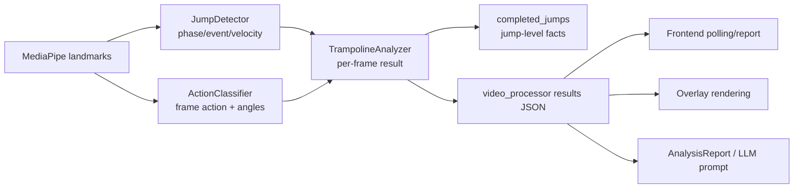
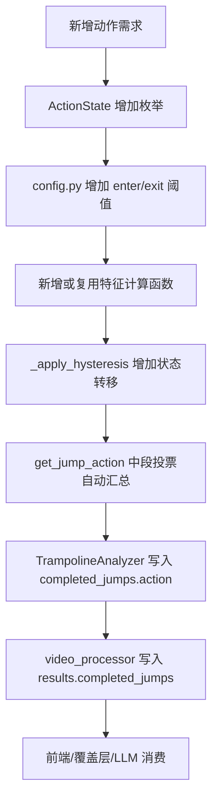

本页定位在“质量保障与扩展”的最后一环，目标是把新增动作类型与新增分析指标拆解为可验证的代码路径：动作扩展主要穿过 `ActionState → ActionClassifier → TrampolineAnalyzer → video_processor → overlay/UI/report/tests`，指标扩展主要穿过 `JumpDetector`、`ActionClassifier` 或 `BedTracker` 的帧级/跳级数据，再由 `TrampolineAnalyzer` 汇总为轮询 JSON、渲染覆盖层、前端报告与 LLM 结构化报告。Sources: [action_classifier.py](trampoline/action_classifier.py#L21-L27), [analyzer.py](trampoline/analyzer.py#L22-L86), [video_processor.py](video_processor.py#L257-L286), [video_analysis.js](static/js/video_analysis.js#L246-L272), [llm_service.py](trampoline/llm_service.py#L20-L65)

## 架构假设与验证结论

从第一性原理看，扩展点分为三类：**分类语义**、**跳级事实**、**展示契约**。分类语义由 `ActionState` 枚举和 `ActionClassifier.classify_frame()` 产生；跳级事实由 `TrampolineAnalyzer` 在落地事件处固化到 `completed_jumps`；展示契约由 `video_processor` 持续写入 JSON，再由前端轮询、报告区、覆盖层和 LLM 报告消费。这个分层意味着新增动作不应直接写前端文本，而应先进入后端规范数据；新增指标也不应只在覆盖层绘制，而应先进入 `process_frame()` 返回值或 `completed_jumps`。Sources: [action_classifier.py](trampoline/action_classifier.py#L68-L94), [analyzer.py](trampoline/analyzer.py#L40-L86), [video_processor.py](video_processor.py#L257-L286), [video_analysis.js](static/js/video_analysis.js#L246-L272)

上图中的关键约束是：`JumpDetector` 只负责相位、速度、跳次、滞空帧和诊断 CSV；`ActionClassifier` 只在 `flight` 阶段分类并维护每跳投票缓存；`TrampolineAnalyzer` 是把“帧级推断”提升为“跳级事实”的唯一稳定编排层。Sources: [jump_detector.py](trampoline/jump_detector.py#L63-L191), [action_classifier.py](trampoline/action_classifier.py#L57-L106), [analyzer.py](trampoline/analyzer.py#L13-L86)

## 当前动作分类的可扩展模型

当前动作枚举包含 `UNKNOWN`、`STRAIGHT`、`PIKE`、`TUCK`、`STRADDLE`，分类特征包括肩-髋-膝躯干大腿角、髋-膝-踝大腿小腿角、踝距/髋宽分腿比例；分类只在飞行阶段执行，接触阶段返回 `Unknown` 并重置状态。Sources: [action_classifier.py](trampoline/action_classifier.py#L21-L27), [action_classifier.py](trampoline/action_classifier.py#L57-L94), [action_classifier.py](trampoline/action_classifier.py#L195-L260)

| 扩展位置 | 当前职责 | 新增动作时的修改点 | 验证方式 |
|---|---|---|---|
| `ActionState` | 定义动作字符串枚举 | 增加新动作枚举值，值会进入 JSON、报告与 UI | 断言 `classify_frame()` 返回新枚举 |
| `config.py` | 集中阈值常量 | 增加进入/退出阈值，保持滞回成对配置 | 构造边界用例验证不抖动 |
| `ActionClassifier` | 计算特征并应用状态机 | 增加特征计算函数与 `_apply_hysteresis()` 分支 | 单测覆盖进入、保持、退出 |
| `overlay.py` | 根据动作名称取颜色 | 为新动作增加颜色映射，否则回落 Unknown 色 | 图像/字典行为测试 |
| `video_analysis.js` / CSS | 展示动作名称与样式类 | 若需要专属样式，添加 `action-<lowercase>` 样式 | 前端 helper/UI 合约测试 |
| `llm_service.py` | 统计动作分布并生成逐跳文本 | 若只新增动作名称，分布自动按字符串计数；若新增指标，需要进入报告模型 | LLM prompt 单测 |

Sources: [action_classifier.py](trampoline/action_classifier.py#L21-L27), [config.py](trampoline/config.py#L28-L45), [overlay.py](trampoline/overlay.py#L13-L20), [video_analysis.js](static/js/video_analysis.js#L187-L193), [video_analysis.js](static/js/video_analysis.js#L259-L262), [llm_service.py](trampoline/llm_service.py#L52-L65)

新增动作的最小后端路径是：先在 `ActionState` 增加枚举，再在 `config.py` 放置可调阈值，然后在 `ActionClassifier` 中计算动作所需特征，最后把进入、保持、退出规则合并到 `_apply_hysteresis()`；如果新动作像 `Straddle` 一样应优先覆盖角度分类，就应放在角度规则之前，因为当前实现已经把分腿检测置于角度分类之前。Sources: [action_classifier.py](trampoline/action_classifier.py#L21-L27), [config.py](trampoline/config.py#L28-L39), [action_classifier.py](trampoline/action_classifier.py#L108-L193)

`get_jump_action()` 对每跳飞行期分类做多数投票，并在有效帧数量足够时裁掉前后各 20% 帧；因此新增动作只要进入 `_per_jump_classifications`，就会自然参与每跳动作判定，不需要另写每跳聚合逻辑。Sources: [action_classifier.py](trampoline/action_classifier.py#L96-L106), [action_classifier.py](trampoline/action_classifier.py#L91-L94), [config.py](trampoline/config.py#L44-L45)

## 新增动作类型的实施清单

第一步，定义动作语义。把新动作加入 `ActionState`，并确认枚举值就是外部可见字符串，因为 `TrampolineAnalyzer` 在落地时写入 `action.value`，`video_processor` 又把 `completed_jumps` 原样写入结果 JSON，前端报告按 `jump.action` 展示动作分布与每跳详情。Sources: [action_classifier.py](trampoline/action_classifier.py#L21-L27), [analyzer.py](trampoline/analyzer.py#L44-L63), [video_processor.py](video_processor.py#L274-L286), [video_analysis.js](static/js/video_analysis.js#L187-L214)

第二步，定义阈值位置。现有阈值集中在 `trampoline/config.py`，包括躯干大腿角进入/退出、大腿小腿角进入/退出、直体阈值、未知回退帧数、分腿进入/退出阈值和并腿阈值；新增动作应遵循同一集中配置模式，避免把魔法数散落在分类器分支中。Sources: [config.py](trampoline/config.py#L28-L45), [action_classifier.py](trampoline/action_classifier.py#L13-L18), [action_classifier.py](trampoline/action_classifier.py#L108-L193)

第三步，扩展特征计算。现有角度函数 `_angle_between()` 使用三点计算顶点角度，距离函数 `_distance()` 用于分腿比例；躯干大腿角、腿部角和分腿比例都先过滤可见性低于 `0.3` 的关键点，再把归一化坐标按帧宽高转为像素坐标。因此新特征应复用这种“可见性过滤 → 像素化 → 几何计算 → 无效返回 `None`”模式。Sources: [action_classifier.py](trampoline/action_classifier.py#L29-L44), [action_classifier.py](trampoline/action_classifier.py#L195-L260)

第四步，维护滞回而不是单阈值切换。当前状态机对 `Straddle` 使用进入阈值 `STRADDLE_LEG_SPREAD_ENTER` 和退出阈值 `STRADDLE_LEG_SPREAD_EXIT`，对 `Pike/Tuck/Straight` 使用进入/退出角度阈值，并用 `UNKNOWN_FALLBACK_FRAMES` 处理连续无效帧；新增动作应提供进入与退出条件，避免边界帧反复抖动。Sources: [action_classifier.py](trampoline/action_classifier.py#L108-L193), [config.py](trampoline/config.py#L28-L39)

第五步，补齐可视化与样式。覆盖层通过 `ACTION_COLORS` 按动作字符串取色，不存在时使用 `Unknown` 灰色；前端统计卡片把动作文本写入 `statAction.textContent`，并生成 `action-${lowercase}` 样式类。因此新增动作若需要专属颜色，应同时更新后端覆盖层颜色和前端 CSS 样式。Sources: [overlay.py](trampoline/overlay.py#L13-L20), [overlay.py](trampoline/overlay.py#L84-L91), [video_analysis.js](static/js/video_analysis.js#L259-L262)

第六步，写回归测试。现有测试已经覆盖初始状态、接触阶段返回 Unknown、直体分类、屈/团分类、滞回、防无效帧回退、投票、分腿分类和分腿滞回；新增动作应至少补充“进入新动作”“保持新动作”“退出新动作或回落到既有动作”“多数投票输出新动作”四类用例。Sources: [tests/test_trampoline.py](tests/test_trampoline.py#L173-L335), [tests/test_trampoline.py](tests/test_trampoline.py#L273-L291)

## 新增分析指标的两条路径

新增指标有两种稳定路径：**帧级指标**适合实时覆盖层和轮询卡片，例如当前的 `velocity`、`trunk_thigh_angle`、`thigh_shin_angle`；**跳级指标**适合最终报告、LLM 和每跳详情，例如当前的 `flight_frames`、`is_intermediate`、`landing`。选择路径的标准不是指标计算位置，而是指标是否需要在落地事件处固化为不可变的每跳事实。Sources: [analyzer.py](trampoline/analyzer.py#L71-L86), [analyzer.py](trampoline/analyzer.py#L53-L63), [video_processor.py](video_processor.py#L257-L286)

| 指标类型 | 写入位置 | 当前类似字段 | 消费端 | 适用场景 |
|---|---|---|---|---|
| 帧级实时指标 | `TrampolineAnalyzer.process_frame()` 返回 dict | `velocity`、`com_y`、`ankle_y`、角度 | `video_processor.current_stats`、覆盖层、轮询状态 | 实时提示、调试曲线、覆盖层展示 |
| 跳级完成指标 | 落地事件分支中的 `jump_entry` | `flight_frames`、`is_intermediate`、`landing` | `completed_jumps`、前端报告、LLM | 每跳评分、落点、质量标签 |
| 全局汇总指标 | 视频结束时写入 `results` | `fps`、`total_frames`、`resolution` | 最终报告、LLM | 视频级统计、训练摘要 |
| LLM 衍生字段 | `AnalysisReport.from_video_analysis()` | `flight_duration_s`、`action_distribution`、`landing_points` | prompt builder | 结构化解读 |

Sources: [analyzer.py](trampoline/analyzer.py#L71-L86), [video_processor.py](video_processor.py#L216-L233), [video_processor.py](video_processor.py#L313-L329), [llm_service.py](trampoline/llm_service.py#L37-L65)

如果指标需要实时显示，应在 `TrampolineAnalyzer.process_frame()` 返回字典中加入字段，并在 `video_processor` 的 `current_stats` 初始化、帧级赋值、`results` 赋值中同步传递；当前代码已经用这种方式传递 `velocity`、`trunk_thigh_angle`、`thigh_shin_angle`、`current_flight_frames` 和 `current_flight_duration_s`。Sources: [analyzer.py](trampoline/analyzer.py#L71-L86), [video_processor.py](video_processor.py#L216-L233), [video_processor.py](video_processor.py#L257-L286)

如果指标需要按跳保存，应在 `TrampolineAnalyzer` 的 `landing` 分支写入 `jump_entry`，因为这里是一次跳跃从飞行转为接触并被计入 `completed_jumps` 的位置；当前落点指标就是在该分支通过 `_compute_landing_payload()` 附加到 `jump_entry["landing"]`，并且异常会被吞掉以保证跳次结果不被落点扩展破坏。Sources: [analyzer.py](trampoline/analyzer.py#L44-L63), [analyzer.py](trampoline/analyzer.py#L88-L114), [tests/test_trampoline.py](tests/test_trampoline.py#L415-L474)

## 指标进入前端与报告的契约

轮询结果进入 `updateStats(data)` 后，前端会更新总跳次、保存 `completed_jumps`，再通过 `resolveCompactStats()` 推导滞空时间、动作和落点；如果新增指标需要出现在顶部统计卡片，就需要新增 DOM 目标、格式化函数和 `updateStats()` 分支，而不是混入已有动作或落点字段。Sources: [video_analysis.js](static/js/video_analysis.js#L246-L272), [video_analysis_helpers.js](static/js/video_analysis_helpers.js#L24-L56)

最终报告区当前按 `completed_jumps` 计算真实跳、动作分布、中间跳数量，并逐跳展示动作、滞空帧和落点；如果新增跳级指标要出现在“每跳详细数据”，应在 `showTrampolineReport()` 的 `realJumps.forEach()` 中读取 `jump.<metric>` 并格式化。Sources: [video_analysis.js](static/js/video_analysis.js#L179-L229)

覆盖层当前读取 `jump_count/reps`、`phase`、`current_action`、`velocity`、`bed_info`、`latest_landing` 和 `landings`；新增实时指标若要画在视频上，应扩展 `draw_trampoline_overlay(frame, stats, bed_info)`，并确保 `video_processor.current_stats` 已经传入该字段。Sources: [overlay.py](trampoline/overlay.py#L32-L115), [video_processor.py](video_processor.py#L216-L233), [video_processor.py](video_processor.py#L294-L294)

LLM 侧的结构化模型已经预留 `landing_points`、`form_scores`、`rotation_data` 和 `extra_sections`，并在 `from_video_analysis()` 中从视频分析结果构造 `AnalysisReport`；如果新增指标要进入 AI 解读，应优先通过 `AnalysisReport` 的字段或 `extra_sections` 进入 `build_prompt()`，而不是让提示词直接依赖前端展示文本。Sources: [llm_service.py](trampoline/llm_service.py#L20-L65), [llm_service.py](trampoline/llm_service.py#L95-L147)

## 回归保护矩阵

扩展动作或指标时，测试应覆盖“算法正确性、契约稳定性、失败隔离”三层。算法正确性由 `tests/test_trampoline.py` 的合成 landmark 驱动；契约稳定性需要检查 `TrampolineAnalyzer.process_frame()` 是否返回预期键；失败隔离则参考落点映射测试，确保指标计算失败不会破坏跳次与动作结果。Sources: [tests/test_trampoline.py](tests/test_trampoline.py#L1-L14), [tests/test_trampoline.py](tests/test_trampoline.py#L345-L360), [tests/test_trampoline.py](tests/test_trampoline.py#L453-L474)

| 变更类型 | 必测用例 | 已有参照 |
|---|---|---|
| 新动作枚举 | 初始/飞行/接触状态下输出正确 | `test_contact_phase_returns_unknown`、`test_straight_classification` |
| 新滞回分支 | 进入后保持，低于退出阈值才离开 | `test_hysteresis_prevents_flickering`、`test_straddle_hysteresis` |
| 新几何特征 | 低可见性不崩溃，无效值返回可处理状态 | `test_unknown_fallback_after_invalid_frames` |
| 新跳级指标 | 落地事件时写入 `completed_jumps` | `test_landing_payload_uses_existing_landing_event` |
| 新指标失败 | 异常不阻断跳次结果 | `test_landing_mapping_failure_preserves_jump_result` |
| 前端展示 | helper 对缺省字段保持兼容 | `resolveCompactStats()` 的默认值处理 |

Sources: [tests/test_trampoline.py](tests/test_trampoline.py#L178-L203), [tests/test_trampoline.py](tests/test_trampoline.py#L226-L335), [tests/test_trampoline.py](tests/test_trampoline.py#L415-L474), [video_analysis_helpers.js](static/js/video_analysis_helpers.js#L24-L56)

## 推荐扩展顺序

对新增动作，推荐顺序是：先加 `ActionState` 与阈值，再加特征计算与状态机，然后写分类单测，最后补覆盖层颜色、前端样式和报告展示；这样可以先锁定算法语义，再处理展示层。Sources: [action_classifier.py](trampoline/action_classifier.py#L21-L27), [config.py](trampoline/config.py#L28-L45), [action_classifier.py](trampoline/action_classifier.py#L108-L193), [overlay.py](trampoline/overlay.py#L13-L20), [video_analysis.js](static/js/video_analysis.js#L259-L262)

对新增指标，推荐顺序是：先判断帧级还是跳级，再在 `TrampolineAnalyzer` 明确输出位置，然后同步 `video_processor` 的 `current_stats/results`，最后按需要接入前端报告、覆盖层或 `AnalysisReport`；如果指标属于落点、床面或坐标映射族，建议继续阅读 [落点数据结构与可视化](19-luo-dian-shu-ju-jie-gou-yu-ke-shi-hua) 与 [覆盖层绘制：骨架、床面、速度与落点](23-fu-gai-ceng-hui-zhi-gu-jia-chuang-mian-su-du-yu-luo-dian)。Sources: [analyzer.py](trampoline/analyzer.py#L71-L86), [video_processor.py](video_processor.py#L216-L286), [video_analysis.js](static/js/video_analysis.js#L179-L229), [llm_service.py](trampoline/llm_service.py#L20-L65)

若扩展改变跳次切分或飞行期定义，应先回到 [跳次分割与起跳落地检测](13-tiao-ci-fen-ge-yu-qi-tiao-luo-di-jian-ce)；若扩展改变动作判定边界，应回到 [动作分类：直体、屈体、团身与分腿跳](14-dong-zuo-fen-lei-zhi-ti-qu-ti-tuan-shen-yu-fen-tui-tiao) 与 [中段投票与滞回状态机](15-zhong-duan-tou-piao-yu-zhi-hui-zhuang-tai-ji)；若扩展影响 API 字段，应核对 [前后端 API 契约](11-qian-hou-duan-api-qi-yue) 与 [测试体系与回归保护](27-ce-shi-ti-xi-yu-hui-gui-bao-hu)。Sources: [jump_detector.py](trampoline/jump_detector.py#L113-L181), [action_classifier.py](trampoline/action_classifier.py#L96-L193), [video_processor.py](video_processor.py#L274-L286), [tests/test_trampoline.py](tests/test_trampoline.py#L345-L360)