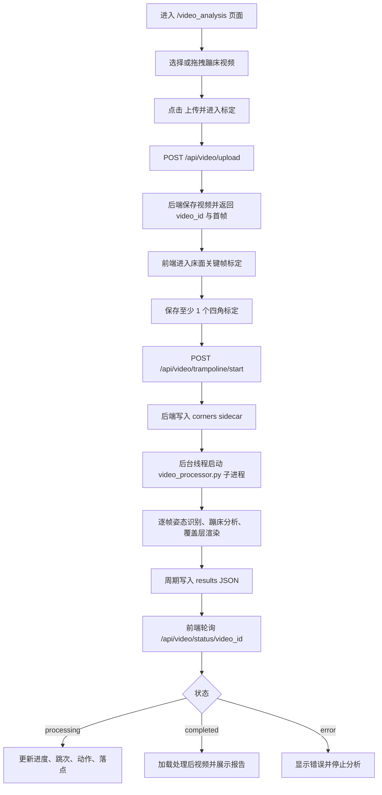

本页解释“蹦床视频分析主流程”在项目中的端到端路径：用户进入视频分析页，选择视频，上传到后端，完成床面关键帧四角标定，启动独立视频处理进程，前端轮询进度，最后展示跳次、动作、落点、报告和处理后视频。它面向初学开发者，只聚焦主流程的“先后顺序”和“模块协作”，不展开跳次检测、动作分类、床面跟踪或 AI 解读的内部算法细节。Sources: [video_analysis.html](templates/video_analysis.html#L12-L20), [video_analysis.js](static/js/video_analysis.js#L426-L474), [app.py](app.py#L269-L365), [app.py](app.py#L368-L457)

## 架构假设与代码验证结论

从第一性原理看，这条主流程必须解决四个问题：**视频从浏览器进入服务器**、**床面标定数据与视频绑定**、**耗时分析不阻塞 Flask 请求**、**前端持续获得处理状态并展示结果**。代码验证后可以确认：页面由 `/video_analysis` 渲染，上传接口 `/api/video/upload` 接收蹦床视频并返回首帧与 `video_id`，标定启动接口 `/api/video/trampoline/start` 写入角点 sidecar 文件并开启后台线程，后台线程再启动 `video_processor.py` 子进程，前端通过 `/api/video/status/<video_id>` 高频轮询状态。Sources: [app.py](app.py#L264-L266), [app.py](app.py#L269-L365), [app.py](app.py#L368-L449), [app.py](app.py#L460-L505), [app.py](app.py#L570-L603)

## 主流程总览

下面的 Mermaid 图展示的是“用户操作 → Flask 状态 → 子进程分析 → 前端回放”的主路径。图中每个节点都对应一个可在代码中定位的职责：HTML 提供入口与显示区域，前端 JS 组织上传、标定和轮询，Flask API 管理任务状态，`video_processor.py` 执行逐帧处理并持续写入 JSON 结果。Sources: [video_analysis.html](templates/video_analysis.html#L23-L74), [video_analysis.html](templates/video_analysis.html#L76-L159), [video_analysis.js](static/js/video_analysis.js#L426-L503), [video_processor.py](video_processor.py#L77-L107)



这条链路的关键约束是：上传后并不会立即开始逐帧分析，而是进入 `uploaded_pending_calibration` 状态；只有当前端提交有效的床面关键帧标定后，后端才会把任务状态切换为 `processing` 并启动子进程。Sources: [app.py](app.py#L324-L351), [static/js/trampoline_calibration_ui.js](static/js/trampoline_calibration_ui.js#L382-L405), [app.py](app.py#L439-L449)

## 页面中的用户操作顺序

用户首先在“蹦床视频分析”页面上传视频，页面文案明确说明支持“上传蹦床视频后，在暂停视频上标定床面四角、识别跳次、分析动作与落点”；上传区域支持拖拽或点击选择文件，并接受浏览器侧 `video/*` 文件。Sources: [video_analysis.html](templates/video_analysis.html#L12-L20), [video_analysis.html](templates/video_analysis.html#L23-L37)

上传后，用户不会直接进入分析结果页，而是看到“床面四角标定”区域：先暂停到目标帧，点击“添加当前帧标定”，再按 **前左 → 前右 → 后右 → 后左** 的顺序在视频画面上标记四个角点。页面要求至少保存一个有效标定后，“开始分析”按钮才具备启动条件。Sources: [video_analysis.html](templates/video_analysis.html#L39-L58), [static/js/trampoline_calibration_ui.js](static/js/trampoline_calibration_ui.js#L20-L37)

分析过程中，页面右侧展示实时统计、落点图、分析报告、AI 分析入口和过程反馈；底部还有处理日志区域，用于显示初始化、上传、标定、进度、完成或错误信息。Sources: [video_analysis.html](templates/video_analysis.html#L76-L159), [video_analysis.html](templates/video_analysis.html#L162-L175), [video_analysis.js](static/js/video_analysis.js#L75-L99)

## 主流程中的文件结构视图

下面是与本页主流程直接相关的项目结构。它不是完整仓库地图，而是帮助初学者理解“页面、前端逻辑、后端路由、处理子进程、蹦床分析模块”各自放在哪里。Sources: [video_analysis.html](templates/video_analysis.html#L178-L181), [app.py](app.py#L264-L266), [video_processor.py](video_processor.py#L77-L83)

```text
fitness-trainer-pose-estimation/
├── app.py
│   ├── /video_analysis 页面路由
│   ├── /api/video/upload 上传接口
│   ├── /api/video/trampoline/start 标定后启动接口
│   ├── /api/video/status/<video_id> 状态轮询接口
│   └── process_video_subprocess 后台线程入口
├── templates/
│   └── video_analysis.html
│       └── 上传区、标定区、统计区、报告区、日志区
├── static/js/
│   ├── video_analysis.js
│   │   └── 上传、进入标定、轮询、更新结果
│   ├── trampoline_calibration_ui.js
│   │   └── 关键帧标定交互与启动请求
│   └── trampoline_calibration_geometry.js
│       └── 标定坐标换算辅助
├── video_processor.py
│   └── 独立子进程逐帧处理视频
└── trampoline/
    ├── analyzer.py
    │   └── 每帧蹦床分析协调器
    └── overlay.py
        └── 处理后视频覆盖层绘制
```

页面模板按顺序加载 `video_analysis_helpers.js`、`trampoline_calibration_geometry.js`、`trampoline_calibration_ui.js` 和 `video_analysis.js`，因此主流程中的页面逻辑依赖这些前端模块先完成注册，再由 `video_analysis.js` 初始化控制器。Sources: [video_analysis.html](templates/video_analysis.html#L178-L181), [video_analysis.js](static/js/video_analysis.js#L41-L47), [video_analysis.js](static/js/video_analysis.js#L626-L628)

## 阶段一：选择视频与本地预览

当前端收到用户选择的视频文件后，会把文件保存到 `videoFile`，用 `URL.createObjectURL(file)` 设置给 `<video>`，显示播放器，隐藏上传区，并启用播放、上传分析和重置按钮。此时视频只是在浏览器本地预览，还没有进入后端分析流程。Sources: [video_analysis.js](static/js/video_analysis.js#L364-L375)

拖拽上传和文件选择最终都会调用同一个 `handleVideoFile(file)` 函数；播放按钮也只是控制页面上的 `<video>` 播放与暂停，不触发后端处理。Sources: [video_analysis.js](static/js/video_analysis.js#L377-L408)

## 阶段二：上传视频并进入待标定状态

用户点击“上传并进入标定”后，前端创建 `FormData`，把视频文件放入 `video` 字段，并固定追加 `exercise_type=trampoline`，然后向 `/api/video/upload` 发起 `POST` 请求。Sources: [video_analysis.js](static/js/video_analysis.js#L426-L445)

后端上传接口会先清理过期的待标定任务，再检查请求中是否存在视频文件、是否指定运动类型、运动类型是否为 `trampoline`、文件名是否为空，并限制视频大小不能超过 `MAX_VIDEO_SIZE_MB`。Sources: [app.py](app.py#L269-L294)

后端保存文件后，会用 OpenCV 读取帧率和总帧数，并通过帧数与 FPS 计算时长；如果视频超过 `MAX_VIDEO_DURATION_SEC`，会删除刚保存的视频并返回错误。Sources: [app.py](app.py#L296-L316)

上传成功后，后端提取首帧 PNG 的 base64 数据，创建 `video_analyses[video_id]` 状态对象，并把任务设为 `uploaded_pending_calibration`、`PENDING_CALIBRATION`、`Awaiting bed corner calibration`；响应中返回 `video_id`、首帧图片、图像尺寸、角点顺序、视频 FPS 和总帧数。Sources: [app.py](app.py#L318-L365)

## 阶段三：关键帧床面标定

前端拿到上传响应后，会停止“正在分析”的状态，记录 `currentVideoId`，提示用户完成关键帧标定，并调用 `trampolineCalibrationController.enterPendingCalibration()`，把 `videoId`、首帧图像和视频 FPS 交给标定控制器。Sources: [video_analysis.js](static/js/video_analysis.js#L454-L467)

标定控制器进入待标定模式时，会显示标定区域、暂停视频、清空旧关键帧、保存后端返回的 `video_id` 和上传帧率，并重新渲染关键帧列表。Sources: [static/js/trampoline_calibration_ui.js](static/js/trampoline_calibration_ui.js#L413-L429)

用户点击“添加当前帧标定”时，控制器会暂停视频，根据当前播放时间和 FPS 估算帧号，截取当前视频画面为 PNG data URL，并把该帧设为当前草稿。Sources: [static/js/trampoline_calibration_ui.js](static/js/trampoline_calibration_ui.js#L228-L238), [static/js/trampoline_calibration_ui.js](static/js/trampoline_calibration_ui.js#L329-L351)

用户在画布上点击角点时，控制器会把显示坐标转换为图像坐标，并按当前顺序追加到 `cornerPoints`；如果点击位置不在视频画面内，会给出警告并忽略该点击。Sources: [static/js/trampoline_calibration_ui.js](static/js/trampoline_calibration_ui.js#L448-L468)

当当前草稿有四个角点时，用户可以保存标定；保存动作会生成包含 `frame_index`、`time_s`、预览图和 `corners_px` 的关键帧对象，其中 `corners_px` 的角点名称来自 `front_left`、`front_right`、`back_right`、`back_left`。Sources: [static/js/trampoline_calibration_ui.js](static/js/trampoline_calibration_ui.js#L362-L380), [app.py](app.py#L35-L39)

## 阶段四：提交标定并启动分析

用户点击标定区的“开始分析”后，前端从控制器生成 `calibrations`，向 `/api/video/trampoline/start` 提交 JSON：`video_id` 加上关键帧标定数组。提交成功后，标定区会隐藏，页面恢复显示视频，并触发主页面的 `onProcessingStart` 回调开始轮询。Sources: [static/js/trampoline_calibration_ui.js](static/js/trampoline_calibration_ui.js#L382-L405), [video_analysis.js](static/js/video_analysis.js#L488-L501)

后端启动接口首先确认 `video_id` 存在、任务模式是 `trampoline`，并处理已完成、处理中、状态不允许启动等情况；如果当前任务仍处于 `uploaded_pending_calibration` 或 `calibration_rejected`，才会继续校验并规范化标定数据。Sources: [app.py](app.py#L368-L418)

标定通过后，后端会写入一个 sidecar JSON 文件，内容包含 schema 版本、`video_id`、运动类型、首个标定帧号、图像尺寸、角点顺序、首个角点集合、完整 `calibrations`、床面尺寸和创建时间。Sources: [app.py](app.py#L420-L437)

sidecar 写入完成后，后端把内存状态更新为 `processing` 和 `PROCESSING`，记录标定数组，设置反馈信息，然后创建 daemon 线程执行 `process_video_subprocess(video_id)`。Sources: [app.py](app.py#L439-L449)

## 阶段五：独立子进程逐帧处理

后台线程不会在 Flask 请求内直接逐帧处理视频，而是调用当前 Python 解释器启动 `video_processor.py` 子进程，并把原始视频路径、运动类型、结果 JSON 路径和处理后视频输出路径作为命令行参数传入。Sources: [app.py](app.py#L460-L490)

线程运行期间会不断读取子进程输出，并每隔短时间检查结果 JSON 是否存在；如果存在，就加载 JSON 并把结果同步回 `video_analyses[video_id]`，使状态接口可以返回最新进度、跳次、动作、落点等数据。Sources: [app.py](app.py#L492-L507), [app.py](app.py#L213-L247)

`video_processor.py` 的处理函数初始化一个结果字典，字段包括 `status`、`progress`、`reps`、`current_action`、`completed_jumps`、`phase`、`latest_landing` 和 `landings`；它还定义 `save_results()`，用于把当前结果写入输出 JSON。Sources: [video_processor.py](video_processor.py#L77-L107)

子进程打开视频后读取总帧数、FPS、宽高，并初始化输出视频写入器；随后初始化 MediaPipe Pose，读取后端生成的角点 sidecar，创建 `BedTracker`，并用首帧初始化床面跟踪。Sources: [video_processor.py](video_processor.py#L121-L187), [video_processor.py](video_processor.py#L189-L210)

处理循环中，子进程逐帧读取视频，更新进度，更新床面跟踪，对当前帧执行 MediaPipe 姿态识别；如果检测到姿态关键点，就绘制骨架和角度弧线，并按 `analyze_skip` 的节奏调用 `TrampolineAnalyzer.process_frame()` 进行蹦床分析。Sources: [video_processor.py](video_processor.py#L212-L258)

每次分析帧产生结果后，子进程会更新当前统计和结果 JSON 字段，包括跳次、当前动作、阶段、当前腾空帧数、当前腾空时长、已完成跳跃、最新落点和落点列表。Sources: [video_processor.py](video_processor.py#L257-L287)

每一帧都会调用 `draw_trampoline_overlay()` 绘制覆盖层；该覆盖层显示跳次数、阶段、动作、速度条，并在有床面信息、最新落点或落点列表时绘制床面四边形、落点标记和小地图。Sources: [video_processor.py](video_processor.py#L294-L302), [trampoline/overlay.py](trampoline/overlay.py#L32-L115)

处理结束后，子进程释放视频和姿态资源，写入最终 FPS、总帧数、分辨率、已完成跳跃、落点等结果，把状态设为 `completed`，进度设为 `100`，最后保存结果 JSON。Sources: [video_processor.py](video_processor.py#L308-L360)

## 阶段六：前端轮询与结果展示

标定启动成功后，主页面调用 `startAnalysisPolling(videoId)`，把视频回到起点并播放，然后每 200 毫秒请求 `/api/video/status/<videoId>`。Sources: [video_analysis.js](static/js/video_analysis.js#L274-L333)

状态接口返回当前任务的 `status`、`progress`、`reps`、评分占位字段、状态、反馈、错误、是否有处理后视频、处理后视频 URL、当前动作、已完成跳跃、阶段、腾空信息、最新落点、落点列表和 FPS。Sources: [app.py](app.py#L570-L603)

当状态是 `processing` 时，前端更新进度条和进度文本，每跨过 10% 记录一次日志，并调用 `updateStats(data)` 更新跳次、当前腾空时间、动作、落点文本和落点图。Sources: [video_analysis.js](static/js/video_analysis.js#L292-L305), [video_analysis.js](static/js/video_analysis.js#L246-L272)

当状态是 `completed` 时，前端停止轮询，记录结束时间，更新统计，进度设为 100%，写入完成日志和反馈；如果后端已有处理后视频 URL，就把 `<video>` 的 `src` 切换为处理后视频并播放，然后生成蹦床报告并停止分析状态。Sources: [video_analysis.js](static/js/video_analysis.js#L305-L322)

当状态是 `error` 时，前端停止轮询，显示错误日志和反馈，把终端状态设为 Error，并停止当前分析。Sources: [video_analysis.js](static/js/video_analysis.js#L322-L328)

## 主流程 API 摘要

| 阶段 | 前端动作 | 后端接口 | 关键输入 | 关键输出 |
|---|---|---|---|---|
| 上传 | 点击“上传并进入标定” | `POST /api/video/upload` | `video` 文件、`exercise_type=trampoline` | `video_id`、首帧图片、图像尺寸、FPS、总帧数 |
| 启动 | 保存标定后点击“开始分析” | `POST /api/video/trampoline/start` | `video_id`、`calibrations` | `status=processing`、标定数量 |
| 轮询 | 自动定时请求 | `GET /api/video/status/<video_id>` | `video_id` | 进度、跳次、动作、阶段、落点、处理后视频 URL |
| 回放 | 完成后切换视频源 | `GET /api/video/processed/<video_id>` | `video_id` | 处理后视频文件流 |

Sources: [video_analysis.js](static/js/video_analysis.js#L439-L445), [app.py](app.py#L269-L365), [static/js/trampoline_calibration_ui.js](static/js/trampoline_calibration_ui.js#L382-L405), [app.py](app.py#L368-L457), [video_analysis.js](static/js/video_analysis.js#L292-L322), [app.py](app.py#L570-L603), [app.py](app.py#L551-L567)

## 初学者应记住的状态变化

| 状态 | 出现位置 | 含义 | 下一步 |
|---|---|---|---|
| `uploaded_pending_calibration` | 上传成功后端状态 | 视频已保存，但还没有有效床面标定 | 前端进入关键帧四角标定 |
| `calibration_rejected` | 标定校验失败后 | 标定数据没有通过后端规范化或校验 | 用户重新提交标定 |
| `processing` | 标定通过并启动后 | 子进程正在逐帧处理视频 | 前端持续轮询状态 |
| `completed` | 子进程正常结束后 | 结果和处理后视频已就绪 | 前端展示报告并回放处理后视频 |
| `error` | 上传、启动或处理失败后 | 主流程失败 | 前端显示错误并停止分析 |

Sources: [app.py](app.py#L324-L351), [app.py](app.py#L411-L418), [app.py](app.py#L439-L457), [app.py](app.py#L514-L536), [video_processor.py](video_processor.py#L344-L360)

## 结果在页面上的呈现方式

实时统计区使用后端返回的 `reps` 和 `completed_jumps` 更新跳次与已完成跳跃，再通过辅助逻辑整理当前腾空时间、动作和落点；落点图会从 `data.landings` 或已完成跳跃中的 `landing` 字段取数据，并只渲染有效落点。Sources: [video_analysis.js](static/js/video_analysis.js#L246-L272), [video_analysis.js](static/js/video_analysis.js#L160-L177)

分析报告在完成后生成，展示分析类型、总跳次、过渡跳数量、动作分布和处理耗时，并提供“每跳详细数据”的折叠区域。Sources: [video_analysis.js](static/js/video_analysis.js#L179-L244)

下载报告按钮会生成一个文本报告，内容包括时间、视频名、总跳次、过渡跳数量、逐跳明细、落点信息和反馈日志，然后以 `trampoline_report_<timestamp>.txt` 下载。Sources: [video_analysis.js](static/js/video_analysis.js#L582-L617)

## 下一步阅读建议

如果你是第一次读这个项目，建议先回到 [概览](1-gai-lan) 建立整体认知，再读 [快速开始](2-kuai-su-kai-shi) 运行项目；完成本页后，继续阅读 [页面入口与功能边界](4-ye-mian-ru-kou-yu-gong-neng-bian-jie) 理解各页面职责，再读 [上传、标定、分析与回放操作指南](5-shang-chuan-biao-ding-fen-xi-yu-hui-fang-cao-zuo-zhi-nan) 练习完整操作。Sources: [video_analysis.html](templates/video_analysis.html#L12-L20), [video_analysis.html](templates/video_analysis.html#L23-L74)

如果你已经能跑通主流程，下一层适合阅读 [端到端架构与数据流](8-duan-dao-duan-jia-gou-yu-shu-ju-liu)、[后端路由、状态机与任务生命周期](9-hou-duan-lu-you-zhuang-tai-ji-yu-ren-wu-sheng-ming-zhou-qi)、[独立视频处理进程设计](10-du-li-shi-pin-chu-li-jin-cheng-she-ji) 和 [前后端 API 契约](11-qian-hou-duan-api-qi-yue)，这些页面会把本页只做概览的后端生命周期与接口契约展开。Sources: [app.py](app.py#L269-L365), [app.py](app.py#L368-L457), [app.py](app.py#L460-L567), [app.py](app.py#L570-L603)

如果你想理解分析结果为什么会出现跳次、动作和落点，可以继续阅读 [MediaPipe 姿态关键点处理管线](12-mediapipe-zi-tai-guan-jian-dian-chu-li-guan-xian)、[跳次分割与起跳落地检测](13-tiao-ci-fen-ge-yu-qi-tiao-luo-di-jian-ce)、[动作分类：直体、屈体、团身与分腿跳](14-dong-zuo-fen-lei-zhi-ti-qu-ti-tuan-shen-yu-fen-tui-tiao) 和 [落点数据结构与可视化](19-luo-dian-shu-ju-jie-gou-yu-ke-shi-hua)。Sources: [trampoline/analyzer.py](trampoline/analyzer.py#L13-L86), [video_processor.py](video_processor.py#L250-L287), [trampoline/overlay.py](trampoline/overlay.py#L97-L115)