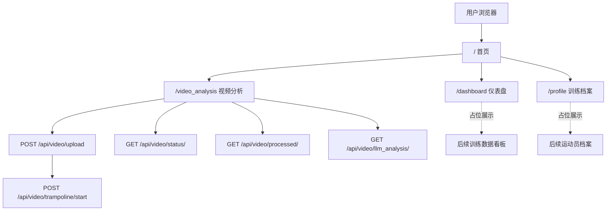

本页说明这个项目“从哪里进入、每个页面负责什么、哪些能力不属于当前入口范围”。当前目录位置是入门章节中的 **[页面入口与功能边界](4-ye-mian-ru-kou-yu-gong-neng-bian-jie)**，它承接前一页 [蹦床视频分析主流程](3-beng-chuang-shi-pin-fen-xi-zhu-liu-cheng)，但只讨论页面和路由边界，不展开算法、标定几何或 AI 实现细节。Sources: [app.py](app.py#L249-L267), [templates/index.html](templates/index.html#L11-L19), [templates/video_analysis.html](templates/video_analysis.html#L12-L20)

## 架构假设与验证结论

从第一性原理看，这个 Flask 应用的入口层可以拆成两类：一类是 **HTML 页面入口**，负责让用户进入首页、视频分析页、仪表盘和档案页；另一类是 **视频分析相关 API 入口**，只在用户上传视频、提交蹦床标定、轮询状态、获取处理后视频或请求 AI 分析时被前端调用。代码验证显示，HTML 页面路由集中在 `/`、`/dashboard`、`/profile`、`/video_analysis`，而视频分析 API 从 `/api/video/upload` 开始，并明确只接受 `exercise_type == 'trampoline'`。Sources: [app.py](app.py#L249-L280), [app.py](app.py#L368-L457), [app.py](app.py#L551-L605)

下图是本页的入口边界总览：它只展示“用户能点击到哪里”和“视频分析页会调用哪些后端入口”，不展开后端处理进程、算法模型或前端标定计算。Sources: [templates/index.html](templates/index.html#L15-L19), [templates/video_analysis.html](templates/video_analysis.html#L16-L20), [app.py](app.py#L269-L365)



这个图里的实线代表当前代码中已经存在并被页面引用的入口，虚线代表模板文本中明确标记为“保留”“占位”“后续接入”的区域。对于初学者来说，最重要的判断是：**当前可直接使用的主线是 `/video_analysis`，首页、仪表盘和档案页更多承担导航壳层与未来扩展占位。** Sources: [templates/index.html](templates/index.html#L27-L29), [templates/dashboard.html](templates/dashboard.html#L15-L16), [templates/profile.html](templates/profile.html#L15-L17), [templates/video_analysis.html](templates/video_analysis.html#L14-L15)

## 页面入口地图

项目当前保留四个主要页面入口：`/` 是首页，`/video_analysis` 是蹦床视频分析主入口，`/dashboard` 是仪表盘占位页，`/profile` 是训练档案占位页。Flask 路由函数分别渲染 `index.html`、`video_analysis.html`、`dashboard.html` 和 `profile.html`，其中视频分析页传入的模式为 `trampoline`。Sources: [app.py](app.py#L249-L267)

| 页面 | 路由 | 模板 | 当前定位 | 初学者应如何理解 |
|---|---:|---|---|---|
| 首页 | `/` | `templates/index.html` | 蹦床项目入口壳层 | 从这里跳转到视频分析、仪表盘、档案 |
| 视频分析 | `/video_analysis` | `templates/video_analysis.html` | 当前主功能页 | 上传视频、标定床面、开始分析、查看结果 |
| 仪表盘 | `/dashboard` | `templates/dashboard.html` | 后续训练数据看板占位 | 现在展示摘要和占位图，不是核心分析入口 |
| 训练档案 | `/profile` | `templates/profile.html` | 后续用户档案占位 | 现在展示占位信息，不处理真实用户资料 |

首页的导航链接直接指向 `/video_analysis`、`/dashboard` 和 `/profile`，并在正文里说明“当前版本先聚焦上传视频后的床面标定、跳次检测、动作识别与 AI 分析”。这意味着首页不是实时相机分析页，而是把用户引导到已经可用的视频分析主线。Sources: [templates/index.html](templates/index.html#L13-L19), [templates/index.html](templates/index.html#L23-L43)

## 可视化项目结构

从页面入口角度看，项目结构可以简化为“Flask 路由 + HTML 模板 + 静态样式与脚本 + 测试契约”。下面的结构只列出与页面入口和功能边界直接相关的文件，帮助初学者快速定位从路由到页面再到前端脚本的路径。Sources: [app.py](app.py#L249-L267), [templates/video_analysis.html](templates/video_analysis.html#L178-L181), [tests/test_app_route_contract.py](tests/test_app_route_contract.py#L76-L97)

```text
.
├── app.py
│   ├── /                  -> templates/index.html
│   ├── /dashboard         -> templates/dashboard.html
│   ├── /profile           -> templates/profile.html
│   ├── /video_analysis    -> templates/video_analysis.html
│   └── /api/video/...     -> 视频分析相关 API
├── templates
│   ├── index.html         -> 首页导航与能力说明
│   ├── dashboard.html     -> 仪表盘占位页
│   ├── profile.html       -> 训练档案占位页
│   └── video_analysis.html-> 当前主功能页
├── static
│   ├── css                -> 页面样式
│   └── js
│       ├── video_analysis.js
│       ├── video_analysis_helpers.js
│       ├── trampoline_calibration_geometry.js
│       └── trampoline_calibration_ui.js
└── tests
    ├── test_app_route_contract.py
    └── test_trampoline_frontend_contract.py
```

这个结构的阅读顺序建议是：先看 `app.py` 中的页面路由，再看对应模板里的导航和文案，最后看 `tests` 中的契约测试确认哪些入口被保留、哪些旧入口已删除。这样可以避免一开始就陷入视频处理算法或 AI 分析细节。Sources: [app.py](app.py#L249-L267), [tests/test_app_route_contract.py](tests/test_app_route_contract.py#L6-L16), [tests/test_app_route_contract.py](tests/test_app_route_contract.py#L19-L45)

## 首页：导航壳层，不是实时分析页

首页标题为“蹦床视频分析”，但页面正文明确说明“首页作为蹦床实时页的入口壳层”，并提示“当前可直接使用的主线是视频上传、标定与分析”。因此，初学者不要把 `/` 理解为完整的实时相机页面；它目前主要承担导航、能力说明和未来实时页预留位置。Sources: [templates/index.html](templates/index.html#L11-L19), [templates/index.html](templates/index.html#L23-L29)

首页侧栏列出当前可用能力：上传蹦床视频、首帧或关键帧床面四角标定、跳次分割与动作识别、处理后视频与 AI 讲解；同时也列出“实时相机页待开发”和“训练看板接入已预留”。这就是首页的功能边界：它说明能力，但不直接完成分析。Sources: [templates/index.html](templates/index.html#L35-L59), [templates/index.html](templates/index.html#L61-L77)

## 视频分析页：当前主功能入口

`/video_analysis` 是当前最重要的页面入口。模板根容器带有 `data-mode="trampoline"`，页面标题和副标题说明用户上传蹦床视频后，可以在暂停视频上标定床面四角，并进行跳次、动作和落点分析。Sources: [templates/video_analysis.html](templates/video_analysis.html#L12-L20)

视频分析页的可见功能被组织成几个区域：上传区、视频播放器、标定步骤、进度条与控制按钮、实时统计、落点图、分析报告、AI 分析、过程反馈和处理日志。初学者可以把它理解为“唯一承载完整视频分析操作链路的页面”。Sources: [templates/video_analysis.html](templates/video_analysis.html#L23-L73), [templates/video_analysis.html](templates/video_analysis.html#L76-L159), [templates/video_analysis.html](templates/video_analysis.html#L162-L175)

视频分析页在底部加载四个前端脚本：`video_analysis_helpers.js`、`trampoline_calibration_geometry.js`、`trampoline_calibration_ui.js` 和 `video_analysis.js`。这说明页面本身只提供 HTML 结构，具体交互由静态脚本接管；其中主脚本在加载时会检查这些辅助模块是否存在。Sources: [templates/video_analysis.html](templates/video_analysis.html#L178-L181), [static/js/video_analysis.js](static/js/video_analysis.js#L41-L47)

## 仪表盘：保留入口，当前是占位展示

`/dashboard` 渲染“蹦床仪表盘”，页面说明它“保留图表与摘要布局，作为后续蹦床训练数据看板的占位页”。它包含摘要卡片、两个 Chart.js 图表容器和项目说明列表，但这些内容在当前代码中是固定上下文或占位数据。Sources: [templates/dashboard.html](templates/dashboard.html#L13-L24), [templates/dashboard.html](templates/dashboard.html#L27-L57), [templates/dashboard.html](templates/dashboard.html#L60-L100)

后端 `_dashboard_context()` 也验证了这个定位：摘要卡片包含“视频分析流程已启用”“实时页面预留”“图表区域保留”“当前阶段占位态”等文案。因此，仪表盘目前不是结果详情页，也不是历史数据管理页，而是为后续看板能力保留稳定路由和布局。Sources: [app.py](app.py#L173-L186)

## 训练档案：保留入口，当前不处理真实用户资料

`/profile` 渲染“蹦床训练档案”，模板说明当前以中文占位态承接后续运动员档案与训练偏好。页面展示头像、标题、保留时间和若干卡片，但它没有表单提交入口，也没有用户资料更新 API 调用。Sources: [templates/profile.html](templates/profile.html#L13-L25), [templates/profile.html](templates/profile.html#L27-L53)

后端 `_profile_context()` 提供的卡片文案也将该页限定为占位页：保留 `/profile` 页面结构，后续可接入运动员资料、器材配置、训练偏好、训练目标卡片、周计划提醒和历史训练摘要。当前边界是“展示占位结构”，不是“管理真实用户数据”。Sources: [app.py](app.py#L189-L210)

## API 入口边界：只服务蹦床视频分析主线

视频上传 API 是 `POST /api/video/upload`，它要求请求中存在 `video` 文件，并要求 `exercise_type` 非空且必须等于 `trampoline`。如果传入其他运动类型，后端直接返回 `Only trampoline uploads are supported`，这把项目边界明确限制在蹦床视频分析，而不是通用健身动作识别平台。Sources: [app.py](app.py#L269-L280), [tests/test_app_route_contract.py](tests/test_app_route_contract.py#L48-L64)

上传成功后，后端创建 `video_id`，保存视频文件，读取视频帧率和帧数，提取首帧图片，并把分析状态初始化为 `uploaded_pending_calibration` 和 `PENDING_CALIBRATION`。这说明上传并不等于立即分析；当前主线要求先完成床面标定，再启动处理。Sources: [app.py](app.py#L296-L365)

启动蹦床分析的 API 是 `POST /api/video/trampoline/start`。它只接受已经上传并等待标定，或此前标定被拒绝的蹦床视频；当标定数据通过规范化后，后端写入角点 sidecar 文件，将状态改为 `processing`，再启动后台线程处理视频。Sources: [app.py](app.py#L368-L457)

状态查询、处理后视频和 AI 分析分别由 `GET /api/video/status/<video_id>`、`GET /api/video/processed/<video_id>` 和 `GET /api/video/llm_analysis/<video_id>` 提供。状态接口返回进度、跳次、动作、落点、视频地址等摘要；处理后视频接口只在文件存在时返回媒体文件；AI 分析接口要求视频分析状态已经是 `completed`。Sources: [app.py](app.py#L551-L605), [app.py](app.py#L606-L705)

| API | 方法 | 所属页面 | 当前边界 |
|---|---:|---|---|
| `/api/video/upload` | POST | 视频分析页 | 只接受蹦床类型上传 |
| `/api/video/trampoline/start` | POST | 视频分析页 | 只启动带标定的蹦床分析 |
| `/api/video/status/<video_id>` | GET | 视频分析页 | 返回进度和摘要状态 |
| `/api/video/processed/<video_id>` | GET | 视频分析页 | 返回已生成的处理后视频 |
| `/api/video/llm_analysis/<video_id>` | GET | 视频分析页 | 只对已完成分析的视频做 AI 解读 |

这张 API 表只用于建立入口边界；具体的任务生命周期、子进程处理、前后端字段契约和 AI 流式返回，请分别阅读 [后端路由、状态机与任务生命周期](9-hou-duan-lu-you-zhuang-tai-ji-yu-ren-wu-sheng-ming-zhou-qi)、[独立视频处理进程设计](10-du-li-shi-pin-chu-li-jin-cheng-she-ji)、[前后端 API 契约](11-qian-hou-duan-api-qi-yue) 和 [SSE 流式返回、缓存与双模型分析](26-sse-liu-shi-fan-hui-huan-cun-yu-shuang-mo-xing-fen-xi)。Sources: [app.py](app.py#L460-L549), [app.py](app.py#L570-L705)

## 已移除或不属于当前范围的入口

测试契约明确列出一组已经移除的旧健身相关端点，包括 `/video_feed`、`/stop_camera`、`/start_exercise`、`/stop_exercise`、`/get_status`、`/exercises`、`/api/profile/update` 和 `/api/video/analyze_frame`。测试要求这些端点返回 404，并要求保留的前端文件中不能再引用这些路径。Sources: [tests/test_app_route_contract.py](tests/test_app_route_contract.py#L6-L16), [tests/test_app_route_contract.py](tests/test_app_route_contract.py#L30-L34), [tests/test_app_route_contract.py](tests/test_app_route_contract.py#L76-L97)

这条边界对初学者很重要：如果你在旧教程或旧代码片段里看到实时摄像头、通用健身动作选择、个人资料更新接口或逐帧分析接口，不应把它们当成当前项目入口。当前保留页面必须返回 200，并且页面文案应包含“蹦床”或“视频分析”，不能出现旧的 `Fitness Trainer` 或 `Select Exercise` 文案。Sources: [tests/test_app_route_contract.py](tests/test_app_route_contract.py#L19-L28), [tests/test_app_route_contract.py](tests/test_app_route_contract.py#L37-L45)

## 页面与功能边界对照

下面的对照表把“能做什么”和“不要期待什么”放在一起，帮助初学者快速判断自己应该打开哪个页面。Sources: [templates/index.html](templates/index.html#L35-L43), [templates/dashboard.html](templates/dashboard.html#L49-L55), [templates/profile.html](templates/profile.html#L41-L51), [templates/video_analysis.html](templates/video_analysis.html#L23-L159)

| 入口 | 当前可做 | 当前不做 |
|---|---|---|
| `/` 首页 | 导航到视频分析、仪表盘、档案；说明当前可用能力 | 不直接上传视频，不执行分析，不提供实时相机 |
| `/video_analysis` 视频分析 | 上传蹦床视频、标定床面、启动分析、查看统计、报告和 AI 区域 | 不支持非蹦床运动类型 |
| `/dashboard` 仪表盘 | 展示摘要卡片和占位图表布局 | 不展示真实历史训练数据 |
| `/profile` 档案 | 展示档案占位结构 | 不更新真实用户资料 |
| `/api/video/...` | 为视频分析页提供上传、启动、状态、视频和 AI 入口 | 不恢复旧健身端点 |

这个边界还被前端契约测试保护：视频分析页必须包含标定区域、分析画布、紧凑统计卡、落点图以及四个脚本引用；同时不应出现独立的 `corner-canvas` 或已删除的健身端点引用。Sources: [tests/test_trampoline_frontend_contract.py](tests/test_trampoline_frontend_contract.py#L7-L20), [tests/test_trampoline_frontend_contract.py](tests/test_trampoline_frontend_contract.py#L22-L45), [tests/test_trampoline_frontend_contract.py](tests/test_trampoline_frontend_contract.py#L47-L64)

## 建议阅读路径

如果你是第一次阅读这个项目，建议按目录顺序继续：先回看 [概览](1-gai-lan) 和 [快速开始](2-kuai-su-kai-shi) 建立整体印象，再读 [蹦床视频分析主流程](3-beng-chuang-shi-pin-fen-xi-zhu-liu-cheng) 理解用户操作链路；读完本页后，下一步应进入 [上传、标定、分析与回放操作指南](5-shang-chuan-biao-ding-fen-xi-yu-hui-fang-cao-zuo-zhi-nan)，把页面入口映射到实际操作步骤。Sources: [templates/index.html](templates/index.html#L27-L43), [templates/video_analysis.html](templates/video_analysis.html#L39-L57), [app.py](app.py#L269-L365)

如果你已经能分清页面入口，再进入深入解析部分会更高效：想看后端状态变化读 [后端路由、状态机与任务生命周期](9-hou-duan-lu-you-zhuang-tai-ji-yu-ren-wu-sheng-ming-zhou-qi)，想看 API 字段读 [前后端 API 契约](11-qian-hou-duan-api-qi-yue)，想看前端交互读 [视频分析页面交互模型](20-shi-pin-fen-xi-ye-mian-jiao-hu-mo-xing)，想看测试保护读 [测试体系与回归保护](27-ce-shi-ti-xi-yu-hui-gui-bao-hu)。Sources: [app.py](app.py#L368-L457), [app.py](app.py#L570-L603), [static/js/video_analysis.js](static/js/video_analysis.js#L3-L63), [tests/test_app_route_contract.py](tests/test_app_route_contract.py#L19-L45)