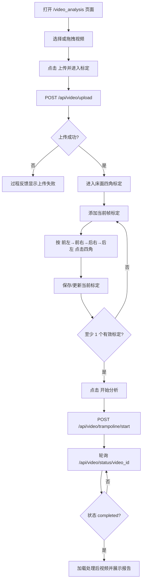
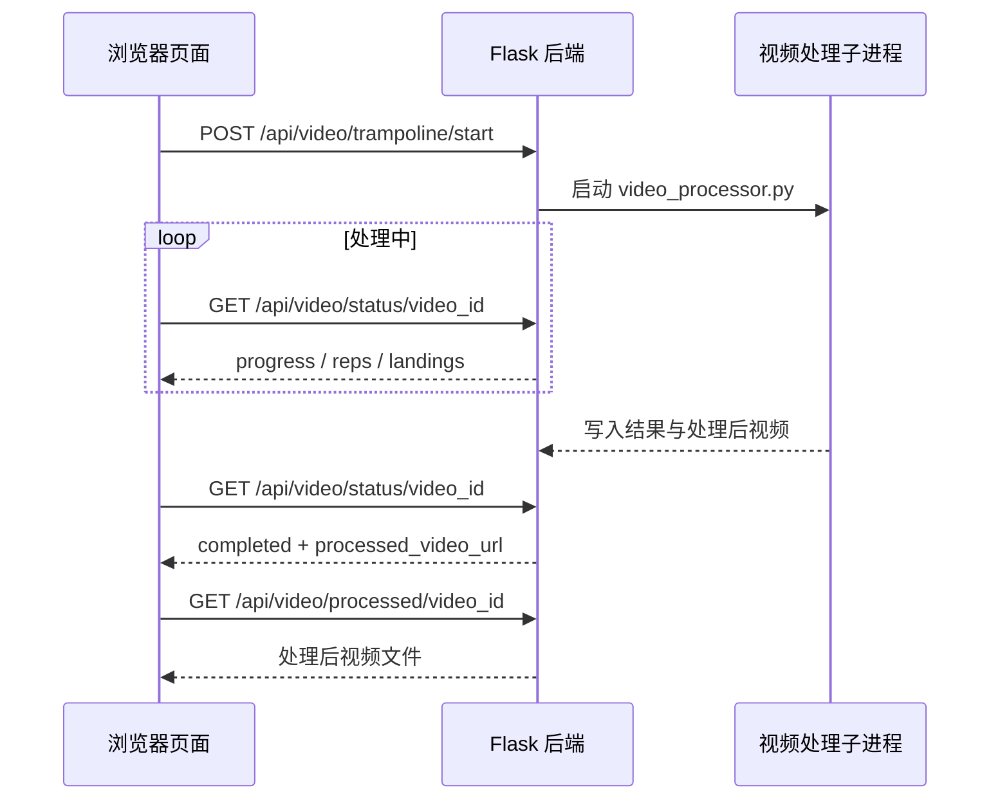

本页位于入门章节的第 5 页，目标是帮助初学开发者理解并亲手走通**蹦床视频分析页面**上的完整操作链路：选择或拖拽视频、上传进入床面四角标定、提交标定启动分析、查看实时统计与落点、回放处理后视频并下载报告。本页只覆盖页面操作与对应的前后端触发点；更底层的 API 契约、算法细节和渲染实现可在后续页面继续阅读。Sources: [templates/video_analysis.html](templates/video_analysis.html#L23-L73), [static/js/video_analysis.js](static/js/video_analysis.js#L426-L474), [app.py](app.py#L269-L365)

如果你还没有看过前置内容，建议先阅读 [蹦床视频分析主流程](3-beng-chuang-shi-pin-fen-xi-zhu-liu-cheng) 和 [页面入口与功能边界](4-ye-mian-ru-kou-yu-gong-neng-bian-jie)，再回到本页执行实际操作；完成本页后，可以继续阅读 [AI 解读功能配置](6-ai-jie-du-gong-neng-pei-zhi) 或 [测试与验证命令速查](7-ce-shi-yu-yan-zheng-ming-ling-su-cha)。Sources: [templates/video_analysis.html](templates/video_analysis.html#L12-L20), [tests/test_app_route_contract.py](tests/test_app_route_contract.py#L19-L45)

## 操作链路总览

从第一性原理看，这个页面不是“上传后立即分析”，而是一个**两段式流程**：第一段把视频上传到后端并让后端提取首帧、生成 `video_id`；第二段要求用户保存至少一个床面四角关键帧标定，然后前端把标定数据提交给 `/api/video/trampoline/start`，后端才会启动逐帧处理。Sources: [app.py](app.py#L269-L365), [static/js/video_analysis.js](static/js/video_analysis.js#L426-L467), [static/js/trampoline_calibration_ui.js](static/js/trampoline_calibration_ui.js#L382-L405)

这张流程图中的关键分界点是“上传完成”和“开始分析”：上传完成只代表后端保存了视频并返回首帧、尺寸、帧率和总帧数；开始分析则要求前端提交至少一个有效标定，并由后端把状态改为 `processing` 后启动独立处理线程。Sources: [app.py](app.py#L318-L365), [app.py](app.py#L408-L457), [static/js/trampoline_calibration_ui.js](static/js/trampoline_calibration_ui.js#L382-L405)

## 页面区域与按钮含义

页面左侧是主要的视频操作区：上传区域支持点击选择文件或拖拽视频，视频播放器用于预览和暂停到目标帧，`analysis-canvas` 在标定时作为覆盖画布承接四角点击；下方控制按钮包括播放、上传并进入标定、停止和重置。Sources: [templates/video_analysis.html](templates/video_analysis.html#L23-L73), [static/js/video_analysis.js](static/js/video_analysis.js#L377-L424)

页面右侧是结果观察区：实时统计展示跳次、当前跳滞空时间、动作和落点坐标，落点图展示最近落点，分析完成后会显示报告区域并启用报告下载；过程反馈和处理日志用于观察上传、标定、轮询、完成或失败等状态。Sources: [templates/video_analysis.html](templates/video_analysis.html#L76-L157), [templates/video_analysis.html](templates/video_analysis.html#L162-L175), [static/js/video_analysis.js](static/js/video_analysis.js#L246-L272)

| 区域 | 初学者需要关注的控件 | 什么时候可用 | 作用 |
|---|---|---:|---|
| 上传区 | `选择视频` / 拖拽区域 | 初始页面 | 把本地视频载入浏览器预览 |
| 视频控制区 | `上传并进入标定` | 已选择视频后 | 上传文件并进入床面标定 |
| 标定区 | `添加当前帧标定` | 上传成功后 | 在当前视频时间点创建一个可点击四角的标定草稿 |
| 标定区 | `保存 / 更新当前标定` | 当前草稿已有 4 个角点后 | 保存该关键帧的四角数据 |
| 标定区 | `开始分析` | 至少保存 1 个有效标定后 | 提交标定并启动后端分析 |
| 结果区 | `下载报告` | 分析完成并展示报告后 | 下载文本格式的分析报告 |

这些按钮的可用性由前端状态控制：未选择文件时播放、分析和重置按钮禁用；标定草稿不足 4 个角点时不能保存；保存的有效标定数量为 0 时不能开始分析。Sources: [static/js/video_analysis.js](static/js/video_analysis.js#L364-L375), [static/js/trampoline_calibration_ui.js](static/js/trampoline_calibration_ui.js#L20-L38), [static/js/trampoline_calibration_ui.js](static/js/trampoline_calibration_ui.js#L92-L108)

## 第一步：选择或拖拽视频

打开 `/video_analysis` 后，页面默认是蹦床视频分析模式，上传区域提示支持 MP4、AVI、MOV、WebM，并提供隐藏的文件输入框和“选择视频”按钮；点击上传区域或按钮都会触发文件选择，拖拽视频文件到上传区域也会进入同一个载入流程。Sources: [templates/video_analysis.html](templates/video_analysis.html#L12-L36), [static/js/video_analysis.js](static/js/video_analysis.js#L377-L399)

选择文件后，前端不会立刻把视频发给后端，而是先用 `URL.createObjectURL(file)` 设置本地预览地址、显示播放器、隐藏上传区，并启用播放、上传分析和重置按钮；日志会记录文件名和文件大小，过程反馈会显示“已加载视频”。Sources: [static/js/video_analysis.js](static/js/video_analysis.js#L364-L375)

| 操作前 | 用户动作 | 操作后 |
|---|---|---|
| 上传区域可见，播放器隐藏 | 点击“选择视频”并选中视频 | 播放器显示，上传区域隐藏 |
| `上传并进入标定` 按钮禁用 | 成功载入视频文件 | `上传并进入标定` 按钮启用 |
| 进度为 0% | 播放或拖动视频 | 非分析状态下进度条按播放时间更新 |

这些状态变化全部发生在浏览器端；此时后端还没有生成 `video_id`，因此刷新页面或点击重置会丢弃当前浏览器内的临时选择。Sources: [static/js/video_analysis.js](static/js/video_analysis.js#L335-L362), [static/js/video_analysis.js](static/js/video_analysis.js#L416-L424)

## 第二步：上传并进入标定

点击“上传并进入标定”后，前端构造 `FormData`，字段包括 `video` 和固定的 `exercise_type=trampoline`，然后向 `/api/video/upload` 发送 POST 请求；发送前页面会把终端状态置为 Processing，并在日志和过程反馈中提示正在上传。Sources: [static/js/video_analysis.js](static/js/video_analysis.js#L426-L445)

后端上传接口会先清理过期的待标定任务，然后校验请求里是否存在视频文件、是否提供运动类型、运动类型是否为 `trampoline`、文件名是否为空、文件大小是否超过 50MB，以及视频时长是否超过 120 秒；不满足条件时会返回失败 JSON 和 400 状态码。Sources: [app.py](app.py#L269-L315), [app.py](app.py#L31-L38)

上传成功后，后端会生成 UUID 形式的 `video_id`，保存原始文件，读取视频帧率和总帧数，提取首帧并返回 `first_frame_b64`、`image_size`、`corner_order`、`video_fps`、`total_frames` 等信息，同时把任务状态设为 `uploaded_pending_calibration` 和 `PENDING_CALIBRATION`。Sources: [app.py](app.py#L296-L365)

| 请求/响应字段 | 方向 | 初学者理解 |
|---|---|---|
| `video` | 前端 → 后端 | 用户选择的本地视频文件 |
| `exercise_type=trampoline` | 前端 → 后端 | 当前页面只支持蹦床模式 |
| `video_id` | 后端 → 前端 | 后续标定、轮询、回放都依赖的任务编号 |
| `first_frame_image` | 后端 → 前端 | 用于进入标定时显示首帧参考图 |
| `corner_order` | 后端 → 前端 | 四角顺序固定为前左、前右、后右、后左 |
| `video_fps` | 后端 → 前端 | 前端估算关键帧帧号时使用 |

上传完成并不代表分析已经开始；前端收到成功响应后会停止“分析中”状态、关闭停止按钮、记录 `video_id`，并调用标定控制器进入待标定界面。Sources: [static/js/video_analysis.js](static/js/video_analysis.js#L454-L467), [static/js/trampoline_calibration_ui.js](static/js/trampoline_calibration_ui.js#L413-L429)

## 第三步：添加关键帧并标定四角

进入标定后，页面会显示“床面四角标定”区域，提示用户暂停到目标帧，点击“添加当前帧标定”，再按**前左 → 前右 → 后右 → 后左**的顺序在视频画面上标记 4 个床面角。Sources: [templates/video_analysis.html](templates/video_analysis.html#L39-L58)

点击“添加当前帧标定”时，前端会暂停视频，读取当前播放时间，使用帧率估算 `frame_index`，捕获当前视频帧作为标定预览图，然后打开覆盖画布进入当前草稿状态。Sources: [static/js/trampoline_calibration_ui.js](static/js/trampoline_calibration_ui.js#L329-L351), [static/js/trampoline_calibration_geometry.js](static/js/trampoline_calibration_geometry.js#L76-L80)

点击画布时，前端会把鼠标在显示画布上的位置转换为原始视频图像坐标；如果点击落在视频内容外的黑边区域，会提示“请点击视频画面内的床面角点，黑边区域无效”，不会把该点加入标定。Sources: [static/js/trampoline_calibration_ui.js](static/js/trampoline_calibration_ui.js#L448-L468), [static/js/trampoline_calibration_geometry.js](static/js/trampoline_calibration_geometry.js#L14-L57)

保存标定时，前端会把当前草稿写入 `calibrationKeyframes`，数据包含 `frame_index`、`time_s`、预览图和 4 个 `corners_px` 点；保存后页面会清空草稿、刷新关键帧列表，并提示“已保存标定”。Sources: [static/js/trampoline_calibration_ui.js](static/js/trampoline_calibration_ui.js#L362-L380)

## 第四步：管理多个标定关键帧

页面允许保存多个关键帧标定，标定列表会按 `frame_index` 排序显示为 `F帧号 / 秒数`；点击已有标定可以跳回对应时间并重新载入该帧的四角数据，关键帧列表还提供“重标”和“删除”操作。Sources: [static/js/trampoline_calibration_ui.js](static/js/trampoline_calibration_ui.js#L240-L315)

对初学者来说，最安全的操作路径是：先至少保存 1 个完整标定，再根据视频中床面视角变化情况增加关键帧；如果某个关键帧点错了，可以选中后重标，也可以删除该标定。页面的“开始分析”按钮只依赖有效标定数量，只要保存的有效标定数量大于 0 就会启用。Sources: [static/js/trampoline_calibration_ui.js](static/js/trampoline_calibration_ui.js#L20-L38), [static/js/trampoline_calibration_ui.js](static/js/trampoline_calibration_ui.js#L317-L327)

| 场景 | 建议操作 | 页面反馈 |
|---|---|---|
| 当前帧还没开始点四角 | 点击“添加当前帧标定” | 草稿标签显示帧号和时间 |
| 点了 1 到 3 个角 | 继续按顺序点击 | 角点计数显示 `n/4` |
| 点满 4 个角 | 点击“保存 / 更新当前标定” | 标定列表新增或更新该帧 |
| 发现点错 | 点击“重标”或“重置角点” | 重新进入该帧草稿 |
| 不再需要某帧 | 选中后点击删除 | 该关键帧从列表移除 |

这些管理操作只改变前端尚未提交的标定数组；真正写入后端侧车 JSON 文件的动作发生在点击“开始分析”之后。Sources: [static/js/trampoline_calibration_ui.js](static/js/trampoline_calibration_ui.js#L86-L90), [static/js/trampoline_calibration_ui.js](static/js/trampoline_calibration_ui.js#L382-L405), [app.py](app.py#L420-L437)

## 第五步：开始分析

点击“开始分析”后，前端会调用 `buildCalibrationPayload` 生成提交体，只保留四角完整的关键帧，并按帧号排序；随后向 `/api/video/trampoline/start` 发送 JSON，请求体包含 `video_id` 和 `calibrations`。Sources: [static/js/trampoline_calibration_geometry.js](static/js/trampoline_calibration_geometry.js#L82-L99), [static/js/trampoline_calibration_ui.js](static/js/trampoline_calibration_ui.js#L382-L392)

| 前端标定草稿结构 | 提交给后端的有效结构 |
|---|---|
| 包含 `frame_index`、`time_s`、`preview_image`、`corners_px` | 只提交 `frame_index`、`time_s`、`corners_px` |
| 可能包含未点满 4 个角的草稿 | 未点满 4 个角的帧会被过滤 |
| 顺序可能来自用户编辑过程 | 提交前按 `frame_index` 升序排序 |

后端收到开始请求后，会检查 `video_id` 是否存在、任务是否属于蹦床模式、当前状态是否允许启动，并规范化标定数据；如果标定不合法，任务会进入 `calibration_rejected` / `CALIBRATION_REJECTED`，并把错误信息返回给前端。Sources: [app.py](app.py#L368-L419)

标定通过后，后端会创建一个包含 `schema_version`、`video_id`、`corner_order`、`corners_px`、`calibrations` 和床面尺寸的侧车 JSON 文件，然后把任务状态改为 `processing` / `PROCESSING`，并启动后台线程执行视频处理。Sources: [app.py](app.py#L420-L449)

## 第六步：观察进度、统计与落点

分析开始后，前端会从视频开头播放预览，并每 200 毫秒轮询 `/api/video/status/<video_id>`；当状态为 `processing` 时，页面会更新进度条、跳次、当前动作、当前滞空时间、当前落点和落点图。Sources: [static/js/video_analysis.js](static/js/video_analysis.js#L274-L333), [app.py](app.py#L570-L603)

状态接口返回的数据包括 `status`、`progress`、`reps`、`state`、`feedback`、`current_action`、`completed_jumps`、`phase`、`current_flight_duration_s`、`latest_landing`、`landings`、`video_fps` 等字段；页面只展示本操作链路需要的统计、落点、进度和回放入口。Sources: [app.py](app.py#L581-L603), [static/js/video_analysis.js](static/js/video_analysis.js#L246-L272)

| 你看到的页面信息 | 数据来源字段 | 页面用途 |
|---|---|---|
| 进度百分比 | `progress` | 判断处理是否仍在进行 |
| 跳次 | `reps` | 显示已识别跳次 |
| 动作 | `current_action` 或完成跳中的动作 | 显示当前或最近动作 |
| 当前跳滞空时间 | `current_flight_duration_s` 或完成跳统计 | 展示当前跳的时间感知 |
| 落点坐标 + conf | `latest_landing` / `landings` | 展示床面坐标与置信度 |
| 落点图 | `landings` | 以点位形式展示最近落点 |

如果轮询过程中后端返回 `error`，前端会停止轮询、记录“分析失败”，并把终端状态置为 Error；如果只是单次网络轮询异常，页面会记录“轮询失败”警告，但轮询循环本身仍由分析状态控制。Sources: [static/js/video_analysis.js](static/js/video_analysis.js#L322-L331)

## 第七步：完成后回放处理视频

当状态变为 `completed` 时，前端会停止轮询、把进度置为 100%、记录“分析完成”，并检查状态响应中是否存在 `has_processed_video` 和 `processed_video_url`；如果存在处理后视频，播放器会切换到该 URL、重新加载并播放。Sources: [static/js/video_analysis.js](static/js/video_analysis.js#L305-L321), [app.py](app.py#L551-L567)

后端的处理视频接口 `/api/video/processed/<video_id>` 会根据任务记录中的 `processed_video` 路径发送文件；如果视频不存在或尚未准备好，会返回 404，存在时按扩展名选择 MP4、AVI 或 WebM 对应的 MIME 类型。Sources: [app.py](app.py#L551-L567)

这个回放阶段仍然使用同一个 `<video>` 播放器，因此对使用者来说表现为“原始预览视频被处理后视频替换”；这一步只在后端确认存在处理后视频时发生。Sources: [static/js/video_analysis.js](static/js/video_analysis.js#L315-L319), [app.py](app.py#L577-L603)

## 第八步：查看并下载报告

分析完成后，页面会生成“分析报告”区域，摘要包含分析类型、总跳次、过渡跳数量、动作分布和处理耗时；每跳详细数据默认折叠，点击“每跳详细数据”按钮可以展开或收起。Sources: [static/js/video_analysis.js](static/js/video_analysis.js#L179-L244)

点击“下载报告”会在浏览器端生成一个文本文件，内容包括报告标题、生成时间、视频名、总跳次、过渡跳数量、逐跳明细和过程反馈日志，然后以 `trampoline_report_<时间戳>.txt` 的文件名触发下载。Sources: [static/js/video_analysis.js](static/js/video_analysis.js#L582-L617)

| 报告位置 | 内容 | 是否需要再次请求后端 |
|---|---|---:|
| 页面报告区域 | 总跳次、动作分布、每跳落点与滞空帧 | 否 |
| 下载文本报告 | 摘要、逐跳明细、反馈日志 | 否 |
| 处理后视频回放 | 叠加处理结果的视频文件 | 是，通过 processed video URL |

报告和下载文本都来自前端已保存的分析结果状态；如果你刷新页面，当前实现中浏览器内的报告状态不会自动恢复。Sources: [static/js/video_analysis.js](static/js/video_analysis.js#L57-L63), [static/js/video_analysis.js](static/js/video_analysis.js#L335-L362)

## 常见问题排查

如果上传失败，优先检查文件是否真实存在、是否选择了视频、是否超过 50MB、视频时长是否超过 120 秒；后端在这些条件不满足时会直接返回错误，前端会把错误显示到日志和过程反馈中。Sources: [app.py](app.py#L273-L315), [static/js/video_analysis.js](static/js/video_analysis.js#L443-L452)

如果“开始分析”按钮一直不可用，通常是因为还没有保存任何有效标定；有效标定必须先点击“添加当前帧标定”，再在视频画面内按固定顺序点满 4 个角，最后点击“保存 / 更新当前标定”。Sources: [templates/video_analysis.html](templates/video_analysis.html#L39-L56), [static/js/trampoline_calibration_ui.js](static/js/trampoline_calibration_ui.js#L20-L38)

如果点击四角没有反应或提示黑边无效，说明点击位置没有落在视频真实内容区域内；前端会根据视频内容在画布中的 contain 区域计算合法范围，黑边区域不会被转换为图像坐标。Sources: [static/js/trampoline_calibration_geometry.js](static/js/trampoline_calibration_geometry.js#L14-L57), [static/js/trampoline_calibration_ui.js](static/js/trampoline_calibration_ui.js#L448-L468)

| 问题 | 页面表现 | 可执行处理 |
|---|---|---|
| 未选择文件就想上传 | `上传并进入标定` 不可用 | 先选择或拖拽视频 |
| 文件太大 | 上传失败并显示大小限制错误 | 使用不超过 50MB 的视频 |
| 视频太长 | 上传失败并显示时长限制错误 | 使用不超过 120 秒的视频 |
| 标定未保存 | `开始分析` 不可用 | 点满 4 个角并保存标定 |
| 点到黑边 | 出现警告反馈 | 点击视频画面内部的床面角 |
| 分析失败 | 终端状态为 Error | 查看过程反馈中的错误文本 |

这些排查项都来自页面现有的前端状态机和后端校验逻辑；本页不引入额外配置项。Sources: [static/js/video_analysis.js](static/js/video_analysis.js#L335-L362), [static/js/trampoline_calibration_ui.js](static/js/trampoline_calibration_ui.js#L92-L108), [app.py](app.py#L269-L315)

## 下一步阅读

完成本页操作后，如果你想理解前端与后端具体传哪些字段，继续阅读 [前后端 API 契约](11-qian-hou-duan-api-qi-yue)；如果你想理解标定点如何映射到床面坐标，继续阅读 [四角标定与关键帧补标](16-si-jiao-biao-ding-yu-guan-jian-zheng-bu-biao) 和 [图像坐标到床面坐标的映射](18-tu-xiang-zuo-biao-dao-chuang-mian-zuo-biao-de-ying-she)。Sources: [static/js/trampoline_calibration_geometry.js](static/js/trampoline_calibration_geometry.js#L36-L99), [app.py](app.py#L420-L437)

如果你想理解分析完成后为什么能看到跳次、动作、落点和处理后视频，继续阅读 [分析进度轮询与结果展示](22-fen-xi-jin-du-lun-xun-yu-jie-guo-zhan-shi) 和 [覆盖层绘制：骨架、床面、速度与落点](23-fu-gai-ceng-hui-zhi-gu-jia-chuang-mian-su-du-yu-luo-dian)；如果你只想验证功能是否仍然可用，下一页 [测试与验证命令速查](7-ce-shi-yu-yan-zheng-ming-ling-su-cha) 更适合。Sources: [static/js/video_analysis.js](static/js/video_analysis.js#L274-L333), [app.py](app.py#L460-L567), [tests/test_app_route_contract.py](tests/test_app_route_contract.py#L37-L45)