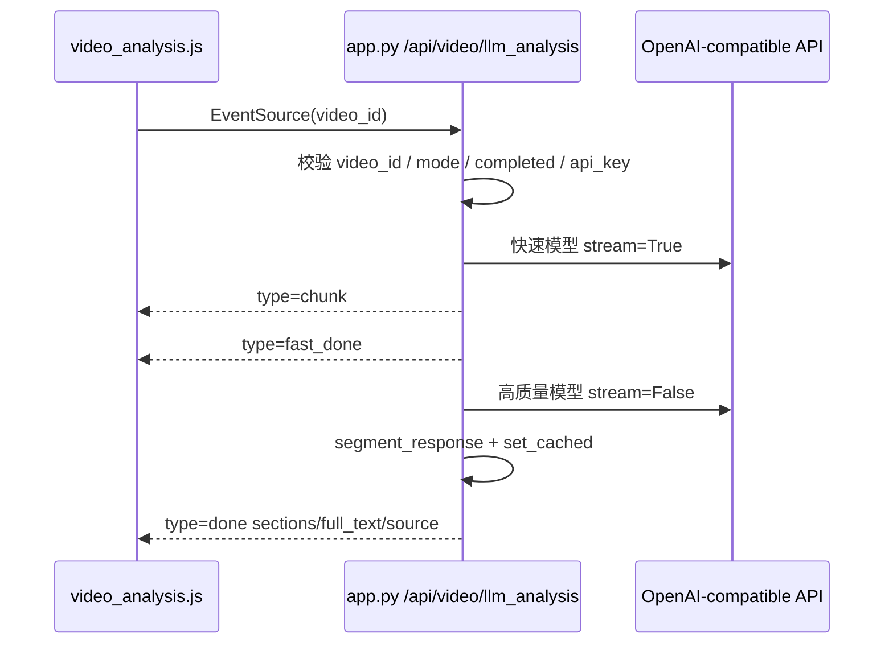

本页说明如何为蹦床视频分析页面启用 **AI 解读**：配置 OpenAI-compatible LLM API Key、可选模型与 Base URL，并理解前端按钮、后端 SSE 接口、双模型调用和缓存的配置边界。AI 解读只在蹦床视频分析完成后可用；视频上传、床面标定、跳次检测和算法细节请分别阅读 [上传、标定、分析与回放操作指南](5-shang-chuan-biao-ding-fen-xi-yu-hui-fang-cao-zuo-zhi-nan)、[蹦床视频分析主流程](3-beng-chuang-shi-pin-fen-xi-zhu-liu-cheng) 和 [SSE 流式返回、缓存与双模型分析](26-sse-liu-shi-fan-hui-huan-cun-yu-shuang-mo-xing-fen-xi)。Sources: [templates/video_analysis.html](templates/video_analysis.html#L116-L147), [static/js/video_analysis.js](static/js/video_analysis.js#L220-L244), [app.py](app.py#L606-L705)

## 配置目标与工作位置

AI 解读功能的配置核心在 `trampoline/llm_service.py`：它从环境变量解析 API Key、Base URL、快速模型和高质量模型，然后使用 `openai.OpenAI` 客户端调用兼容 OpenAI Chat Completions 的接口。项目依赖中已经声明 `openai>=1.0.0`，因此启用 AI 解读的必要条件是安装依赖并在运行 Flask 应用的进程环境中提供可用的 API Key。Sources: [trampoline/llm_service.py](trampoline/llm_service.py#L152-L195), [trampoline/llm_service.py](trampoline/llm_service.py#L198-L229), [requirements.txt](requirements.txt#L10-L12)

```text
fitness-trainer-pose-estimation/
├── app.py                         # 暴露 /api/video/llm_analysis/<video_id> SSE 接口
├── requirements.txt               # 声明 openai>=1.0.0
├── templates/
│   └── video_analysis.html        # AI 分析按钮、流式文本区、四张结果卡片
├── static/
│   └── js/
│       └── video_analysis.js      # EventSource 连接 SSE 并更新页面
└── trampoline/
    └── llm_service.py             # 环境变量解析、Prompt 构建、LLM 调用、缓存
```

以上结构中，**配置入口不是前端页面，而是后端进程环境变量**；前端只负责在分析报告生成后显示“开始 AI 分析”按钮，并通过 `EventSource` 连接后端 SSE 接口。Sources: [templates/video_analysis.html](templates/video_analysis.html#L116-L147), [static/js/video_analysis.js](static/js/video_analysis.js#L505-L570), [app.py](app.py#L606-L705)

## 启用流程总览

下面的流程图展示从“配置环境变量”到“页面收到 AI 解读”的最短路径。注意：后端会先校验视频 ID、蹦床模式、分析完成状态和 API Key；任一条件不满足时，接口会以 SSE error 消息返回，而不是进入模型调用。Sources: [app.py](app.py#L620-L646), [app.py](app.py#L654-L705)

```mermaid
flowchart TD
    A[安装 requirements.txt 依赖] --> B[在运行进程环境中设置 API Key]
    B --> C[可选设置 Base URL 与模型名]
    C --> D[启动 Flask 应用]
    D --> E[上传蹦床视频并完成分析]
    E --> F[前端显示 AI 分析区域与按钮]
    F --> G[点击开始 AI 分析]
    G --> H[/api/video/llm_analysis/video_id SSE]
    H --> I{后端校验通过?}
    I -- 否 --> J[返回 type=error]
    I -- 是 --> K[快速模型流式输出 chunk]
    K --> L[高质量模型同步结果完成后输出 done]
```

前端的 AI 区域默认是隐藏的；只有 `showTrampolineReport(data)` 执行后，页面才会移除 `llmSection` 的隐藏状态并启用 `llmBtn`。因此配置 API Key 只能让接口具备调用能力，不能绕过“必须先完成视频分析”的产品流程。Sources: [static/js/video_analysis.js](static/js/video_analysis.js#L220-L244), [static/js/video_analysis.js](static/js/video_analysis.js#L300-L322)

## 必需配置：API Key

后端按固定优先级读取 API Key：`DEEPSEEK_API_KEY` 优先，其次是 `DS_API_KEY`、`QWEN_API_KEY`、`DASHSCOPE_API_KEY`。只要其中任意一个环境变量有非空值，`resolve_api_key()` 就会返回第一个命中的值；如果全部缺失，后端接口会返回 `LLM API key not configured`，LLM 服务内部也会产生“未配置 LLM API key 环境变量”的错误文本。Sources: [trampoline/llm_service.py](trampoline/llm_service.py#L152-L168), [trampoline/llm_service.py](trampoline/llm_service.py#L212-L219), [app.py](app.py#L643-L646)

| 优先级 | 环境变量 | 用途 | 是否必需 |
|---:|---|---|---|
| 1 | `DEEPSEEK_API_KEY` | DeepSeek 风格命名的主 API Key | 四选一 |
| 2 | `DS_API_KEY` | DeepSeek 简写兼容变量 | 四选一 |
| 3 | `QWEN_API_KEY` | Qwen 风格命名的 API Key | 四选一 |
| 4 | `DASHSCOPE_API_KEY` | DashScope 风格命名的 API Key | 四选一 |

该优先级由测试覆盖：当多个 Key 同时存在时优先使用 `DEEPSEEK_API_KEY`；删除后会依次回退到 `DS_API_KEY`、`QWEN_API_KEY`、`DASHSCOPE_API_KEY`；全部删除时返回空字符串。Sources: [tests/test_llm_service.py](tests/test_llm_service.py#L147-L180)

在 Linux shell 中可以用以下方式为当前终端会话设置 Key，然后从同一个终端启动应用；这里使用占位符，不能提交真实密钥到仓库。Sources: [trampoline/llm_service.py](trampoline/llm_service.py#L152-L168), [app.py](app.py#L708-L717)

```bash
export DEEPSEEK_API_KEY="sk-your-api-key"
python app.py
```

## 可选配置：Base URL

Base URL 也由环境变量解析，优先级为 `DEEPSEEK_BASE_URL`、`DS_BASE_URL`、`QWEN_BASE_URL`；如果没有设置，默认值是 `https://api.deepseek.com`。后端会把解析出的 `base_url` 传给 `openai.OpenAI(api_key=..., base_url=..., timeout=...)`，因此该配置必须指向兼容 OpenAI SDK 的服务端点。Sources: [trampoline/llm_service.py](trampoline/llm_service.py#L171-L178), [trampoline/llm_service.py](trampoline/llm_service.py#L212-L229), [trampoline/llm_service.py](trampoline/llm_service.py#L244-L260)

| 优先级 | 环境变量 | 默认值 | 说明 |
|---:|---|---|---|
| 1 | `DEEPSEEK_BASE_URL` | 无 | 首选 Base URL |
| 2 | `DS_BASE_URL` | 无 | 简写兼容 Base URL |
| 3 | `QWEN_BASE_URL` | 无 | Qwen 兼容 Base URL |
| 默认 | 未设置以上变量 | `https://api.deepseek.com` | 代码内置默认值 |

如果使用非默认服务商，应同时设置 API Key 和 Base URL；如果只设置 API Key 而不设置 Base URL，代码会使用默认的 `https://api.deepseek.com`。Sources: [trampoline/llm_service.py](trampoline/llm_service.py#L171-L178), [trampoline/llm_service.py](trampoline/llm_service.py#L212-L225)

```bash
export DEEPSEEK_API_KEY="sk-your-api-key"
export DEEPSEEK_BASE_URL="https://your-openai-compatible-endpoint"
python app.py
```

## 可选配置：快速模型与高质量模型

AI 解读采用 **双模型路径**：快速模型用于 SSE 流式输出，给前端尽快展示内容；高质量模型在后台线程中同步调用，完成后作为最终结果优先返回。如果高质量模型成功，`done` 消息的 `source` 是 `quality`；如果高质量模型失败但快速模型已有可用文本，则使用 `fast_fallback`；如果两者都失败，则返回“两个模型均调用失败”。Sources: [app.py](app.py#L656-L700)

模型名由 `resolve_models()` 解析。快速模型优先读取 `DEEPSEEK_FAST_MODEL`，其次 `DS_FAST_MODEL`、`QWEN_FAST_MODEL`，默认 `deepseek-v4-flash`；高质量模型优先读取 `DEEPSEEK_MODEL`，其次 `DS_PRO_MODEL`、`QWEN_MODEL`，默认 `deepseek-v4-pro`。Sources: [trampoline/llm_service.py](trampoline/llm_service.py#L181-L195)

| 模型角色 | 优先级 1 | 优先级 2 | 优先级 3 | 默认值 | 调用方式 |
|---|---|---|---|---|---|
| 快速模型 | `DEEPSEEK_FAST_MODEL` | `DS_FAST_MODEL` | `QWEN_FAST_MODEL` | `deepseek-v4-flash` | `stream=True` |
| 高质量模型 | `DEEPSEEK_MODEL` | `DS_PRO_MODEL` | `QWEN_MODEL` | `deepseek-v4-pro` | `stream=False` |

测试确认默认模型分别是 `deepseek-v4-flash` 和 `deepseek-v4-pro`，并确认自定义 `DEEPSEEK_FAST_MODEL`、`DEEPSEEK_MODEL` 会覆盖默认值；当 DeepSeek 变量缺失时，代码会回退到 `DS_FAST_MODEL` 和 `DS_PRO_MODEL`。Sources: [tests/test_llm_service.py](tests/test_llm_service.py#L183-L211)

典型配置如下；模型名称必须是目标 Base URL 对应服务实际支持的名称，因为代码会原样传入 `client.chat.completions.create(model=model, ...)`。Sources: [trampoline/llm_service.py](trampoline/llm_service.py#L221-L229), [trampoline/llm_service.py](trampoline/llm_service.py#L252-L260)

```bash
export DEEPSEEK_API_KEY="sk-your-api-key"
export DEEPSEEK_FAST_MODEL="deepseek-v4-flash"
export DEEPSEEK_MODEL="deepseek-v4-pro"
python app.py
```

## 运行前检查

运行前至少检查两项：依赖中包含 `openai>=1.0.0`，并且启动应用的进程能读取 API Key。若没有安装 `openai`，流式调用会返回“openai 库未安装，请运行 pip install openai”，同步调用会返回“openai 库未安装”。Sources: [requirements.txt](requirements.txt#L10-L12), [trampoline/llm_service.py](trampoline/llm_service.py#L206-L210), [trampoline/llm_service.py](trampoline/llm_service.py#L237-L243)

```bash
pip install -r requirements.txt
export DEEPSEEK_API_KEY="sk-your-api-key"
python app.py
```

应用启动入口在 `app.py` 末尾，控制台会打印本地访问地址和可用页面；AI 解读页面位于 `/video_analysis`，但必须先完成蹦床视频分析，才能在报告区域看到 AI 分析按钮。Sources: [app.py](app.py#L708-L717), [templates/video_analysis.html](templates/video_analysis.html#L116-L147), [static/js/video_analysis.js](static/js/video_analysis.js#L220-L244)

## 前端触发与返回内容

点击“开始 AI 分析”后，前端会关闭旧的 `EventSource`，清空流式文本区，隐藏已有卡片，然后连接 `/api/video/llm_analysis/${currentVideoId}`。当收到 `chunk` 消息时，前端把文本追加到流式区域；收到 `fast_done` 时，提示正在生成高质量分析；收到 `done` 时，前端将后端分段后的内容填入“整体表现、主要问题、逐跳点评、改进建议”四张卡片。Sources: [static/js/video_analysis.js](static/js/video_analysis.js#L505-L555)

后端要求 LLM 输出严格包含四个 Markdown 二级标题：`整体表现`、`主要问题`、`逐跳点评`、`改进建议`。最终文本会通过 `segment_response()` 按这些标题切分，缺失的标题会得到空字符串，前端则显示“AI 未生成此部分”。Sources: [trampoline/llm_service.py](trampoline/llm_service.py#L70-L92), [trampoline/llm_service.py](trampoline/llm_service.py#L278-L296), [static/js/video_analysis.js](static/js/video_analysis.js#L538-L550)



## 缓存行为

AI 解读结果按 `video_id` 缓存在内存字典 `_llm_cache` 中，缓存内容包含 `full_text`、`sections` 和 `timestamp`，缓存 TTL 是 1800 秒。后端在发起新模型调用前会先检查缓存；如果命中，直接返回 `done` 消息，不再调用模型。Sources: [trampoline/llm_service.py](trampoline/llm_service.py#L299-L322), [app.py](app.py#L647-L653)

缓存是进程内结构，并且键是 `video_id`；当前代码没有将 AI 解读结果写入文件或数据库。测试覆盖了 `set_cached()` 与 `get_cached()` 的基本命中和未命中行为。Sources: [trampoline/llm_service.py](trampoline/llm_service.py#L301-L322), [tests/test_llm_service.py](tests/test_llm_service.py#L133-L145)

## 常见问题排查

| 现象 | 后端或前端表现 | 可验证原因 | 处理动作 |
|---|---|---|---|
| 点击后提示 `LLM API key not configured` | SSE 返回 `type=error` | 后端 `resolve_api_key()` 返回空字符串 | 在启动 Flask 的同一环境中设置 `DEEPSEEK_API_KEY`、`DS_API_KEY`、`QWEN_API_KEY` 或 `DASHSCOPE_API_KEY` |
| 页面显示“连接中断” | 前端 `EventSource.onerror` 触发 | SSE 连接异常或后端未完成响应 | 查看后端日志，并确认接口路径 `/api/video/llm_analysis/<video_id>` 可访问 |
| 返回 `Video analysis not yet complete` | SSE 返回 `type=error` | `analysis.status` 不是 `completed` | 等待蹦床视频分析完成后再点击 AI 分析 |
| 返回 `LLM analysis only available for trampoline mode` | SSE 返回 `type=error` | `analysis.mode` 不是 `trampoline` | 使用蹦床视频分析流程 |
| 文本区出现 `[ERROR] LLM 调用失败...` | LLM 服务返回错误文本 | OpenAI-compatible API 调用抛出异常 | 检查 Base URL、模型名、Key 权限和服务端可用性 |

这些现象都来自明确的代码分支：接口会校验视频是否存在、是否为蹦床模式、是否已完成分析、是否配置 API Key；前端会在 SSE error 时显示连接中断；LLM 服务会在 SDK 缺失、Key 缺失或接口异常时返回错误文本。Sources: [app.py](app.py#L620-L646), [static/js/video_analysis.js](static/js/video_analysis.js#L556-L570), [trampoline/llm_service.py](trampoline/llm_service.py#L206-L234)

## 建议阅读顺序

完成本页配置后，建议先回到 [上传、标定、分析与回放操作指南](5-shang-chuan-biao-ding-fen-xi-yu-hui-fang-cao-zuo-zhi-nan) 验证端到端操作，再阅读 [结构化分析报告模型](24-jie-gou-hua-fen-xi-bao-gao-mo-xing) 理解 AI 输入数据，随后阅读 [提示词构建与输出约束](25-ti-shi-ci-gou-jian-yu-shu-chu-yue-shu) 理解四段式输出要求，最后阅读 [SSE 流式返回、缓存与双模型分析](26-sse-liu-shi-fan-hui-huan-cun-yu-shuang-mo-xing-fen-xi) 深入理解当前配置项如何参与运行时调用链。Sources: [trampoline/llm_service.py](trampoline/llm_service.py#L20-L65), [trampoline/llm_service.py](trampoline/llm_service.py#L70-L147), [app.py](app.py#L606-L705)