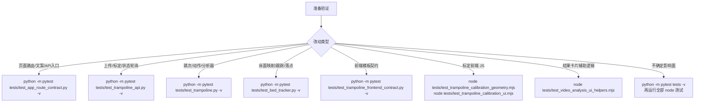

本页定位在目录中的“入门”阶段，目标是让中级开发者用最短路径完成仓库的**测试发现、局部回归、前后端契约验证与算法单元验证**；它只覆盖命令速查与测试选择，不展开具体算法、API 生命周期或前端交互细节，后续可转到 [测试体系与回归保护](27-ce-shi-ti-xi-yu-hui-gui-bao-hu) 阅读更完整的质量保障设计。Sources: [README.md](README.md#L114-L128)

## 一页判断：先跑哪条命令

如果你刚拉取仓库或准备提交改动，建议先运行 Python 测试全集，再运行三个 Node 前端纯函数/控制器测试；仓库 README 已列出常用 Python 与 Node 测试入口，当前 `tests/` 目录还包含 `test_video_analysis_ui_helpers.mjs` 这个前端辅助函数测试文件，因此本页把它也纳入速查清单。Sources: [README.md](README.md#L114-L128), [tests/test_video_analysis_ui_helpers.mjs](tests/test_video_analysis_ui_helpers.mjs#L1-L68)

```bash
python -m pytest tests -v
node tests/test_trampoline_calibration_geometry.mjs
node tests/test_trampoline_calibration_ui.mjs
node tests/test_video_analysis_ui_helpers.mjs
```

上述三类命令覆盖的验证面可以概括为：Python `pytest` 负责 Flask 路由/API、蹦床算法、床面跟踪、覆盖层与 LLM 服务；Node 直接执行 ES module 测试文件，验证标定几何、标定 UI 状态机与视频分析紧凑统计辅助函数。Sources: [tests/test_app_route_contract.py](tests/test_app_route_contract.py#L19-L97), [tests/test_trampoline_api.py](tests/test_trampoline_api.py#L53-L238), [tests/test_trampoline_calibration_geometry.mjs](tests/test_trampoline_calibration_geometry.mjs#L1-L80), [tests/test_trampoline_calibration_ui.mjs](tests/test_trampoline_calibration_ui.mjs#L187-L316), [tests/test_video_analysis_ui_helpers.mjs](tests/test_video_analysis_ui_helpers.mjs#L1-L68)

## 验证地图

下面的图把“命令 → 测试文件 → 保护对象”压缩成一个执行地图：你可以从改动位置反推需要运行的最小命令，也可以在不确定影响面时直接运行全集。Sources: [tests/test_app_route_contract.py](tests/test_app_route_contract.py#L6-L97), [tests/test_trampoline_api.py](tests/test_trampoline_api.py#L14-L238), [tests/test_trampoline.py](tests/test_trampoline.py#L63-L474), [tests/test_bed_tracker.py](tests/test_bed_tracker.py#L36-L336)



这张图反映的是测试文件中可验证的事实：路由契约测试检查保留页面、删除旧健身端点、上传类型限制与前端引用泄漏；API 测试检查上传后待标定状态、状态字段、启动幂等、清理、关键帧标定排序与重复帧拒绝；算法测试检查跳次检测、动作分类、滞回、分析器状态字段；床面测试检查图像到床面映射、落点区域、边界校验、跟踪恢复、关键帧过渡与小地图绘制。Sources: [tests/test_app_route_contract.py](tests/test_app_route_contract.py#L19-L97), [tests/test_trampoline_api.py](tests/test_trampoline_api.py#L53-L238), [tests/test_trampoline.py](tests/test_trampoline.py#L78-L474), [tests/test_bed_tracker.py](tests/test_bed_tracker.py#L36-L336)

## 项目中与测试直接相关的结构

测试入口集中在 `tests/` 目录，业务代码按 Flask 后端、视频处理、蹦床分析模块、模板和静态资源分布；README 的目录结构明确把 `tests/` 与 `app.py`、`video_processor.py`、`trampoline/`、`templates/`、`static/` 放在同一层级，便于按改动目录选择测试命令。Sources: [README.md](README.md#L87-L110)

```text
project-root/
├── app.py
├── video_processor.py
├── trampoline/
│   ├── analyzer.py
│   ├── bed_tracker.py
│   ├── jump_detector.py
│   ├── action_classifier.py
│   ├── overlay.py
│   └── llm_service.py
├── templates/
├── static/
│   └── js/
└── tests/
    ├── test_app_route_contract.py
    ├── test_trampoline_api.py
    ├── test_trampoline_frontend_contract.py
    ├── test_trampoline.py
    ├── test_bed_tracker.py
    ├── test_trampoline_overlay.py
    ├── test_llm_service.py
    ├── test_trampoline_calibration_geometry.mjs
    ├── test_trampoline_calibration_ui.mjs
    └── test_video_analysis_ui_helpers.mjs
```

`tests/conftest.py` 会把仓库根目录加入 `sys.path`，因此 Python 测试可直接 `import app` 或导入 `trampoline.*` 模块；这也是推荐使用 `python -m pytest ...` 从仓库根目录执行的原因。Sources: [tests/conftest.py](tests/conftest.py#L1-L8), [tests/test_app_route_contract.py](tests/test_app_route_contract.py#L1-L4), [tests/test_trampoline.py](tests/test_trampoline.py#L9-L13)

## 命令速查表

下表按“你改了什么”组织命令；如果一次改动跨越多个区域，按行叠加执行，或者直接运行 Python 全集与全部 Node 测试。Sources: [README.md](README.md#L114-L128), [tests/test_app_route_contract.py](tests/test_app_route_contract.py#L6-L97), [tests/test_trampoline_api.py](tests/test_trampoline_api.py#L14-L238)

| 场景 | 推荐命令 | 主要验证内容 |
|---|---|---|
| Python 全量回归 | `python -m pytest tests -v` | 运行 `tests/` 下所有 Python 测试文件 |
| 页面路由与旧端点清理 | `python -m pytest tests/test_app_route_contract.py -v` | `/`、`/dashboard`、`/profile`、`/video_analysis` 返回 200；旧健身端点返回 404；上传类型与 LLM 路由基本契约 |
| 前端模板契约 | `python -m pytest tests/test_trampoline_frontend_contract.py -v` | JS 中引用的 DOM id 是否存在；视频分析页是否包含标定 UI、统计卡片和脚本 |
| 上传、标定、状态 API | `python -m pytest tests/test_trampoline_api.py -v` | 上传待标定、状态字段同步、启动幂等、过期清理、多关键帧标定与重复关键帧拒绝 |
| 床面跟踪与落点映射 | `python -m pytest tests/test_bed_tracker.py -v` | 四角校验、图像到床面坐标、落点区域、ORB 重定位、关键帧过渡、小地图绘制 |
| 覆盖层状态样式 | `python -m pytest tests/test_trampoline_overlay.py -v` | 床面覆盖层在 trusted/frozen/lost/low_confidence 状态下的颜色和标签 |
| 跳次、动作分类、分析器 | `python -m pytest tests/test_trampoline.py -v` | 跳次阶段、动作分类、分腿跳、滞回、多帧稳定性、分析器输出字段 |
| LLM 报告层 | `python -m pytest tests/test_llm_service.py -v` | 报告结构、提示词、分段、缓存、API key 与模型解析 |
| 标定几何 JS | `node tests/test_trampoline_calibration_geometry.mjs` | contain 显示矩形、显示/图像坐标互转、帧号换算、标定 payload 排序 |
| 标定 UI JS | `node tests/test_trampoline_calibration_ui.mjs` | 标定 UI 状态描述、画布要求、关键帧保存、重置行为 |
| 视频分析辅助 JS | `node tests/test_video_analysis_ui_helpers.mjs` | 紧凑统计中滞空时间、动作、落点的选择规则 |

## 环境与依赖确认

运行应用相关测试前，应先安装仓库运行依赖；README 给出的安装流程是创建虚拟环境、激活环境并执行 `pip install -r requirements.txt`，而 `requirements.txt` 声明了 Flask、OpenCV、MediaPipe、NumPy、imageio、imageio-ffmpeg 与 OpenAI 兼容客户端等运行依赖。Sources: [README.md](README.md#L37-L46), [requirements.txt](requirements.txt#L1-L15)

```bash
python -m venv venv
source venv/bin/activate
pip install -r requirements.txt
```

Python 测试文件直接使用 `pytest` 的 fixture、断言辅助或近似比较，例如 API 测试使用 `pytest.fixture` 隔离上传目录，床面测试使用 `pytest.approx` 和异常断言，LLM 测试也使用 `pytest.fixture` 构造模拟分析数据；因此执行 Python 测试时需要当前环境可导入 `pytest`。Sources: [tests/test_trampoline_api.py](tests/test_trampoline_api.py#L7-L19), [tests/test_bed_tracker.py](tests/test_bed_tracker.py#L5-L16), [tests/test_llm_service.py](tests/test_llm_service.py#L5-L15)

Node 测试文件使用 Node 内置的 `node:assert/strict`，并直接从 `static/js/` 导入 ES module；从仓库根目录执行 `node tests/<file>.mjs` 即可覆盖这些前端纯逻辑测试。Sources: [tests/test_trampoline_calibration_geometry.mjs](tests/test_trampoline_calibration_geometry.mjs#L1-L10), [tests/test_trampoline_calibration_ui.mjs](tests/test_trampoline_calibration_ui.mjs#L1-L5), [tests/test_video_analysis_ui_helpers.mjs](tests/test_video_analysis_ui_helpers.mjs#L1-L4)

## 常用执行路径

第一次验证建议使用“全量后局部”的路径：先运行 `python -m pytest tests -v` 建立基线，再运行三个 Node 命令补齐前端 ES module 逻辑；README 中列出的常用命令已经覆盖多数 Python 与 Node 测试，本页额外补充 `test_video_analysis_ui_helpers.mjs`，因为它在 `tests/` 目录中验证视频分析紧凑统计辅助函数。Sources: [README.md](README.md#L114-L128), [tests/test_video_analysis_ui_helpers.mjs](tests/test_video_analysis_ui_helpers.mjs#L1-L68)

```bash
python -m pytest tests -v
node tests/test_trampoline_calibration_geometry.mjs
node tests/test_trampoline_calibration_ui.mjs
node tests/test_video_analysis_ui_helpers.mjs
```

如果只改了页面模板或静态 JS 的 DOM 绑定，优先运行前端契约测试和对应 Node 测试：`test_trampoline_frontend_contract.py` 会对比 JS 中 `getElementById(...)` 引用与模板 id，并检查视频分析页是否包含标定画布、关键按钮、统计区域和脚本引用；Node 标定 UI 测试会进一步验证控制器进入待标定、添加关键帧、点击四角、保存 payload 和重置草稿的行为。Sources: [tests/test_trampoline_frontend_contract.py](tests/test_trampoline_frontend_contract.py#L7-L64), [tests/test_trampoline_calibration_ui.mjs](tests/test_trampoline_calibration_ui.mjs#L217-L315)

```bash
python -m pytest tests/test_trampoline_frontend_contract.py -v
node tests/test_trampoline_calibration_geometry.mjs
node tests/test_trampoline_calibration_ui.mjs
node tests/test_video_analysis_ui_helpers.mjs
```

如果只改了上传、标定启动或状态轮询相关后端逻辑，优先运行 API 生命周期测试；该文件通过 `isolated_uploads` fixture 隔离上传目录、清理 `video_analyses`、替换子进程处理函数，并用合成 MP4 验证上传后状态、首帧、视频尺寸、FPS、标定启动、幂等冲突、过期清理、多关键帧排序和重复帧拒绝。Sources: [tests/test_trampoline_api.py](tests/test_trampoline_api.py#L14-L50), [tests/test_trampoline_api.py](tests/test_trampoline_api.py#L53-L238)

```bash
python -m pytest tests/test_trampoline_api.py -v
```

如果只改了跳次分割、动作分类或分析器输出字段，优先运行 `test_trampoline.py`；该文件使用合成 MediaPipe landmark 数据验证角度计算、跳次阶段、完整跳跃周期、低可见度容错、直体/屈体/团身/分腿跳分类、滞回、防闪烁、逐跳投票与分析器状态字段。Sources: [tests/test_trampoline.py](tests/test_trampoline.py#L16-L60), [tests/test_trampoline.py](tests/test_trampoline.py#L63-L474)

```bash
python -m pytest tests/test_trampoline.py -v
```

如果只改了床面标定、跟踪或落点绘制，优先运行 `test_bed_tracker.py` 和 `test_trampoline_overlay.py`；前者验证四角映射、落点区域、无效四边形拒绝、sidecar 解析、低置信落点、受控透视恢复、ORB 重定位、手动关键帧过渡、标记线与小地图边界，后者验证床面覆盖层不同可信状态的颜色与标签。Sources: [tests/test_bed_tracker.py](tests/test_bed_tracker.py#L36-L336), [tests/test_trampoline_overlay.py](tests/test_trampoline_overlay.py#L1-L20)

```bash
python -m pytest tests/test_bed_tracker.py -v
python -m pytest tests/test_trampoline_overlay.py -v
```

如果只改了 AI 解读层，优先运行 `test_llm_service.py`；该文件验证 `AnalysisReport.from_video_analysis`、动作分布、滞空时间补充、默认字段、提示词结构、额外段落、流式 chunk 清理、Markdown 分段、缓存、API key 优先级与模型解析。Sources: [tests/test_llm_service.py](tests/test_llm_service.py#L30-L200)

```bash
python -m pytest tests/test_llm_service.py -v
```

## 结果解读与失败定位

当 `test_app_route_contract.py` 失败时，先看失败断言属于“保留路由未返回 200”“已删除旧端点未返回 404”“视频分析页默认模式不符合预期”“上传错误信息变化”还是“前端残留旧端点引用”；该测试文件把这些契约拆成独立测试函数，失败名称通常已经能定位到页面路由、上传参数或静态资源引用。Sources: [tests/test_app_route_contract.py](tests/test_app_route_contract.py#L19-L97)

当 `test_trampoline_api.py` 失败时，优先确认失败点在上传阶段、状态字段同步、启动幂等、完成态复用、过期清理、多关键帧 sidecar 写入还是重复关键帧拒绝；测试中明确断言了 `uploaded_pending_calibration`、`processing`、`completed`、`expired`、`calibration_rejected` 等状态，适合用来判断 API 契约是否被破坏。Sources: [tests/test_trampoline_api.py](tests/test_trampoline_api.py#L53-L238)

当前端 Node 测试失败时，按文件名分流：几何测试失败通常意味着坐标映射、letterbox/contain 计算、帧号换算或 payload 归一化有变化；UI 测试失败通常意味着标定状态文案、按钮可用性、点击画布、保存关键帧或重置行为有变化；辅助函数测试失败通常意味着紧凑统计选择当前飞行、最后完成跳或过滤中间跳的规则有变化。Sources: [tests/test_trampoline_calibration_geometry.mjs](tests/test_trampoline_calibration_geometry.mjs#L16-L80), [tests/test_trampoline_calibration_ui.mjs](tests/test_trampoline_calibration_ui.mjs#L187-L316), [tests/test_video_analysis_ui_helpers.mjs](tests/test_video_analysis_ui_helpers.mjs#L6-L68)

## 最小回归选择矩阵

这张矩阵用于提交前快速选择命令；它不是替代全量回归，而是在改动范围明确时减少等待时间。Sources: [tests/test_trampoline_frontend_contract.py](tests/test_trampoline_frontend_contract.py#L7-L64), [tests/test_trampoline_api.py](tests/test_trampoline_api.py#L53-L238), [tests/test_bed_tracker.py](tests/test_bed_tracker.py#L36-L336), [tests/test_llm_service.py](tests/test_llm_service.py#L30-L200)

| 改动文件/区域 | 最小建议命令 |
|---|---|
| `templates/video_analysis.html` | `python -m pytest tests/test_trampoline_frontend_contract.py -v` |
| `static/js/trampoline_calibration_geometry.js` | `node tests/test_trampoline_calibration_geometry.mjs` |
| `static/js/trampoline_calibration_ui.js` | `node tests/test_trampoline_calibration_ui.mjs` 和 `python -m pytest tests/test_trampoline_frontend_contract.py -v` |
| `static/js/video_analysis_helpers.js` | `node tests/test_video_analysis_ui_helpers.mjs` |
| `static/js/video_analysis.js` | `python -m pytest tests/test_trampoline_frontend_contract.py -v`，必要时再运行 `node tests/test_video_analysis_ui_helpers.mjs` |
| `app.py` 的页面/API 契约 | `python -m pytest tests/test_app_route_contract.py -v` 和 `python -m pytest tests/test_trampoline_api.py -v` |
| `trampoline/jump_detector.py`、`trampoline/action_classifier.py`、`trampoline/analyzer.py` | `python -m pytest tests/test_trampoline.py -v` |
| `trampoline/bed_tracker.py` | `python -m pytest tests/test_bed_tracker.py -v` |
| `trampoline/overlay.py` | `python -m pytest tests/test_trampoline_overlay.py -v` 和 `python -m pytest tests/test_bed_tracker.py -v` |
| `trampoline/llm_service.py` | `python -m pytest tests/test_llm_service.py -v` |

## 推荐阅读顺序

完成本页命令验证后，如果你想理解这些测试为什么存在，建议下一步阅读 [测试体系与回归保护](27-ce-shi-ti-xi-yu-hui-gui-bao-hu)；如果失败集中在 API 生命周期，转到 [后端路由、状态机与任务生命周期](9-hou-duan-lu-you-zhuang-tai-ji-yu-ren-wu-sheng-ming-zhou-qi) 和 [前后端 API 契约](11-qian-hou-duan-api-qi-yue)；如果失败集中在标定、跟踪或落点，转到 [四角标定与关键帧补标](16-si-jiao-biao-ding-yu-guan-jian-zheng-bu-biao)、[床面跟踪、置信度与漂移修正](17-chuang-mian-gen-zong-zhi-xin-du-yu-piao-yi-xiu-zheng) 与 [落点数据结构与可视化](19-luo-dian-shu-ju-jie-gou-yu-ke-shi-hua)。Sources: [README.md](README.md#L114-L128)

如果失败集中在视频分析页面交互或结果展示，继续阅读 [视频分析页面交互模型](20-shi-pin-fen-xi-ye-mian-jiao-hu-mo-xing)、[标定画布几何计算](21-biao-ding-hua-bu-ji-he-ji-suan) 与 [分析进度轮询与结果展示](22-fen-xi-jin-du-lun-xun-yu-jie-guo-zhan-shi)；如果失败集中在 LLM 测试，继续阅读 [结构化分析报告模型](24-jie-gou-hua-fen-xi-bao-gao-mo-xing)、[提示词构建与输出约束](25-ti-shi-ci-gou-jian-yu-shu-chu-yue-shu) 与 [SSE 流式返回、缓存与双模型分析](26-sse-liu-shi-fan-hui-huan-cun-yu-shuang-mo-xing-fen-xi)。Sources: [tests/test_trampoline_frontend_contract.py](tests/test_trampoline_frontend_contract.py#L22-L64), [tests/test_trampoline_calibration_geometry.mjs](tests/test_trampoline_calibration_geometry.mjs#L16-L80), [tests/test_llm_service.py](tests/test_llm_service.py#L62-L200)