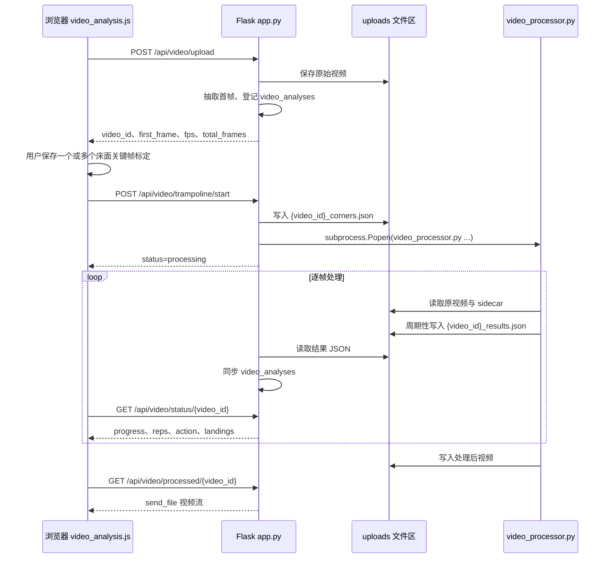
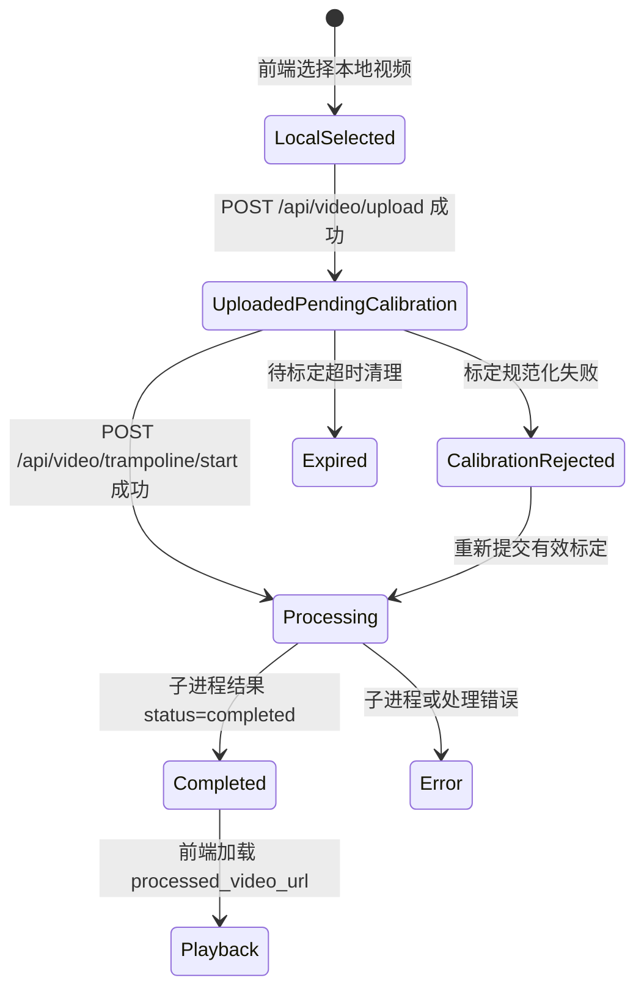

本页定位在“深入解析 / 系统架构”的第一站，目标是把蹦床视频分析从浏览器上传、床面标定、后端任务启动、独立处理进程、状态轮询到结果回放的**端到端数据路径**一次性对齐；具体算法细节、路由状态机细节、独立进程实现细节和 API 字段契约会在后续页面展开。Sources: [templates/video_analysis.html](templates/video_analysis.html#L23-L73), [app.py](app.py#L269-L365), [app.py](app.py#L368-L457), [app.py](app.py#L460-L603)

## 架构假设与验证结论

从第一性原理看，这个系统不是“浏览器直接分析视频”，而是一个**浏览器负责采集用户输入与展示结果、Flask 负责会话态与任务编排、独立 Python 子进程负责逐帧计算与渲染**的三段式架构；验证依据是前端只上传文件、提交标定和轮询状态，Flask 将上传文件与标定元数据写入 `uploads` 相关路径并启动线程，而线程再通过 `subprocess.Popen` 调用 `video_processor.py`。Sources: [static/js/video_analysis.js](static/js/video_analysis.js#L426-L467), [static/js/trampoline_calibration_ui.js](static/js/trampoline_calibration_ui.js#L382-L405), [app.py](app.py#L324-L351), [app.py](app.py#L447-L449), [app.py](app.py#L460-L490)

第二个已验证模式是：后端内存字典 `video_analyses` 是 Web 请求层的**任务状态投影**，不是最终计算引擎；真正的帧级结果由 `video_processor.py` 周期性写入结果 JSON，Flask 线程循环读取该 JSON 并同步到 `video_analyses`，最终 `/api/video/status/<video_id>` 再把该状态返回给前端。Sources: [app.py](app.py#L31-L38), [video_processor.py](video_processor.py#L84-L107), [video_processor.py](video_processor.py#L301-L303), [app.py](app.py#L492-L516), [app.py](app.py#L570-L603)

第三个已验证模式是：床面标定不是分析进程内部临时交互，而是在分析前由前端生成关键帧标定数组，后端规范化后写入 sidecar JSON，独立处理进程再读取这个 sidecar 初始化 `BedTracker`；这使“用户输入的几何事实”和“逐帧分析计算”之间形成一个明确的文件边界。Sources: [static/js/trampoline_calibration_ui.js](static/js/trampoline_calibration_ui.js#L362-L391), [app.py](app.py#L411-L437), [video_processor.py](video_processor.py#L189-L199), [video_processor.py](video_processor.py#L200-L214)

## 顶层组件关系

下图展示的是端到端主链路的组件关系：浏览器页面承载视频选择、标定画布、实时统计、落点图、报告区域和日志区域；Flask 应用承载上传、启动、状态、处理后视频下载等接口；独立视频处理器承载 MediaPipe、蹦床分析器、床面跟踪与覆盖层渲染。Sources: [templates/video_analysis.html](templates/video_analysis.html#L23-L181), [app.py](app.py#L269-L365), [app.py](app.py#L368-L457), [app.py](app.py#L551-L603), [video_processor.py](video_processor.py#L77-L83)

```mermaid
flowchart LR
    U[用户] --> B[浏览器视频分析页]
    B -->|POST /api/video/upload<br/>视频文件 + exercise_type| F[Flask app.py]
    F -->|返回 video_id + 首帧图像 + fps + 帧数| B
    B -->|床面关键帧标定<br/>video_id + calibrations| F
    F -->|写入 uploads/{video_id}_corners.json| S[(Sidecar 标定文件)]
    F -->|线程启动 subprocess| P[video_processor.py]
    P -->|读取原视频| V[(uploads 原始视频)]
    P -->|读取标定 sidecar| S
    P -->|逐帧姿态、跳次、动作、落点、覆盖层| R[(结果 JSON + 处理后视频)]
    F -->|循环读取结果 JSON<br/>同步内存状态| M[(video_analyses)]
    B -->|GET /api/video/status/{video_id}| F
    F -->|进度、跳次、动作、落点、processed_video_url| B
    B -->|GET /api/video/processed/{video_id}| F
    F -->|send_file 处理后视频| B
```

该架构的关键边界在于：浏览器不持有后端计算状态，Flask 不直接执行逐帧 MediaPipe 主循环，视频处理器不直接响应浏览器请求；三者通过 HTTP、sidecar 文件、结果 JSON 和内存状态投影组合成一条异步处理链。Sources: [static/js/video_analysis.js](static/js/video_analysis.js#L443-L467), [static/js/video_analysis.js](static/js/video_analysis.js#L300-L332), [app.py](app.py#L483-L516), [video_processor.py](video_processor.py#L236-L303)

## 运行时数据流

端到端数据流从用户选择视频开始：前端将本地文件绑定到 `<video>` 元素用于预览，并在用户点击“上传并进入标定”时通过 `FormData` 发送到 `/api/video/upload`，同时固定提交 `exercise_type=trampoline`。Sources: [static/js/video_analysis.js](static/js/video_analysis.js#L364-L374), [static/js/video_analysis.js](static/js/video_analysis.js#L426-L445)

上传接口执行输入边界检查：要求存在 `video` 文件、要求 `exercise_type` 为 `trampoline`、检查空文件名、检查文件大小、用 OpenCV 获取 fps 与帧数并限制视频时长，然后抽取首帧并创建 `uploaded_pending_calibration` 状态。Sources: [app.py](app.py#L269-L323), [app.py](app.py#L324-L365)

前端收到上传成功响应后，不立即启动分析，而是进入“待标定”阶段：它保存 `video_id`，提示用户完成床面关键帧标定，并把首帧图像与视频 fps 传给标定控制器。Sources: [static/js/video_analysis.js](static/js/video_analysis.js#L454-L467), [static/js/trampoline_calibration_ui.js](static/js/trampoline_calibration_ui.js#L413-L429)

标定控制器允许用户在当前视频帧保存四角点，每个关键帧保存为 `frame_index`、`time_s`、`preview_image` 和 `corners_px`；开始分析时，它把 `video_id` 与 `calibrations` 作为 JSON 提交到 `/api/video/trampoline/start`。Sources: [static/js/trampoline_calibration_ui.js](static/js/trampoline_calibration_ui.js#L337-L379), [static/js/trampoline_calibration_ui.js](static/js/trampoline_calibration_ui.js#L382-L405)

启动接口将标定数据规范化，生成包含 `schema_version`、`video_id`、`corner_order`、`corners_px`、`calibrations` 和床面尺寸的 sidecar JSON，并把分析状态切换为 `processing` 后启动后台线程。Sources: [app.py](app.py#L380-L437), [app.py](app.py#L439-L457)

后台线程不是直接处理视频，而是构造命令行参数调用 `video_processor.py`：参数包括原始视频路径、运动类型、结果 JSON 路径和处理后视频路径；随后线程持续读取子进程输出和结果 JSON，把计算进度同步回内存状态。Sources: [app.py](app.py#L460-L490), [app.py](app.py#L492-L516)

处理器启动后初始化结果结构，打开视频，读取总帧数、fps、分辨率，创建输出视频 writer，初始化 MediaPipe Pose，再读取 sidecar 创建 `BedTracker`，最后实例化 `TrampolineAnalyzer` 并进入逐帧循环。Sources: [video_processor.py](video_processor.py#L77-L103), [video_processor.py](video_processor.py#L121-L187), [video_processor.py](video_processor.py#L189-L214)

逐帧循环中，处理器更新床面跟踪、执行姿态检测、绘制骨架和角度弧线，并按 `analyze_skip` 抽样调用 `TrampolineAnalyzer.process_frame` 生成跳次、动作、阶段、滞空帧数、落点等结构化结果；这些结果同时进入当前帧覆盖层、结果 JSON 和最终视频。Sources: [video_processor.py](video_processor.py#L235-L303), [trampoline/analyzer.py](trampoline/analyzer.py#L22-L86)

前端以 200ms 间隔轮询 `/api/video/status/<video_id>`，收到 `processing` 状态时更新进度、跳次、动作、落点等实时统计；收到 `completed` 状态时停止轮询、将视频源切换为 `processed_video_url` 并展示报告。Sources: [static/js/video_analysis.js](static/js/video_analysis.js#L300-L332), [app.py](app.py#L570-L603)

## 端到端时序

下面的时序图把“上传 → 标定 → 启动 → 子进程处理 → 轮询 → 回放”的主路径压缩到一个可验证序列；它强调一个事实：用户提交标定之后，浏览器与处理器之间没有直接连接，浏览器只和 Flask 交互。Sources: [static/js/video_analysis.js](static/js/video_analysis.js#L443-L467), [static/js/trampoline_calibration_ui.js](static/js/trampoline_calibration_ui.js#L382-L405), [app.py](app.py#L460-L516), [static/js/video_analysis.js](static/js/video_analysis.js#L300-L332)



这个时序让任务生命周期具备两个明显的异步层：第一层是 Flask 请求线程与后台线程分离，第二层是后台线程与独立视频处理子进程分离；因此浏览器无需等待上传请求同步完成整段视频分析。Sources: [app.py](app.py#L447-L449), [app.py](app.py#L483-L490), [app.py](app.py#L492-L516), [static/js/video_analysis.js](static/js/video_analysis.js#L300-L332)

## 数据对象与边界

端到端主链路中有四类核心数据对象：原始视频文件、标定 sidecar、增量结果 JSON、内存状态投影；它们分别服务于上传持久化、几何输入持久化、进程间结果交换和 HTTP 状态响应。Sources: [app.py](app.py#L296-L300), [app.py](app.py#L421-L437), [video_processor.py](video_processor.py#L105-L107), [app.py](app.py#L501-L516)

| 数据对象 | 生产者 | 消费者 | 主要字段或内容 | 架构作用 |
|---|---|---|---|---|
| 原始视频文件 | `/api/video/upload` | `video_processor.py` | 上传文件路径、fps、帧数 | 后端分析输入 |
| 首帧图像响应 | `/api/video/upload` | 标定 UI | `first_frame_b64`、`image_size`、`video_fps` | 引导标定阶段 |
| 标定 sidecar | `/api/video/trampoline/start` | `BedTracker.from_sidecar` | `corners_px`、`calibrations`、`bed_dimensions_m` | 把用户几何输入传给处理器 |
| 结果 JSON | `video_processor.py` | Flask 后台线程 | `progress`、`reps`、`completed_jumps`、`landings` | 子进程到 Web 层的同步介质 |
| 内存状态 `video_analyses` | Flask 上传与同步逻辑 | `/api/video/status/<video_id>` | `status`、`progress`、`current_action`、`processed_video` | 浏览器轮询读取的任务状态 |

Sources: [app.py](app.py#L324-L351), [app.py](app.py#L354-L365), [app.py](app.py#L421-L437), [video_processor.py](video_processor.py#L84-L103), [app.py](app.py#L581-L603)

## 前端职责边界

前端页面的结构显示，它同时包含上传区、视频播放器、标定画布、进度条、控制按钮、实时统计、落点图、报告区、AI 分析区、反馈日志和处理日志；这些元素构成的是交互与展示层，而不是帧级分析层。Sources: [templates/video_analysis.html](templates/video_analysis.html#L23-L181)

前端脚本的职责可以概括为四个动作：加载视频并预览、上传视频并进入标定、提交标定并启动后端任务、轮询状态并把结果映射到 UI；其中 `startAnalysisPolling(videoId)` 是前端和后端异步任务之间的主要同步机制。Sources: [static/js/video_analysis.js](static/js/video_analysis.js#L364-L374), [static/js/video_analysis.js](static/js/video_analysis.js#L426-L467), [static/js/trampoline_calibration_ui.js](static/js/trampoline_calibration_ui.js#L382-L405), [static/js/video_analysis.js](static/js/video_analysis.js#L300-L332)

标定 UI 的职责边界尤其清晰：它维护关键帧草稿、四角点、已保存标定列表、按钮可用状态，并最终只向后端提交标定 payload；一旦后端接受标定，它通过 `onProcessingStart` 通知主页面开始轮询。Sources: [static/js/trampoline_calibration_ui.js](static/js/trampoline_calibration_ui.js#L74-L90), [static/js/trampoline_calibration_ui.js](static/js/trampoline_calibration_ui.js#L92-L108), [static/js/trampoline_calibration_ui.js](static/js/trampoline_calibration_ui.js#L382-L405), [static/js/video_analysis.js](static/js/video_analysis.js#L488-L501)

## 后端编排边界

Flask 应用承担的是请求校验、文件落盘、状态登记、标定规范化、sidecar 写入、后台线程启动、结果同步和文件返回；这些职责都围绕“任务编排”展开，而不是直接在请求处理函数中跑完整视频分析。Sources: [app.py](app.py#L269-L365), [app.py](app.py#L368-L457), [app.py](app.py#L460-L567)

上传后创建的状态包含 `mode`、`status`、`progress`、`filepath`、`exercise_type`、`total_frames`、`video_fps`、`current_action`、`completed_jumps`、`phase`、`landings`、`corner_order` 和 `image_size` 等字段，这些字段形成后续轮询响应的初始状态基线。Sources: [app.py](app.py#L324-L351)

启动分析时，后端拒绝不存在的视频、非蹦床模式、已用不同标定启动的任务，以及不处于待标定状态的任务；这说明任务状态转换被集中放在启动接口中控制。Sources: [app.py](app.py#L374-L409)

处理完成后，后台线程根据结果 JSON 更新状态，并解析实际输出视频路径；状态接口再用 `has_processed_video` 和 `processed_video_url` 告诉浏览器是否可以拉取处理后视频。Sources: [app.py](app.py#L510-L531), [app.py](app.py#L577-L603)

## 独立处理进程边界

`video_processor.py` 的文件级说明直接定义了它的边界：它是独立蹦床视频处理器，在独立进程中运行，用于避免内存问题，并产出可轮询的 JSON 分析结果与带蹦床覆盖层的处理后视频。Sources: [video_processor.py](video_processor.py#L1-L7)

处理进程内部的主循环包含三个连续层次：视觉输入层使用 OpenCV 读帧并用 MediaPipe Pose 获取姿态；分析层用 `TrampolineAnalyzer` 整合跳次检测、动作分类和落点数据；渲染层把骨架、角度弧线、床面覆盖层和统计信息写入输出视频。Sources: [video_processor.py](video_processor.py#L121-L187), [video_processor.py](video_processor.py#L250-L294), [trampoline/analyzer.py](trampoline/analyzer.py#L13-L86)

`TrampolineAnalyzer` 自身是算法编排器：它持有 `JumpDetector`、`ActionClassifier` 和可选的 `BedTracker`，在每个分析帧上先做跳次检测，再处理起跳/落地阶段转换，飞行期执行动作分类，并在落地时附加落点 payload。Sources: [trampoline/analyzer.py](trampoline/analyzer.py#L1-L20), [trampoline/analyzer.py](trampoline/analyzer.py#L22-L86)

## 状态传播模型

系统的状态传播不是单点写入，而是“处理器结果 → 后台线程同步 → 状态接口响应 → 前端 UI 更新”的链式传播；处理器每 15 帧保存一次结果 JSON，后台线程周期读取，前端每 200ms 轮询状态。Sources: [video_processor.py](video_processor.py#L301-L303), [app.py](app.py#L492-L516), [static/js/video_analysis.js](static/js/video_analysis.js#L300-L332)



状态名来自后端实际写入的 `status` 与 `state` 字段：上传成功后为 `uploaded_pending_calibration` 和 `PENDING_CALIBRATION`，标定失败会进入 `calibration_rejected` 和 `CALIBRATION_REJECTED`，启动后进入 `processing` 和 `PROCESSING`，处理器最终写入 `completed` 与 `COMPLETED`，待标定超时清理会写入 `expired` 与 `EXPIRED`。Sources: [app.py](app.py#L149-L170), [app.py](app.py#L324-L351), [app.py](app.py#L411-L418), [app.py](app.py#L439-L445), [video_processor.py](video_processor.py#L313-L345)

## 架构取舍表

该设计把同步 HTTP 请求从重计算中剥离出来，同时用文件作为进程间边界；这不是最高吞吐的队列系统，但在当前代码中提供了清晰、可验证、可测试的端到端路径。Sources: [app.py](app.py#L447-L516), [video_processor.py](video_processor.py#L84-L107), [video_processor.py](video_processor.py#L301-L303)

| 架构点 | 当前实现 | 直接收益 | 可见约束 |
|---|---|---|---|
| Web 层状态 | `video_analyses` 内存字典 | 状态读取简单，轮询响应直接 | 状态存在于当前 Flask 进程内 |
| 计算隔离 | `threading.Thread` 启动 `subprocess.Popen` | 避免在请求函数内长时间逐帧处理 | 需要通过文件同步结果 |
| 标定传递 | sidecar JSON | 用户几何输入与分析进程解耦 | 处理器要求 sidecar 存在 |
| 结果同步 | 周期性写入与读取结果 JSON | 前端可看到处理中进度 | 同步频率受写入/轮询间隔影响 |
| 视频交付 | `/api/video/processed/<video_id>` 返回文件 | 前端可切换到覆盖层视频回放 | 只有输出文件存在后才可用 |

Sources: [app.py](app.py#L31-L38), [app.py](app.py#L483-L516), [video_processor.py](video_processor.py#L189-L199), [video_processor.py](video_processor.py#L301-L303), [app.py](app.py#L551-L567)

## 与后续页面的阅读关系

读完本页后，如果你要深入任务状态和接口分支，应继续阅读[后端路由、状态机与任务生命周期](9-hou-duan-lu-you-zhuang-tai-ji-yu-ren-wu-sheng-ming-zhou-qi)；如果你关注为什么采用独立子进程、结果 JSON 如何同步，应阅读[独立视频处理进程设计](10-du-li-shi-pin-chu-li-jin-cheng-she-ji)；如果你要实现或重构前后端调用字段，应阅读[前后端 API 契约](11-qian-hou-duan-api-qi-yue)。Sources: [app.py](app.py#L269-L365), [app.py](app.py#L368-L603), [video_processor.py](video_processor.py#L77-L107)

如果你的关注点转向算法本身，本页只提供数据流入口；姿态关键点处理应进入[MediaPipe 姿态关键点处理管线](12-mediapipe-zi-tai-guan-jian-dian-chu-li-guan-xian)，跳次和起落检测应进入[跳次分割与起跳落地检测](13-tiao-ci-fen-ge-yu-qi-tiao-luo-di-jian-ce)，动作识别应进入[动作分类：直体、屈体、团身与分腿跳](14-dong-zuo-fen-lei-zhi-ti-qu-ti-tuan-shen-yu-fen-tui-tiao)，床面几何与落点则应进入[四角标定与关键帧补标](16-si-jiao-biao-ding-yu-guan-jian-zheng-bu-biao)和[落点数据结构与可视化](19-luo-dian-shu-ju-jie-gou-yu-ke-shi-hua)。Sources: [video_processor.py](video_processor.py#L179-L214), [video_processor.py](video_processor.py#L257-L294), [trampoline/analyzer.py](trampoline/analyzer.py#L36-L86)