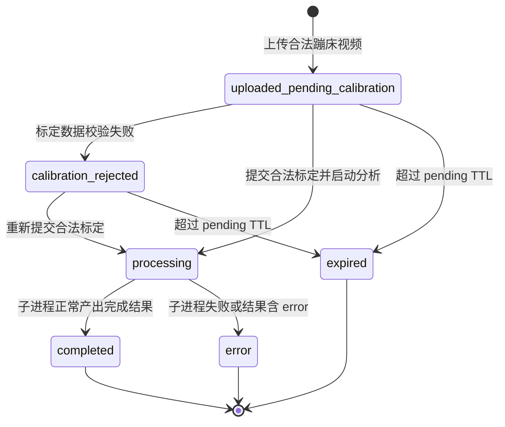

本页解释后端如何把“上传视频 → 等待床面标定 → 启动分析 → 轮询状态 → 获取处理后视频”串成一个可追踪的任务生命周期。范围限定在 Flask 路由、内存状态对象、后台线程与独立子进程之间的协作；算法细节、前端交互细节和 AI 解读流式返回分别留给 [蹦床分析核心算法](13-tiao-ci-fen-ge-yu-qi-tiao-luo-di-jian-ce)、[分析进度轮询与结果展示](22-fen-xi-jin-du-lun-xun-yu-jie-guo-zhan-shi) 与 [SSE 流式返回、缓存与双模型分析](26-sse-liu-shi-fan-hui-huan-cun-yu-shuang-mo-xing-fen-xi)。Sources: [app.py](app.py#L249-L267), [app.py](app.py#L269-L365), [app.py](app.py#L368-L457), [app.py](app.py#L570-L603)

## 架构假设与验证结论

从第一性原理看，这个后端不是传统“请求内同步处理视频”的结构，而是一个**短请求驱动的异步任务编排器**：上传接口只保存文件并创建任务记录，启动接口只校验标定并拉起后台线程，真正的视频分析在独立 `video_processor.py` 子进程中执行，状态接口负责把内存中的任务快照暴露给前端轮询。这个判断可以由三处实现共同验证：全局 `video_analyses` 字典保存任务状态，`start_trampoline_analysis()` 创建 daemon 线程，`process_video_subprocess()` 再通过 `subprocess.Popen()` 调用独立脚本。Sources: [app.py](app.py#L31-L38), [app.py](app.py#L447-L449), [app.py](app.py#L460-L490)

```mermaid
flowchart LR
    U[浏览器] -->|POST /api/video/upload| A[Flask 上传路由]
    A -->|创建 video_analyses[video_id]| M[(内存任务表)]
    A -->|返回首帧与 pending 状态| U

    U -->|POST /api/video/trampoline/start| S[启动分析路由]
    S -->|写入 corners sidecar| C[(uploads/video_id_corners.json)]
    S -->|启动 daemon thread| T[后台线程]

    T -->|subprocess.Popen| P[video_processor.py]
    P -->|增量写 results JSON| R[(uploads/video_id_results.json)]
    T -->|读取 JSON 并同步字段| M

    U -->|GET /api/video/status/video_id| Q[状态路由]
    Q -->|读取任务快照| M
    Q -->|返回 progress / phase / landings| U

    U -->|GET /api/video/processed/video_id| V[处理后视频路由]
    V -->|send_file| O[(processed mp4/avi/webm)]
```

上图中的关键分层是：Flask 主进程承担**路由契约与任务状态聚合**，`video_processor.py` 承担**视频帧处理与结果文件生产**，两者之间通过 `uploads/<video_id>_results.json` 进行进度同步，通过 `uploads/<video_id>_corners.json` 传递床面标定数据。这个边界在代码中表现为主进程构造 `output_json_path`、`output_video_path` 并传给子进程，而子进程在处理循环中周期性 `save_results()`。Sources: [app.py](app.py#L469-L481), [app.py](app.py#L501-L516), [video_processor.py](video_processor.py#L77-L108), [video_processor.py](video_processor.py#L301-L302)

## 路由边界：页面路由与任务 API 分离

页面路由保持极薄：`/`、`/dashboard`、`/profile`、`/video_analysis` 都只渲染模板，其中 `/video_analysis` 固定传入 `mode='trampoline'`，说明当前后端入口已经收敛到蹦床视频分析主线。路由契约测试也确认这些页面仍返回 200，并且已移除旧健身实时摄像头相关端点。Sources: [app.py](app.py#L249-L267), [tests/test_app_route_contract.py](tests/test_app_route_contract.py#L6-L16), [tests/test_app_route_contract.py](tests/test_app_route_contract.py#L19-L35)

| 路由 | 方法 | 生命周期角色 | 主要返回或效果 |
|---|---:|---|---|
| `/api/video/upload` | POST | 创建任务并进入待标定态 | `video_id`、首帧 base64、图像尺寸、帧率、总帧数、角点顺序 |
| `/api/video/trampoline/start` | POST | 接收标定并启动后台分析 | 写入 sidecar、置为 `processing`、启动线程 |
| `/api/video/status/<video_id>` | GET | 对外暴露任务快照 | `status`、`progress`、跳次、阶段、落点、处理后视频 URL |
| `/api/video/processed/<video_id>` | GET | 输出处理后视频文件 | 根据扩展名返回 mp4 / avi / webm |
| `/api/video/llm_analysis/<video_id>` | GET | 分析完成后的 AI 解读入口 | 仅在 `completed` 后允许继续；细节属于 AI 页面 |

这些 API 的职责不是等价的 CRUD，而是按生命周期阶段划分：上传接口负责**准入控制和任务初始化**，启动接口负责**标定接受与执行触发**，状态接口负责**幂等读取**，处理后视频接口负责**结果文件访问**。LLM 路由虽然也挂在视频命名空间下，但它明确要求任务 `status == 'completed'`，因此在本页只作为生命周期完成后的下游入口提及。Sources: [app.py](app.py#L269-L365), [app.py](app.py#L368-L457), [app.py](app.py#L551-L567), [app.py](app.py#L570-L627)

## 任务状态模型：video_analyses 是生命周期中心

后端的任务状态集中保存在模块级字典 `video_analyses` 中，键是上传时生成的 UUID，值是一个包含文件路径、模式、进度、算法摘要、床面标定、落点、阶段等字段的字典。上传成功后，初始状态被设置为 `uploaded_pending_calibration`，同时 `state` 是 `PENDING_CALIBRATION`，`phase` 是 `pending_calibration`，这三个字段分别服务于 API 状态、业务状态展示和蹦床分析阶段展示。Sources: [app.py](app.py#L31-L38), [app.py](app.py#L296-L351)



这张状态图只展示后端代码中可验证的状态转移。上传路由创建 `uploaded_pending_calibration`，启动路由在异常时写入 `calibration_rejected`，在合法标定后写入 `processing`，清理函数会把长时间未完成标定的任务转成 `expired`，子进程协调函数在完成或失败时写入 `completed` 或 `error`。Sources: [app.py](app.py#L324-L351), [app.py](app.py#L411-L418), [app.py](app.py#L439-L449), [app.py](app.py#L149-L170), [app.py](app.py#L510-L536)

## 上传阶段：准入控制、首帧提取与待标定任务创建

`/api/video/upload` 的核心不是开始分析，而是建立一个“可标定任务”。它首先清理过期待标定任务，然后要求 multipart 中存在 `video`，要求 `exercise_type` 必须是 `trampoline`，拒绝空文件名，并按 `MAX_VIDEO_SIZE_MB` 做文件大小限制。文件保存后，路由用 OpenCV 读取 FPS、帧数和时长，若超过 `MAX_VIDEO_DURATION_SEC` 就删除已保存文件并返回错误。Sources: [app.py](app.py#L269-L316)

上传阶段还会提取第一帧并编码为 PNG base64，用于后续标定界面显示。若视频无法打开、无法读取首帧或无法编码，辅助函数会返回错误，上传路由会删除文件并返回 400。成功时，响应包含 `first_frame_b64`、`first_frame_image`、`image_size`、`corner_order`、`video_fps` 和 `total_frames`，测试明确锁定了这些契约字段。Sources: [app.py](app.py#L41-L56), [app.py](app.py#L318-L365), [tests/test_trampoline_api.py](tests/test_trampoline_api.py#L53-L74)

任务初始化字段体现了“先上传、后标定”的设计：`corners` 初始为 `None`，`started` 为 `False`，`status` 为 `uploaded_pending_calibration`，`feedback` 为 `Awaiting bed corner calibration`。这意味着上传成功并不代表分析已经排队执行；只有后续启动接口接受标定数据后，后台处理才会被触发。Sources: [app.py](app.py#L324-L351)

## 标定启动阶段：校验、sidecar 与幂等控制

`/api/video/trampoline/start` 是生命周期中的关键门闩。它先根据 `video_id` 查找任务，不存在则返回 404，非蹦床任务返回 400；然后根据当前 `status` 分支处理：已完成任务直接返回已完成结果，正在处理的任务会比较本次提交的标定是否与既有标定一致，一致则幂等返回“already started”，不一致则返回 409 冲突。Sources: [app.py](app.py#L368-L407)

对于待标定或标定曾被拒绝的任务，启动路由会调用 `_normalize_trampoline_calibrations()` 标准化输入。该函数支持两种请求形态：直接传 `calibrations`，或者传旧式 `corners` 并包装成 `frame_index=0` 的单帧标定。标准化最终依赖 `trampoline.bed_tracker` 中的校验函数，并把角点坐标四舍五入到 3 位小数。Sources: [app.py](app.py#L59-L67), [app.py](app.py#L82-L97), [app.py](app.py#L117-L126), [app.py](app.py#L411-L418)

标定通过后，后端会写入 `uploads/<video_id>_corners.json` sidecar 文件，内容包括 `schema_version: 2`、`video_id`、`exercise_type`、首个标定帧、图像尺寸、角点顺序、全部 calibrations、床面尺寸和创建时间。写文件采用先写 `.tmp` 再 `os.replace()` 的方式，减少半写入文件被子进程读取的风险。Sources: [app.py](app.py#L420-L437)

启动接口随后把内存任务更新为 `processing` / `PROCESSING`，保存 `corners` 与 `calibrations`，清空 `error`，标记 `started=True`，然后创建 daemon 线程执行 `process_video_subprocess(video_id)`。测试覆盖了三类关键行为：重复提交相同标定可幂等通过，提交不同标定会返回 409，多关键帧标定会写入排序后的 calibrations，重复关键帧会被拒绝并留下 `calibration_rejected`。Sources: [app.py](app.py#L439-L457), [tests/test_trampoline_api.py](tests/test_trampoline_api.py#L143-L160), [tests/test_trampoline_api.py](tests/test_trampoline_api.py#L198-L238)

## 后台执行阶段：线程监控子进程，JSON 同步内存状态

`process_video_subprocess()` 是 Flask 主进程与独立视频处理脚本之间的协调层。它根据任务记录生成 `output_json_path` 和 `output_video_path`，再用当前 Python 解释器执行 `video_processor.py <video_path> <exercise_type> <output_json_path> <output_video_path>`。子进程工作目录被固定为项目根目录，stdout 与 stderr 合并后由主进程日志读取。Sources: [app.py](app.py#L460-L490)

协调线程在子进程运行期间每 0.3 秒检查一次结果 JSON 是否存在；如果存在，就读取 JSON 并调用 `_sync_analysis_from_results()` 同步进度、跳次、动作、阶段、滞空帧数、落点和帧率等字段到 `video_analyses`。这是一种文件型进度通道：子进程不直接访问 Flask 内存，而是通过可序列化结果文件让主进程安全地聚合任务状态。Sources: [app.py](app.py#L492-L507), [app.py](app.py#L213-L247)

子进程正常退出且结果 JSON 存在时，协调线程把 `progress` 设置为 100，并用结果中的 `status` 决定最终状态，默认是 `completed`。随后它根据结果里的 `output_video` 或约定路径查找处理后视频；如果结果包含 `error`，即使子进程返回码为 0，也会把任务状态改为 `error`。Sources: [app.py](app.py#L509-L531)

子进程失败或没有产出结果 JSON 时，协调线程会把任务写为 `error`，并记录 `Subprocess failed`。收尾阶段会删除临时 results JSON，并调用 `_remove_video_artifacts(..., include_processed=False)` 清理原始上传文件和角点 sidecar，但不会删除处理后视频；这保证状态接口仍可返回处理后视频地址，而不再保留输入文件。Sources: [app.py](app.py#L532-L548), [app.py](app.py#L133-L147), [app.py](app.py#L538-L543)

## 子进程结果生产：从 processing 到 completed/error

`video_processor.py` 启动时先构造一份初始 `results` 字典，默认 `status='processing'`、`progress=0`、`state='READY'`，并包含蹦床运行态字段，如 `current_action`、`completed_jumps`、`phase`、`current_flight_frames`、`latest_landing` 和 `landings`。如果传入的 `exercise_type` 不是 `trampoline`，它会直接写入 `error` 并返回。Sources: [video_processor.py](video_processor.py#L77-L115)

真正处理前，子进程必须找到与 `video_id` 对应的 corners sidecar；找不到时会把结果状态写为 `error`。找到后，子进程加载 sidecar，创建床面跟踪器，并用首帧初始化。这个约束解释了为什么启动路由必须先写 sidecar 再启动后台线程：处理脚本把 sidecar 视为分析任务的必需输入。Sources: [video_processor.py](video_processor.py#L189-L210)

处理循环中，子进程逐帧更新 `progress`，在指定间隔运行蹦床分析器，并把跳次、当前动作、阶段、滞空时长、落点等字段写入 `results`。每处理 15 帧，脚本调用 `save_results()` 将当前快照刷到 JSON 文件，供 Flask 协调线程读取。Sources: [video_processor.py](video_processor.py#L235-L303)

视频结束后，子进程把最终结果写成 `status='completed'`、`progress=100`、`state='COMPLETED'`，补充 `fps`、`video_fps`、`total_frames`、`resolution` 和 `completed_jumps`，关闭视频 writer，并最终保存结果。异常路径则把 `status` 置为 `error`、记录错误字符串并保存结果。Sources: [video_processor.py](video_processor.py#L313-L360), [video_processor.py](video_processor.py#L364-L392)

## 状态查询阶段：轮询视图是内存快照，不直接读子进程

`/api/video/status/<video_id>` 每次请求都会先调用过期清理，然后从 `video_analyses` 读取任务。如果任务不存在，返回 `status: not_found`；如果存在，则检测 `processed_video` 文件是否真实存在，并据此设置 `has_processed_video` 与 `processed_video_url`。Sources: [app.py](app.py#L570-L593)

状态响应聚合了两类信息：一类是生命周期字段，如 `status`、`progress`、`error`、`has_processed_video`；另一类是分析运行态字段，如 `reps`、`current_action`、`completed_jumps`、`phase`、`current_flight_frames`、`current_flight_duration_s`、`latest_landing`、`landings`、`fps` 和 `video_fps`。测试确认这些运行态字段属于稳定的增量契约。Sources: [app.py](app.py#L581-L603), [tests/test_trampoline_api.py](tests/test_trampoline_api.py#L76-L109)

需要注意的是，状态路由不读取 `uploads/<video_id>_results.json`；读取结果 JSON 的责任在后台协调线程中完成。因此状态接口返回的是主进程内存中的最新已同步快照，而不是文件系统的实时视图。这个设计使轮询请求保持轻量，但也意味着主进程内存是任务状态的权威来源。Sources: [app.py](app.py#L492-L507), [app.py](app.py#L570-L603)

## 处理后视频访问：文件存在性决定可用性

`/api/video/processed/<video_id>` 根据 `video_id` 查找任务，任务不存在返回 404；任务存在但 `processed_video` 缺失或文件不存在，也返回 404。只有当后台协调线程已经把实际输出路径写入任务，并且文件仍在磁盘上时，该接口才会通过 `send_file()` 返回视频。Sources: [app.py](app.py#L551-L560)

返回视频时，后端根据文件扩展名选择 MIME 类型：`.avi` 对应 `video/x-msvideo`，`.webm` 对应 `video/webm`，其他情况默认 `video/mp4`。这个选择与子进程输出策略对应：子进程优先尝试 H.264 mp4，失败时可能通过 OpenCV fallback 产出 avi 或其他 mp4。Sources: [app.py](app.py#L561-L567), [video_processor.py](video_processor.py#L137-L177)

## 过期与资源清理：待标定任务有 TTL

后端对未完成标定的蹦床任务设置了 `TRAMPOLINE_PENDING_TTL_SECONDS = 60 * 60`。`cleanup_expired_pending_trampoline_uploads()` 只处理 `mode == 'trampoline'` 且 `status` 为 `uploaded_pending_calibration` 或 `calibration_rejected` 的任务；超过 TTL 后，它会删除原始视频、sidecar、结果 JSON 和处理后视频候选文件，并把任务状态改为 `expired` / `EXPIRED`。Sources: [app.py](app.py#L35-L38), [app.py](app.py#L149-L170)

清理函数被上传、启动和状态查询三个入口调用，因此只要用户继续访问这些 API，后端就会机会性地回收长时间未标定的上传文件。测试明确验证了过期待标定任务会被标记为 `expired`，同时原始视频和 sidecar 文件会被删除。Sources: [app.py](app.py#L269-L272), [app.py](app.py#L368-L371), [app.py](app.py#L570-L573), [tests/test_trampoline_api.py](tests/test_trampoline_api.py#L178-L195)

## 生命周期字段速查

| 字段 | 所在对象 | 典型值 | 后端含义 |
|---|---|---|---|
| `status` | `video_analyses` / API / results JSON | `uploaded_pending_calibration`、`processing`、`completed`、`error`、`expired` | 生命周期主状态 |
| `state` | `video_analyses` / API / results JSON | `PENDING_CALIBRATION`、`PROCESSING`、`COMPLETED`、动作名 | 展示层或处理器状态摘要 |
| `phase` | `video_analyses` / API / results JSON | `pending_calibration`、`unknown`、`flight` 等 | 蹦床分析阶段字段 |
| `progress` | `video_analyses` / API / results JSON | `0` 到 `100` | 按处理帧数估计的进度 |
| `started` | `video_analyses` | `False` / `True` | 是否已通过启动接口触发后台线程 |
| `processed_video` | `video_analyses` | 文件路径或 `None` | 处理后视频实际路径 |
| `calibrations` | `video_analyses` / sidecar | 多关键帧列表 | 子进程床面跟踪的输入数据 |
| `error` | `video_analyses` / API / results JSON | 字符串或 `None` | 标定、子进程或文件处理错误 |

这些字段并非全部由同一层生产：上传路由初始化 `status/state/phase/started`，启动路由写入 `calibrations` 并切到 `processing`，子进程生产 `progress/phase/landings/completed_jumps`，协调线程把结果同步回内存，状态路由再把内存快照序列化给前端。理解字段来源，有助于定位“前端看到状态不更新”时应该检查启动路由、协调线程还是子进程结果文件。Sources: [app.py](app.py#L324-L351), [app.py](app.py#L439-L449), [app.py](app.py#L213-L247), [video_processor.py](video_processor.py#L241-L303), [app.py](app.py#L581-L603)

## 设计取舍：为什么使用线程加子进程

这个后端采用“Flask 线程监控 + 独立 Python 子进程处理视频”的组合，而不是直接在请求线程里跑 MediaPipe。可验证的动机体现在 `video_processor.py` 文件头注释中：独立进程用于避免内存问题，同时产出轮询用 JSON 和带覆盖层的视频。主进程也在文件开头设置了 TensorFlow 与线程相关环境变量，子进程脚本再次设置相同变量，说明视频处理依赖的底层库需要受控的运行环境。Sources: [video_processor.py](video_processor.py#L1-L7), [app.py](app.py#L1-L7), [video_processor.py](video_processor.py#L9-L14)

| 方案 | 本项目采用情况 | 优点 | 代价 |
|---|---|---|---|
| 请求内同步处理 | 未采用 | 实现最简单 | 上传请求会长时间阻塞，不适合视频分析 |
| Flask 后台线程直接处理 | 仅作为协调层 | 请求可快速返回，能更新内存状态 | 若直接跑重计算，仍会与 Web 进程资源耦合 |
| 线程 + 子进程 | 已采用 | 隔离 MediaPipe/OpenCV 处理，主进程只聚合状态 | 状态需通过 JSON 文件同步，需清理临时文件 |
| 外部任务队列 | 未出现 | 可持久化与分布式调度 | 当前代码没有引入队列或 worker 服务 |

因此，本项目当前生命周期管理是一个轻量级本地异步模型：没有数据库，没有外部队列，也没有跨进程共享内存；任务元数据在 Flask 进程内，重计算在子进程内，进度通过磁盘 JSON 桥接。这个结论只基于当前文件中的实现，不外推到部署层能力。Sources: [app.py](app.py#L31-L38), [app.py](app.py#L460-L548), [video_processor.py](video_processor.py#L105-L108), [video_processor.py](video_processor.py#L301-L303)

## 与相邻页面的阅读关系

如果你需要从更高层理解这一页所在位置，建议先读 [端到端架构与数据流](8-duan-dao-duan-jia-gou-yu-shu-ju-liu)；如果你要继续追踪子进程内部如何处理视频，下一步读 [独立视频处理进程设计](10-du-li-shi-pin-chu-li-jin-cheng-she-ji)；如果你要核对前端调用字段与响应格式，读 [前后端 API 契约](11-qian-hou-duan-api-qi-yue) 和 [分析进度轮询与结果展示](22-fen-xi-jin-du-lun-xun-yu-jie-guo-zhan-shi)。Sources: [app.py](app.py#L269-L365), [app.py](app.py#L368-L457), [app.py](app.py#L570-L603), [video_processor.py](video_processor.py#L77-L108)